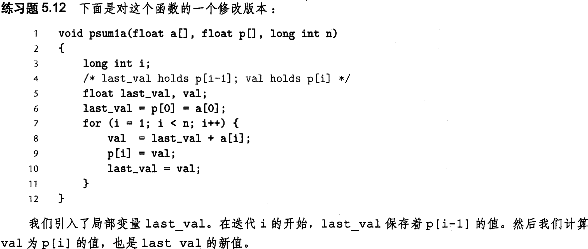

# 计算机系统第三次作业


```c
#include <stdio.h>
#include <stdlib.h>
#include <unistd.h>
#include <fcntl.h>
#include <string.h>
#include <sys/stat.h>
#include <sys/mman.h>

int main (int argc, char *argv[])
{
  int fd = open(argv[1], O_RDWR);		//打开目标文件，打开方式为可读可写
  struct stat sb;
  size_t length;
  if (fd == -1)											//文件打开失败
  {
    perror("open");
    exit(1);
  }
	if (fstat(fd, &sb) == -1)					//获取文件状态
  {
    perror ("fstat");
    exit(1);
  }
  length = sb.st_size;							//获取文件长度（大小）
  
  //void *mmap(void *start, size_t length, int prot, int flags, int fd, off_t offset)
  //addr:指定映射的起始地址，通常设为NULL，由内核来分配，映射成功后，return 该地址
  //length：代表将文件中映射到内存的部分的长度，单位为字节数，一般要求为页大小整数倍
  /*prot：映射区域的保护方式。可以为以下几种方式的组合：
  	PROT_EXEC 映射区域可被执行
		PROT_READ 映射区域可被读取
		PROT_WRITE 映射区域可被写入
		PROT_NONE 映射区域不能存取
	*/
  /*flags：影响映射区域的各种特性。在调用mmap()时必须要指定MAP_SHARED 或MAP_PRIVATE
  	MAP_FIXED 如果参数start所指的地址无法成功建立映射时，则放弃映射，不对地址做修正.
		MAP_SHARED对映射区域的写入数据会复制回文件内，而且允许其他映射该文件的进程共享.
		MAP_PRIVATE 对映射区域的写入操作会产生一个映射文件的复制，即私人的“写入时复制”（copy on write）对此区域作的任何修改都不会写回原来的文件内容.
 	*/
  //fd：要映射到内存中的文件描述符，即调用mmap前调用open函数的返回值。（如果使用匿名内存映射时，即flags中设置了MAP_ANONYMOUS，fd设为-1。）
  //offset：文件映射的偏移量，通常设置为0，代表从文件最前方开始对应，offset必须是分页大小的整数倍。
    char *addr = mmap(NULL, length, PROT_READ | PROT_WRITE, MAP_SHARED, fd, 0);
  if (addr == MAP_FAILED)
  {
    perror ("mmap");
    exit(1);
  }
  
  //修改内存映射区域的内容
  char *p = strchr(addr, 'H');		//查找'H'字符的位置
  *p = 'J';												//将'H'替换成'J"
  
  if (munmap(addr, length) == -1)	//解除内存映射
  {
    perror ("munmap");
    exit(1);
  }
  
  close(fd);
  
  return 0;
}

```

运行前查看hello.txt


编译代码并运行后查看hello.txt:


memset.c实现

```c
#include <stdlib.h>											//使用size_t数据类型
void *my_memset(void *s, int c, size_t n)
{
    size_t K = sizeof(unsigned long);
    size_t cnt = 0;
    unsigned char *schar = s;
    
    //开始时直到目的地址是K的倍数时，使用字节级的写
    while ((size_t)schar % K != 0 && cnt < n) {
        *schar++ = (unsigned char) c;
        cnt++;
    }
    
    //使用数据类型为 unsigned long 的字来装下4个（对于IA32)或者8个（对于 x86-64) c,
    unsigned long longc;
    unsigned char* tmp = (unsigned char*)&longc;
    size_t i = 0;
    while (i < K) {
        *tmp++ = (unsigned char)c;
        i++;
    }
    
    //然后进行字级的写
    unsigned long *slong = (unsigned long*)schar;
    while (cnt + K < n) {
        *slong++ = longc;
        cnt += K;
    }
    
    //最后未成字部分采用用字节级的写
    while (cnt < n) {
        *schar++ = (unsigned char) c;
        cnt++;
    }
    
    return s;
}
```

使用mtest.c测试

```c
#include <stdio.h>
void *my_memset(void *s, int c, size_t n);
int main ()
{
    char a[9];
    my_memset((void *)a, 1, sizeof(a));
    for (size_t i = 0; i < sizeof(a) / sizeof(char); i++)
    {
        printf("a[%d] = %d\n", (int)i, (int)a[i]);
    }
    return 0;
}
```

编译运行




```c
void psum1a(float a[], float p[], long int n)
{
  long int i;
  float val1, val2, val3 = p[0] = a[0];
  //3次循环展开和重新结合
  for (i = 1; i < n - 2; i += 3)
  {
    val1 = val3 + a[i];
    val2 = val1 + a[i+1];
    val3 = val2 + a[i+2];
    p[i] = val1;
    p[i+1] = val2;
  	p[i+2] = val3;
  }
  //处理剩余元素
  for (; i < n; ++i) 
  {
    p[i] = p[i-1] + a[i];
  }
}
```

