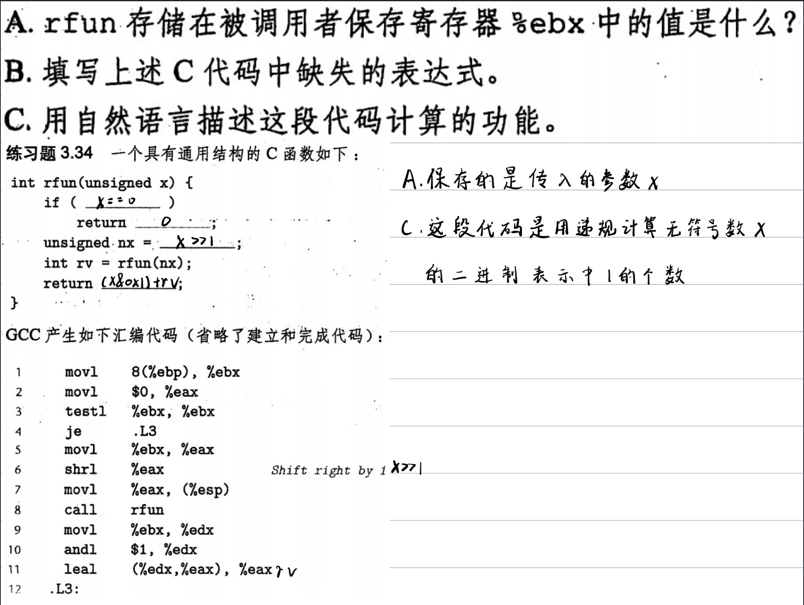
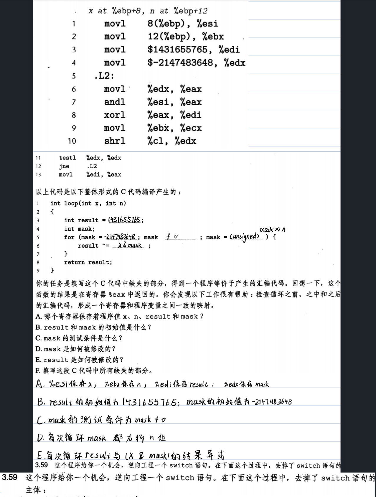
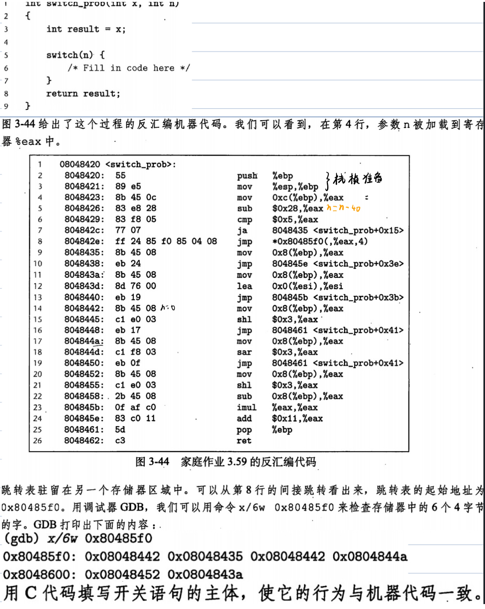
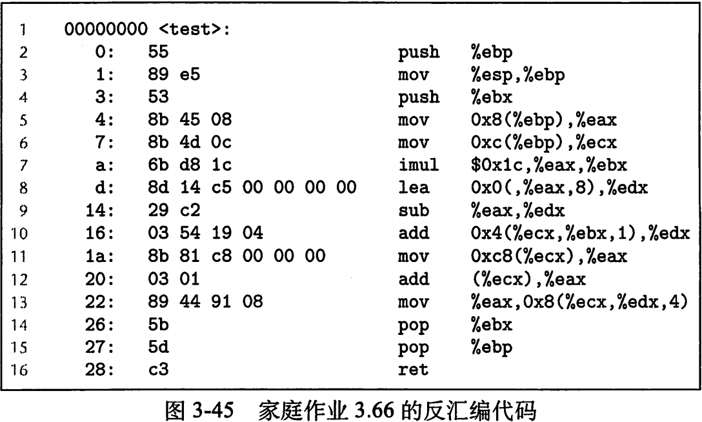
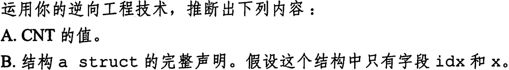

# 计算机系统第二次作业







由汇编代码可知0x80485f0到0x8048600地址存放的是switch语句的跳转表

```assembly
sub	$0x28,%eax
cmp	$0x5,%eax
```

这两行代码是被测试的值(n - 40)，再用(n - 40) - 5与5比较，可知比较的值为40—45，再根据跳转表和汇编代码可得到switch语句主体如下：

```c
int switch_prob (int x, int n){
  int result = x;
  switch (n){
    case 40:
      result <<= 3;
      break;
    case 41:
      result += 17;
      break;
    case 42:
      result <<= 3;
      break;
    case 43:
     	result >>= 3;
      break;
  	case 44:
      result = (result << 3) -x;
      result *= result;
			result += 17;
      break;
    case 45:
      result *= result;
			result += 17;
      break;
    default:
      result += 17;
      break;
  }
  return result;
}
```



首先来看2-4行汇编代码：

```assembly
push %ebp
mov %esp,%ebp
push %ebx
```

这三行是test函数的栈帧准备：保存调用函数的帧指针，建立函数栈帧，保存调用函数中%ebx中的值。

接下来第5行从%ebp偏移8个字节的地址中的值存入%eax中，根据函数调用过程，此处存放的值应是第一个参数 i 

```assembly
mov	0x8(%ebp),%eax	/*	%eax = i */
```

第6行是将第二个参数bp保存到%ecx中

```assembly
mov 0xc(%ebp),%ecx	/*	%exc = bp	*/
```

第7行将%eax中的值与立即数0xc1(28)相乘存入%ebx中

```assembly
imul $0xc1,%eax,%ebx	/*	%ebx = %eax * 28 = 28i	*/
```

8-9行计算 8 *%eax + 0值并存入到%edx中，再计算%edx - %eax将结果在保存到%edx中

```assembly
lea 0x0(,%eax,8),%edx	/*	%edx = 8 * %eax = 8i	*/
sub %eax,%edx	/*	%edx = %edx - %eax = 7i	*/
```

第10行计算(%ecx + %ebx + 4)地址中的值与%edx相加并将结果保存到edx中，%ecx保存的bp是结构体的起始地址，所以bp 是结构体中第一个变量left的地址，则bp + 4 + 28i 应是bp->a[i]的地址,可判断a_struct占28个字节，+7是为了后面得到ap->x[ap->idx]的地址

```assembly
add	0x4(%ecx,%ebx,1),%edx	/*	%edx = %ecx + %ebx + 4  + %edx = (bp + 28i + 4) + 7i	*/
```

第11-12行将%exc + 200地址处的值保存到%eax中，即(bp + 200)地址处的值，然后将%ecx地址处的值，即结构体中第一个参数bp->left与%eax值相加保存到%eax中，可推断是计算n = bp->left + bp->right，所以(bp + 200)地址处保存的是	bp->right，则a[CNT]的字节大小为200 - 4 =196，**CNT = 196 / 28 = 7**。

```assembly
mov 0xc8(%ecx),%eax
add (%exc),%eax		/* int n = bp->left + bp->right	*/
```

根据上述分析，%eax中保存的是n,%ecx中保存的*dp，%edx中保存的是\*ap，是所以第13行执行的语句是ap->x[ap->idx] = n，汇编指令是将%eax中的值保存到地址 bp + 4 *((bp + 28i + 4) + 7i) + 8 中

```assembly
mov	%eax,0x8(%ecx,%edx,4)		/* bp + 4 *((bp + 28i + 4) + 7i) + 8 =
															bp + 4 + 28i + 4 + 4*(bp + 28i + 4)
																		ap->x[ap->idx] = n;
```

bp + 4 + 28i是ap结构体的起始地址，+4后应是跳过第一个变量idx的地址，此时是ap->x[0]的地址，说明idx是int型变量，再+4*(bp + 28i + 4)就是x[ap->idx]的地址，\*4 说明 x[CNT] 是int型数组，而a_struct的大小为28字节，所以整型数组x的大小为24，即有7个元素

综上，a_struct的声明如下：

```c
typedef	struct {
  int idx;
  int x[6];
}	a_struct
```

