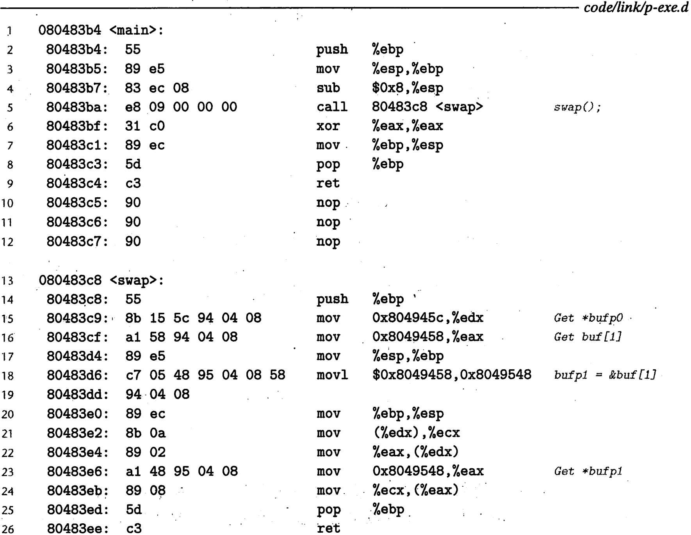

# 计算机系统第四次作业

计科2203 林芳伦 202208010326

## 第7章：P476~479 7.12 , 7.13，7.15

### 7.12 

图7-10 中的 swap 程序包含5个重定位的引用。对于每个重定位的引用，给出它在图7-10中的行号、运行时存储器地址和值。 swap.o 模块中的原始代码和重定位条目如图 7-19 所示。

图7-19:

图7-10:



| 图7-10 中的行号 |   地址    |    值     |
| :-------------: | :-------: | :-------: |
|       15        | 0x80483cb | 0x804945c |
|       16        | 0x80483d0 | 0x8049458 |
|       18        | 0x80483d8 | 0x8049458 |
|       18        | 0x80483dc | 0x8049458 |
|       23        | 0x80483e7 | 0x8049548 |

### 7.13

考虑图 7~20 中的 代码和相应的可重定位目标模块。

A. 确定当模块被重定位时，链接器将修改 .text 中的哪些指令。对于每条这样的指令，列出它的重定位条目中的信息：节偏移、重定位类型和符号名字。

B. 确定当模块被重定位时，链接器将修改 .data 中的哪些数据目标。对于每条这样的指令，列出它的重定位条目中的信息：节偏移、重定位类型和符号名字。

可以随意使用诸如 OBJDUMP 之类的工具来帮助你解答这个题目。

C代码：

```c
extern int p3(void); 
int x = 1; 
int *xp = &x; 

void p2(int y) { 
} 
 
void p1() { 
  p2(*xp + p3()); 
} 
```

可重定位目标文件的 .text节


可重定位目标文件的 .data节：


#### A：

|      指令      | 节偏移 | 重定位类型 | 符号名字 |
| :------------: | :----: | :--------: | :------: |
| e8 fc ff ff ff |  0xc   | R_386_PC32 |    P3    |
| al 00 00 00 00 |  0x13  |  R_386_32  |    xp    |
| e8 fc ff ff ff |  0x15  | R_386_PC32 |    P2    |

#### B:

|    指令     | 节偏移 | 重定位类型 | 符号名字 |
| :---------: | :----: | :--------: | :------: |
| 00 00 00 00 |  0x4   |  R_386_32  |    x     |


### 7.15

完成下面的任务将帮助你更熟悉处理目标文件的各种工具。

A. 在你的系统上， libc.a libm.a 的版本中包含多少目标文件？

B. gcc-O2 产生的可执行代码与 gee -O2  -g 产生的不同吗？

C. 在你的系统上， GCC 驱动程序使用的是什么共享库？

#### A:

在文件中查找到libc.a和libm.a的位置使用 `ar` 命令列出库文件中的内容：

```sh
ar -t libc.a 
ar -t libm.a
```

libc.a:


还有很多目标文件未列出

将 `ar -t` 命令的输出重定向到 `wc -l` 来计算目标文件的数量。


libm.a：


#### B:

 `-O2` 选项用于指定优化级别，而 `-g` 选项用于生成调试信息

- `-O2`：这是 GCC 编译器的一个优化选项，表示启用O2级别的优化。编译器会尝试改善程序的运行效率，包括使用一些复杂的优化算法，但不会改变程序的语义。O2优化级别可能包括循环展开、公共子表达式消除、死代码删除等。

- `-g`：这个选项用于生成调试信息。即使用 `-g` 编译的程序会包含额外的信息，使得调试器（如 GDB）能够映射程序的机器代码回到源代码中的行号，从而更容易地调试程序。

使用 `-O2 -g` 时，编译器会生成经过优化的代码，并且包含足够的调试信息，以便在不牺牲性能的情况下进行调试。这对于开发过程中的性能调优和问题诊断非常有用。

如果只使用 `-O2` 而没有 `-g`，编译器将生成优化的代码，但不会包含调试信息。这通常用于生成最终的发布版本，因为优化的代码运行得更快，而且没有调试信息可以减小可执行文件的大小。

以一下C文件为例：

```c
#include <stdio.h>
int main(int argc, char* argv[])
{
    int a[10] = {1, 2, 3, 4, 5, 6, 7, 8, 9, 10};
    int i, sum = 0;
    for (i = 0; i < 10; i++)
        sum += a[i];
    printf("sum = %d\n", sum);
}
```

使用`-g`:

```assembly
Disassembly of section .text:

00001080 <main>:
    1080:	8d 4c 24 04          	lea    0x4(%esp),%ecx
    1084:	83 e4 f0             	and    $0xfffffff0,%esp
    1087:	31 d2                	xor    %edx,%edx
    1089:	ff 71 fc             	push   -0x4(%ecx)
    108c:	55                   	push   %ebp
    108d:	89 e5                	mov    %esp,%ebp
    108f:	56                   	push   %esi
    1090:	e8 d8 01 00 00       	call   126d <__x86.get_pc_thunk.si>
    1095:	81 c6 3f 2f 00 00    	add    $0x2f3f,%esi
    109b:	53                   	push   %ebx
    109c:	8d 5d e4             	lea    -0x1c(%ebp),%ebx
    109f:	51                   	push   %ecx
    10a0:	b9 01 00 00 00       	mov    $0x1,%ecx
    10a5:	83 ec 3c             	sub    $0x3c,%esp
    10a8:	65 a1 14 00 00 00    	mov    %gs:0x14,%eax
    10ae:	89 45 e4             	mov    %eax,-0x1c(%ebp)
    10b1:	31 c0                	xor    %eax,%eax
    10b3:	c7 45 c0 02 00 00 00 	movl   $0x2,-0x40(%ebp)
    10ba:	8d 45 c0             	lea    -0x40(%ebp),%eax
    10bd:	c7 45 c4 03 00 00 00 	movl   $0x3,-0x3c(%ebp)
    10c4:	c7 45 c8 04 00 00 00 	movl   $0x4,-0x38(%ebp)
    10cb:	c7 45 cc 05 00 00 00 	movl   $0x5,-0x34(%ebp)
    10d2:	c7 45 d0 06 00 00 00 	movl   $0x6,-0x30(%ebp)
    10d9:	c7 45 d4 07 00 00 00 	movl   $0x7,-0x2c(%ebp)
    10e0:	c7 45 d8 08 00 00 00 	movl   $0x8,-0x28(%ebp)
    10e7:	c7 45 dc 09 00 00 00 	movl   $0x9,-0x24(%ebp)
    10ee:	c7 45 e0 0a 00 00 00 	movl   $0xa,-0x20(%ebp)
    10f5:	eb 0e                	jmp    1105 <main+0x85>
    10f7:	8d b4 26 00 00 00 00 	lea    0x0(%esi,%eiz,1),%esi
    10fe:	66 90                	xchg   %ax,%ax
    1100:	8b 08                	mov    (%eax),%ecx
    1102:	83 c0 04             	add    $0x4,%eax
    1105:	01 ca                	add    %ecx,%edx
    1107:	39 d8                	cmp    %ebx,%eax
    1109:	75 f5                	jne    1100 <main+0x80>
    110b:	83 ec 04             	sub    $0x4,%esp
    110e:	8d 86 34 e0 ff ff    	lea    -0x1fcc(%esi),%eax
    1114:	89 f3                	mov    %esi,%ebx
    1116:	52                   	push   %edx
    1117:	50                   	push   %eax
    1118:	6a 01                	push   $0x1
    111a:	e8 41 ff ff ff       	call   1060 <__printf_chk@plt>
    111f:	83 c4 10             	add    $0x10,%esp
    1122:	8b 45 e4             	mov    -0x1c(%ebp),%eax
    1125:	65 2b 05 14 00 00 00 	sub    %gs:0x14,%eax
    112c:	75 0d                	jne    113b <main+0xbb>
    112e:	8d 65 f4             	lea    -0xc(%ebp),%esp
    1131:	31 c0                	xor    %eax,%eax
    1133:	59                   	pop    %ecx
    1134:	5b                   	pop    %ebx
    1135:	5e                   	pop    %esi
    1136:	5d                   	pop    %ebp
    1137:	8d 61 fc             	lea    -0x4(%ecx),%esp
    113a:	c3                   	ret    
    113b:	e8 40 01 00 00       	call   1280 <__stack_chk_fail_local>

00001140 <_start>:
    1140:	f3 0f 1e fb          	endbr32 
    1144:	31 ed                	xor    %ebp,%ebp
    1146:	5e                   	pop    %esi
    1147:	89 e1                	mov    %esp,%ecx
    1149:	83 e4 f0             	and    $0xfffffff0,%esp
    114c:	50                   	push   %eax
    114d:	54                   	push   %esp
    114e:	52                   	push   %edx
    114f:	e8 18 00 00 00       	call   116c <_start+0x2c>
    1154:	81 c3 80 2e 00 00    	add    $0x2e80,%ebx
    115a:	6a 00                	push   $0x0
    115c:	6a 00                	push   $0x0
    115e:	51                   	push   %ecx
    115f:	56                   	push   %esi
    1160:	ff b3 24 00 00 00    	push   0x24(%ebx)
    1166:	e8 d5 fe ff ff       	call   1040 <__libc_start_main@plt>
    116b:	f4                   	hlt    
    116c:	8b 1c 24             	mov    (%esp),%ebx
    116f:	c3                   	ret    

00001170 <__x86.get_pc_thunk.bx>:
    1170:	8b 1c 24             	mov    (%esp),%ebx
    1173:	c3                   	ret    
    1174:	66 90                	xchg   %ax,%ax
    1176:	66 90                	xchg   %ax,%ax
    1178:	66 90                	xchg   %ax,%ax
    117a:	66 90                	xchg   %ax,%ax
    117c:	66 90                	xchg   %ax,%ax
    117e:	66 90                	xchg   %ax,%ax

00001180 <deregister_tm_clones>:
    1180:	e8 e4 00 00 00       	call   1269 <__x86.get_pc_thunk.dx>
    1185:	81 c2 4f 2e 00 00    	add    $0x2e4f,%edx
    118b:	8d 8a 34 00 00 00    	lea    0x34(%edx),%ecx
    1191:	8d 82 34 00 00 00    	lea    0x34(%edx),%eax
    1197:	39 c8                	cmp    %ecx,%eax
    1199:	74 1d                	je     11b8 <deregister_tm_clones+0x38>
    119b:	8b 82 18 00 00 00    	mov    0x18(%edx),%eax
    11a1:	85 c0                	test   %eax,%eax
    11a3:	74 13                	je     11b8 <deregister_tm_clones+0x38>
    11a5:	55                   	push   %ebp
    11a6:	89 e5                	mov    %esp,%ebp
    11a8:	83 ec 14             	sub    $0x14,%esp
    11ab:	51                   	push   %ecx
    11ac:	ff d0                	call   *%eax
    11ae:	83 c4 10             	add    $0x10,%esp
    11b1:	c9                   	leave  
    11b2:	c3                   	ret    
    11b3:	8d 74 26 00          	lea    0x0(%esi,%eiz,1),%esi
    11b7:	90                   	nop
    11b8:	c3                   	ret    
    11b9:	8d b4 26 00 00 00 00 	lea    0x0(%esi,%eiz,1),%esi

000011c0 <register_tm_clones>:
    11c0:	e8 a4 00 00 00       	call   1269 <__x86.get_pc_thunk.dx>
    11c5:	81 c2 0f 2e 00 00    	add    $0x2e0f,%edx
    11cb:	55                   	push   %ebp
    11cc:	89 e5                	mov    %esp,%ebp
    11ce:	53                   	push   %ebx
    11cf:	8d 8a 34 00 00 00    	lea    0x34(%edx),%ecx
    11d5:	8d 82 34 00 00 00    	lea    0x34(%edx),%eax
    11db:	83 ec 04             	sub    $0x4,%esp
    11de:	29 c8                	sub    %ecx,%eax
    11e0:	89 c3                	mov    %eax,%ebx
    11e2:	c1 e8 1f             	shr    $0x1f,%eax
    11e5:	c1 fb 02             	sar    $0x2,%ebx
    11e8:	01 d8                	add    %ebx,%eax
    11ea:	d1 f8                	sar    %eax
    11ec:	74 14                	je     1202 <register_tm_clones+0x42>
    11ee:	8b 92 28 00 00 00    	mov    0x28(%edx),%edx
    11f4:	85 d2                	test   %edx,%edx
    11f6:	74 0a                	je     1202 <register_tm_clones+0x42>
    11f8:	83 ec 08             	sub    $0x8,%esp
    11fb:	50                   	push   %eax
    11fc:	51                   	push   %ecx
    11fd:	ff d2                	call   *%edx
    11ff:	83 c4 10             	add    $0x10,%esp
    1202:	8b 5d fc             	mov    -0x4(%ebp),%ebx
    1205:	c9                   	leave  
    1206:	c3                   	ret    
    1207:	8d b4 26 00 00 00 00 	lea    0x0(%esi,%eiz,1),%esi
    120e:	66 90                	xchg   %ax,%ax

00001210 <__do_global_dtors_aux>:
    1210:	f3 0f 1e fb          	endbr32 
    1214:	55                   	push   %ebp
    1215:	89 e5                	mov    %esp,%ebp
    1217:	53                   	push   %ebx
    1218:	e8 53 ff ff ff       	call   1170 <__x86.get_pc_thunk.bx>
    121d:	81 c3 b7 2d 00 00    	add    $0x2db7,%ebx
    1223:	83 ec 04             	sub    $0x4,%esp
    1226:	80 bb 34 00 00 00 00 	cmpb   $0x0,0x34(%ebx)
    122d:	75 27                	jne    1256 <__do_global_dtors_aux+0x46>
    122f:	8b 83 1c 00 00 00    	mov    0x1c(%ebx),%eax
    1235:	85 c0                	test   %eax,%eax
    1237:	74 11                	je     124a <__do_global_dtors_aux+0x3a>
    1239:	83 ec 0c             	sub    $0xc,%esp
    123c:	ff b3 30 00 00 00    	push   0x30(%ebx)
    1242:	e8 29 fe ff ff       	call   1070 <__cxa_finalize@plt>
    1247:	83 c4 10             	add    $0x10,%esp
    124a:	e8 31 ff ff ff       	call   1180 <deregister_tm_clones>
    124f:	c6 83 34 00 00 00 01 	movb   $0x1,0x34(%ebx)
    1256:	8b 5d fc             	mov    -0x4(%ebp),%ebx
    1259:	c9                   	leave  
    125a:	c3                   	ret    
    125b:	8d 74 26 00          	lea    0x0(%esi,%eiz,1),%esi
    125f:	90                   	nop

00001260 <frame_dummy>:
    1260:	f3 0f 1e fb          	endbr32 
    1264:	e9 57 ff ff ff       	jmp    11c0 <register_tm_clones>

00001269 <__x86.get_pc_thunk.dx>:
    1269:	8b 14 24             	mov    (%esp),%edx
    126c:	c3                   	ret    

0000126d <__x86.get_pc_thunk.si>:
    126d:	8b 34 24             	mov    (%esp),%esi
    1270:	c3                   	ret    
    1271:	66 90                	xchg   %ax,%ax
    1273:	66 90                	xchg   %ax,%ax
    1275:	66 90                	xchg   %ax,%ax
    1277:	66 90                	xchg   %ax,%ax
    1279:	66 90                	xchg   %ax,%ax
    127b:	66 90                	xchg   %ax,%ax
    127d:	66 90                	xchg   %ax,%ax
    127f:	90                   	nop

00001280 <__stack_chk_fail_local>:
    1280:	f3 0f 1e fb          	endbr32 
    1284:	53                   	push   %ebx
    1285:	e8 e6 fe ff ff       	call   1170 <__x86.get_pc_thunk.bx>
    128a:	81 c3 4a 2d 00 00    	add    $0x2d4a,%ebx
    1290:	83 ec 08             	sub    $0x8,%esp
    1293:	e8 b8 fd ff ff       	call   1050 <__stack_chk_fail@plt>

```

不使用`-g`:

```assembly
Disassembly of section .text:

00001080 <main>:
    1080:	8d 4c 24 04          	lea    0x4(%esp),%ecx
    1084:	83 e4 f0             	and    $0xfffffff0,%esp
    1087:	31 d2                	xor    %edx,%edx
    1089:	ff 71 fc             	push   -0x4(%ecx)
    108c:	55                   	push   %ebp
    108d:	89 e5                	mov    %esp,%ebp
    108f:	56                   	push   %esi
    1090:	e8 d8 01 00 00       	call   126d <__x86.get_pc_thunk.si>
    1095:	81 c6 3f 2f 00 00    	add    $0x2f3f,%esi
    109b:	53                   	push   %ebx
    109c:	8d 5d e4             	lea    -0x1c(%ebp),%ebx
    109f:	51                   	push   %ecx
    10a0:	b9 01 00 00 00       	mov    $0x1,%ecx
    10a5:	83 ec 3c             	sub    $0x3c,%esp
    10a8:	65 a1 14 00 00 00    	mov    %gs:0x14,%eax
    10ae:	89 45 e4             	mov    %eax,-0x1c(%ebp)
    10b1:	31 c0                	xor    %eax,%eax
    10b3:	c7 45 c0 02 00 00 00 	movl   $0x2,-0x40(%ebp)
    10ba:	8d 45 c0             	lea    -0x40(%ebp),%eax
    10bd:	c7 45 c4 03 00 00 00 	movl   $0x3,-0x3c(%ebp)
    10c4:	c7 45 c8 04 00 00 00 	movl   $0x4,-0x38(%ebp)
    10cb:	c7 45 cc 05 00 00 00 	movl   $0x5,-0x34(%ebp)
    10d2:	c7 45 d0 06 00 00 00 	movl   $0x6,-0x30(%ebp)
    10d9:	c7 45 d4 07 00 00 00 	movl   $0x7,-0x2c(%ebp)
    10e0:	c7 45 d8 08 00 00 00 	movl   $0x8,-0x28(%ebp)
    10e7:	c7 45 dc 09 00 00 00 	movl   $0x9,-0x24(%ebp)
    10ee:	c7 45 e0 0a 00 00 00 	movl   $0xa,-0x20(%ebp)
    10f5:	eb 0e                	jmp    1105 <main+0x85>
    10f7:	8d b4 26 00 00 00 00 	lea    0x0(%esi,%eiz,1),%esi
    10fe:	66 90                	xchg   %ax,%ax
    1100:	8b 08                	mov    (%eax),%ecx
    1102:	83 c0 04             	add    $0x4,%eax
    1105:	01 ca                	add    %ecx,%edx
    1107:	39 d8                	cmp    %ebx,%eax
    1109:	75 f5                	jne    1100 <main+0x80>
    110b:	83 ec 04             	sub    $0x4,%esp
    110e:	8d 86 34 e0 ff ff    	lea    -0x1fcc(%esi),%eax
    1114:	89 f3                	mov    %esi,%ebx
    1116:	52                   	push   %edx
    1117:	50                   	push   %eax
    1118:	6a 01                	push   $0x1
    111a:	e8 41 ff ff ff       	call   1060 <__printf_chk@plt>
    111f:	83 c4 10             	add    $0x10,%esp
    1122:	8b 45 e4             	mov    -0x1c(%ebp),%eax
    1125:	65 2b 05 14 00 00 00 	sub    %gs:0x14,%eax
    112c:	75 0d                	jne    113b <main+0xbb>
    112e:	8d 65 f4             	lea    -0xc(%ebp),%esp
    1131:	31 c0                	xor    %eax,%eax
    1133:	59                   	pop    %ecx
    1134:	5b                   	pop    %ebx
    1135:	5e                   	pop    %esi
    1136:	5d                   	pop    %ebp
    1137:	8d 61 fc             	lea    -0x4(%ecx),%esp
    113a:	c3                   	ret    
    113b:	e8 40 01 00 00       	call   1280 <__stack_chk_fail_local>

00001140 <_start>:
    1140:	f3 0f 1e fb          	endbr32 
    1144:	31 ed                	xor    %ebp,%ebp
    1146:	5e                   	pop    %esi
    1147:	89 e1                	mov    %esp,%ecx
    1149:	83 e4 f0             	and    $0xfffffff0,%esp
    114c:	50                   	push   %eax
    114d:	54                   	push   %esp
    114e:	52                   	push   %edx
    114f:	e8 18 00 00 00       	call   116c <_start+0x2c>
    1154:	81 c3 80 2e 00 00    	add    $0x2e80,%ebx
    115a:	6a 00                	push   $0x0
    115c:	6a 00                	push   $0x0
    115e:	51                   	push   %ecx
    115f:	56                   	push   %esi
    1160:	ff b3 24 00 00 00    	push   0x24(%ebx)
    1166:	e8 d5 fe ff ff       	call   1040 <__libc_start_main@plt>
    116b:	f4                   	hlt    
    116c:	8b 1c 24             	mov    (%esp),%ebx
    116f:	c3                   	ret    

00001170 <__x86.get_pc_thunk.bx>:
    1170:	8b 1c 24             	mov    (%esp),%ebx
    1173:	c3                   	ret    
    1174:	66 90                	xchg   %ax,%ax
    1176:	66 90                	xchg   %ax,%ax
    1178:	66 90                	xchg   %ax,%ax
    117a:	66 90                	xchg   %ax,%ax
    117c:	66 90                	xchg   %ax,%ax
    117e:	66 90                	xchg   %ax,%ax

00001180 <deregister_tm_clones>:
    1180:	e8 e4 00 00 00       	call   1269 <__x86.get_pc_thunk.dx>
    1185:	81 c2 4f 2e 00 00    	add    $0x2e4f,%edx
    118b:	8d 8a 34 00 00 00    	lea    0x34(%edx),%ecx
    1191:	8d 82 34 00 00 00    	lea    0x34(%edx),%eax
    1197:	39 c8                	cmp    %ecx,%eax
    1199:	74 1d                	je     11b8 <deregister_tm_clones+0x38>
    119b:	8b 82 18 00 00 00    	mov    0x18(%edx),%eax
    11a1:	85 c0                	test   %eax,%eax
    11a3:	74 13                	je     11b8 <deregister_tm_clones+0x38>
    11a5:	55                   	push   %ebp
    11a6:	89 e5                	mov    %esp,%ebp
    11a8:	83 ec 14             	sub    $0x14,%esp
    11ab:	51                   	push   %ecx
    11ac:	ff d0                	call   *%eax
    11ae:	83 c4 10             	add    $0x10,%esp
    11b1:	c9                   	leave  
    11b2:	c3                   	ret    
    11b3:	8d 74 26 00          	lea    0x0(%esi,%eiz,1),%esi
    11b7:	90                   	nop
    11b8:	c3                   	ret    
    11b9:	8d b4 26 00 00 00 00 	lea    0x0(%esi,%eiz,1),%esi

000011c0 <register_tm_clones>:
    11c0:	e8 a4 00 00 00       	call   1269 <__x86.get_pc_thunk.dx>
    11c5:	81 c2 0f 2e 00 00    	add    $0x2e0f,%edx
    11cb:	55                   	push   %ebp
    11cc:	89 e5                	mov    %esp,%ebp
    11ce:	53                   	push   %ebx
    11cf:	8d 8a 34 00 00 00    	lea    0x34(%edx),%ecx
    11d5:	8d 82 34 00 00 00    	lea    0x34(%edx),%eax
    11db:	83 ec 04             	sub    $0x4,%esp
    11de:	29 c8                	sub    %ecx,%eax
    11e0:	89 c3                	mov    %eax,%ebx
    11e2:	c1 e8 1f             	shr    $0x1f,%eax
    11e5:	c1 fb 02             	sar    $0x2,%ebx
    11e8:	01 d8                	add    %ebx,%eax
    11ea:	d1 f8                	sar    %eax
    11ec:	74 14                	je     1202 <register_tm_clones+0x42>
    11ee:	8b 92 28 00 00 00    	mov    0x28(%edx),%edx
    11f4:	85 d2                	test   %edx,%edx
    11f6:	74 0a                	je     1202 <register_tm_clones+0x42>
    11f8:	83 ec 08             	sub    $0x8,%esp
    11fb:	50                   	push   %eax
    11fc:	51                   	push   %ecx
    11fd:	ff d2                	call   *%edx
    11ff:	83 c4 10             	add    $0x10,%esp
    1202:	8b 5d fc             	mov    -0x4(%ebp),%ebx
    1205:	c9                   	leave  
    1206:	c3                   	ret    
    1207:	8d b4 26 00 00 00 00 	lea    0x0(%esi,%eiz,1),%esi
    120e:	66 90                	xchg   %ax,%ax

00001210 <__do_global_dtors_aux>:
    1210:	f3 0f 1e fb          	endbr32 
    1214:	55                   	push   %ebp
    1215:	89 e5                	mov    %esp,%ebp
    1217:	53                   	push   %ebx
    1218:	e8 53 ff ff ff       	call   1170 <__x86.get_pc_thunk.bx>
    121d:	81 c3 b7 2d 00 00    	add    $0x2db7,%ebx
    1223:	83 ec 04             	sub    $0x4,%esp
    1226:	80 bb 34 00 00 00 00 	cmpb   $0x0,0x34(%ebx)
    122d:	75 27                	jne    1256 <__do_global_dtors_aux+0x46>
    122f:	8b 83 1c 00 00 00    	mov    0x1c(%ebx),%eax
    1235:	85 c0                	test   %eax,%eax
    1237:	74 11                	je     124a <__do_global_dtors_aux+0x3a>
    1239:	83 ec 0c             	sub    $0xc,%esp
    123c:	ff b3 30 00 00 00    	push   0x30(%ebx)
    1242:	e8 29 fe ff ff       	call   1070 <__cxa_finalize@plt>
    1247:	83 c4 10             	add    $0x10,%esp
    124a:	e8 31 ff ff ff       	call   1180 <deregister_tm_clones>
    124f:	c6 83 34 00 00 00 01 	movb   $0x1,0x34(%ebx)
    1256:	8b 5d fc             	mov    -0x4(%ebp),%ebx
    1259:	c9                   	leave  
    125a:	c3                   	ret    
    125b:	8d 74 26 00          	lea    0x0(%esi,%eiz,1),%esi
    125f:	90                   	nop

00001260 <frame_dummy>:
    1260:	f3 0f 1e fb          	endbr32 
    1264:	e9 57 ff ff ff       	jmp    11c0 <register_tm_clones>

00001269 <__x86.get_pc_thunk.dx>:
    1269:	8b 14 24             	mov    (%esp),%edx
    126c:	c3                   	ret    

0000126d <__x86.get_pc_thunk.si>:
    126d:	8b 34 24             	mov    (%esp),%esi
    1270:	c3                   	ret    
    1271:	66 90                	xchg   %ax,%ax
    1273:	66 90                	xchg   %ax,%ax
    1275:	66 90                	xchg   %ax,%ax
    1277:	66 90                	xchg   %ax,%ax
    1279:	66 90                	xchg   %ax,%ax
    127b:	66 90                	xchg   %ax,%ax
    127d:	66 90                	xchg   %ax,%ax
    127f:	90                   	nop

00001280 <__stack_chk_fail_local>:
    1280:	f3 0f 1e fb          	endbr32 
    1284:	53                   	push   %ebx
    1285:	e8 e6 fe ff ff       	call   1170 <__x86.get_pc_thunk.bx>
    128a:	81 c3 4a 2d 00 00    	add    $0x2d4a,%ebx
    1290:	83 ec 08             	sub    $0x8,%esp
    1293:	e8 b8 fd ff ff       	call   1050 <__stack_chk_fail@plt>

```

对比发现二者的执行代码没有明显区别，但在使用gdb调试时，使用`-g`选项生成的可执行文件会显示当前执行的源代码语句。

#### C:

可以使用以下命令：

```
gcc -print-prog-name=cc1
```

打印出GCC驱动程序调用的C编译器的实际路径。

然后使用 `ldd` 命令来查看这个编译器使用的共享库：

```
ldd /path/to/cc1
```

替换 `/path/to/cc1` 为实际的编译器路径。这将列出所有被链接的共享库及其路径。

## 第8章：P528~529 8.19，8.21，8.23

### 8.19

下面的函数打印多少行输出？给出一个答案为n的函数。假设 n ≥ 1。

```c
void foo(int n) 
{ 
		int i; 
  
		for (i = 0; i < n; i++) 
				Fork(); 
		printf("hello\n");
		exit(0);
}
```

该foo函数循环n次使用fork创建新进程

- 每次fork相当于一个进程分叉成两个进程
- 一次fork生成2个进程，两次fork生成4个进程，三次fork生成8个进程，......，n次fork生成2^n个进程
- 最终每个子进程都会打印一行输出

所以结果为2^n。

### 8.21

下面程序的可能的输出序列是什么？

```c
int main() 
{ 
  if (fork() == 0) { 
    	printf("a");
			exit(0);
		} 
	else { 
			printf("b");
			waitpid(-1, NULL, 0); 
		} 
	printf("c"); 
	exit(0); 
}
```

- 如果fork后是父进程先运行

首先父进程会打印b，接着调用waitpid等待子进程执行结束，所以这里会切换到子进程执行，子进程先打印a，子进程结束，父进程不再阻塞，最后打印c

所以此时的输出序列是

```
bac
```

- 如果fork后是子进程先运行

首先子进程会打印a，子进程结束，父进程继续执行打印b，此时因为没有未结束的子进程父进程调用waitpid时不会阻塞等待，继续运行打印c

所以此时的输出序列是

```
abc
```

### 8.23

你的一个同事想要使用信号来让一个父进程对发生在一个子进程中的事件计数。其思想是每次发生一个事件时，通过向父进程发送一个信号来通知它，并且让父进程的信号处理程序对一个全局变量counter 加一，在子进程终止之后，父进程就可以检查这个变量。然而，当他在系统上运行图 8-41中的测试程序时，发现当父进程调用 printf时， counter 的值总是 2, 即使子进程向父进程发送了5个信号。他很困惑，向你寻求帮助。你能解释这个程序有什么错误吗？

图8-41中的测试程序：

```c
#include "csapp.h"  
int counter = 0;  
void handler(int sig) 
{ 
	 counter++; 
	 sleep(1); /* Do some work in the handler */
	 return; 
} 
 
int main() 
{ 
	int i;
 	Signal(SIGUSR2, handler); 

 	if (Fork() == 0) { /* Child */
		for (i = 0; i < 5; i++) { 
			Kill (getppid () , SIGUSR2); 
 			printf ("sent SIGUSR2 to parent\n");
 		} 
 		exit(0); 
 }
  
 Wait(NULL); 
 printf("counter=%d\n", counter); 
 exit(0); 
}
```

这个程序的问题就在于他的代码没有解决信号可以阻塞和不会排队等待这样的情况。程序运行时发生的情况是：父进程接收并捕获了第一个信号，父进程执行处理函数，当处理程序还在处理第一个信号时，第二个信号就传送并添加到了待处理信号集合里。然而，因为SIGUSR2信号被SIGUSR2处理程序阻塞了，所以第二个信号就不会被接收。此后，在处理程序还在处理第一个信号时，第三、第四、第五个信号陆续到达，而此时因为已经有了一个待处理的SIGUSR2，所以第三、第四、第五个SIGUSR2信号都会被丢弃。一段时间后，处理程序处理完第一个信号，counter+1并返回，但还有一个待处理的SIGUSR2，父进程接收这个信号，并第二次执行处理函数，counter+1。在处理程序完成对第二个信号的处理之后，已经没有待处理的SIGUSR2信号了，因为后面三个SIGUSR2信号的所有信息都已丢弃，所以最终counter的结果是2。