#  《操作系统系统》实验一报告 

## 1 实验项目

### 1.1 项目名称

环境配置

### 1.2 实验目的

配置后续实验环境，熟悉命令行操作和GDB调试

### 1.3 实验要求

按指导书构建裸机程序并调试

### 1.4 实验资源

实验一指导书、M2 MacBook 

## 2 实验过程

### 2.1 安装工具链

**1.** ***安装交叉编译工具链 (aarch64)***

**(1)** MacOS下的操作方法与Linux相同，但交叉工具链需要从Arm官网的[GNU Toolchain Downloads](https://developer.arm.com/downloads/-/arm-gnu-toolchain-downloads) 页面下载相应版本的工具链，因为使用的是M2芯片，需下载更新版本[arm-gnu-toolchain-13.2.rel1-darwin-x86_64-aarch64-none-elf.tar.xz](https://developer.arm.com/-/media/Files/downloads/gnu/13.2.rel1/binrel/arm-gnu-toolchain-13.2.rel1-darwin-x86_64-aarch64-none-elf.tar.xz?rev=d019d9d0443441a7b5093fc0a842e0f1&hash=2B7F82CB9F6491E01776FBB7C9612621)

```
# 解压工具链
$ tar -xf gcc-arm-(按Tab键补全)
# 重命名工具链目录
$ mv gcc-arm-(按Tab键补全) aarch64-none-elf
```

将目录 /path/to/your/aarch64-none-elf/bin （这里对应你自己实际的目录，用 pwd 命令查看）加入到环境变量 PATH 中。

**(3)** ***测试工具链是否安装成功***

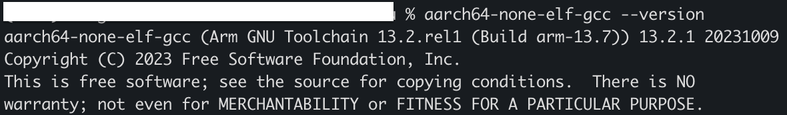 

正确现实版本号说明安装成功

### 2.2 安装QEMU模拟器

***\(1)*** 参考QEMU官网[https://wiki.qemu.org/Hosts/Mac](https://wiki.qemu.org/Hosts/Mac)*安装*


如果没有安装brew需要自行安装

/bin/zsh -c "$(curl -fsSL https://gitee.com/cunkai/HomebrewCN/raw/master/Homebrew.sh)"

### 2.3 安装CMake

Mac 通过 brew install cmake下载安装

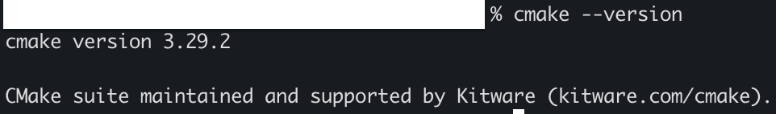   

Cmake是一个跨平台、开源的构建系统，它的主要功能有如下：

(1)跨平台兼容性：Cmake支持多种操作系统和编译环境，包括Windows\linux\Mac os等。

(2)生成构建系统：Cmake能够根据源码和预配置好的构建配置文件，生成各种构建文件，从而启动编译过程、测试以及打包可执行文件。

(3)扩展性好：支持裸机控制语法，并且允许通过CMakeLists.txt文件来配置项目构建过程。

在本次实验中，我们将在lab1中创建一个build 文件夹，用于存储配置文件。

 

### 2.4 创建裸机(Bare Metal)程序

​	由于我们的目标是编写一个操作系统，所以我们需要创建一个独立于操作系统的可执行程序，又称 独立式可执行程序（freestanding executable） 或 裸机程序（bare-metal executable） 。这意味着所有依赖于操作系统的库我们都不能使用。比如 std 中的大部分内容（io, thread, file system, etc.）都需要操作系统的支持，所以这部分内容我们不能使用。但是，不依赖与操作系统的语言特性还是可以继续使用的。

##### **(1)** 创建项目

我们将参照UniProton设计项目的目录层次，但为了理解方便，将会进行相应简化。其初始目录结构如下图所示。

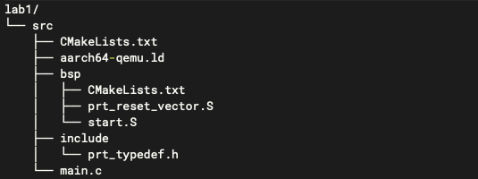

在实验一 lab1 目录下有一个 src 目录，所有源代码均放在此处。其下包括 bsp 目录和 include 目录。其中 bsp 目录存放与硬件紧密相关的代码，include 目录中存放项目的大部分头文件。

1、src：在操作系统中src文件通常指的是源代码文件，一般用多语言编写，实验中src仅main.c文件。

2、Src\CMakeLists.txt: 该文件用于构建CMake项目的配置文件，用于指定项目的构建过程。

3、Aarch64-qemu.ld: 链接器脚本，用于控制如何将各种对象文件（由编译器生成）组合成一个可执行文件或共享库。

4、Src\bsp: bsp通常包含了与硬件相关的代码和配置信息，以便操作系统能够与硬件进行交互。包括硬件初始化、中断处理、时钟管理、内存映射等功能。总的来说bsp提供了一个标准化的接口，使得应用程序和操作系统可以移植到不同平台上。

5、Start.S:主要负责系统启动的初始化工作。

6、prt_reset_vector.S ：包含处理器复位向量表或相关的初始化代码。复位向量表是处理器在启动时首先访问的内存位置，它指向初始化代码，用于设置处理器状态、初始化内存、配置中断等。

7、Include：包括一些头文件，在src下使用#include<文件名>即可直接引用其下的头文件。实验中，该目录下有 prt_typedef.h 头文件，它是 UniProton 所使用的基本数据类型和结构的定义，如 U8、U16、U32、U64等。

8、Prt_typedef.h：定义了一些数据类型。

9、main.c: main 函数的主要功能（L12-L13）是把 out_str 中的字符通过宏 UART_REG_WRITE 逐个写入地址为 0x9000000 的地方。其作用将在 [实验二 Hello, miniEuler](https://os2024lab.readthedocs.io/zh-cn/latest/lab2/index.html) 部分详细解释。

##### (2)根据实验指导书创建编辑相应main.c文件、prt_typedef.h文件、start.S文件、prt_reset_vector.S、以及aarch64-qemu.ld

main.c源码

```c
#include "prt_typedef.h"

#define UART_REG_WRITE(value, addr)  (*(volatile U32 *)((uintptr_t)addr) = (U32)value)

S32 main(void)
{
    char out_str[] = "AArch64 Bare Metal";

    int length = sizeof(out_str) / sizeof(out_str[0]);

    // 逐个输出字符
    for (int i = 0; i < length - 1; i++) {
        UART_REG_WRITE(out_str[i], 0x09000000);
    }
}
```

> [!NOTE]
>
> S32 是在 prt_typedef.h 中定义的基本类型，这是为了屏蔽各硬件系统的区别，方便操作系统移植到多种不同规格的硬件上。
>
> main 函数的主要功能（L12-L13）是把 out_str 中的字符通过宏 UART_REG_WRITE 逐个写入地址为 0x9000000 的地方。
>
> 其作用将在 [实验二 Hello, miniEuler](https://os2024lab.readthedocs.io/zh-cn/latest/lab2/index.html) 部分详细解释。

start.S 源码

```assembly
    .global   OsEnterMain
    .extern __os_sys_sp_end

    .type     start, function
    .section  .text.bspinit, "ax"
    .balign   4

    .global OsElxState
    .type   OsElxState, @function
OsElxState:
    MRS    x6, CurrentEL // 把系统寄存器 CurrentEL 的值读入到通用寄存器 x6 中
    MOV    x2, #0x4 // CurrentEL EL1： bits [3:2] = 0b01
    CMP    w6, w2

    BEQ Start // 若 CurrentEl 为 EL1 级别，跳转到 Start 处执行，否则死循环。

OsEl2Entry:
    B OsEl2Entry

Start:
    LDR    x1, =__os_sys_sp_end // 符号在ld文件中定义
    BIC    sp, x1, #0xf // 设置栈指针

    B      OsEnterMain

OsEnterReset:
    B      OsEnterReset
```

> [!NOTE]
>
> L1，L2两行声明 OsEnterMain 和 __os_sys_sp_end 是外部定义的符号，其中 OsEnterMain 在 prt_reset_vector.S 中定义， __os_sys_sp_end 在链接脚本 aarch64-qemu.ld 定义。
>
> L5 声明这部分代码段(section)的名字是 .text.bspinit
>
> L10 为系统入口，即系统一启动就会执行从L10开始的代码，其原因在随后的链接脚本中说明。
>
> L11-L15 检测当前CPU的 Exception Level 是否为 EL1 （将在 [实验四 异常处理](https://os2024lab.readthedocs.io/zh-cn/latest/lab4/index.html) 部分详细解释），如果是 EL1 则通过 L15 的 BEQ Start 跳转到标号Start(L20)处开始执行，否则执行 L17 开始的指令，它和 L18 一起构成死循环。
>
> L11 中的 CurrentEL 是 AArch64 架构的系统寄存器。这些寄存器不能直接操作，需要通过 MRS 指令（把系统寄存器的值读入到通用寄存器）或 MSR 指令（把通用寄存器的值写入到系统寄存器）借助通用寄存器来访问。完整的寄存器列表可参考 Arm 官网的 [AArch64 System Registers](https://developer.arm.com/documentation/ddi0595/2021-12/AArch64-Registers) 页面。
>
> L21-L22 用链接文件定义的地址初始化栈指针 sp，然后 L24 跳转到 prt_reset_vector.S 的 L7 行 OsEnterMain 处开始执行。

prt_reset_vector.S 源码

```assembly
DAIF_MASK = 0x1C0       // disable SError Abort, IRQ, FIQ

    .global  OsVectorTable
    .global  OsEnterMain

    .section .text.startup, "ax"
OsEnterMain:
    BL      main

    MOV     x2, DAIF_MASK // bits [9:6] disable SError Abort, IRQ, FIQ
    MSR     DAIF, x2 // 把通用寄存器 x2 的值写入系统寄存器 DAIF 中

EXITLOOP:
    B EXITLOOP
```

> [!NOTE]
>
> 目前，完全可以把 start.S 和 prt_reset_vector.S 合成一个文件，但为了将来扩展且与 UniProton 保持一致选择保留2个文件。
>
> L8 行跳转到通过 BL main 跳转到main.c中的main函数执行，main函数执行完后会回到 L10继续执行。
>
> L10-L11 禁用了Debug、SError、IRQ和FIQ，因为中断处理尚未设置，详细参见 [实验四 异常处理](OS/lab4)
>
> L10 中的 DAIF 是 AArch64 架构的系统寄存器，完整的寄存器列表可参考 Arm 官网的 [AArch64 System Registers](https://developer.arm.com/documentation/ddi0595/2021-12/AArch64-Registers) 页面。
>
> L13-L14 进入死循环。
>
> 在上面两个汇编文件中出现了两种不同的跳转指令 B 和 BL，其中 B 跳转后不返回调用位置， BL 跳转后执行完函数后会回到调用位置继续执行。

aarch64-qemu.ld 脚本。 该脚本较长，下面展示的仅是目前需了解的部分。完整版可从 [这里](https://os2024lab.readthedocs.io/zh-cn/latest/_static/aarch64-qemu.ld) 下载。

```assembly
ENTRY(__text_start)

_stack_size = 0x10000;
_heap_size = 0x10000;

MEMORY
{
    IMU_SRAM (rwx) : ORIGIN = 0x40000000, LENGTH = 0x800000 /* 内存区域 */
    MMU_MEM (rwx) : ORIGIN = 0x40800000, LENGTH = 0x800000 /* 内存区域 */
}

SECTIONS
{
    text_start = .;
    .start_bspinit :
    {
        __text_start = .; /* __text_start 指向当前位置， "." 表示当前位置 */
        KEEP(*(.text.bspinit))
    } > IMU_SRAM

    ... ... ...

    .heap (NOLOAD) :
    {
        . = ALIGN(8);
        PROVIDE (__HEAP_INIT = .);
        . = . + _heap_size; /* 堆空间 */
        . = ALIGN(8);
        PROVIDE (__HEAP_END = .);
    } > IMU_SRAM

    .stack (NOLOAD) :
    {
        . = ALIGN(8);
        PROVIDE (__os_sys_sp_start = .);
        . = . + _stack_size; /* 栈空间 */
        . = ALIGN(8);
        PROVIDE (__os_sys_sp_end = .);
    } > IMU_SRAM
    end = .;

    ... ... ...
}
```

> [!NOTE]
>
> L1 的 ENTRY(__text_start)中指明系统入口为 __text_start 。 L17-L18 表明 __text_start 为 .text.bspinit 段的起始位置。而在 start.S 中 L5 处定义了 .text.bspinit 段，其入口为 L10 处的 OsElxState 标号。因此系统的入口实际上就是 start.S 中的 L10 处的 OsElxState 标号处。
>
> 链接脚本中通过 PROVIDE 定义的符号 __os_sys_sp_end 是全局符号，可以在程序中使用（如 start.s 中），其定义的是栈底的位置。
>
> L26-L29，L35-L38 处分别定义了堆空间和栈空间。
>
> 
>
> 链接脚本中除了组织各个段之外，还可以定义符号，链接脚本中定义的符号被添加到全局符号中
>
> symbol = expression ; symbol += expression ;第一个表达式表示定义一个符号，第二个表达式对符号值进行操作，中间的空格是必须的
>
> 当程序和链接脚本中同时定义了变量符号时，链接脚本中的符号会覆盖掉程序中定义的符号
>
> 定义内存区域后，一个段没有显示地指定将要添加到哪个区域,将会对段的属性和区域的属性进行匹配
>
> 详情可参考 [The GNU linker](https://ftp.gnu.org/old-gnu/Manuals/ld-2.9.1/html_mono/ld.html)。此外，这里还有一个简单的 [链接脚本基本介绍](https://zhuanlan.zhihu.com/p/363308789) 可参考。


### 2.5 工程构建

操作系统是一个复杂的工程。如当前版本的 UniProton 包含了近 500 个文件，超过 10 万行的代码及说明，而 Linux 内核则包含有 6 万多个文件，超过 2700 万行的代码 (2020)。如果纯手工构建这样的系统是不可想象的，所以我们需要构建系统的帮助。

CMake 是一个跨平台的开源构建系统。CMake 通过简单的、与平台和编译器无关的配置文件来控制软件编译过程。

**(1)** ***CMakeLists.txt***

CMakeList是一个Cmake脚本，主要作用是为编译"miniEuler"项目设置正确的交叉编译工具链、编译选项、链接选项和项目结构。通过指定交叉编译工具链和编译选项，它允许项目在非目标机器的系统上编译出能够在aarch64架构上运行的代码。

```cmake
cmake_minimum_required(VERSION 3.12)

set(CMAKE_SYSTEM_NAME "Generic") # 目标系统(baremental)：  cmake/tool_chain/uniproton_tool_chain_gcc_arm64.cmake 写的是Linux
set(CMAKE_SYSTEM_PROCESSOR "aarch64") # 目标系统CPU

set(TOOLCHAIN_PATH "/usr/local/aarch64-none-elf") # 修改为交叉工具链实际所在目录 build.py config.xml中定义
set(CMAKE_C_COMPILER ${TOOLCHAIN_PATH}/bin/aarch64-none-elf-gcc)
set(CMAKE_CXX_COMPILER ${TOOLCHAIN_PATH}/bin/aarch64-none-elf-g++)
set(CMAKE_ASM_COMPILER ${TOOLCHAIN_PATH}/bin/aarch64-none-elf-gcc)
set(CMAKE_LINKER ${TOOLCHAIN_PATH}/bin/aarch64-none-elf-ld)

# 定义编译和链接等选项
set(CC_OPTION "-Os   -Wformat-signedness    -Wl,--build-id=none   -fno-PIE -fno-PIE --specs=nosys.specs -fno-builtin -fno-dwarf2-cfi-asm -fomit-frame-pointer -fzero-initialized-in-bss -fdollars-in-identifiers -ffunction-sections -fdata-sections -fno-aggressive-loop-optimizations -fno-optimize-strlen -fno-schedule-insns -fno-inline-small-functions -fno-inline-functions-called-once -fno-strict-aliasing -finline-limit=20  -mlittle-endian -nostartfiles -funwind-tables")
set(AS_OPTION "-Os   -Wformat-signedness    -Wl,--build-id=none   -fno-PIE -fno-PIE --specs=nosys.specs -fno-builtin -fno-dwarf2-cfi-asm -fomit-frame-pointer -fzero-initialized-in-bss -fdollars-in-identifiers -ffunction-sections -fdata-sections -fno-aggressive-loop-optimizations -fno-optimize-strlen -fno-schedule-insns -fno-inline-small-functions -fno-inline-functions-called-once -fno-strict-aliasing -finline-limit=20  -mlittle-endian -nostartfiles -funwind-tables")
set(LD_OPTION " ")
set(CMAKE_C_FLAGS "${CC_OPTION} ")
set(CMAKE_ASM_FLAGS "${AS_OPTION} ")
set(CMAKE_LINK_FLAGS "${LD_OPTION} -T ${CMAKE_CURRENT_SOURCE_DIR}/aarch64-qemu.ld") # 指定链接脚本
set(CMAKE_EXE_LINKER_FLAGS "${LD_OPTION} -T ${CMAKE_CURRENT_SOURCE_DIR}/aarch64-qemu.ld") # 指定链接脚本
set (CMAKE_C_LINK_FLAGS " ")
set (CMAKE_CXX_LINK_FLAGS " ")

set(HOME_PATH ${CMAKE_CURRENT_SOURCE_DIR})

set(APP "miniEuler") # APP变量，后面会用到 ${APP}
project(${APP} LANGUAGES C ASM) # 工程名及所用语言
set(CMAKE_BUILD_TYPE Debug) # 生成 Debug 版本

include_directories( # include 目录
    ${CMAKE_CURRENT_SOURCE_DIR}/include
    ${CMAKE_CURRENT_SOURCE_DIR}/bsp
)

add_subdirectory(bsp) # 包含子文件夹的内容

list(APPEND OBJS $<TARGET_OBJECTS:bsp>)
add_executable(${APP} main.c ${OBJS}) # 可执行文件
```

注意这里需要根据自己的交叉工具链所在目录更改TOOLCHAIN_PATH

**(2) ** ***src/bsp/下的CMakeLists.txt***

```cmake
set(SRCS start.S prt_reset_vector.S )
add_library(bsp OBJECT ${SRCS})  # OBJECT类型只编译生成.o目标文件，但不实际链接成库
```

这两行CMake脚本是构建系统中用于定义一个库目标的常见用法。

①set(SRCS start.S prt_reset_vector.S) 设置了名为 SRCS 的变量，其中包含了库目标的源文件列表。在里start.S 和 prt_reset_vector.S 是汇编语言源文件，通常用于定义程序的入口点和重置向量。

②add_library(bsp OBJECT ${SRCS}) 这行命令告诉CMake创建一个库目标，名为 bsp。add_library 是CMake中用于定义库目标的命令，它可以创建静态库（STATIC）、动态库（SHARED）、或对象库（OBJECT）。

③使用 OBJECT 类型的库有以下几个优点：

 优化构建时间：由于不生成单独的库文件，这可以减少构建系统的复杂性和构建时间。

 直接包含：生成的对象文件可以直接被其他目标包含，使得链接过程更加灵活。

 避免重复编译：当多个目标需要相同对象文件时，这些对象文件只会被编译一次。

可以看到，src/下的 CMakeLists.txt 设置了交叉工具路径、编译和链接选项、项目名称和语言等全局环境，然后设置了需包含头文件的位置和源文件及其子目录。

**(3)** ***编译运行***

1.编译

首先在项目目录 lab1 下创建 build 目录用于编译生成，然后进入 build 目录执行

```
$ cmake ../src
$ cmake --build .
```

2.运行

在项目目录lab1下执行

```
$ qemu-system-aarch64 -machine virt -m 1024M -cpu cortex-a53 -nographic -kernel build/miniEuler  -s
```

具体参数解释如下：

 qemu-system-aarch64：这是QEMU模拟器的命令，用于模拟ARM64（也称为AArch64）架构的处理器。

 -machine virt：指定QEMU使用的机器模型。virt是一个QEMU提供的虚拟硬件平台，它模拟了一个通用的硬件环境，适合于大多数操作系统的运行。

 -m 1024M：设置QEMU模拟器的内存大小为1024MB（1GB）。

 -cpu cortex-a53：指定QEMU模拟的CPU类型为ARM Cortex-A53。Cortex-A53是一款高效的ARMv8-A架构处理器，常用于移动设备和嵌入式系统。

 -nographic：指示QEMU以无图形界面模式运行。这意味着所有的输出将通过命令行界面（CLI）进行，而不是图形用户界面（GUI）。

 -kernel build/miniEuler：指定了操作系统内核的路径。在这个例子中，build/miniEuler是内核映像文件的位置，它将被QEMU用作启动操作系统的内核。

 -s：这个参数后面通常跟一个数字，用来指定QEMU监听的GDB服务器的TCP端口号。

### 2.6 调试支持

**(1)** ***GDB简单调试***

编译成功后就可以运行，这需要使用前面安装的QEMU模拟器。此外，为了查找并修正bug，我们需要使用调试工具。

①通过QEMU运行程序并启动调试服务器，默认端口1234

```
$ qemu-system-aarch64 -machine virt,gic-version=2 -m 1024M -cpu cortex-a53 -nographic -kernel build/miniEuler  -s -S
```

-S：这个参数指示QEMU在启动后暂停执行，等待GDB调试器的连接。这通常用于在启动时附加调试器进行调试。

②启动调试客户端

在另一个终端窗口中启动GDB

```
$ aarch64-none-elf-gdb build/miniEuler
```

③设置调试参数，开始调试

连接到QEMU监听的端口（默认是1234）:

`(gdb) target remote localhost:1234`

反汇编当前的程序计数器（PC）指向的代码区域:

`(gdb) disassemble`

执行程序中一条语句:

`(gdb) n`

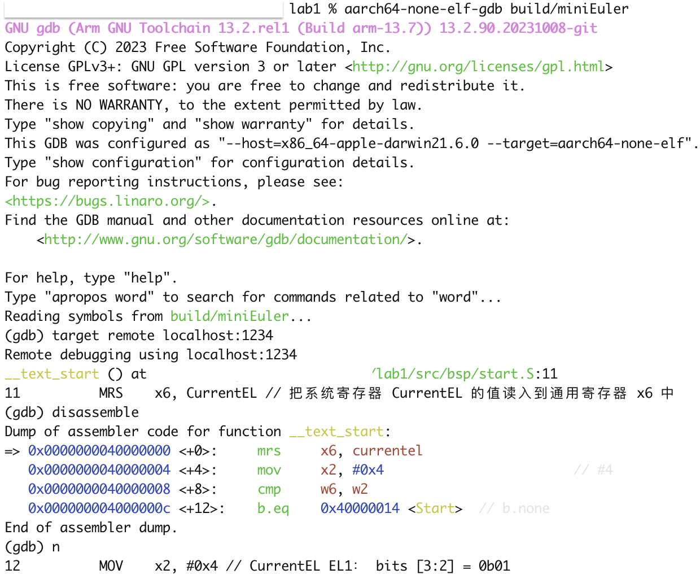

**(2)** ***将调试集成到vscode***

如上通过QEMU运行程序并启动调试服务器

***1.***打开 main.c 文件，点击 vscode左侧的运行和调试按钮，弹出对话框选择创建 launch.json文件，增加如下配置：

```json
{
    // Use IntelliSense to learn about possible attributes.
    // Hover to view descriptions of existing attributes.
    // For more information, visit: https://go.microsoft.com/fwlink/?linkid=830387
    "version": "0.2.0",
    "configurations": [

        {
            "name": "aarch64-gdb",
            "type": "cppdbg",
            "request": "launch",
            "program": "${workspaceFolder}/build/miniEuler",
            "stopAtEntry": true,
            "cwd": "${fileDirname}",
            "environment": [],
            "externalConsole": false,
            "launchCompleteCommand": "exec-run",
            "MIMode": "gdb",
            "miDebuggerPath": "aarch64-none-elf/bin/aarch64-none-elf-gdb", // 修改成交叉调试器gdb对应位置
            "miDebuggerServerAddress": "localhost:1234",
            "setupCommands": [
                {
                    "description": "Enable pretty-printing for gdb",
                    "text": "-enable-pretty-printing",
                    "ignoreFailures": true
                }
            ]
        }
    ],
}
```

"name": "aarch64-gdb"：为这个调试配置提供一个易读的名称。

"type": "cppdbg"：指定调试器类型，这里是C/C++调试器。

"request": "launch"：请求类型，表示启动一个新的调试会话。

"program": "\${workspaceFolder}/build/miniEuler"：指定要调试的程序的路径，这里使用了VS Code的变量${workspaceFolder}来表示工作区的根目录。

"stopAtEntry": true：指示调试器在程序入口处停止，这通常用于设置断点。

"cwd": "${fileDirname}"：设置当前工作目录为当前打开文件的目录。

"environment": []：定义了程序运行时的环境变量列表，这里没有设置任何环境变量。

"externalConsole": false：指示不使用外部控制台运行程序。

"launchCompleteCommand": "exec-run"：在启动完成后执行的命令。

"MIMode": "gdb"：指定机器接口模式为GDB。

"miDebuggerPath": "路径"：指定了GDB调试器的路径，需要根据我们实际情况修改成正确的GDB调试器路径。

"miDebuggerServerAddress": "localhost:1234"：指定了GDB服务器的地址和端口，这里设置GDB服务器监听在本地的1234端口。

"setupCommands"：定义了启动GDB之前要执行的一系列命令。在这个配置中，启用了GDB的pretty-printing功能，这可以美化输出，使其更易于阅读。

 

***2.***在左边面板顶部选择刚添加的 aarch64-gdb 选项，点击旁边的绿色 开始调试（F5） 按钮开始调试。

在调试时，可以在调试控制台执行gdb命令，如：

——查看指定地址的内存内容。在调试控制台执行 -exec x/20xw 0x40000000 即可，其中 x表示查看命令，20表示查看数量，x表示格式，可选格式包括 

Format letters are o(octal), x(hex), d(decimal), u(unsigned decimal),t(binary), f(float), a(address), i(instruction), c(char) and s(string).

Size letters are b(byte), h(halfword), w(word), g(giant, 8 bytes).，最后的 w表示字宽，b表示单字节，h表示双字节，w表示四字节，g表示八字节。

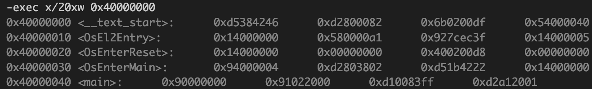

还可以是指令：-exec x/20i 0x40000000

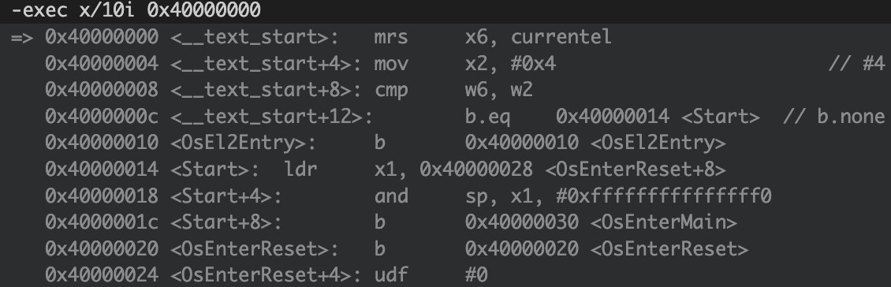

——显示所有寄存器。-exec info all-registers

——查看寄存器内容。-exec p/x $pc


——修改寄存器内容。-exec set $x24 = 0x5


——修改指定内存位置的内容。-exec set {int}0x4000000 = 0x1 或者 -exec set *((int *) 0x4000000) = 0x1

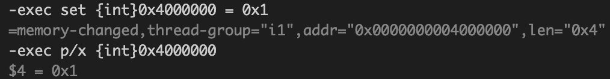

——修改指定MMIO 寄存器的内容。 -exec set *((volatile int *) 0x08010004) = 0x1


——退出调试 -exec q

## 3 作业

### 3.1作业1

**商业操作系统都有复杂的构建系统，试简要分析 UniProton 的构建系统。**

UniProton 是一款实时操作系统，具备极致的低时延和灵活的混合关键性部署特性，可以适用于工业控制场景，既支持微控制器 MCU，也支持算力强的多核 CPU。

UniProton 系统由 Mem、Arch、Kernel、IPC、OM 五大子系统构成，Mem、Arch 是整个系统的基石。

各子系统的职责如下：

Mem：实现内存分区的创建，内存块的申请和释放等功能。

Arch：实现和芯片强相关的硬件特性功能，如硬中断、异常接管等。

Kernel：实现任务、软中断、TICK中断、软件定时器等功能。

IPC：实现事件、队列、信号量等功能。

OM：实现 cpup、hook 等调测功能。

分析build.py:

1.导入模块:

导入os、sys、time、shutil、subprocess、platform等Python标准库

导入自定义模块，如make_buildef、globle、BuilderNolog和log_msg

```python
#!/usr/bin/env python3
# coding=utf-8
# The build entrance of UniProton.
# Copyright (c) 2009-2023 Huawei Technologies Co., Ltd. All rights reserved.

import os
import sys
import time
import shutil
import subprocess
import platform
from sys import argv
UniProton_home = os.path.dirname(os.path.abspath(__file__))
sys.path.insert(0, "%s/cmake/common/build_auxiliary_script"%UniProton_home)
from make_buildef import make_buildef
sys.path.insert(0, "%s/build/uniproton_ci_lib"%UniProton_home)
import globle
from logs import BuilderNolog, log_msg
from get_config_info import *
```

2. 类定义

```python
class Compile:
# 根据makechoice获取config的配置的环境，compile_mode， lib_type,
    def get_config(self, cpu_type, cpu_plat):
        self.compile_mode = get_compile_mode()
        self.lib_type, self.plam_type, self.hcc_path, self.kconf_dir, self.system, self.core = get_cpu_info(cpu_type, cpu_plat, self.build_machine_platform)
        if not self.compile_mode and self.lib_type and self.plam_type and self.hcc_path and self.kconf_dir:
            log_msg('error', 'load config.xml env error')
            sys.exit(0)
        self.config_file_path = '%s/build/uniproton_config/config_%s'%(self.home_path, self.kconf_dir)

        self.objcopy_path = self.hcc_path
```

get_config: 根据提供的CPU类型和平台获取编译配置，包括编译模式、库类型、平台类型等，并设置相应的环境变量

```python
 		def setCmdEnv(self):
        self.build_time_tag = time.strftime('%Y-%m-%d_%H:%M:00')
        self.log_dir = '%s/logs/%s' % (self.build_dir, self.cpu_type)
        self.log_file = '%s.log' % self.kconf_dir
    def SetCMakeEnviron(self):
        os.environ["CPU_TYPE"] = self.cpu_type
        os.environ["PLAM_TYPE"] = self.plam_type
        os.environ["LIB_TYPE"] = self.lib_type
        os.environ["COMPILE_OPTION"] = self.compile_option
        os.environ["HCC_PATH"] = self.hcc_path
        os.environ["UNIPROTON_PACKING_PATH"] = self.UniProton_packing_path
        os.environ["CONFIG_FILE_PATH"] = self.config_file_path
        os.environ["LIB_RUN_TYPE"] = self.lib_run_type
        os.environ["HOME_PATH"] = self.home_path
        os.environ["COMPILE_MODE"] = self.compile_mode
        os.environ["BUILD_MACHINE_PLATFORM"] = self.build_machine_platform
        os.environ["SYSTEM"] = self.system
        os.environ["CORE"] = self.core
        os.environ["OBJCOPY_PATH"] = self.objcopy_path
        os.environ['PATH'] = '%s:%s' % (self.hcc_path, os.getenv('PATH'))

    # 环境准备，准备执行cmake，make，makebuildfile，CmakeList需要的环境
    # 每次compile之前请调用该函数
    def prepare_env(self, cpu_type, choice):
        # makebuildfile需要的环境kconf_dir
        # cmake需要的环境cmake_env_path，home_path（cmakelist所在的路径）,home_path,
        # make cmd拼接需要的环境：home_path,UniProton_make_jx,log_dir,log_file，build_time_tag， UniProton_make_jx

        #根据cpu_type, choice从config文件中获取并初始化初始化hcc_path， plam_type, kconf_dir
        #根据输入分支获取
        #从编译镜像环境获取
        self.get_config(cpu_type, choice)
        self.setCmdEnv()
        self.SetCMakeEnviron()

    #获取编译环境是arm64还是x86，用户不感知，并将其写入环境变量。
    def getOsPlatform(self):
        self.cmake_env_path = get_tool_info('cmake', 'tool_path')

        if platform.uname()[-1] == 'aarch64':
            self.build_machine_platform = 'arm64'
        else:
            self.build_machine_platform = 'x86'

```

setCmdEnv: 设置构建命令环境，包括构建时间标签和日志目录

SetCMakeEnviron: 设置CMake所需的环境变量

prepare_env: 准备编译环境，包括调用get_config和setCmdEnv

getOsPlatform: 确定当前操作系统平台，并设置环境变量。

```python
    # 获取当前编译的路径信息，配置文件信息，编译选项信息
    def __init__(self, cpu_type: str, make_option="normal", lib_run_type="FPGA", choice="ALL", make_phase="ALL",
                 UniProton_packing_path=""):
        # 当前路径信息
        self.system = ""
        self.objcopy_path = ""
        self.builder = None
        self.compile_mode = ""
        self.core = ""
        self.plam_type = ""
        self.kconf_dir = ""
        self.build_tmp_dir = ""
        self.log_dir = ""
        self.lib_type = ""
        self.hcc_path = ""
        self.log_file = ""
        self.config_file_path = ""
        self.build_time_tag = ""
        self.build_dir = globle.build_dir
        self.home_path = globle.home_path
        self.kbuild_path = globle.kbuild_path
        # 当前选项信息
        self.cpu_type = cpu_type
        self.compile_option = make_option
        self.lib_run_type = lib_run_type
        self.make_choice = choice.lower()
        self.make_phase = make_phase
        self.UniProton_packing_path = UniProton_packing_path if make_phase == "CREATE_CMAKE_FILE" else '%s/output'%self.home_path
        self.UniProton_binary_dir = os.getenv('RPROTON_BINARY_DIR')
        self.UniProton_install_file_option = os.getenv('RPROTON_INSTALL_FILE_OPTION')
        self.UniProton_make_jx = 'VERBOSE=1' if self.UniProton_install_file_option == 'SUPER_BUILD' else 'VERBOSE=1 -j' + str(os.cpu_count())
        # 当前编译平台信息
        self.getOsPlatform()
```

\_\_init\_\_: 类初始化方法，设置编译选项、路径和当前编译平台信息，包括：

cpu_type：CPU 类型，是一个字符串。

make_option：编译选项，默认为 "normal"。

lib_run_type：库要运行的平台，默认为 "FPGA"。

choice：编译选项，默认为 "ALL"。

make_phase：全量构建选项，默认为 "ALL"。

UniProton_packing_path：UniProton 库的安装位置，默认为空字符串。

```python
#调用cmake生成Makefile文件，需要
def CMake(self):
    if self.UniProton_binary_dir:
        self.build_tmp_dir = '%s/output/tmp/%s' % (self.UniProton_binary_dir, self.kconf_dir)
    else:
        self.build_tmp_dir = '%s/output/tmp/%s' % (self.build_dir, self.kconf_dir)
    os.environ['BUILD_TMP_DIR'] = self.build_tmp_dir

    if not os.path.exists(self.build_tmp_dir):
        os.makedirs(self.build_tmp_dir)
    if not os.path.exists(self.log_dir):
        os.makedirs(self.log_dir)

    log_msg('info', 'BUILD_TIME_TAG %s' % self.build_time_tag)
    self.builder = BuilderNolog(os.path.join(self.log_dir, self.log_file))
    if self.make_phase in ['CREATE_CMAKE_FILE', 'ALL']:
        real_path = os.path.realpath(self.build_tmp_dir)
        if os.path.exists(real_path):
            shutil.rmtree(real_path)
        os.makedirs(self.build_tmp_dir)
        #拼接cmake命令
        if self.compile_option == 'fortify':
            cmd = '%s/cmake %s -DCMAKE_TOOLCHAIN_FILE=%s/cmake/tool_chain/uniproton_tool_chain.cmake ' \
                  '-DCMAKE_C_COMPILER_LAUNCHER="sourceanalyzer;-b;%sproject" ' \
                  '-DCMAKE_INSTALL_PREFIX=%s &> %s/%s' % (
            self.cmake_env_path, self.home_path, self.home_path, self.cpu_type,
            self.UniProton_packing_path, self.log_dir, self.log_file)
        elif self.compile_option == 'hllt':
            cmd = '%s/cmake %s -DCMAKE_TOOLCHAIN_FILE=%s/cmake/tool_chain/uniproton_tool_chain.cmake ' \
                  '-DCMAKE_C_COMPILER_LAUNCHER="lltwrapper" -DCMAKE_INSTALL_PREFIX=%s &> %s/%s' % (
            self.cmake_env_path, self.home_path, self.home_path, self.UniProton_packing_path, self.log_dir, self.log_file)
        else:
            cmd = '%s/cmake %s -DCMAKE_TOOLCHAIN_FILE=%s/cmake/tool_chain/uniproton_tool_chain.cmake ' \
                  '-DCMAKE_INSTALL_PREFIX=%s &> %s/%s' % (
            self.cmake_env_path, self.home_path, self.home_path, self.UniProton_packing_path, self.log_dir, self.log_file)
        #执行cmake命令
        if self.builder.run(cmd, cwd=self.build_tmp_dir, env=None):
            log_msg('error', 'generate makefile failed!')
            return False

    log_msg('info', 'generate makefile succeed.')
    return True
```

CMake: 调用CMake命令生成Makefile。

```python
def UniProton_clean(self):
    for foldername,subfoldernames,filenames in os.walk(self.build_dir):
        for subfoldername in subfoldernames:
            if subfoldername in ['logs','output','__pycache__']:
                folder_path = os.path.join(foldername,subfoldername)
                shutil.rmtree(os.path.relpath(folder_path))
        for filename in filenames:
            if filename == 'prt_buildef.h':
                file_dir = os.path.join(foldername,filename)
                os.remove(os.path.relpath(file_dir))
    if os.path.exists('%s/cmake/common/build_auxiliary_script/__pycache__'%self.home_path):
        shutil.rmtree('%s/cmake/common/build_auxiliary_script/__pycache__'%self.home_path)
    if os.path.exists('%s/output'%self.home_path):
        shutil.rmtree('%s/output'%self.home_path)
    if os.path.exists('%s/tools/SRE/x86-win32/sp_makepatch/makepatch'%self.home_path):
        os.remove('%s/tools/SRE/x86-win32/sp_makepatch/makepatch'%self.home_path)
    if os.path.exists('%s/build/prepare/__pycache__'%self.home_path):
        shutil.rmtree('%s/build/prepare/__pycache__'%self.home_path)
    return True
```

UniProton_clean: 清理编译缓存，移除旧的构建文件。

```python
def make(self):
    if self.make_phase in ['EXECUTING_MAKE', 'ALL']:
        self.builder.run('make clean', cwd=self.build_tmp_dir, env=None)
        tmp = sys.argv
        if self.builder.run(
                'make all %s &>> %s/%s' % (
                self.UniProton_make_jx, self.log_dir, self.log_file), cwd=self.build_tmp_dir, env=None):
            log_msg('error', 'make %s %s  failed!' % (self.cpu_type, self.plam_type))
            return False
        sys.argv = tmp
        if self.compile_option in ['normal', 'coverity', 'single']:
            if self.builder.run('make install %s &>> %s/%s' % (self.UniProton_make_jx, self.log_dir, self.log_file), cwd=self.build_tmp_dir, env=None):
                log_msg('error', 'make install failed!')
                return False
        if os.path.exists('%s/%s' % (self.log_dir, self.log_file)):
            self.builder.log_format()

    log_msg('info', 'make %s %s succeed.' % (self.cpu_type, self.plam_type))
    return True
```

make: 执行make命令来编译项目。

```python
def make(self):
    if self.make_phase in ['EXECUTING_MAKE', 'ALL']:
        self.builder.run('make clean', cwd=self.build_tmp_dir, env=None)
        tmp = sys.argv
        if self.builder.run(
                'make all %s &>> %s/%s' % (
                self.UniProton_make_jx, self.log_dir, self.log_file), cwd=self.build_tmp_dir, env=None):
            log_msg('error', 'make %s %s  failed!' % (self.cpu_type, self.plam_type))
            return False
        sys.argv = tmp
        if self.compile_option in ['normal', 'coverity', 'single']:
            if self.builder.run('make install %s &>> %s/%s' % (self.UniProton_make_jx, self.log_dir, self.log_file), cwd=self.build_tmp_dir, env=None):
                log_msg('error', 'make install failed!')
                return False
        if os.path.exists('%s/%s' % (self.log_dir, self.log_file)):
            self.builder.log_format()

    log_msg('info', 'make %s %s succeed.' % (self.cpu_type, self.plam_type))
    return True
```

SdkCompaile: 编译SDK，调用MakeBuildef、CMake和make方法。

```python
def SdkCompaile(self)->bool:
    # 判断该环境中是否需要编译
    if self.hcc_path == 'None':
        return True

    self.MakeBuildef()
    if self.CMake() and self.make():
        log_msg('info', 'make %s %s lib succeed!' % (self.cpu_type, self.make_choice))
        return True
    else:
        log_msg('info', 'make %s %s lib failed!' % (self.cpu_type, self.make_choice))
        return False
```

UniProtonCompile: 对外编译接口，根据类初始化时的值进行编译。

```python
# 对外函数，调用后根据类初始化时的值进行编译
def UniProtonCompile(self):
    #清除UniProton缓存
    if self.cpu_type == 'clean':
        log_msg('info', 'UniProton clean')
        return self.UniProton_clean()
    # 根据cpu的编译平台配置相应的编译环境。
    if self.make_choice == "all":
        for make_choice in globle.cpu_plat[self.cpu_type]:
            self.prepare_env(self.cpu_type, make_choice)
            if not self.SdkCompaile():
                return False
    else:
        self.prepare_env(self.cpu_type, self.make_choice)
        if not self.SdkCompaile():
            return False
    return True
```

MakeBuildef: 创建构建环境文件

```python
def MakeBuildef(self):
  
   if not make_buildef(globle.home_path,self.kconf_dir,"CREATE"):
       sys.exit(1)
   log_msg('info', 'make_buildef_file.sh %s successfully.' % self.kconf_dir)
```

3.脚本执行入口

```python
# argv[1]: cpu_plat 表示要编译的平台：
# argv[2]: compile_option 控制编译选项，调用不同的cmake参数，目前只有normal coverity hllt fortify single(是否编译安全c，组件化独立构建需求)
# argv[3]: lib_run_type lib库要跑的平台 faga sim等
# argv[4]: make_choice 
# argv[5]: make_phase 全量构建选项
# argv[6]: UniProton_packing_path lib库的安装位置
if __name__ == "__main__":
    default_para = ("all", "normal", "FPGA", "ALL", "ALL", "")
    if len(argv) == 1:
        para = [default_para[i] for i in range(0, len(default_para))]
    else:
        para = [argv[i+1] if i < len(argv) - 1 else default_para[i] for i in range(0,len(default_para))]

    cur_cpu_type = para[0].lower()
    cur_compile_option = para[1].lower()
    cur_lib_run_type = para[2]
    cur_make_choice = para[3]
    cur_make_phase = para[4]
    cur_UniProton_packing_path = para[5]
    for plat in globle.cpus_[cur_cpu_type]:
        UniProton_build = Compile(plat, cur_compile_option, cur_lib_run_type, cur_make_choice, cur_make_phase, cur_UniProton_packing_path)
        if not UniProton_build.UniProtonCompile():
            sys.exit(1)
    sys.exit(0)
```

这部分代码会解析命令行参数，然后循环调用 Compile 类的 UniProtonCompile 方法来编译 UniProton 项目。 

### 3.2作业2

学习如何调试项目

调试查看操作系统是否正确运行，当前异常状态为EL1，程序正确跳转到Start入口

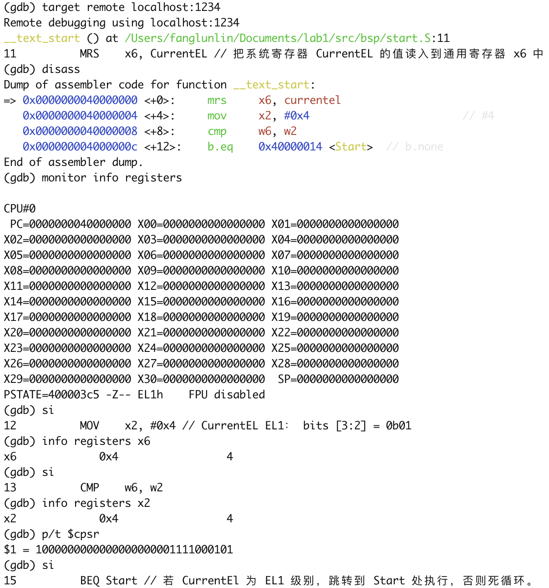

Start是操作系统启动的初始化部分，这里的指令执行了栈指针的初始化，其中包括：

加载栈指针的结束地址，并将其存入 x1 寄存器。

通过 BIC 指令清除栈指针的低 4 位，确保栈指针 16 字节对齐

最后程序跳转到主函数 OsEnterMain。

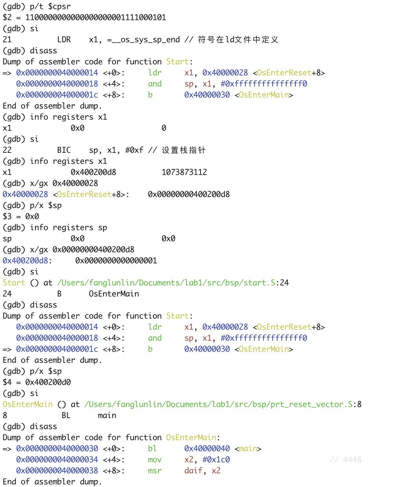

程序跳转到main函数执行，如果运行正常则输出结果`AArch64 Bare Metal`

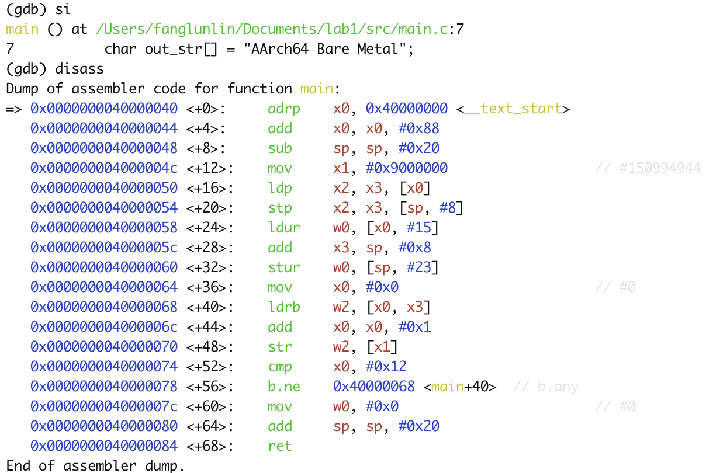

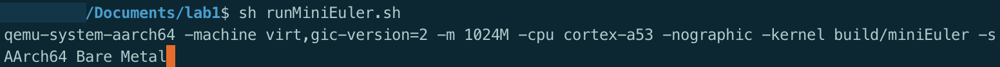
