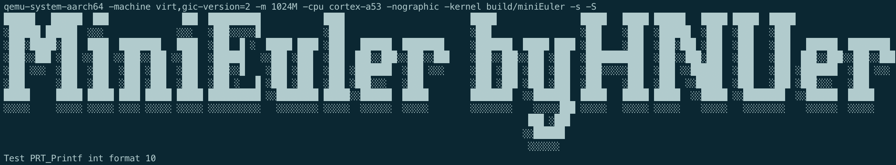

 

# 操作系统实验二报告

## 1 实验项目

### 1.1 项目名称

Hello, miniEuler

### 1.2 实验目的

print函数是学习几乎任何一种软件开发语言时最先学习使用的函数，同时该函数也是最基本和原始的程序调试手段，但该函数的实现却并不简单。本实验的目的在于理解操作系统与硬件的接口方法，并实现一个可打印字符的函数（非系统调用），用于后续的调试和开发。

### 1.3 实验要求

按照实验指导书实现PRT_Printf函数并打印内容

### 1.4 实验资源

实验指导书、M2 MacBook

## 2 实验任务

### 2.1 实验任务A

任务名称：了解virt机器

操作系统介于硬件和应用程序之间，向下管理硬件资源，向上提供应用编程接口。设计并实现操作系统需要熟悉底层硬件的组成及其操作方法。

本系列实验都会在QEMU模拟器上完成，首先来了解一下模拟的机器信息。可以通过下列两种方法：

#### 1.查看QEMU关于 virt的描述 

 或者查看QEMU的源码，如github上的 virt.h 和 virt.c。virt.c中可见如下有关内存映射的内容。

```c
static const MemMapEntry base_memmap[] = {
    /* Space up to 0x8000000 is reserved for a boot ROM */
    [VIRT_FLASH] =              {          0, 0x08000000 },
    [VIRT_CPUPERIPHS] =         { 0x08000000, 0x00020000 },
    /* GIC distributor and CPU interfaces sit inside the CPU peripheral space */
    [VIRT_GIC_DIST] =           { 0x08000000, 0x00010000 },
    [VIRT_GIC_CPU] =            { 0x08010000, 0x00010000 },
    [VIRT_GIC_V2M] =            { 0x08020000, 0x00001000 },
    [VIRT_GIC_HYP] =            { 0x08030000, 0x00010000 },
    [VIRT_GIC_VCPU] =           { 0x08040000, 0x00010000 },
    /* The space in between here is reserved for GICv3 CPU/vCPU/HYP */
    [VIRT_GIC_ITS] =            { 0x08080000, 0x00020000 },
    /* This redistributor space allows up to 2*64kB*123 CPUs */
    [VIRT_GIC_REDIST] =         { 0x080A0000, 0x00F60000 },
    [VIRT_UART] =               { 0x09000000, 0x00001000 },
    [VIRT_RTC] =                { 0x09010000, 0x00001000 },
    [VIRT_FW_CFG] =             { 0x09020000, 0x00000018 },
    [VIRT_GPIO] =               { 0x09030000, 0x00001000 },
    [VIRT_SECURE_UART] =        { 0x09040000, 0x00001000 },
    [VIRT_SMMU] =               { 0x09050000, 0x00020000 },
    [VIRT_PCDIMM_ACPI] =        { 0x09070000, MEMORY_HOTPLUG_IO_LEN },
    [VIRT_ACPI_GED] =           { 0x09080000, ACPI_GED_EVT_SEL_LEN },
    [VIRT_NVDIMM_ACPI] =        { 0x09090000, NVDIMM_ACPI_IO_LEN},
    [VIRT_PVTIME] =             { 0x090a0000, 0x00010000 },
    [VIRT_SECURE_GPIO] =        { 0x090b0000, 0x00001000 },
    [VIRT_MMIO] =               { 0x0a000000, 0x00000200 },
    /* ...repeating for a total of NUM_VIRTIO_TRANSPORTS, each of that size */
    [VIRT_PLATFORM_BUS] =       { 0x0c000000, 0x02000000 },
    [VIRT_SECURE_MEM] =         { 0x0e000000, 0x01000000 },
    [VIRT_PCIE_MMIO] =          { 0x10000000, 0x2eff0000 },
    [VIRT_PCIE_PIO] =           { 0x3eff0000, 0x00010000 },
    [VIRT_PCIE_ECAM] =          { 0x3f000000, 0x01000000 },
    /* Actual RAM size depends on initial RAM and device memory settings */
    [VIRT_MEM] =                { GiB, LEGACY_RAMLIMIT_BYTES },
};

```

##### 2.通过QEMU导出设备树

①安装设备树格式转换工具

Mac下安装

```cmd
$  brew install dtc
```


Linux下安装

```cmd
$ apt-get install device-tree-compiler
```

 

②通过QEMU导出设备树并转成可读格式

```cmd
$ qemu-system-aarch64 -machine virt,dumpdtb=virt.dtb -cpu cortex-a53 -nographic
$ dtc -I dtb -O dts -o virt.dts virt.dtb
```

（tips：-machine virt 指明机器类型为virt，这是QEMU仿真的虚拟机器。）

 

virt.dtb转换后生成的virt.dts中可找到如下内容

```c
pl011@9000000 {
    clock-names = "uartclk\0apb_pclk";
    clocks = <0x8000 0x8000>;
    interrupts = <0x00 0x01 0x04>;
    reg = <0x00 0x9000000 0x00 0x1000>;
    compatible = "arm,pl011\0arm,primecell";
};

chosen {
    stdout-path = "/pl011@9000000";
    kaslr-seed = <0xcbd0568d 0xb463306c>;
};
```

由上可以看出，virt机器包含有pl011的设备，该设备的寄存器在0x9000000开始处。pl011实际上是一个UART设备，即串口。可以看到virt选择使用pl011作为标准输出，这是因为与PC不同，大部分嵌入式系统默认情况下并不包含VGA设备。

### 2.2 实验任务B

任务名称：实现 PRT_Printf 函数

本系列实验每个实验均依赖前序相关实验，因此可拷贝 lab1 目录并重命名为 lab2 ，在 lab2 目录中再操作（后续实验照此操作）。

新建 src/bsp/print.c 文件，完成如下部分。

**(1) 宏定义**

在 print.c 中包含所需头文件，并定义后续将会用到的宏

```c
#include <stdarg.h>
#include "prt_typedef.h"

#define UART_0_REG_BASE 0x09000000 // pl011 设备寄存器地址
// 寄存器及其位定义参见：https://developer.arm.com/documentation/ddi0183/g/programmers-model/summary-of-registers
#define DW_UART_THR 0x00 // UARTDR(Data Register) 寄存器
#define DW_UART_FR 0x18  // UARTFR(Flag Register) 寄存器
#define DW_UART_LCR_HR 0x2c  // UARTLCR_H(Line Control Register) 寄存器
#define DW_XFIFO_NOT_FULL 0x020  // 发送缓冲区满置位
#define DW_FIFO_ENABLE 0x10 // 启用发送和接收FIFO

#define UART_BUSY_TIMEOUT   1000000
#define OS_MAX_SHOW_LEN 0x200


#define UART_REG_READ(addr)          (*(volatile U32 *)(((uintptr_t)addr)))  // 读设备寄存器
#define UART_REG_WRITE(value, addr)  (*(volatile U32 *)((uintptr_t)addr) = (U32)value) // 写设备寄存器
```

**(2)串口的初始化**

依据之前virt.dts中的描述，pl011的寄存器在virt机器中被映射到了0x9000000的内存位置。通过访问pl011的技术参考手册中的“Chapter 3. Programmers Model”中的”Summary of registers“一节可知，第0号寄存器是pl011串口的数据寄存器，用于数据的收发。

如果启用了FIFO，写入此位置的数据将推送到传输FIFO上

如果未启用FIFO，数据将存储在发射器保持寄存器（传输FIFO的底部数据）中。

写入操作从UART启动传输。数据前缀为开始位，附加适当的奇偶校验位（如果启用奇偶校验）和停止位。然后传输由此产生的文字。

对于收到的文字：

如果启用了FIFO，数据字节和4位状态（中断、帧、奇偶校验和超时）将推送到12位宽接收FIFO

如果未启用FIFO，数据字节和状态将存储在接收持有寄存器（接收FIFO的底部单词）中。

 

注意到我们只是向UART0写入，而没从UART0读出（如果读出会读出其他设备通过串口发送过来的数据，而不是刚才写入的数据，注意体会这与读写内存时是不一样的，详情参见pl011的技术手册），编译器在优化时可能对这部分代码进行错误的优化，如把这些操作都忽略掉。在 UART_REG_READ 宏和 UART_REG_WRITE 宏中使用 volatile 关键字的目的是告诉编译器，这些读取或写入有特定目的，不应将其优化（也就是告诉编译器不要瞎优化，这些写入和读出都有特定用途。如连续两次读，编译器可能认为第二次读就是前次的值，所以优化掉第二次读，但对外设寄存器的连续读可能返回不同的值。再比如写，编译器可能认为写后没有读所以写没有作用，或者连续的写会覆盖前面的写，但对外设而言对这些寄存器的写入都有特定作用）。

```c
U32 PRT_UartInit(void)
{
    U32 result = 0;
    U32 reg_base = UART_0_REG_BASE;
    // LCR寄存器： https://developer.arm.com/documentation/ddi0183/g/programmers-model/register-descriptions/line-control-register--uartlcr-h?lang=en
    result = UART_REG_READ((unsigned long)(reg_base + DW_UART_LCR_HR));
    UART_REG_WRITE(result | DW_FIFO_ENABLE, (unsigned long)(reg_base + DW_UART_LCR_HR)); // 启用 FIFO

    return OS_OK;
}
```

这个函数的主要目的是配置UART的行控制寄存器以启用FIFO。

**(3)往串口发送字符**

```c
// 读 reg_base + offset 寄存器的值。 uartno 参数未使用
S32 uart_reg_read(S32 uartno, U32 offset, U32 *val)
{
    S32 ret;
    U32 reg_base = UART_0_REG_BASE;


    *val = UART_REG_READ((unsigned long)(reg_base + offset));
    return OS_OK;
}

// 通过检查 FR 寄存器的标志位确定发送缓冲是否满，满时返回1.
S32 uart_is_txfifo_full(S32 uartno)
{
    S32 ret;
    U32 usr = 0;

    ret = uart_reg_read(uartno, DW_UART_FR, &usr);
    if (ret) {
        return OS_OK;
    }

    return (usr & DW_XFIFO_NOT_FULL);
}

// 往 reg_base + offset 寄存器中写入值 val。
void uart_reg_write(S32 uartno, U32 offset, U32 val)
{
    S32 ret;
    U32 reg_base = UART_0_REG_BASE;

    UART_REG_WRITE(val, (unsigned long)(reg_base + offset));
    return;
}

// 通过轮询的方式发送字符到串口
void uart_poll_send(unsigned char ch)
{

    S32 timeout = 0;
    S32 max_timeout = UART_BUSY_TIMEOUT;

    // 轮询发送缓冲区是否满
    int result = uart_is_txfifo_full(0);
    while (result) {
        timeout++;
        if (timeout >= max_timeout) {
            return;
        }
        result = uart_is_txfifo_full(0);
    }

    // 如果缓冲区没满，通过往数据寄存器写入数据发送字符到串口
    uart_reg_write(0, DW_UART_THR, (U32)(U8)ch);
    return;
}

// 轮询的方式发送字符到串口，且转义换行符
void TryPutc(unsigned char ch)
{
    uart_poll_send(ch);
    if (ch == '\n') {
        uart_poll_send('\r');
    }
}
```

上面的代码很简单，就是通过轮询的方式向 PL011 的数据寄存器 DR 写入数据即可实现往串口发送字符，实现字符输出。

①uart_reg_read(S32 uartno, U32 offset, U32 *val)：

 这个函数用于从UART的特定寄存器中读取值。

 参数 uartno 表示UART端口编号，但在函数体中未使用。

 参数 offset 是要读取的寄存器相对于 reg_base 的偏移量。

 参数 val 是一个指向 U32 类型的指针，用于存储从寄存器中读取的值。

 函数返回 OS_OK，表示操作成功。

②uart_is_txfifo_full(S32 uartno)：

 这个函数检查UART的发送FIFO（先进先出）缓冲区是否已满。

 它首先调用 uart_reg_read 来读取 UARTFR 寄存器的值，然后检查 DW_XFIFO_NOT_FULL 位是否被设置。

 如果该位为1，表示FIFO非满；如果为0，表示FIFO满。

 函数返回 usr & DW_XFIFO_NOT_FULL 的结果，如果FIFO满，返回1。

③uart_reg_write(S32 uartno, U32 offset, U32 val)：

 这个函数用于向UART的特定寄存器写入值。

 参数 uartno 同样未使用。

 参数 offset 是要写入的寄存器相对于 reg_base 的偏移量。

 参数 val 是要写入寄存器的值。

 函数通过调用 UART_REG_WRITE 宏来执行写入操作。

④uart_poll_send(unsigned char ch)：

 这个函数以轮询方式发送单个字符 ch 到UART。

 它首先检查发送FIFO是否满，如果满，则等待直到有足够的空间。

 如果FIFO未满，它将字符写入 UARTDR 寄存器（通过 DW_UART_THR 偏移量）以发送字符。

⑤TryPutc(unsigned char ch)：

 这个函数用于发送单个字符 ch 到UART，并在遇到换行符 \n 时自动发送回车符 \r。

 它调用 uart_poll_send 来发送字符。

 如果发送的字符是换行符 \n，则再次调用 uart_poll_send 来发送回车符 \r。

**(4) 支持格式化输出**

```c
extern int  vsnprintf_s(char *buff, int buff_size, int count, char const *fmt, va_list arg);
int TryPrintf(const char *format, va_list vaList)
{
    int len;
    char buff[OS_MAX_SHOW_LEN] = {0};
    char *str = buff;

    len = vsnprintf_s(buff, OS_MAX_SHOW_LEN, OS_MAX_SHOW_LEN, format, vaList);
    if (len == -1) {
        return len;
    }

    while (*str != '\0') {
        TryPutc(*str);
        str++;
    }

    return OS_OK;
}

U32 PRT_Printf(const char *format, ...)
{
    va_list vaList;
    S32 count;

    va_start(vaList, format);
    count = TryPrintf(format, vaList);
    va_end(vaList);

    return count;
}
```

为了实现与 C 语言中 printf 函数类似的格式化功能，我们要用到可变参数列表 va_list 。而真正实现格式化控制转换的函数是 vsnprintf_s 函数。

①TryPrintf(const char *format, va_list vaList)：

 这个函数使用 vsnprintf_s 函数生成格式化的字符串，然后将生成的字符串通过 TryPutc 函数发送到UART。

 参数 format 是指向格式字符串的指针，vaList 是一个 va_list 类型，用于访问函数参数列表中的可变参数。

 vsnprintf_s 函数尝试在 buff 缓冲区内格式化字符串，最大长度由 OS_MAX_SHOW_LEN 定义。

 如果 vsnprintf_s 返回 -1，表示缓冲区大小不足以存储完整的格式化字符串，函数将返回 -1。

 如果格式化成功，TryPrintf 将遍历 buff 缓冲区中的每个字符，并使用 TryPutc 函数发送每个字符。

②PRT_Printf(const char *format, ...)：

 这个函数是 TryPrintf 的包装器，它使用 va_start、va_end 宏来管理 va_list。

 参数 format 是指向格式字符串的指针，后面的省略号 ... 表示函数接受可变数量的参数。

 va_start(vaList, format) 初始化 vaList 为指向 format 参数之后的第一个参数。

 然后，TryPrintf 被调用来格式化字符串并发送到UART。

 va_end(vaList) 清理 vaList，之后 PRT_Printf 返回 TryPrintf 的返回值。

**(5)** 实现vsnprintf_s.c函数

新建 src/bsp/vsnprintf_s.c 实现 vsnprintf_s 函数 

vsnprintf_s 函数的主要作用是依据格式控制符将可变参数列表转换成字符列表写入缓冲区。UniProton 提供了 libboundscheck 库，其中实现了 vsnprintf_s 函数，作为可选作业你可以试着使用 libboundscheck 库中的 vsnprintf_s 函数。简单起见，我们从另一个国产实时操作系统 RT-Thread 的 kservice.c 中引入了一个实现并进行了简单修改。 

以下是该函数的概要：

①函数原型声明：

int vsnprintf_s(char *buf, int size, int no_count, const char *fmt, va_list args)：这是主要的函数，它格式化一个字符串并写入到提供的缓冲区 buf 中。

②辅助函数：

static void ftoa_fixed(char *buffer, double value)：将一个浮点数转换为字符串（固定点表示），但这个函数在提供的代码中没有实现。

static void ftoa_sci(char *buffer, double value)：将一个浮点数转换为字符串（科学计数法），同样没有在提供的代码中实现。

③字符串长度计算：

int strlen(const char *s)：计算字符串 s 的长度。

④数字处理：

int skip_atoi(const char **s)：跳过字符串 s 中的数字并计算它们的数值。

⑤打印数字：

static char *print_number(char *buf, char *end, ...)：将数字格式化并写入到缓冲区 buf 中，直到 end 指示的位置。

⑥格式化标志：

定义了多个宏，如 ZEROPAD、SIGN、PLUS 等，用于处理格式化输出时的各种标志。

⑦格式化输出：

vsnprintf_s 函数实现的核心逻辑，包括解析格式字符串 fmt、处理各种格式化标志、计算字段宽度、处理精度、识别转换说明符等。

⑧字符、字符串和指针的格式化：

特别处理了字符 %c、字符串 %s 和指针 %p 的格式化输出。

⑨数字格式化：

对于 %b（二进制）、%o（八进制）、%x/%X（十六进制）和 %d/%i/%u（十进制）转换说明符，函数会根据需要格式化整数。

⑩其他格式化：

处理了 %%（百分号）、标志和填充字符等其他格式化情况。

⑪缓冲区和结束符：

确保缓冲区 buf 的末尾有一个空字符 \0，即使在缓冲区已满的情况下。

最后函数返回写入缓冲区的字符数，但不包括结尾的空字符。

**(6)调用PRT_Printf函数**

main.c 修改为调用 PRT_Printf 函数输出信息。

```c
#include "prt_typedef.h"

extern U32 PRT_Printf(const char *format, ...);
extern void PRT_UartInit(void);

S32 main(void)
{
    PRT_UartInit();

    PRT_Printf("Test PRT_Printf int format %d \n\n", 10);
}
```

**(7) 将新增文件纳入构建系统**

修改 src/bsp/CMakeLists.txt 文件加入新增文件 print.c 和 vsnprintf_s.c

```cmake
set(SRCS start.S prt_reset_vector.S print.c vsnprintf_s.c)
add_library(bsp OBJECT ${SRCS})  # OBJECT类型只编译生成.o目标文件，但不实际链接成库启用 FPU
```

**(8) 启用FPU**

构建项目并执行发现程序没有任何输出。 需启用 FPU (src/bsp/start.S)。

```assembly
    LDR    x1, =__os_sys_sp_end // ld文件中定义，堆栈设置
    BIC    sp, x1, #0xf

//参考： https://developer.arm.com/documentation/den0024/a/Memory-Ordering/Barriers/ISB-in-more-detail
Enable_FPU:
    MRS X1, CPACR_EL1
    ORR X1, X1, #(0x3 << 20)
    MSR CPACR_EL1, X1
    ISB

    B      OsEnterMain
```

**(9) 构建项目并执行**

再次构建项目并执行，发现已可正常输出。至此，我们获得了一个基本的输出和调试手段，如我们可以在系统崩溃时调用 PRT_Printf 函数进行输出。

我们可以利用 PRT_Printf 函数来打印一个文本 banner ,在 main.c 的 main 函数中调用 PRT_Printf 输出。

```c
S32 main(void)
{
    PRT_UartInit();
    PRT_Printf("██████   ██████  ███              ███  ██████████            ████                        █████                █████   █████ ██████   █████ █████  █████\n");
    PRT_Printf("░██████ ██████  ░░░              ░░░   ░███░░░░░█            ░███                        ░███                 ░███    ░███  ░██████  ░███  ░███   ░███\n");
    PRT_Printf("░███░█████░███  ████  ████████   ████  ░███  █ ░  █████ ████ ░███   ██████  ████████     ░███████  █████ ████ ░███    ░███  ░███░███ ░███  ░███   ░███   ██████  ████████\n");
    PRT_Printf("░███░░███ ░███ ░░███ ░░███░░███ ░░███  ░██████   ░░███ ░███  ░███  ███░░███░░███░░███    ░███░░███░░███ ░███  ░███████████  ░███░░███░███  ░███   ░███  ███░░███░░███░░███\n");
    PRT_Printf("░███ ░░░  ░███  ░███  ░███ ░███  ░███  ░███░░█    ░███ ░███  ░███ ░███████  ░███ ░░░     ░███ ░███ ░███ ░███  ░███░░░░░███  ░███ ░░██████  ░███   ░███ ░███████  ░███ ░░░\n");
    PRT_Printf("░███      ░███  ░███  ░███ ░███  ░███  ░███ ░   █ ░███ ░███  ░███ ░███░░░   ░███         ░███ ░███ ░███ ░███  ░███    ░███  ░███  ░░█████  ░███   ░███ ░███░░░   ░███\n");
    PRT_Printf("█████     █████ █████ ████ █████ █████ ██████████ ░░████████ █████░░██████  █████        ████████  ░░███████  █████   █████ █████  ░░█████ ░░████████  ░░██████  █████\n");
    PRT_Printf("░░░░░     ░░░░░ ░░░░░ ░░░░ ░░░░░ ░░░░░ ░░░░░░░░░░   ░░░░░░░░ ░░░░░  ░░░░░░  ░░░░░        ░░░░░░░░    ░░░░░███ ░░░░░   ░░░░░ ░░░░░    ░░░░░   ░░░░░░░░    ░░░░░░  ░░░░░\n");
    PRT_Printf("                                                                                                    ███ ░███\n");
    PRT_Printf("                                                                                                   ░░██████\n");
    PRT_Printf("                                                                                                    ░░░░░░\n");
    PRT_Printf("Test PRT_Printf int format %d \n\n", 10);
}
```



3 作业

3.1 作业1

不启用 fifo，通过检测 UARTFR 寄存器的 TXFE 位来发送数据。

答：要在不启用FIFO的情况下通过检测UARTFR寄存器的TXFE位来发送数据，需要禁用FIFO，并需要修改uart_poll_send函数，使其检查UARTFR寄存器中的TXFE位，而不是使用FIFO相关的逻辑。

禁用FIFO：

```c
U32 PRT_UartInit(void)
{
    U32 result = 0; //声明一个32位无符号整数变量 result 并初始化为0。
    U32 reg_base = UART_0_REG_BASE; //读取 UARTLCR_H 寄存器的当前值。UART_REG_READ 宏用于从指定的寄存器地址读取值，这里读取的是UART的行控制寄存器的高字节部分（UARTLCR_H）。
// LCR寄存器:https://developer.arm.com/documentation/ddi0183/g/programmers-model/register-descriptions/line-control-register--uartlcr-h?lang=en
    result = UART_REG_READ((unsigned long)(reg_base + DW_UART_LCR_HR));
//    UART_REG_WRITE(result | DW_FIFO_ENABLE, (unsigned long)(reg_base + DW_UART_LCR_HR)); // 启用 FIFO
    UART_REG_WRITE(result & ~DW_FIFO_ENABLE, (unsigned long)(reg_base + DW_UART_LCR_HR)); // 禁用用 FIFO
    return OS_OK;
}
```

以下是修改后的uart_poll_send函数：

```c
void uart_poll_send(unsigned char ch)
{
    S32 timeout = 0;
    S32 max_timeout = UART_BUSY_TIMEOUT;
    U32 reg_base = UART_0_REG_BASE; // UART寄存器基地址
       // 轮询等待发送缓冲区空闲
       while (1) {
           U32 uartfr = UART_REG_READ((unsigned long)(reg_base + DW_UART_FR));
           // 检查发送缓冲区是否空闲（TXFE标志位）
           if (uartfr & (1 << TXFE_BIT_POS)) { // 假设TXFE_BIT_POS是TXFE位的位置
               break;
           }
           if (++timeout >= max_timeout) {
               // 超时退出，避免无限等待
               return;
           }
       }
       // 发送字符
    UART_REG_WRITE((U32)(U8)ch, (unsigned long)(reg_base + DW_UART_THR));
    return;
}
```

 

修改后的uart_poll_send函数中，我们使用了一个while循环来轮询UARTFR寄存器的TXFE位。TXFE_BIT_POS 是一个假设的宏，需要将其替换为 UARTFR 寄存器中 TXFE 位的实际位位置。在 PL011 的 UARTFR 寄存器中，TXFE 位通常是第 7 位。

TXFE位在UARTFR寄存器中，当发送缓冲区空闲时，该位为1。一旦TXFE位为1，我们就通过UARTDR寄存器发送字符。

构建项目运行无误


## 3 实验总结

本次实验让我了解到如何使用QEMU仿真virt机器，并在此基础上实现PRT_Printf函数，通过查看实验指导书中给出的代码，可以了解到如何用FIFO向串口发送数据以及vsnprintf_s函数是如何实现依据格式控制符将可变参数列表转换成字符列表写入缓冲区的。实验最后也尝试了不使用FIFO，通过检测UARTFR 寄存器的 TXFE 位向串口发送数据，对串口接收字符并实现字符输出的底层逻辑更加清晰。
