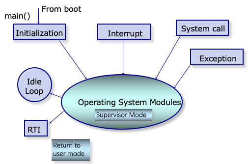
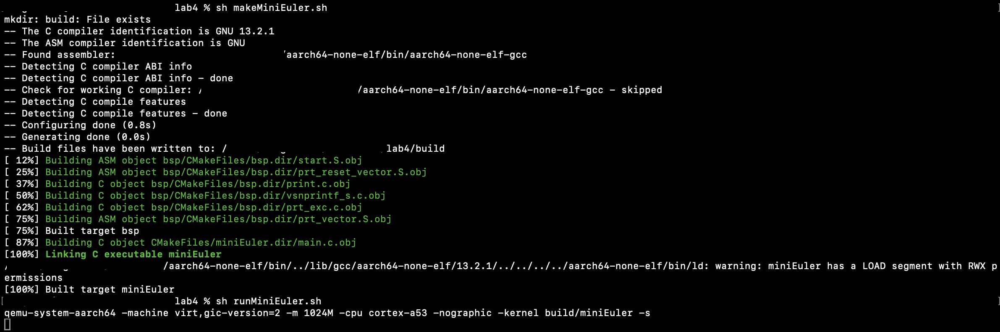
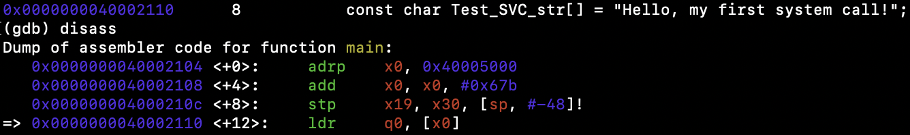
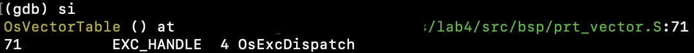
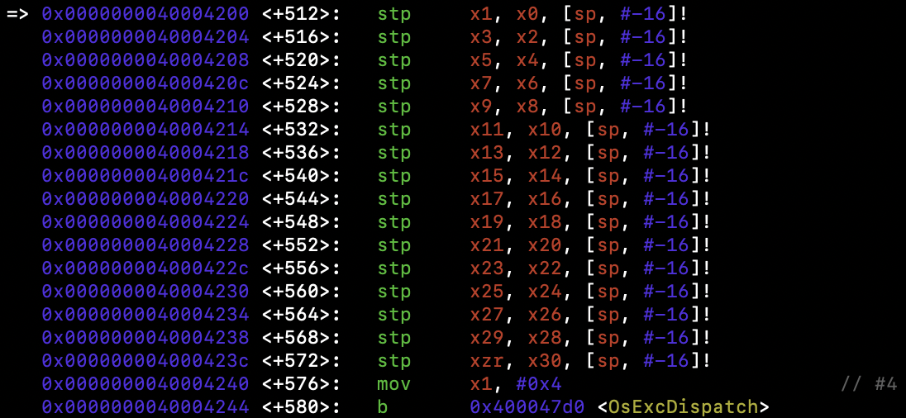
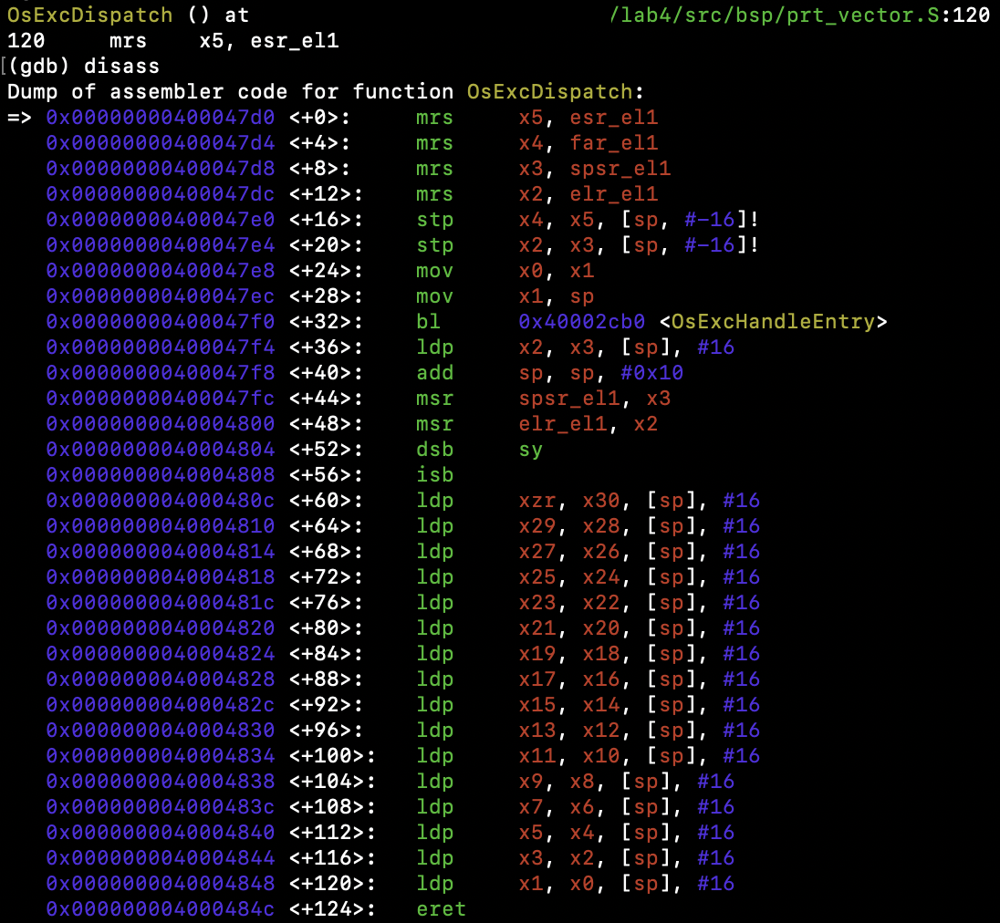
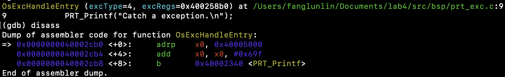
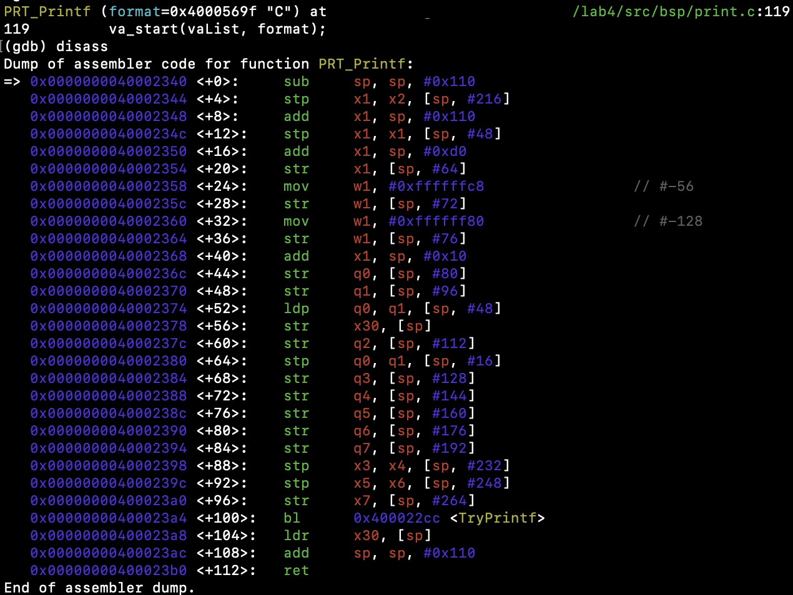
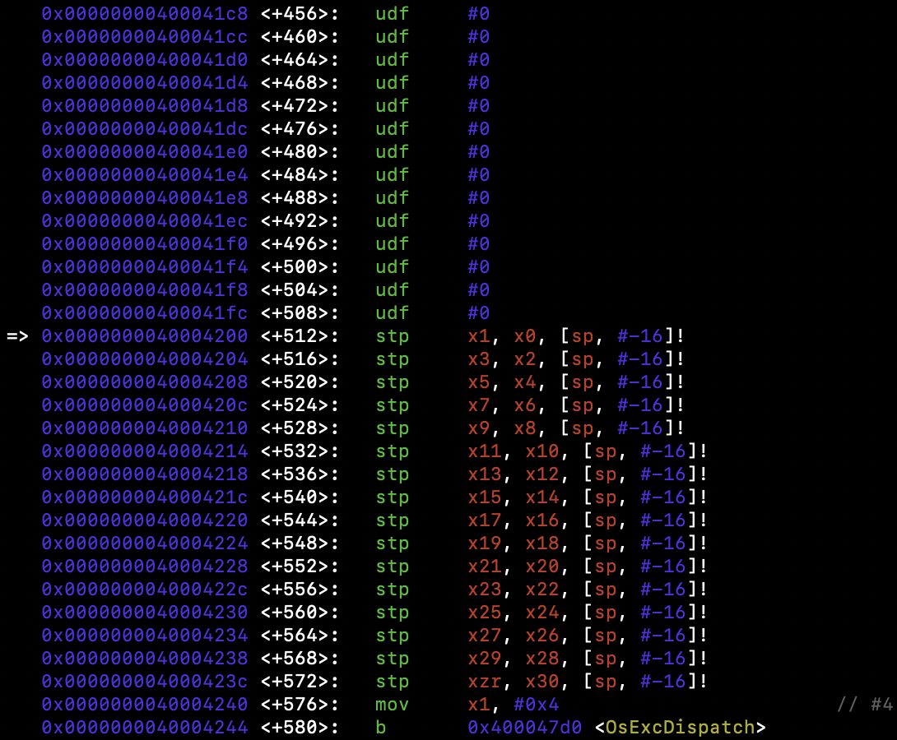
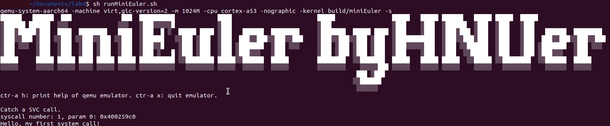

# 实验四 异常处理

中断、异常和陷阱指令是操作系统的基石，现代操作系统就是由中断驱动的。本实验和实验五的目的在于深刻理解中断的原理和机制，掌握CPU访问中断控制器的方法，掌握Arm体系结构的中断机制和规范，实现时钟中断服务和部分异常处理等。

## 陷入操作系统

如下图所示，操作系统是一个多入口的程序，执行陷阱（Trap）指令，出现异常、发生中断时都会陷入到操作系统。



## ARMv8的中断与异常处理

ARMv8 架构定义了两种执行状态(Execution States)，AArch64 和 AArch32。分别对应使用64位宽通用寄存器或32位宽通用寄存器的执行。


上图所示为AArch64中的异常级别(Exception levels)的组织。可见AArch64中共有4个异常级别，分别为EL0，EL1，EL2和EL3。在AArch64中，Interrupt是Exception的子类型，称为异常。 AArch64 中有四种类型的异常：

- Sync（Synchronous exceptions，同步异常），在执行时触发的异常，例如在尝试访问不存在的内存地址时。
- IRQ （Interrupt requests，中断请求），由外部设备产生的中断
- FIQ （Fast Interrupt Requests，快速中断请求），类似于IRQ，但具有更高的优先级，因此 FIQ 中断服务程序不能被其他 IRQ 或 FIQ 中断。
- SError （System Error，系统错误），用于外部数据中止的异步中断。

当异常发生时，处理器将执行与该异常对应的异常处理代码。在ARM架构中，这些异常处理代码将会被保存在内存的异常向量表中。每一个异常级别（EL0，EL1，EL2和EL3）都有其对应的异常向量表。需要注意的是，与x86等架构不同，该表包含的是要执行的指令，而不是函数地址。

异常向量表的基地址由VBAR_ELn给出，然后每个表项都有一个从该基地址定义的偏移量。 每个表有16个表项，每个表项的大小为128（0x80）字节（32 条指令）。 该表实际上由4组，每组4个表项组成。 分别是：

- 发生于当前异常级别的异常且SPSel寄存器选择SP0， Sync、IRQ、FIQ、SError对应的4个异常处理。
- 发生于当前异常级别的异常且SPSel寄存器选择SPx， Sync、IRQ、FIQ、SError对应的4个异常处理。
- 发生于较低异常级别的异常且执行状态为AArch64， Sync、IRQ、FIQ、SError对应的4个异常处理。
- 发生于较低异常级别的异常且执行状态为AArch32， Sync、IRQ、FIQ、SError对应的4个异常处理。

### 异常向量表

新建 src/bsp/prt_vector.S 文件，参照这里 [3](https://os2024lab.readthedocs.io/zh-cn/latest/lab4/index.html#id21) 定义异常向量表如下：

```assembly
.section .os.vector.text, "ax"

    .global  OsVectorTable
    .type  OsVectorTable,function

    .align 13

OsVectorTable:
.set    VBAR, OsVectorTable
.org VBAR                                // Synchronous, Current EL with SP_EL0
    EXC_HANDLE  0 OsExcDispatch

.org (VBAR + 0x80)                       // IRQ/vIRQ, Current EL with SP_EL0
    EXC_HANDLE  1 OsExcDispatch

.org (VBAR + 0x100)                      // FIQ/vFIQ, Current EL with SP_EL0
    EXC_HANDLE  2 OsExcDispatch

.org (VBAR + 0x180)                      // SERROR, Current EL with SP_EL0
    EXC_HANDLE  3 OsExcDispatch

.org (VBAR + 0x200)                      // Synchronous, Current EL with SP_ELx
    EXC_HANDLE  4 OsExcDispatch

.org (VBAR + 0x280)                      // IRQ/vIRQ, Current EL with SP_ELx
    EXC_HANDLE  5 OsExcDispatch

.org (VBAR + 0x300)                      // FIQ/vFIQ, Current EL with SP_ELx
    EXC_HANDLE  6 OsExcDispatch

.org (VBAR + 0x380)                      // SERROR, Current EL with SP_ELx
    EXC_HANDLE  7 OsExcDispatch

.org (VBAR + 0x400)                      // Synchronous, EL changes and the target EL is using AArch64
    EXC_HANDLE  8 OsExcDispatchFromLowEl

.org (VBAR + 0x480)                      // IRQ/vIRQ, EL changes and the target EL is using AArch64
    EXC_HANDLE  9 OsExcDispatch

.org (VBAR + 0x500)                      // FIQ/vFIQ, EL changes and the target EL is using AArch64
    EXC_HANDLE  10 OsExcDispatch

.org (VBAR + 0x580)                      // SERROR, EL changes and the target EL is using AArch64
    EXC_HANDLE  11 OsExcDispatch

.org (VBAR + 0x600)                      // Synchronous, L changes and the target EL is using AArch32
    EXC_HANDLE  12 OsExcDispatch

.org (VBAR + 0x680)                      // IRQ/vIRQ, EL changes and the target EL is using AArch32
    EXC_HANDLE  13 OsExcDispatch

.org (VBAR + 0x700)                      // FIQ/vFIQ, EL changes and the target EL is using AArch32
    EXC_HANDLE  14 OsExcDispatch

.org (VBAR + 0x780)                      // SERROR, EL changes and the target EL is using AArch32
    EXC_HANDLE  15 OsExcDispatch

    .text
```

可以看到：针对4组，每组4类异常共16类异常均定义有其对应的入口，且其入口均定义为 EXC_HANDLE vecId handler 的形式。

> [!TIP]
>
> CPSR 寄存器中有当前栈的选择 bits[0] 0:SP_EL0,1:SP_ELX

在 prt_reset_vector.S 中的 OsEnterMain: 标号后加入代码

```assembly
OsVectTblInit: // 设置 EL1 级别的异常向量表
    LDR x0, =OsVectorTable
    MSR VBAR_EL1, X0
```

### 上下文保存与恢复

EXC_HANDLE 实际上是一个宏，其定义如下。

```assembly
.global OsExcHandleEntry
.type   OsExcHandleEntry, function

.macro SAVE_EXC_REGS  // 保存通用寄存器的值到栈中
    stp    x1, x0, [sp,#-16]!
    stp    x3, x2, [sp,#-16]!
    stp    x5, x4, [sp,#-16]!
    stp    x7, x6, [sp,#-16]!
    stp    x9, x8, [sp,#-16]!
    stp    x11, x10, [sp,#-16]!
    stp    x13, x12, [sp,#-16]!
    stp    x15, x14, [sp,#-16]!
    stp    x17, x16, [sp,#-16]!
    stp    x19, x18, [sp,#-16]!
    stp    x21, x20, [sp,#-16]!
    stp    x23, x22, [sp,#-16]!
    stp    x25, x24, [sp,#-16]!
    stp    x27, x26, [sp,#-16]!
    stp    x29, x28, [sp,#-16]!
    stp    xzr, x30, [sp,#-16]!
.endm

.macro RESTORE_EXC_REGS  // 从栈中恢复通用寄存器的值
    ldp    xzr, x30, [sp],#16
    ldp    x29, x28, [sp],#16
    ldp    x27, x26, [sp],#16
    ldp    x25, x24, [sp],#16
    ldp    x23, x22, [sp],#16
    ldp    x21, x20, [sp],#16
    ldp    x19, x18, [sp],#16
    ldp    x17, x16, [sp],#16
    ldp    x15, x14, [sp],#16
    ldp    x13, x12, [sp],#16
    ldp    x11, x10, [sp],#16
    ldp    x9, x8, [sp],#16
    ldp    x7, x6, [sp],#16
    ldp    x5, x4, [sp],#16
    ldp    x3, x2, [sp],#16
    ldp    x1, x0, [sp],#16
.endm

.macro EXC_HANDLE vecId handler
    SAVE_EXC_REGS // 保存寄存器宏

    mov x1, #\vecId // x1 记录异常类型
    b   \handler // 跳转到异常处理
.endm
```

> [!NOTE]
>
> 注意把这部分代码放到 src/bsp/prt_vector.S 文件的开头

EXC_HANDLE 宏的主要作用通过 `stp 指令（Store Pair）`有效地将多对寄存器的值推入栈中,即一发生异常就立即保存CPU寄存器的值，然后跳转到异常处理函数进行异常处理。

随后，我们继续在 src/bsp/prt_vector.S 文件中实现异常处理函数，包括 OsExcDispatch 和 OsExcDispatchFromLowEl。

```assembly
    .global OsExcHandleEntry
    .type   OsExcHandleEntry, function

    .global OsExcHandleEntryFromLowEl
    .type   OsExcHandleEntryFromLowEl, function


    .section .os.init.text, "ax"
    .globl OsExcDispatch
    .type OsExcDispatch, @function
    .align 4
OsExcDispatch:
    mrs    x5, esr_el1
    mrs    x4, far_el1
    mrs    x3, spsr_el1
    mrs    x2, elr_el1
    stp    x4, x5, [sp,#-16]!
    stp    x2, x3, [sp,#-16]!

    mov    x0, x1  // x0： 异常类型
    mov    x1, sp  // x1： 栈指针
    bl     OsExcHandleEntry  // 跳转到实际的 C 处理函数， x0, x1分别为该函数的第1，2个参数。

    ldp    x2, x3, [sp],#16
    add    sp, sp, #16        // 跳过far, esr, HCR_EL2.TRVM==1的时候，EL1不能写far, esr
    msr    spsr_el1, x3
    msr    elr_el1, x2
    dsb    sy
    isb

    RESTORE_EXC_REGS // 恢复上下文

    eret //从异常返回


    .globl OsExcDispatchFromLowEl
    .type OsExcDispatchFromLowEl, @function
    .align 4
OsExcDispatchFromLowEl:
    mrs    x5, esr_el1
    mrs    x4, far_el1
    mrs    x3, spsr_el1
    mrs    x2, elr_el1
    stp    x4, x5, [sp,#-16]!
    stp    x2, x3, [sp,#-16]!

    mov    x0, x1
    mov    x1, sp
    bl     OsExcHandleFromLowElEntry

    ldp    x2, x3, [sp],#16
    add    sp, sp, #16        // 跳过far, esr, HCR_EL2.TRVM==1的时候，EL1不能写far, esr
    msr    spsr_el1, x3
    msr    elr_el1, x2
    dsb    sy
   isb

    RESTORE_EXC_REGS // 恢复上下文

    eret //从异常返回
```

OsExcDispatch 首先保存了4个系统寄存器到栈中，然后调用实际的异常处理 OsExcHandleEntry 函数。当执行完 OsExcHandleEntry 函数后，我们需要依序恢复寄存器的值。这就是操作系统课程中重点讲述的上下文的保存和恢复过程。

OsExcDispatchFromLowEl 与 OsExcDispatch 的操作除调用的实际异常处理函数不同外其它完全一致。

### 异常处理函数

新建 src/bsp/prt_exc.c 文件，实现实际的 OsExcHandleEntry 和 OsExcHandleFromLowElEntry 异常处理函数。

```c
#include "prt_typedef.h"
#include "os_exc_armv8.h"

extern U32 PRT_Printf(const char *format, ...);

// ExcRegInfo 格式与 OsExcDispatch 中寄存器存储顺序对应
void OsExcHandleEntry(U32 excType, struct ExcRegInfo *excRegs)
{
    PRT_Printf("Catch a exception.\n");
}

// ExcRegInfo 格式与 OsExcDispatchFromLowEl 中寄存器存储顺序对应
void OsExcHandleFromLowElEntry(U32 excType, struct ExcRegInfo *excRegs)
{
    PRT_Printf("Catch a exception from low exception level.\n");
}
```

注意到上面两个异常处理函数的第2个参数是 struct ExcRegInfo * 类型，而在 src/bsp/prt_vector.S 中我们为该参数传递的是栈指针 sp。所以该结构需与异常处理寄存器保存的顺序保持一致。

新建 src/bsp/os_exc_armv8.h 文件，定义 ExcRegInfo 结构。

```c
#ifndef ARMV8_EXC_H
#define ARMV8_EXC_H

#include "prt_typedef.h"

#define XREGS_NUM       31

struct ExcRegInfo {
    // 以下字段的内存布局与TskContext保持一致
    uintptr_t elr;                  // 返回地址
    uintptr_t spsr;
    uintptr_t far;
    uintptr_t esr;
    uintptr_t xzr;
    uintptr_t xregs[XREGS_NUM];     // 0~30 : x30~x0
};

#endif /* ARMV8_EXC_H */
```

> [!NOTE]
>
> 注意把上面的新增文件加入构建系统。

### 触发异常

注释掉 FPU 启用代码，构建系统并执行发现没有任何信息输出，通过调试将会观察到异常。


构建系统并执行



## 系统调用

> [!TIP]
>
> 下面请启用 FPU。

系统调用是通用操作系统为应用程序提供服务的方式，理解系统调用对理解通用操作系统的实现非常重要。下面我们来实现1条简单的系统调用。

EL 0 是用户程序所在的级别，而在lab1中我们已经知道CPU启动后进入的是EL1或以上级别。

在 main 函数中我们首先返回到 EL0 级别，然后通过 SVC 调用一条系统调用.

```c
S32 main(void)
{

    const char Test_SVC_str[] = "Hello, my first system call!";

    PRT_UartInit();

    PRT_Printf("            _       _ _____      _             _             _   _ _   _ _   _           \n");
    PRT_Printf("  _ __ ___ (_)_ __ (_) ____|   _| | ___ _ __  | |__  _   _  | | | | \\ | | | | | ___ _ __ \n");
    PRT_Printf(" | '_ ` _ \\| | '_ \\| |  _|| | | | |/ _ \\ '__| | '_ \\| | | | | |_| |  \\| | | | |/ _ \\ '__|\n");
    PRT_Printf(" | | | | | | | | | | | |__| |_| | |  __/ |    | |_) | |_| | |  _  | |\\  | |_| |  __/ |   \n");
    PRT_Printf(" |_| |_| |_|_|_| |_|_|_____\\__,_|_|\\___|_|    |_.__/ \\__, | |_| |_|_| \\_|\\___/ \\___|_|   \n");
    PRT_Printf("                                                     |___/                               \n");

   PRT_Printf("ctr-a h: print help of qemu emulator. ctr-a x: quit emulator.\n\n");


    // 回到异常 EL 0级别，模拟系统调用，查看异常的处理，了解系统调用实现机制。
    // 《Bare-metal Boot Code for ARMv8-A Processors》
    OS_EMBED_ASM(
        "MOV    X1, #0b00000\n" // Determine the EL0 Execution state.
        "MSR    SPSR_EL1, X1\n"
        "ADR    x1, EL0Entry\n" // Points to the first instruction of EL0 code
        " MSR    ELR_EL1, X1\n"
        "eret\n"  // 返回到 EL 0 级别
        "EL0Entry: \n"
        "MOV x0, %0 \n" //参数1
        "MOV x8, #1\n" //在linux中,用x8传递 syscall number，保持一致。
        "SVC 0\n"    // 系统调用
        "B .\n" // 死循环，以上代码只用于演示，EL0级别的栈未正确设置
        ::"r"(&Test_SVC_str[0])
    );


    // 在 EL1 级别上模拟系统调用
    // OS_EMBED_ASM("SVC 0");
    return 0;

}
```

> [!CAUTION]
>
> OS_EMBED_ASM 在 prt_typedef.h 中定义为 __asm__ __volatile__，用于 C 与 ASM 混合编程。
>
> SVC 是 arm 中的系统调用指令，相当于 x86 中的 int 指令。

> [!TIP]
>
> 汇编语法可以参考 GNU ARM Assembler Quick Reference [5](https://os2024lab.readthedocs.io/zh-cn/latest/lab4/index.html#id23) 和 Arm Architecture Reference Manual Armv8 (Chapter C3 A64 Instruction Set Overview) [6](https://os2024lab.readthedocs.io/zh-cn/latest/lab4/index.html#id24)
>
> 内联汇编中Clobbers的用途到底是什么？ [7](https://os2024lab.readthedocs.io/zh-cn/latest/lab4/index.html#id25)

### 系统调用实现

在 src/bsp/prt_exc.c 修改 OsExcHandleFromLowElEntry 函数实现 1 条系统调用。

```c
extern void TryPutc(unsigned char ch);
void MyFirstSyscall(char *str)
{
    while (*str != '\0') {
        TryPutc(*str);
        str++;
    }
}
// ExcRegInfo 格式与 OsExcDispatch 中寄存器存储顺序对应
void OsExcHandleFromLowElEntry(U32 excType, struct ExcRegInfo *excRegs)
{
    int ExcClass = (excRegs->esr&0xfc000000)>>26;
    if (ExcClass == 0x15){ //SVC instruction execution in AArch64 state.
        PRT_Printf("Catch a SVC call.\n");
        // syscall number存在x8寄存器中, x0为参数1
        int syscall_num = excRegs->xregs[(XREGS_NUM - 1)- 8]; //uniproton存储的顺序x0在高，x30在低
        uintptr_t param0 = excRegs->xregs[(XREGS_NUM - 1)- 0];
        PRT_Printf("syscall number: %d, param 0: 0x%x\n", syscall_num, param0);

        switch(syscall_num){
            case 1:
                MyFirstSyscall((void *)param0);
                break;
            default:
                PRT_Printf("Unimplemented syscall.\n");
        }
    }else{
        PRT_Printf("Catch a exception.\n");

    }
}
```

> [!IMPORTANT]
>
> UniProton是一个嵌入式实时系统，在 arm v8 中其维持在 EL 1 级别，而不会返回 EL 0 级别，所以后续操作系统服务不再采用系统调用的方式。

## lab4 作业

### 作业1

查找启用FPU 前异常出现的位置和原因。禁用FPU后PRT_Printf工作不正常，需通过调试跟踪查看异常发生的位置和原因 elr_el1 esr_el1 寄存器

注释FPU后启动调试服务器，观察main函数汇编代码


在执行`ldr q0, [x0]`后，发现程序跳转到异常表：



跳转到异常表的位置为  `EXC_HANDLE 4 OsExcDispatch`，即异常类型为当前异常级别的同步异常且SPSel寄存器选择SPx



使用命令

```shell
info register ELR_EL1
info register ESR_EL1
```

查看异常出现的位置以及异常信息


看到出现异常的地址就是汇编指令`ldr q0, [x0]`的地址，所以可以确认这里就是异常出现的位置。

ESR_EL1寄存器包含了关于从异常级别EL1进入异常处理程序时的异常情况的详细信息：

十六进制值`0x1fe00000`转换为二进制是`0001 1111 1110 0000 0000 0000 0000 0000`

- **EC**（Exception Class）字段：最高位`1`表示这是一个同步异常。
- **IL**（Instruction Length）字段：紧接着的两位`1f`表示异常发生时指令的长度为4字节（32位指令）。
- **ISS**（Instruction Specific Syndrome）字段：剩下的位提供了关于异常的特定信息，在这个值中，即`0000 0000 0000 0000`。

随后进入异常处理函数`OsExcDispatch

OsExcDispatch 首先保存了4个系统寄存器到栈中，然后调用实际的异常处理 OsExcHandleEntry 函数。当执行完 OsExcHandleEntry 函数后，我们需要依序恢复寄存器的值。

这里异常处理是输出提示语`Catch a exception.`，需要调用`PRT_Printf`函数



继续执行`PRT_Printf`的汇编指令，但是发现执行到`0x000000004000236c <+44>:	str	q0, [sp, #80]`时发现又进入了跳转表


且异常类型与第一次异常相同



使用命令

```shell
info register ELR_EL1
info register ESR_EL1
```

查看异常出现的位置以及异常信息


异常发生的地址为0x4000236c，即`str	q0, [sp, #80]`指令地址；

异常信息和上一个异常相同。

**至此可以分析出为什么禁用FPU后没有输出的原因：**

禁用FPU后会在main函数发生异常，在处理main函数产生的异常时需要调用PRT_Printf函数，但因为FPU被禁用，这里也会产生异常，于是程序又会进入异常表，处理PRT_Printf函数的异常，但处理PRT_Printf函数的异常也需要调用PRT_Printf函数输出字符串，于是就进入了一个死循环，程序会在异常表、异常处理函数、PRT_Printf函数中反复执行相同指令，且不会产生任何输出。

**为什么禁用FPU后main函数和PRT_Printf函数会发生异常：**

由FPU的启动指令分析

```assembly
Enable_FPU:
     MRS X1, CPACR_EL1
     ORR X1, X1, #(0x3 << 20)
     MSR CPACR_EL1, X1
     ISB
```

可以看到启用FPU会将系统寄存器CPACR_EL1的最高位置为1，表示允许对FPU的完全访问。

如果注释掉启动代码，则系统没有权限访问浮点寄存器，而q0-q31寄存器都属于浮点寄存器的一部分，所以当执行的指令要访问这些寄存器时都会发生同步异常。

启用FPU后正常执行系统调用的输出



## 心得体会

通过本次实验，我对异常处理在操作系统中的作用和实现有了更深入的理解。中断和异常处理是操作系统设计中不可或缺的部分。中断使得系统能够响应外部事件和硬件请求，而异常处理则确保了程序运行中的稳定性和安全性。在实现过程中，我了解到了不同类型异常是如何通过异常向量表让操作系统陷入异常并调用相应的异常处理函数，以及学会了在异常处理函数前后的上下文保存与恢复，主要是将原进程的通用寄存器保存到栈中，在异常处理后从栈中恢复寄存器。最后通过禁用FPU触发异常并通过系统调用触发中断。

## 出现的问题

主要的问题出现在作业上，我在MacOS中实现异常处理后发现无论是启用FPU还是不启用FPU，发现都会在main函数的第4条汇编指令陷入异常，循环打印Catch a exception，尝试复制lab4的文件在Ubuntu虚拟机中启动运行后却能正常调用SVC系统调用，具体原因还未查明。