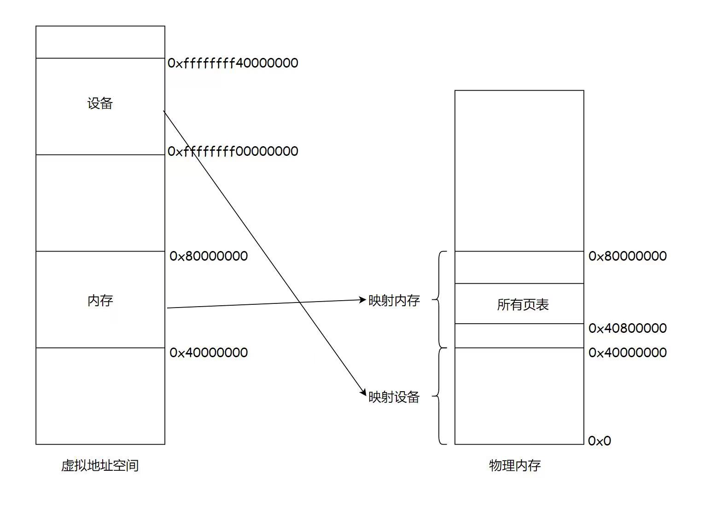

# 实验八 分页内存管理

## Armv8的地址转换

[ARM Cortex-A Series Programmer’s Guide for ARMv8-A](https://developer.arm.com/documentation/den0024/a/The-Memory-Management-Unit/Context-switching) 中提到：For EL0 and EL1, there are two translation tables. TTBR0_EL1 provides translations for the bottom of Virtual Address space, which is typically application space and TTBR1_EL1 covers the top of Virtual Address space, typically kernel space. This split means that the OS mappings do not have to be replicated in the translation tables of each task. 即TTBR0指向整个虚拟空间下半部分通常用于应用程序的空间，TTBR1指向虚拟空间的上半部分通常用于内核的空间。其中TTBR0除了在EL1中存在外，也在EL2 and EL3中存在，但TTBR1只在EL1中存在。

TTBR0_ELn 和 TTBR1_ELn 是页表基地址寄存器，地址转换的过程如下所示。


在一个简单的地址翻译中，只涉及一个级别的查找。它假设我们使用带有42位虚拟地址的64KB颗粒。MMU将虚拟地址翻译如下：

1. 如果VA[63:42] = 1，则TTBR1用于第一页表格的基本地址。当VA[63:42] = 0时，TTBR0用于第一页表格的基本地址。
2. 页面表包含8192个64位页面表条目，并使用VA[41:29]进行索引。MMU从表格中读取相关的2级页面表格条目。
3. MMU检查页面表条目的有效性，以及是否允许请求的内存访问。假设它是有效的，则允许内存访问.
4. 在上图中，页面表条目指的是一个512MB的页面（它是一个块描述符）。
5. 位[47:29]取自此页面表条目和物理地址的表单位[47:29]。
6. 因为我们有一个512MB的页面，VA的位[28:0]被带入PA[28:0]。请参阅颗粒尺寸对翻译表的影响
7. 返回完整的PA[47:0]，以及页面表条目中的其他信息。

在实践中，如此简单的翻译过程严重限制了您划分地址空间的精细程度。一级表条目也可以指向二级页面表，而不是只使用这个一级翻译表。

## mmu管理

新建 src/bsp/mmu.c 文件

```c
#include "prt_typedef.h"
#include "prt_module.h"
#include "prt_errno.h"
#include "mmu.h"
#include "prt_task.h"


extern U64 g_mmu_page_begin;
extern U64 g_mmu_page_end;
extern void os_asm_invalidate_dcache_all(void);
extern void os_asm_invalidate_icache_all(void);
extern void os_asm_invalidate_tlb_all(void);
static mmu_mmap_region_s g_mem_map_info[] = {
    {
        .virt      = 0x0,
        .phys      = 0x0,
        .size      = 0x40000000, // 1G size
        .max_level = 0x2,  // 不应大于3
        .attrs     = MMU_ATTR_DEVICE_NGNRNE | MMU_ACCESS_RWX, // 设备

    }, {

        .virt      = 0x40000000,
        .phys      = 0x40000000,
        .size      = 0x40000000, // 1G size
        .max_level = 0x2, // // 不应大于3
        .attrs     = MMU_ATTR_CACHE_SHARE | MMU_ACCESS_RWX, // 内存
    }

};


static mmu_ctrl_s g_mmu_ctrl = { 0 };


// 依据实际情况生成tcr的值，pva_bits返回虚拟地址位数。Translation Control Register (tcr)

static U64 mmu_get_tcr(U32 *pips, U32 *pva_bits)

{
    U64 max_addr = 0;
    U64 ips, va_bits;
    U64 tcr;
    U32 i;
    U32 mmu_table_num = sizeof(g_mem_map_info) / sizeof(mmu_mmap_region_s);
    // 根据g_mem_map_info表计算所使用的虚拟地址的最大值

    for (i = 0; i < mmu_table_num; ++i) {
        max_addr = MAX(max_addr, g_mem_map_info[i].virt + g_mem_map_info[i].size);
    }


    // 依据虚拟地址最大值计算虚拟地址所需的位数，

    // 实际上应该分别计算物理地址的ips和虚拟地址的va_bits，而不是如下同时进行。

    if (max_addr > (1ULL << MMU_BITS_44)) {
        ips = MMU_PHY_ADDR_LEVEL_5;
        va_bits = MMU_BITS_48;
    } else if (max_addr > (1ULL << MMU_BITS_42)) {
        ips = MMU_PHY_ADDR_LEVEL_4;
        va_bits = MMU_BITS_44;
    } else if (max_addr > (1ULL << MMU_BITS_40)) {
        ips = MMU_PHY_ADDR_LEVEL_3;
        va_bits = MMU_BITS_42;
    } else if (max_addr > (1ULL << MMU_BITS_36)) {
        ips = MMU_PHY_ADDR_LEVEL_2;
        va_bits = MMU_BITS_40;
    } else if (max_addr > (1ULL << MMU_BITS_32)) {
        ips = MMU_PHY_ADDR_LEVEL_1;
        va_bits = MMU_BITS_36;
    } else {
        ips = MMU_PHY_ADDR_LEVEL_0;
        va_bits = MMU_BITS_32;
    }


    // 构建Translation Control Register寄存器的值,tcr可控制TTBR0_EL1和TTBR1_EL1的影响

    tcr = TCR_EL1_RSVD | TCR_IPS(ips);
    if (g_mmu_ctrl.granule == MMU_GRANULE_4K) {
        tcr |= TCR_TG0_4K | TCR_SHARED_INNER | TCR_ORGN_WBWA | TCR_IRGN_WBWA;
    } else {
        tcr |= TCR_TG0_64K | TCR_SHARED_INNER | TCR_ORGN_WBWA | TCR_IRGN_WBWA;
    }

    tcr |= TCR_T0SZ(va_bits);   // Memory region 2^(64-T0SZ)
    if (pips != NULL) {
        *pips = ips;
    }

    if (pva_bits != NULL) {
        *pva_bits = va_bits;
    }

    return tcr;
}


static U32 mmu_get_pte_type(U64 const *pte)
{
    return (U32)(*pte & PTE_TYPE_MASK);
}


// 根据页表项级别计算当个页表项表示的范围（位数）

static U32 mmu_level2shift(U32 level)
{
    if (g_mmu_ctrl.granule == MMU_GRANULE_4K) {
        return (U32)(MMU_BITS_12 + MMU_BITS_9 * (MMU_LEVEL_3 - level));
    } else {
        return (U32)(MMU_BITS_16 + MMU_BITS_13 * (MMU_LEVEL_3 - level));
    }
}


// 根据虚拟地址找到对应级别的页表项

static U64 *mmu_find_pte(U64 addr, U32 level)
{
    U64 *pte = NULL;
    U64 idx;
    U32 i;

    if (level < g_mmu_ctrl.start_level) {
        return NULL;
    }

    pte = (U64 *)g_mmu_ctrl.tlb_addr;

    // 从顶级页表开始，直到找到所需level级别的页表项或返回NULL

    for (i = g_mmu_ctrl.start_level; i < MMU_LEVEL_MAX; ++i) {
        // 依据级别i计算页表项在页表中的索引idx
        if (g_mmu_ctrl.granule == MMU_GRANULE_4K) {
            idx = (addr >> mmu_level2shift(i)) & 0x1FF;
        } else {
            idx = (addr >> mmu_level2shift(i)) & 0x1FFF;
        }


        // 找到对应的页表项

        pte += idx;

        // 如果是需要level级别的页表项则返回

        if (i == level) {
            return pte;
        }


        // 从顶级页表开始找，

        // 找到当前级别页表项不是有效的（无效或是block entry）直接返回NULL

        if (mmu_get_pte_type(pte) != PTE_TYPE_TABLE) {
            return NULL;
        }


        // 不是所需级别但pte指向有效，依据页表粒度准备访问下级页表

        if (g_mmu_ctrl.granule == MMU_GRANULE_4K) {
            pte = (U64 *)(*pte & PTE_TABLE_ADDR_MARK_4K);
        } else {
            pte = (U64 *)(*pte & PTE_TABLE_ADDR_MARK_64K);
        }
    }


    return NULL;

}


// 根据页表粒度在页表区域新建一个页表，返回页表起始位置

static U64 *mmu_create_table(void)
{
    U32 pt_len;
    U64 *new_table = (U64 *)g_mmu_ctrl.tlb_fillptr;
    if (g_mmu_ctrl.granule == MMU_GRANULE_4K) {
        pt_len = MAX_PTE_ENTRIES_4K * sizeof(U64);
    } else {
        pt_len = MAX_PTE_ENTRIES_64K * sizeof(U64);
    }


    // 根据页表粒度在页表区域新建一个页表（4K或64K）

    g_mmu_ctrl.tlb_fillptr += pt_len;
    if (g_mmu_ctrl.tlb_fillptr - g_mmu_ctrl.tlb_addr > g_mmu_ctrl.tlb_size) {
        return NULL;
    }


    // 初始化页表全为0，因此该页表所有的页表项初始都是PTE_TYPE_FAULT

    // (void)memset_s((void *)new_table, MAX_PTE_ENTRIES_64K * sizeof(U64), 0, pt_len);
    U64 *tmp = new_table;
    for(int i = 0; i < pt_len; i+=sizeof(U64)){
        *tmp = 0;
        tmp++;
    }


    return new_table;

}


static void mmu_set_pte_table(U64 *pte, U64 *table)
{
    // https://developer.arm.com/documentation/den0024/a/The-Memory-Management-Unit/Translation-tables-in-ARMv8-A/AArch64-descriptor-format
    *pte = PTE_TYPE_TABLE | (U64)table;
}


// 依据mmu_mmap_region_s填充pte

static S32 mmu_add_map_pte_process(mmu_mmap_region_s const *map, U64 *pte, U64 phys, U32 level)
{
    U64 *new_table = NULL;
    // 属于上级页表项

    if (level < map->max_level) {
        // 如果页表项指向无效，新建一个页表且pte指向该页表
        if (mmu_get_pte_type(pte) == PTE_TYPE_FAULT) {
            // 新建一个页表
            new_table = mmu_create_table();
            if (new_table == NULL) {
                return -1;
            }

            // pte指向下级页表

            mmu_set_pte_table(pte, new_table);

        } //else: 如果页表项指向有效，不做任何处理。

    } else if (level == MMU_LEVEL_3) { // 最多4级页表(0,1,2,3)，这是最后一级页表项，最后L3级页表项定义略有不同
        *pte = phys | map->attrs | PTE_TYPE_PAGE;
    } else {
        // 这里的情况：等于map->max_level且不到最后L3级页表，依据mmu_mmap_region_s的配置作为block entry类型直接指向物理区域
        *pte = phys | map->attrs | PTE_TYPE_BLOCK;
    }


    return 0;

}


// 依据 mmu_mmap_region_s 的定义，生成 mmu 映射

static S32 mmu_add_map(mmu_mmap_region_s const *map)
{
    U64 virt = map->virt;
    U64 phys = map->phys;
    U64 max_level = map->max_level;
    U64 start_level = g_mmu_ctrl.start_level;
    U64 block_size = 0;
    U64 map_size = 0;
    U32 level;
    U64 *pte = NULL;
    S32 ret;


    if (map->max_level <= start_level) {
        return -2;
    }


    while (map_size < map->size) {
        // 从起始级别start_level开始遍历页表。注意起始级别页表肯定存在
        for (level = start_level; level <= max_level; ++level) {
            // 找到对应level的页表项
            pte = mmu_find_pte(virt, level);
            if (pte == NULL) {
                return -3;

            }


            // 如果为上级页表项且pte指向无效，新建下级页表且pte指向该新建的页表

            // 如果为最低页表项或到达设定级别页表项，直接设置页表项的值

            ret = mmu_add_map_pte_process(map, pte, phys, level);

            if (ret) {

                return ret;

            }


            if (level != start_level) {

                block_size = 1ULL << mmu_level2shift(level);

            }

        }


        virt += block_size;

        phys += block_size;

        map_size += block_size;

    }


    return 0;

}


static inline void mmu_set_ttbr_tcr_mair(U64 table, U64 tcr, U64 attr)

{

    OS_EMBED_ASM("dsb sy");


    OS_EMBED_ASM("msr ttbr0_el1, %0" : : "r" (table) : "memory");

    // OS_EMBED_ASM("msr ttbr1_el1, %0" : : "r" (table) : "memory");

    OS_EMBED_ASM("msr tcr_el1, %0" : : "r" (tcr) : "memory");

    OS_EMBED_ASM("msr mair_el1, %0" : : "r" (attr) : "memory");


    OS_EMBED_ASM("isb");

}


static U32 mmu_setup_pgtables(mmu_mmap_region_s *mem_map, U32 mem_region_num, U64 tlb_addr, U64 tlb_len, U32 granule)

{

    U32 i;

    U32 ret;

    U64 tcr;

    U64 *new_table = NULL;


    g_mmu_ctrl.tlb_addr = tlb_addr;

    g_mmu_ctrl.tlb_size = tlb_len;

    g_mmu_ctrl.tlb_fillptr = tlb_addr;

    g_mmu_ctrl.granule = granule;

    g_mmu_ctrl.start_level = 0;


    tcr = mmu_get_tcr(NULL, &g_mmu_ctrl.va_bits);


    // 依据页表粒度和虚拟地址位数计算地址转换起始级别

    if (g_mmu_ctrl.granule == MMU_GRANULE_4K) {

        if (g_mmu_ctrl.va_bits < MMU_BITS_39) {

            g_mmu_ctrl.start_level = MMU_LEVEL_1;

        } else {

            g_mmu_ctrl.start_level = MMU_LEVEL_0;

        }

    } else {

        if (g_mmu_ctrl.va_bits <= MMU_BITS_36) {

            g_mmu_ctrl.start_level = MMU_LEVEL_2;

        } else {

            g_mmu_ctrl.start_level = MMU_LEVEL_1;

            return 3;

        }

    }


    // 创建一个顶级页表，不一定是L0

    new_table = mmu_create_table();

    if (new_table == NULL) {

        return 1;

    }


    for (i = 0; i < mem_region_num; ++i) {

        ret = mmu_add_map(&mem_map[i]);

        if (ret) {

            return ret;

        }

    }


    mmu_set_ttbr_tcr_mair(g_mmu_ctrl.tlb_addr, tcr, MEMORY_ATTRIBUTES);


    return 0;

}


static S32 mmu_setup(void)

{

    S32 ret;

    U64 page_addr;

    U64 page_len;


    page_addr = (U64)&g_mmu_page_begin;

    page_len = (U64)&g_mmu_page_end - (U64)&g_mmu_page_begin;


    ret = mmu_setup_pgtables(g_mem_map_info, (sizeof(g_mem_map_info) / sizeof(mmu_mmap_region_s)),

                            page_addr, page_len, MMU_GRANULE_4K);

    if (ret) {

        return ret;

    }


    return 0;

}


S32 mmu_init(void)

{

    S32 ret;


    ret = mmu_setup();

    if (ret) {

        return ret;

    }


    os_asm_invalidate_dcache_all();

    os_asm_invalidate_icache_all();

    os_asm_invalidate_tlb_all();


    set_sctlr(get_sctlr() | CR_C | CR_M | CR_I);


    return 0;

}
```

新建 src/bsp/mmu.h

```c
#ifndef __MMU_H__
#define __MMU_H__

#include "prt_typedef.h"

#define CACHE_POS            0x2
#define CACHE_ENABLE         0x4
#define CACHE_MASK           0x7

#define MT_DEVICE_NGNRNE     0
#define MT_DEVICE_NGNRE      1
#define MT_DEVICE_GRE        2
#define MT_NORMAL_NC         3
#define MT_NORMAL            4

#define MEMORY_ATTRIBUTES    ((0x00 << (MT_DEVICE_NGNRNE * 8)) | \
                              (0x04 << (MT_DEVICE_NGNRE * 8))  | \
                              (0x0c << (MT_DEVICE_GRE * 8))    | \
                              (0x44 << (MT_NORMAL_NC * 8))     | \
                              (0xffUL << (MT_NORMAL * 8)))
// https://developer.arm.com/documentation/den0024/a/The-Memory-Management-Unit/Translation-tables-in-ARMv8-A/AArch64-descriptor-format
#define PTE_TYPE_FAULT       (0 << 0)
#define PTE_TYPE_BLOCK       (1 << 0)
#define PTE_TYPE_VALID       (1 << 0)
#define PTE_TYPE_MASK        (3 << 0)
#define PTE_TYPE_PAGE        (3 << 0)
#define PTE_TYPE_TABLE       (3 << 0)

#define PTE_TABLE_PXN        (1UL << 59)
#define PTE_TABLE_XN         (1UL << 60)
#define PTE_TABLE_AP         (1UL << 61)
#define PTE_TABLE_NS         (1UL << 63)

#define PTE_BLOCK_MEMTYPE(x) ((x) << 2)
#define PTE_BLOCK_NS         (1 << 5)
#define PTE_BLOCK_AP_R       (2 << 6)
#define PTE_BLOCK_AP_RW      (0 << 6)
#define PTE_BLOCK_NON_SHARE  (0 << 8)
#define PTE_BLOCK_OUTER_SHARE (2 << 8)
#define PTE_BLOCK_INNER_SHARE (3 << 8)
#define PTE_BLOCK_AF         (1 << 10)
#define PTE_BLOCK_NG         (1 << 11)
#define PTE_BLOCK_PXN        (1UL << 53)
#define PTE_BLOCK_UXN        (1UL << 54)

#define PMD_ATTRINDX(t)      ((t) << 2)
#define PMD_ATTRINDX_MASK    (7 << 2)
#define PMD_ATTRMASK         (PTE_BLOCK_PXN     | \
                              PTE_BLOCK_UXN     | \
                              PMD_ATTRINDX_MASK | \
                              PTE_TYPE_VALID)

#define TCR_IPS(x)           ((x) << 32)    // Intermediate Physical Address Size
#define TCR_T0SZ(x)          ((64 - (x)) << 0)
#define TCR_IRGN_NC          (0 << 8)
#define TCR_IRGN_WBWA        (1 << 8)
#define TCR_IRGN_WT          (2 << 8)
#define TCR_IRGN_WBNWA       (3 << 8)
#define TCR_IRGN_MASK        (3 << 8)
#define TCR_ORGN_NC          (0 << 10)
#define TCR_ORGN_WBWA        (1 << 10)
#define TCR_ORGN_WT          (2 << 10)
#define TCR_ORGN_WBNWA       (3 << 10)
#define TCR_ORGN_MASK        (3 << 10)
#define TCR_SHARED_NON       (0 << 12)
#define TCR_SHARED_OUTER     (2 << 12)
#define TCR_SHARED_INNER     (3 << 12)
#define TCR_TG0_4K           (0 << 14)
#define TCR_TG0_64K          (1 << 14)
#define TCR_TG0_16K          (2 << 14)
#define TCR_EPD1_DISABLE     (1 << 23)

#define TCR_EL1_RSVD         (1UL << 35)    //原定义错误
#define TCR_EL2_RSVD         (1UL << 31 | 1UL << 23)
#define TCR_EL3_RSVD         (1UL << 31 | 1UL << 23)

#define MAX_PTE_ENTRIES_4K   512
#define MAX_PTE_ENTRIES_64K  8192

#define PTE_TABLE_ADDR_MARK_4K  0x0000FFFFFFFFF000ULL
#define PTE_TABLE_ADDR_MARK_64K 0x0000FFFFFFFF0000ULL


#define MMU_ATTR_DEVICE_NGNRNE    (PTE_BLOCK_MEMTYPE(MT_DEVICE_NGNRNE))
#define MMU_ATTR_DEVICE           (PTE_BLOCK_MEMTYPE(MT_DEVICE_NGNRE))
#define MMU_ATTR_UNCACHE_UNSHARE  (PTE_BLOCK_MEMTYPE(MT_NORMAL_NC) | PTE_BLOCK_NON_SHARE)
#define MMU_ATTR_UNCACHE_SHARE    (PTE_BLOCK_MEMTYPE(MT_NORMAL_NC) | PTE_BLOCK_INNER_SHARE)
#define MMU_ATTR_CACHE_UNSHARE    (PTE_BLOCK_MEMTYPE(MT_NORMAL)    | PTE_BLOCK_NON_SHARE)
#define MMU_ATTR_CACHE_SHARE      (PTE_BLOCK_MEMTYPE(MT_NORMAL)    | PTE_BLOCK_INNER_SHARE)
#define MMU_ATTR_MASK             0X31CULL

#define MMU_ACCESS_NONE           (PTE_BLOCK_AP_RW)
#define MMU_ACCESS_R              (PTE_BLOCK_AF | PTE_BLOCK_UXN | PTE_BLOCK_PXN | PTE_BLOCK_AP_R)
#define MMU_ACCESS_RW             (PTE_BLOCK_AF | PTE_BLOCK_UXN | PTE_BLOCK_PXN | PTE_BLOCK_AP_RW)
#define MMU_ACCESS_RWX            (PTE_BLOCK_AF | PTE_BLOCK_AP_RW)
#define MMU_ACCESS_RX             (PTE_BLOCK_AF | PTE_BLOCK_AP_R)
#define MMU_ACCESS_MASK           0X600000000004C0ULL

#define MMU_GRANULE_4K            0
#define MMU_GRANULE_64K           1

#define MAX(a, b)                 (((a) > (b)) ? (a) : (b))
#define MIN(a, b)                 (((a) < (b)) ? (a) : (b))

#define CR_M                      (1 << 0)  // MMU enable
#define CR_A                      (1 << 1)  // Alignment check enable
#define CR_C                      (1 << 2)  // Cacheability control
#define CR_SA                     (1 << 3)  // SP(stack pointer) Alignment check enable
#define CR_I                      (1 << 12)
#define CR_WXN                    (1 << 19)
#define CR_EE                     (1 << 25)

#define SPSR_EL_END_LE            (0 << 9)
#define SPSR_EL_DEBUG_MASK        (1 << 9)
#define SPSR_EL_ASYN_MASK         (1 << 8)
#define SPSR_EL_SERR_MASK         (1 << 8)
#define SPSR_EL_IRQ_MASK          (1 << 7)
#define SPSR_EL_FIQ_MASK          (1 << 6)
#define SPSR_EL_T_A32             (0 << 5)
#define SPSR_EL_M_AARCH64         (0 << 4)
#define SPSR_EL_M_AARCH32         (1 << 4)
#define SPSR_EL_M_SVC             (0x3)
#define SPSR_EL_M_HYP             (0xa)
#define SPSR_EL_M_EL1H            (5)
#define SPSR_EL_M_EL2H            (9)

#define CPUECTLR_EL1_L1PCTL_MASK  (7 << 13)
#define CPUECTLR_EL1_L3PCTL_MASK  (7 << 10)

typedef enum {
    MMU_LEVEL_0 = 0,
    MMU_LEVEL_1,
    MMU_LEVEL_2,
    MMU_LEVEL_3,
    MMU_LEVEL_MAX
} mmu_level_e;

typedef enum {
    MMU_PHY_ADDR_LEVEL_0 = 0,
    MMU_PHY_ADDR_LEVEL_1,
    MMU_PHY_ADDR_LEVEL_2,
    MMU_PHY_ADDR_LEVEL_3,
    MMU_PHY_ADDR_LEVEL_4,
    MMU_PHY_ADDR_LEVEL_5
} mmu_physical_addr_size_e;

typedef enum {
    MMU_BITS_9 = 9,
    MMU_BITS_12 = 12,
    MMU_BITS_13 = 13,
    MMU_BITS_16 = 16,
    MMU_BITS_32 = 32,
    MMU_BITS_36 = 36,
    MMU_BITS_39 = 39,
    MMU_BITS_40 = 40,
    MMU_BITS_42 = 42,
    MMU_BITS_44 = 44,
    MMU_BITS_48 = 48,
} mmu_bits_e;

typedef struct {
    U64 tlb_addr;
    U64 tlb_size;
    U64 tlb_fillptr;
    U32 granule;
    U32 start_level;
    U32 va_bits;
} mmu_ctrl_s;

typedef struct {
    U64 virt;
    U64 phys;
    U64 size;
    U64 max_level;
    U64 attrs;
} mmu_mmap_region_s;

static inline unsigned long get_sctlr(void)
{
    unsigned long val;
    
    __asm__ __volatile__("mrs %0, sctlr_el1" : "=r" (val) : : "cc");

    return val;
}

static inline unsigned long get_cpuectr(void)
{
    unsigned long val;

    __asm__ __volatile__("mrs %0, S3_1_C15_C2_1" : "=r" (val) : : "cc");

    return val;
}

static inline void set_sctlr(unsigned long val)
{
    __asm__ __volatile__("dsb sy");
    __asm__ __volatile__("msr sctlr_el1, %0" : : "r" (val) : "cc");
    __asm__ __volatile__("dsb sy");
    __asm__ __volatile__("isb");
}

extern S32 mmu_init(void);

#endif
```

新建 src/bsp/cache_asm.S

```assembly
.global os_asm_invalidate_dcache_all
.global os_asm_flush_dcache_all
.global os_asm_clean_dcache_all
.global os_asm_invalidate_icache_all
.global os_asm_invalidate_tlb_all

    .type os_asm_dcache_level, "function"
os_asm_dcache_level:
    lsl    x12, x0, #1
    msr    csselr_el1, x12
    isb
    mrs    x6, ccsidr_el1
    and    x2, x6, #7
    add    x2, x2, #4
    mov    x3, #0x3ff
    and    x3, x3, x6, lsr #3
    clz    w5, w3
    mov    x4, #0x7fff
    and    x4, x4, x6, lsr #13
    
loop_set:
    mov    x6, x3
loop_way:
    lsl    x7, x6, x5
    orr    x9, x12, x7
    lsl    x7, x4, x2
    orr    x9, x9, x7
    tbz    w1, #1, 3f
    dc     csw, x9
    b      2f
3:  tbz    w1, #0, 1f
    dc     isw, x9
    b      2f
1:  dc     cisw, x9
2:  subs   x6, x6, #1
    b.ge   loop_way
    subs   x4, x4, #1
    b.ge   loop_set
    
    ret
    
    .type os_asm_dcache_all, "function"
os_asm_dcache_all:
    mov    x1, x0
    dsb    sy
    mrs    x10, clidr_el1
    lsr    x11, x10, #24
    and    x11, x11, #0x7
    cbz    x11, finished
    mov    x15, x30
    mov    x0, #0
    
loop_level:
    lsl    x12, x0, #1
    add    x12, x12, x0
    lsr    x12, x10, x12
    and    x12, x12, #7
    cmp    x12, #2
    b.lt   skip
    bl     os_asm_dcache_level
skip:
    add    x0, x0, #1
    cmp    x11, x0
    b.gt   loop_level
    
    mov    x0, #0
    msr    csselr_el1, x0
    dsb    sy
    isb
    mov    x30, x15
    
finished:
    ret

    .type os_asm_invalidate_dcache_all, "function"
os_asm_invalidate_dcache_all:
    mov    x0, #0x1
    b      os_asm_dcache_all

    .type os_asm_flush_dcache_all, "function"
os_asm_flush_dcache_all:
    mov    x0, #0x0
    b      os_asm_dcache_all

    .type os_asm_clean_dcache_all, "function"
os_asm_clean_dcache_all:
    mov    x0, #0x2
    b      os_asm_dcache_all

    .type os_asm_invalidate_icache_all, "function"
os_asm_invalidate_icache_all:
    ic     ialluis
    isb    sy
    ret

    .type os_asm_invalidate_tlb_all, "function"
os_asm_invalidate_tlb_all:
    tlbi   vmalle1
    dsb    sy
    isb
    ret
```

## 启用 mmu

start.S 中在 B OsEnterMain 之前启用 MMU

```assembly
// 启用 MMU
BL     mmu_init
// 进入 main 函数
B      OsEnterMain
```

> [!NOTE]
>
> 将新增文件加入构建系统
>
> 修改src/bsp/CMakeLists中内容，添加mmu.c和cache_asm.S文件

> [!NOTE]
>
> 通过调试确保你真的启动了 MMU

> [!TIP]
>
> 在 ARM 架构下，MMU（Memory Management Unit，内存管理单元）的启⽤状态由系统控制寄存器
>
> （System Control Register，SCTLR）的第 0 位来表⽰。这个位被称为 MMU Enable（M）位。 具体来
>
> 说：
>
> 1.当 SCTLR 寄存器的第 0 位（M 位）为 1 时，表⽰ MMU 已经启⽤。
>
> 2.当 SCTLR 寄存器的第 0 位（M 位）为 0 时，表⽰ MMU 处于禁⽤状态。
>
> 因此，在 ARM 架构下，要确认 MMU 是否已经启⽤，你只需要查看 SCTLR 寄存器的第 0 位即可。

## lab8 作业

### 作业1

启用 TTBR1 ，将地址映射到虚拟地址的高半部分，使用高地址访问串口 修改后：

（1）src/bsp/print.c中

```c
#define UART_0_REG_BASE (0xffffffff00000000 + 0x09000000)
```

(2)src/bsp/hwi_init.c 中

```c
#define GIC_DIST_BASE              (0xffffffff00000000 + 0x08000000)
#define GIC_CPU_BASE               (0xffffffff00000000 + 0x08010000)
```

程序可以正常运行。（GIC_DIST_BASE 和 GIC_CPU_BASE 的高位多少个f与你对MMU的配置有关）

启用ttbr_el1


将地址映射到虚拟内存的高半部分




在ARM架构中，Translation Control Register (TCR) 的某些位是保留位，它们必须被设置为特定的值以确保系统能够正确地执行地址转换。这些值通常在ARM架构的参考手册中有详细说明。对于ARMv8，tcr_el1的第31位因被设置成1


设置好后再构建项目可以正常运行

