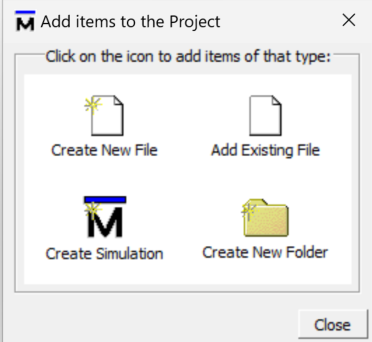
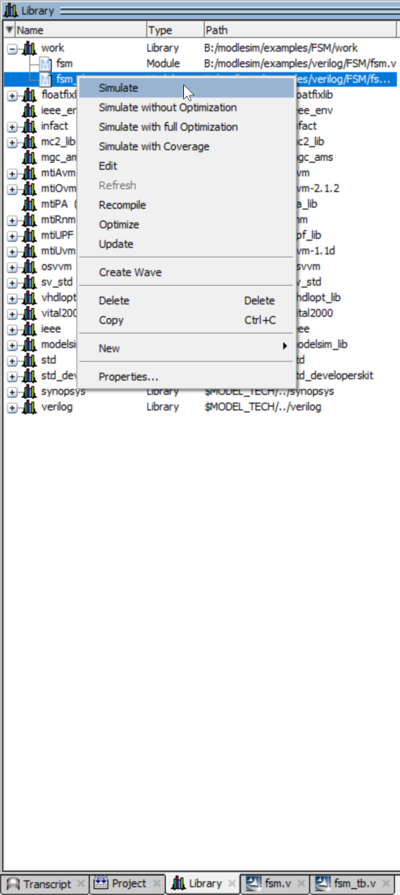
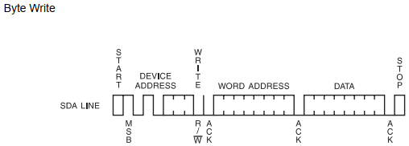
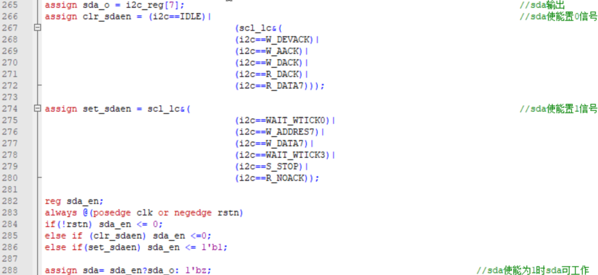

#  《FPGA I2C接口实现》实验报告


## 一、 描述组合电路、时序电路、状态机

### Verilog描述组合电路：

使用always语句

```verilog
reg x;
reg y;
always @(*)			//(*)表示always的敏感列表电平触发，*表示所有信号，这里等同(x or y)
begin
  if(S) x = A;	// =阻塞赋值用于组合电路
	else	x = B;
end
```

### Verilog描述时序电路：

```verilog
always @(posedge clk or negedge rst)	//(posedge clk or negedge rest)表示边沿触发，描述异步复位且时钟clk上升沿触发
 begin
   if (!rst)
     q <= 1'b0;		// <= 非阻塞赋值用于时序电路
   else if (en == 1'b1)
     q <= d;
   else
     q <= 1'b0;
 end
```

### 描述状态机：

状态机全称为有限状态机（Finite State Machine,FSM),是表示有限个状态以及在这些状态之间的转移和动作等行为的数学模型。

FSM是由寄存器和组合逻辑组成的电路。其状态在时钟边沿从一个状态转向另一个状态。

#### FSM实例工程

1）设计文件为PPT中FSM实例，文件名设定为fsm.v；

2）测试文件为PPT中FSM实例TestBench，文件名设定为fsm_tb.v；

3）按照建立工程->添加代码->编译代码->启动仿真->添加波形信号->执行仿真流程进行。

#### 自定FSM工程

**1）根据个人某天行踪编写状态机，如：**

​     S0：睡觉；睡醒则起床吃早餐；

​     S1：吃早餐；吃完有课则去上课（a=1），无课自习；

​     S2：12节上课；若34节有课则去上课（b=1），无课自习；

​     S3：12节自习；若34节有课则去上课（b=1），无课自习；

​     S4：34节上课；上完课吃午餐；

​     S5：34节自习；自习完吃午餐；

​     S6：吃午餐；吃完有工训课则去上课（c=1），无课午休；

​     S7：上工训课；若56节有课（d=1），则去上课无课自习；

​     S8：午休；若56节有课（d=1）则去上课，无课自习；

​     S9：56节上课；78节有课则上课（e =1），无课去运动；

​     S10：56节自习；78节有课则上课（e=1），无课去运动；

​     S11：78节上课；上完课晚自习；

​     S12：去运动；运动完晚自习；

​     S13：晚自习；晚自习结束睡觉；

输出pos位当前位置：

00：宿舍

01：教学楼

10：食堂

11：运动场

状态图：


**2）Verilog描述状态机**

```verilog
//输入端口为控制信号和时钟信号，输出端口为pos，表示位置
module fsm(
    input clk,
    input a,b,c,d,e,
    output reg [1:0] pos
);
 
//使用4位16进制数表示所有状态
parameter s0=4'h0,s1=4'h1,s2=4'h2,s3=4'h3,s4=4'h4,s5=4'h5,s6=4'h6,s7=4'h7,s8=4'h8,s9=4'h9,s10=4'ha,s11=4'hb,s12=4'hc,s13=4'hd;
reg [3:0] state,next_state;
//下一状态判断
always @(*) begin
    case (state)
      s0: next_state=s1;
      s1: if(a) next_state=s2;
          else next_state=s3;
      s2: if(b) next_state=s4;
          else next_state=s5;
      s3: if(b) next_state=s4;
          else next_state=s5;
      s4: next_state=s6;
      s5: next_state=s6;
      s6: if(c) next_state=s7;
          else next_state=s8;
      s7: if(d) next_state=s9;
          else next_state=s10;
      s8: if(d) next_state=s9;
          else next_state=s10;
      s9: if(e) next_state=s11;
          else next_state=s12;
      s10: if(e) next_state=s11;
					else next_state=s12;
      s11: next_state=s13;
      s12: next_state=s13;
      s13: next_state=s0;
      default: next_state=s0;
    endcase
end
//状态更新与输出
always @(posedge clk) state<=next_state;
 
always @(*) begin
    case (state)
        s0: pos=2'b00;
        s1: pos=2'b10;
        s2: pos=2'b01;
        s3: pos=2'b01;
        s4: pos=2'b01;
        s5: pos=2'b01;
        s6: pos=2'b10;
        s7: pos=2'b01;
        s8: pos=2'b00;
        s9: pos=2'b01;
        s10: pos=2'b11;
        s11: pos=2'b01;
        s12: pos=2'b11;
        s13: pos=2'b01;
        default: pos=2'b00;
    endcase
end 
endmodule
```

## 二、编写TestBench

```verilog
`timescale 1ns/100ps
module fsm_tb();
 
parameter s0=4'h0,s1=4'h1,s2=4'h2,s3=4'h3,s4=4'h4,s5=4'h5,s6=4'h6,s7=4'h7,s8=4'h8,s9=4'h9,s10=4'ha,s11=4'hb,s12=4'hc,s13=4'hd;
  reg [3:0] clk,state,next_state;
reg a,b,c,d,e;
wire [1:0] pos;
fsm dut1(clk,a,b,c,d,e,pos);
initial clk=0;
always #50 clk=~clk;
initial begin
    a=0;b=0;c=0;d=0;e=0;
    #1
    #400
    a=1;
    b=1;
    c=0;
    d=1;
    e=0;
    #600
    repeat(1024) @(posedge clk);
    $stop;
end
endmodule
```

第一次从s0开始，设定状态变化为：

s0-> s1->s2->s4->s6->s8->s9->s12->s13->s0

## 三、ModelSim工具使用步骤

### 建立工程（File->New->Project）


1. Project Name：填写工程名，工程名通常以_tb结尾；
2. Project Location：工程路径；
3. Default Library Name：仿真库名称，通常为work；
4. Copy Settings Form：指定modelsim.ini文件
5. 点击OK按钮进入下一步



1. Creat New File：建立新文件
2. Add Existing File：添加已有文件
3. Creat Simulation：建立新文件夹
4. 通常我们已经使用UltraEdit编辑器将设计文件和测试文件编写好，故点击Add Existing File即可。

弹出如下界面： 点击Browse按钮添加设计文件（fsm.v)和测试文件(fsm_tb.v)


关闭Add items to the Project对话框，可以看到flow_led.v、flow_led_tb.v文件已经添加至Modelsim仿真工程中，如图所示。


 双击文件可打开.v文件进行编辑。

 编辑完成，单击保存按钮。

### 编译代码

Compil Selected:编译选中文件

Compile All:编译全部文件


编译完成后如下图所示：


Status栏有3种状态；

 √：编译通过；

 ×：编译错误； 

三角符号：警告；

 编译错误表示：Modelsim无法完成文件的编译工作。文件中包含明显的语法，使用者可根据Modelsim的提示信息进行修改（双击红色字符即可弹出错误信息）。 

警告信息是一种比较特殊的状态，表示被编译的文件没有明显的语法错误，但是可能包含一些影响最终输出结果的因素。

 编译仅仅是检查Verilog语法是否合法，不代表逻辑功能的正确性。

### 启动波形仿真

1. 在界面左下角的位置有library和project切换窗口，点击libray;
2. 点击work前的“+”号，将其展开;
3. 双击tb模块或选中tb后右键弹出菜单，点击Simulate；



弹出如下界面：


### 添加波形信号

鼠标右键点击”dut1”,选择”Add Wave”选项，如图所示：


 弹出下图界面：该模块中的所有信号已经添加到wave窗口中；


在objects框中选中信号（按Ctrl可多选），右键选择**Add->To Wave->Selected Signals**可添加信号至wave窗口


 wave窗口中信号可设置格式


### 执行仿真

- 设置仿真时间为1ms，点击右边的运行按钮即可执行仿真。


- 运行后结果如下图所示：


- 常用小工具：

1. 放大、缩小、全局显示
2. 查找前一个（往前）下降沿
3. 查找下一个（往后）上升沿
4. 按住鼠标中键移位鼠标可放大指定区域波形

## 四、EEPROM读写代码分析

### **1、编写设计文件和TestBench文件，实现对EEPROM的读写功能验证；**

1）设计文件（i2c.v)：实现对EEPROM模型的“Byte Write”和“Random Read"功能；

2）测试文件（i2c_tb.v)：实现“Byte Write”和“Random Read"的功能验证；

3）建立完整的工程，编译正确，波形能证明读写功能的正确性。

4）工程目录如图所示：


**I2C_Rtl目录：存放i2c.v（设计文件）；**

**I2C_Tes目录：存放i2c_tb.v（测试文件）和EEPROM的模型文件（在仿真时用模型文件代替实际芯片，M24XXX_Macro.v，M24XXX_Memory.v，M24XXX_Parameters.v）；**

**I2C_Sim目录：工程目录，用于存放工程文件等；**

### 2、代码说明

### i2c.v

   输入：

​	clk：时钟信号

​	rstn：复位信号，低有效；

​	write_op：写命令，高有效；当发出write_op命令，必须 等待op_done为高才可将write_op清零；

​	write_data[7:0]：写数据；

​	reade_op：读命令，高有效；当发出read_op命令，必须等待op_done为高才可将read_op清零；

   输出：

​         read_data[7:0]：读数据；

​	 addr[7:0]：读写地址；

​         op_done：读写操作完成

   I2C协议信号：

​          scl：I2C协议的scl信号

​          sda：I2C协议的sda信号


使用8位16进制数表示所有状态，共55个：


scl周期是使用计数器对时钟周期计数实现的，一个scl周期是30个时钟周期，30*200k=6Mhz，为所使用的FPGA板的时钟频率。


下一状态的更新：


使用wr_op和rd_op将输入信号write_op，read_op表示的读写命令用高电平表示：


下一状态判断，与状态图一致，时间为scl_tick，即scl周期结束。首先是在scl=1时，sda由1->0，开始数据传输，并先写入器件地址(10100000)和数据地址，然后根据wr_op，rd_op判断进行读还是写操作，写操作直接开始写入数据，读操作则需要重新写器件地址和数据地址，然后读取数据。


SCL同步的实现：


  空闲，等待，操作结束，start开始等状态下SCL都是高电平，因此不需要clr_scl对SCL清零。另外clr_scl只在scl_ls（scl的低电平开始）处才置1，把scl清0，在15个clk周期的scl_hs处,再把scl拉高，就实现了SCL周期。

SDA：SDA的控制信号声明，这些信号在对应的状态且scl在低电平的中心时置1，根据这些控制信号，在SDA上进行数据读写。而i2c_reg用来暂存数据。


使用信号i2c_rlf表示是否有读写操作，如果有，则i2c_reg将左移，一位一位处理数据。


根据上述控制信号，将输入的特定数据保存到i2c_reg


sda输出使用sda使能信号sda_en控制，写器件地址，数据地址，写数据时使能信号为1，接收ACK响应时使能为0。sda输出i2c_reg的最高位，即一位一位完成读或写。



读取数据时将数据读到read_data


最后使用d5ms_count计数时钟周期等待，使用时钟频率为6Mhz，一个周期166ns，等待约1.36ms，然后重新开始完成新的读写命令。

### i2c_tb.v

模块声明与实例化：


根据时钟频率6Mhz设置周期166ns，并对信号初始化：


首先输入写命令信号，地址为8‘h55，写入的数据为8’haa。等待操作完成后，将write_op设为1（高电平无效），输入读命令信号，读出地址8’h55中的数据，读出的数据应该为刚刚写入的8’haa。

### 3、仿真波形

首先是向地址为8‘h55处写入数据，sda在scl为高电平时产生下降沿，表示开始工作，scl开始翻转，依次写入器件地址，数据地址，以及数据8’haa，并接收响应。最后scl为高电平，sda产生上升沿，停止工作。

经过等待后开始读出0x55处的数据，先写入器件地址，数据地址（dummy write），然后再次写入器件地址，读出数据。


### 4、EEPROM读写代码下载及验证

#### 管脚分配

  1）SDA固定为PIN47；

  2）SCL固定接PIN45；

  3）clk固定接PIN17；


  4）AT24C02模块正面朝上。

  5）其它管脚按照图中所示分配。

这里因为在实验室下板验证时忘记拍照记录，没有结果展示，但验证结果是正确的

## 五、实验总结

详细学习了verilog语言的基本语法以及使用verilog语言描述时序逻辑和组合逻辑的方式。同时也了解了如何使用verilog编写有限状态机并练习编写了简单的有限状态机。了解了test_bench的编写以及熟悉了使用ModelSim进行波形仿真。理解了I2C接口协议以及I2C协议下SCL，SDA数据是如何传输的。我详细深入地研究了I2C协议，对于给出的参考代码能够基本理解，也能够对应波形仿真结果解释I2C协议的数据传输，最后将代码下载至FPGA开发板，验证了I2C协议正常工作。

