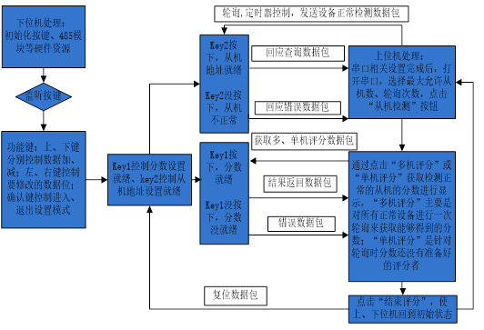
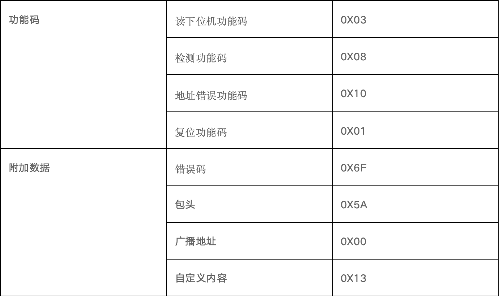
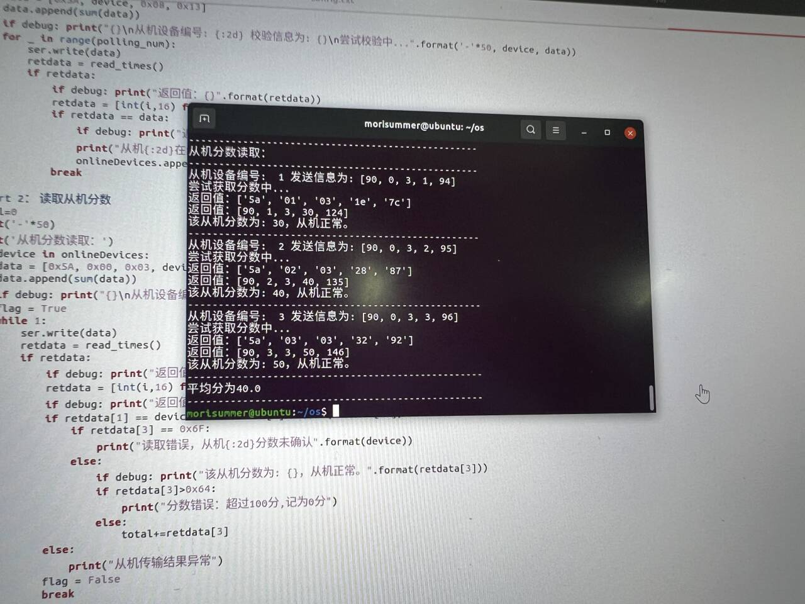
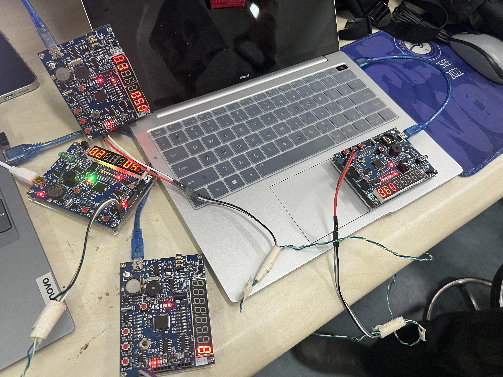

# 基于485总线的评分系统实验报告

# 1 实验项目

## 1.1 项目名称

基于485总线的评分系统

## 1.2 实验目的

通过本案例加深理解RS485通信方式，实现上位机的主控制器与所有的下位机进行通信。

## 1.3 实验资源

PC、STC学习板等

## 1.4 实验简介



## 1.5 实验通信协议

本案例模拟Modbus协议，采用主、从技术，上位机的主控制器可以与所有的下位机通信，也可以单独与一个指定的下位机通信。模拟Modbus协议中，上下位机的数据包都只含5个字节，其基本格式为：数据包头（0x5A）+地址码（广播地址/从机地址）+功能码+携带数据（一个字节）+校验码字节，携带数据部分可以扩充多个字节，可以视情况进行修改。数据包具体定义如下：

（1）主机检测从机是否正常相关数据包：（主机与单个从机设备通信）

A、设备正常检测数据包：

方向：上位机----->下位机

数据包消息：数据包头+从机地址+检测功能码（Fun_CheckSlave）+自定义内容（Check_Content）+校验字节

功能：查询下位机是否正常。正常，下位机发送回应查询数据包；不正常，则下位机不予回应；数据传输过程发生错误，下位机发送回应错误数据包，上位机可以通过设置多次轮询来重新检测该设备是否正常；

B、回应查询数据包：

方向：下位机----->上位机

数据包消息：数据包头+从机地址+检测功能码（Fun_CheckSlave）+自定义内容（接收自主机Check_Content）+校验字节

C、回应错误数据包：

方向：下位机----->上位机

数据包消息：数据包头+从机地址+检测功能码（Fun_CheckSlave）+错误码（ErrorInfo）+校验字节

（2）主机获取从机评分相关数据包：（主机与单个从机设备通信）

D、获取多、单机评分数据包：

方向：上位机----->下位机

数据包消息：数据包头+检测正常从机地址（0x00）+读下位机功能码（Fun_ReadInfo）+从机地址+校验字节

功能：对检测正常的设备，进行一次轮询，获取评分已经准备好的从机的分数。对于单机直接进行通信，没有轮询。

E、结果返回数据包：

方向：下位机----->上位机

数据包消息：数据包头+从机地址+读下位机功能码（Fun_ReadInfo）+从机返回的分数值+校验字节（分数值>100:表示上面提及的未准备好，回应错误数据包）

（3）此轮评分结束相关数据包

F、复位数据包：（主机与所有从机通信）

方向：上位机----->下位机

数据包消息：数据包头+广播地址+复位功能码（Fun_Reset）+从机返回的分数值（0x00）+校验字节

功能：指示所有正常连接的从机进行复位操作，准备下一轮的评分。

 

# 2 实验任务

## 2.1 实验任务一 

任务名称：B级任务

### 2.1.1 实验步骤

1、 阅读程序系统流程框图，明确双机通信的功能需求。

2、 熟悉上一节中模拟MODBUS协议的数据包结构，相关功能码及附加数据定义



3、 回顾485总线数据收发实验，搭建双机通信电路。参考上一节内容确保STC从机编号和评分设定完成后，按下KEY2、KEY3按键标志，第1位和第8位LED灯被点亮。

4、 PC端串口设置如下：

串口波特率：9600  数据位：8位  校验位：无  停止位：1

5、 所编写的PC端程序应参考上一节中的通信协议完成一次完整的评分过程：

- 需要包含串口的设置
- 主节点发起从机检测过程：发送指定从机编号正常检测数据包，判断回应查询数据包是否符合上一节中的通信协议。
- 主机获取从机评分过程：发送指定从机评分相关数据包，判断回应查询数据包是否符合上一节中的通信协议。
- 主机发起结束评分的过程，若复位成功，STC从机上第1位和第8位LED灯会熄灭。
- 展示串口相关信息，展示检测到的从机编号和从机的评分等。

### 2.1.2程序代码

```python
import binascii
import serial.tools.list_ports

#read config
def openreadconfig(file_name):
    data = []
    file = open(file_name, 'r',encoding='utf-8')  # 打开文件
    file_data = file.readlines()  # 读取所有行
    count = 0
    for row in file_data:
        tmp_list = row.split(' ')  # 按‘，'切分每行的数据
        tmp_list[-1] = tmp_list[-1].replace('\n','') #去掉换行符
        count+=1
        if count == 1:
            data.append(float(tmp_list[1]))  # 将每行数据插入data中
        else:
            data.append(int(float(tmp_list[1])))  # 将每行数据插入data中
    return data
config = openreadconfig('config.txt')

my_timeout = config[0] #timeout 设置为0.04
device_upper = config[1] #机器编号范围上限是多少
polling_num = config[2] #轮询次数 设置为15
debug = config[3] #是否打印调试信息 1为打印
if debug: print("读入参数列表为{}".format(config))


# initial
plist = list(serial.tools.list_ports.comports())  # 获取端口列表
ser = serial.Serial(list(plist[0])[0], 9600, timeout=my_timeout)  # 导入pyserial模块
#若上面出现错误，则考虑手动设置端口，也就是使用下面的这一条，注意COM多少
#ser = serial.Serial("COM6", 9600, timeout=my_timeout)

#其中timeout参数为操作未完成时发生超时之前的毫秒数
#9600为波特率，不需要调节

#从串口读数据
def read_times():
    while 1:
        dic = []
        reading = ser.read(5)  # 读取串口数据
        if reading != b'':
            a = str(hex(int(binascii.hexlify(reading), 16)))
            b = a.replace("0x", "")
            for index in range(0, len(b), 2):
                dic.append(b[index] + b[index + 1])
        return dic


devices=list(range(0,device_upper)) #初次遍历机器的范围
print(devices)

onlineDevices=[] # 在线的机器

# part 1: 查询在线从机信息
print("查询在线从机信息")
for device in devices:
    data = [0x5A, device, 0x08, 0x13]
    data.append(sum(data))
    if debug: print("{}\n从机设备编号: {:2d} 校验信息为: {}\n尝试校验中...".format('-'*50, device, data))
    for _ in range(polling_num):
        ser.write(data)
        retdata = read_times()
        if retdata:
            if debug: print("返回值：{}".format(retdata))
            retdata = [int(i,16) for i in retdata]
            if retdata == data:
                if debug: print("返回的校验信息为: {}，从机正常。".format(retdata))
                print("从机{:2d}在线".format(device))
                onlineDevices.append(device)
            break

# part 2： 读取从机分数
total=0
print('-'*50)
print('从机分数读取：')
for device in onlineDevices:
    data = [0x5A, 0x00, 0x03, device]
    data.append(sum(data))
    if debug: print("{}\n从机设备编号: {:2d} 发送信息为: {}\n尝试获取分数中...".format('-'*50, device, data))
    flag = True
    while 1:
        ser.write(data)
        retdata = read_times()
        if retdata:
            if debug: print("返回值：{}".format(retdata))
            retdata = [int(i,16) for i in retdata]
            if debug: print("返回值：{}".format(retdata))
            if retdata[1] == device and retdata[4] == sum(retdata[:4]):
                if retdata[3] == 0x6F:
                    print("读取错误，从机{:2d}分数未确认".format(device))
                else:
                    if debug: print("该从机分数为: {}，从机正常。".format(retdata[3]))
                    if retdata[3]>0x64:
                        print("分数错误：超过100分,记为0分")
                    else:
                        total+=retdata[3]
            else:
                print("从机传输结果异常")
            flag = False
            break
    if flag:
        print("从机{:2d}无返回".format(device))

# part 3: 计算输出平均分
average = total/len(onlineDevices)
print('-'*50)
print("平均分为{}".format(average))
print('-'*50)

# part 4: 从机复位操作
print('从机复位操作：')
data = [0x5A, 0x00, 0x01, 0x00, 0x5B]
for _ in range(100):
    ser.write(data)
print("从机已复位，可以开始下一轮评分。")
```

### 2.1.3 运行结果分析

运行结果：



运行结果分析

我们设置了编号为123的从机，分数分别为30、40、50，程序通过轮询，正确地确定了在线的从机编号为1234，并成功地从这几个从机中试图读取分数。最后获得的平均分为40，结果正确。

唯一缺陷在于对轮询次数较高时代码运行较慢。

## 2.2 实验任务二 

任务名称：A级任务

### 2.2.1 实验步骤

在B级任务基础上，扩充程序功能如：允许最大从机数、轮询次数、错误数据包的处理、统计多人评分的平均分等。（答辩评分的主要依据）

### 2.2.2 程序代码

```python
import binascii
import serial.tools.list_ports

#read config
def openreadconfig(file_name):
    data = []
    file = open(file_name, 'r',encoding='utf-8')  # 打开文件
    file_data = file.readlines()  # 读取所有行
    count = 0
    for row in file_data:
        tmp_list = row.split(' ')  # 按‘，'切分每行的数据
        tmp_list[-1] = tmp_list[-1].replace('\n','') #去掉换行符
        count+=1
        if count == 1:
            data.append(float(tmp_list[1]))  # 将每行数据插入data中
        else:
            data.append(int(float(tmp_list[1])))  # 将每行数据插入data中
    return data
config = openreadconfig('config.txt')

my_timeout = config[0] #timeout 设置为0.04
device_upper = config[1] #机器编号范围上限是多少
polling_num = config[2] #轮询次数 设置为15
debug = config[3] #是否打印调试信息 1为打印
if debug: print("读入参数列表为{}".format(config))


# initial
plist = list(serial.tools.list_ports.comports())  # 获取端口列表
ser = serial.Serial(list(plist[0])[0], 9600, timeout=my_timeout)  # 导入pyserial模块
#若上面出现错误，则考虑手动设置端口，也就是使用下面的这一条，注意COM多少
#ser = serial.Serial("COM6", 9600, timeout=my_timeout)

#其中timeout参数为操作未完成时发生超时之前的毫秒数
#9600为波特率，不需要调节

#从串口读数据
def read_times():
    while 1:
        dic = []
        reading = ser.read(5)  # 读取串口数据
        if reading != b'':
            a = str(hex(int(binascii.hexlify(reading), 16)))
            b = a.replace("0x", "")
            for index in range(0, len(b), 2):
                dic.append(b[index] + b[index + 1])
        return dic


devices=list(range(0,device_upper)) #初次遍历机器的范围
print(devices)

onlineDevices=[] # 在线的机器

# part 1: 查询在线从机信息
print("查询在线从机信息")
for device in devices:
    data = [0x5A, device, 0x08, 0x13]
    data.append(sum(data))
    if debug: print("{}\n从机设备编号: {:2d} 校验信息为: {}\n尝试校验中...".format('-'*50, device, data))
    for _ in range(polling_num):
        ser.write(data)
        retdata = read_times()
        if retdata:
            if debug: print("返回值：{}".format(retdata))
            retdata = [int(i,16) for i in retdata]
            if retdata == data:
                if debug: print("返回的校验信息为: {}，从机正常。".format(retdata))
                print("从机{:2d}在线".format(device))
                onlineDevices.append(device)
            break

# part 2： 读取从机分数
total=0
print('-'*50)
print('从机分数读取：')
for device in onlineDevices:
    data = [0x5A, 0x00, 0x03, device]
    data.append(sum(data))
    if debug: print("{}\n从机设备编号: {:2d} 发送信息为: {}\n尝试获取分数中...".format('-'*50, device, data))
    flag = True
    while 1:
        ser.write(data)
        retdata = read_times()
        if retdata:
            if debug: print("返回值：{}".format(retdata))
            retdata = [int(i,16) for i in retdata]
            if debug: print("返回值：{}".format(retdata))
            if retdata[1] == device and retdata[4] == sum(retdata[:4]):
                if retdata[3] == 0x6F:
                    print("读取错误，从机{:2d}分数未确认".format(device))
                else:
                    if debug: print("该从机分数为: {}，从机正常。".format(retdata[3]))
                    if retdata[3]>0x64:
                        print("分数错误：超过100分,记为0分")
                    else:
                        total+=retdata[3]
            else:
                print("从机传输结果异常")
            flag = False
            break
    if flag:
        print("从机{:2d}无返回".format(device))

# part 3: 计算输出平均分
average = total/len(onlineDevices)
print('-'*50)
print("平均分为{}".format(average))
print('-'*50)

# part 4: 从机复位操作
print('从机复位操作：')
data = [0x5A, 0x00, 0x01, 0x00, 0x5B]
for _ in range(100):
    ser.write(data)
print("从机已复位，可以开始下一轮评分。")
```

### 2.2.3 运行结果分析

运行结果：


运行结果分析

我们设置了编号为123的从机，分数分别为30、40、50，程序通过轮询，正确地确定了在线的从机编号为1234，并成功地从这几个从机中试图读取分数。最后获得的平均分为40，结果正确。

唯一缺陷在于对轮询次数较高时代码运行较慢。

# 3 总结

## 3.1 小组分工，个人任务总结

完成了所有主要任务，包括代码编写、新功能添加、bug解决、测试验证等。

## 3.2 心得体会

​	通过本次实验，我复习并加深了对RS485总线通信的理解，也进一步熟悉了使用python进行串口的数据读写，以及时间监听等机制。成功实现了评分系统。在实现的过程中与同学配合，将串口及事件监听作为类封装参考了同学的设计，数据的收发及解析主要结合实验资料中的定义完成。最后的多级评分尝试在原程序的基础上进行实现，但是由于单片机不能每次都准确的接收数据并进行响应，没有测试成功。通过串口相关的几次实验，我对单片机与计算机的串口通信以及基于RS485的通信都有了深入的了解。为后续相关知识的学习建立了基础。


