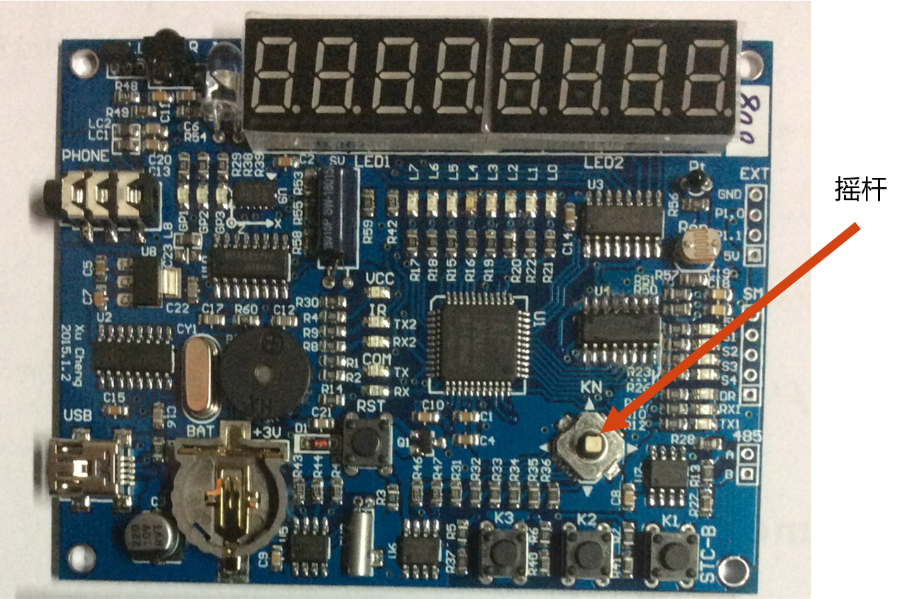

## 计算机串口使用与测量实验报告


## 1.Linux操作系统平台

### 1.1 实验目的

1. 了解Linux系统文件系统的基本组织
2. 了解Linux基本的多用户权限系统
3. 熟练使用ls、cd、cat、more、sudo、gcc、vim等基本命令
4. 会使用ls和chmod命令查看和修改文件权限

### 1.2 实验基础

1. 阅读PDF掌握Linux操作系统的文件权限、用户与组、目录相关的命令以及Linux的软件安装
2. gcc命令

### 1.3 实验步骤

**（1）安装firstrun.deb**

使用命令`sudo dpkg -i firstrun.deb`进行安装


**（2）运行根目录下的/gettips可执行程序**

> [!TIP]
>
> 使用`cd /`命令前往根目录


运行该程序后在屏幕上给出了下一步骤要探索的目录。

**（3）前往上一步给出的目录找到隐藏文件**

> [!NOTE]
>
> 如果直接使用`cd usr/bin/tianma`命令会提示权限不够，因为普通用户模式下不能访问tianma文件，需要进入root根账户（超级用户）


使用命令`sudo su`登陆root账户或使用`sudo sh`命令以超级用户身份运行


使用`ls`命令查看tianma目录内容：

发现屏幕没有打印任何文件，使用`ls -a`指令列出所有文件，包括隐藏文件：


- ‘.'是当前目录
- ‘..'是上一级目录
- ‘.puzzle.txt’即我们要找的隐藏文件

**（4）将隐藏文件内容显示到屏幕上**

1. 使用`cat`命令:
    屏幕上打印出了.puzzle.txt的文件内容：3282097263
2. **编写C语言程序：（选做内容）**
    在tainma文件夹中创建一个ans.c文件并编写以下代码：
```c
#include<stdio.h>
#include<stdlib.h>
int main(int argc, char* argv[])
{
  FILE *fp;
	char str[100];
  
  fp = fopen(".puzzle.txt", "r");
  if(fp == NULL) {
    printf("打开文件失败\n");
    exit(0);
  }
  
  while(fgets(str, 100, fp) != NULL) {
    printf("%x\n", atoi(str));
  }
  
  fclose(fp);
}
```

使用`gcc -o ans ans.c`编译生成可执行文件ans后运行，.puzzle.txt文件中的内容转换成十六进制数输出到屏幕上


**（5）将文件内容提交到本次实验服务器**

使用命令`curl "132.232.98.70:6363/check?id=iiiiiiiiiiii&v=xxxxxxxxxx"`将文件内容提交到本次实验服务器，其中xxxxxxxxxx替换成读取到的文件内容，iiiiiiiiiiii替换成自己的学号

这里因为实验时未截图和拍照记录结果直接是拿电脑给老师验收了，写实验报告时再提交就会显示NOK。

## 2.Linux平台串口数据接收

### 2.1 实验目的

1. 熟练使用Linux下io函数read、write和epoll函数
2. 了解Linux设备文件机制
3. 熟练使用示波器识读UART波形

### 2.2 实验说明

​	实验使用示波器抓取STC单片计算机板发送的UART信号，分析该信号的波特率，根据识读到的结果编写Linux程序读取UART串口所收到的数据。


​	UART串口是通过移位寄存器将所传输的数据按时间顺序进行传输的方式。信号线在没有数据传输时保持高电平。信号以下降沿表示传输开始。传输开始时，UART固定传输一个码片时间的低电平作为起始位，然后开始移位所传输载荷数据的最低比特。

​	每次传输可以传输7比特、8比特或者9比特数据，可以选择带奇偶校验位，最后再固定传输一个码片宽度的高电平作为停止位。

​	例如，最主流的UART串口配置是8N1，就是1个起始位、8个数据位，1个停止位，无奇偶校验位。又例如下图所示，就是1个起始位，7个数据位，1个奇偶校验位，1个停止位。


​	由于UART串口没有时钟信号，所以需要通信双方约定一个码片的时间长度。人们习惯使用波特率来表示每秒钟所能发送的码片数量。码片长度越长，波特率越低；码片长度越短，波特率越高。常用的波特率有1200、1800, 2400, 4800, 9600,19200, 38400, 57600, 115200等。这次实验所用的波特率都是常用波特率。

实验所用STC单片机，下载dut1.hex文件后会主动按照以下格式发送数据。本次实验是要正确获取序列号内容。

| 字节1 | 字节2 | 字节3-字节13(共11字节) |
| ----- | ----- | ---------------------- |
| 0xAA  | 0x55  | 序列号                 |

### 2.3 实验内容

1. **按照学习通4.3.1章节内容向STC单片计算机板下载程序：dut7.hex**

2. **使用示波器观察STC单片机UART串口输出信号，识别单片机发送数据所使用的波特率。**

   根据视频，将示波器一端接地，另一端接UART端口，然后调整是下降沿触发，触发电压是2.5V左右，同时这里需要注意我们接在哪个源上就需要选择输出哪个源上的信息。之后，我们使用示波器上面的Single按钮，调整好波形，直到一次波形大约能占到一格，观察如下： 


图中每格高电平表示1，低电平表示0，这里的是010110101

   据波特率的定义，即1s内发送的位数，计算波特率。

   1 / 200μs=5000，和：常用的波特率4800接近，所以可以确定单片机串口波特率为4800

3. **根据单片机串口波特率，编译C语言程序从虚拟机的串口读取信息。**

   首先将附件的三个程序复制到虚拟机中， 修改com.c中的波特率为4800:

```c
cfsetispeed(&opt, B4800); //设置串口输入数据的波特率
cfsetospeed(&opt, B4800); //设置串口输出数据的波特率
```

   电脑连接好单片机并设置在串口助手设置好波特率后编译后运行：


   STC单片机计算串口发出来的内容格式为：

   0xAA 0x55 序列号

   以上内容为二进制数据表示，共13个字节。例如：

   0xAA 0x55 0x11 0x22 0x33 0x44 0x55 0x66 0x77 0x88 0x99 0xAA 0xBB 。

   其中0x11 0x22 0x33 0x44 0x55 0x66 0x77 0x88 0x99 0xAA 0xBB 就是该单片机的序列号。

找到aa 55后往后读11个字节即连接的单片机序列号：

`a0 1d 55 26 75 64 21 68 42 74 86`

4. **将序列号提交到本次实验服务器**
   使用如下命令将序列号提交到本次实验服务器，其中112233445566778899AABB请用读取到的序列号代替，iiiiiiiiiii用自己学号代替。

​	`curl "132.232.98.70:6363/checkBaud?id=iiiiiiiiiiii&v=112233445566778899AABB"`


5. **(选做任务)使用pyserial模块操作串口读取序列号。**

```python
import serial.tools.list_ports
# 字符串转字符串
def b2s(data):
    return ''.join([f'{ch:0>2x}' for ch in data]).upper()
# 连接设备
ser = serial.Serial(list(serial.tools.list_ports.comports()[0])[0], 1200)
# 判断是否连接到设备
assert (ser != None)
# 输入学号
studentID = input("学号:")
# 判断学号是否正确
assert (studentID.isdigit() and len(studentID) == 12)
# 读入序列号
number = b2s(ser.read(13))
# 断言魔数为AA55
assert (number[:4] == "AA55")
# 取出序列号
number = number[4:]
assert (len(number) == 11 * 2)
print(f'序列号:{number}')
# 使用学号构造即将发送的字节数据
startData = b'\xaa\x55' + bytes([ord(ch) - ord('0') for ch in studentID])
# 写入设备
ser.write(startData)
password = b''  # 读到的密码
i = 1  # 循环次数
# 开启永真循环，直到ctrl+c被按下
while True:
    # 读1位，探测魔数
    t = b2s(ser.read(1))
    # 第一个魔数应该是AA
    if t != "AA":
        continue
    # 再读一位
    t = b2s(ser.read(1))
    # 第二个魔数应该是55
    if t != "55":
        continue
    # 判断魔数后可以放心读取数据
    # 读入密码开始位置的索引
    index = list(ser.read(1))[0]
    # 若索引大于4，则表明中间有无关字节，吸收掉无关字节
    if index - 4 > 0:
        ser.read(index - 4)
    # 读入四字节的密码
    password = ser.read(4)
    print(f'[{i}]密码:{b2s(password)}')
    # 使用这次读到的密码构造数据，发送给设备以读取下一次的密码
    ser.write(b'\xaa\x55' + password)
    i += 1
```

## 3.计算机串口数据收发与测量

### 3.1实验目的

1. 熟练使用Linux下io函数read、write和epoll等
2. 熟练处理流式通信数据 3.2实验过程

### 3.2实验过程

1. 向STC单片机下载程序 getSecret.hex
下载程序后，单片机将使用1200波特率发送自身序列号，格式同上一节课（4.3节内容）相同。请记录下该序列号。
2. 向串口写入自己的学号
格式为：0xAA 0x55 十二位学号数字。
例如学号20220110203，应该通过串口发送以下数据
AA 55 02 00 02 02 00 01 01 01 00 02 00 03
3. 反复解析单片机发出的密码并发回串口直到获得最后一串密码
例如，收到以下密码串
AA 55 0A 00 00 00 00 00 00 C9 34 3F 5D 
其中AA 55为前导串，0A表示起始字节是第10字节。请将密码原样发回给串口。
AA 55 C9 34 3F 5D 
4. 将学号、序列号、最后一串密码发送到课程后台
格式为：`curl "132.232.98.70:6363/checkSecret?id=学号&v=序列号&s=密码"`
5. (选做)在Linux系统下使用C++或者Python代码完成上面第三步动作，并将取到的最后一组密码发送到课程后台中。

​	使用上次实验编写好python运行后结果：


## 4.RS485信号的测量

### 4.1实验目的

1. 熟练使用Linux下io函数read、write和epoll等
2. 熟练RS485串口的信号特点

### 4.2实验说明

***RS485信号介绍***

- 采用差分传输方式，也称作平衡传输；
- 使用一对双绞线，一线定义为A，另一线定义B；
- A、B线之间电平在+2～+6V，为逻辑“0”
- A、B线之间电平在-2～-6V，为逻辑“1”


- 无干扰：（DT） = （D+）-（D-）
- 有干扰：（DT） = [(D+) + Noise] - [(D-) + Noise] = (D+) - (D-)

### 4.3实验过程

**1、为自己单片机电路板(后面称为A板)下载新的hex文件。**

然后按下K3按键，电路板将通过RS485向外发出一组序列号信息。该信号序列格式为：

0xAA 0x55 4字节序列号

请在板上RS485接口插上杜邦线，然后示波器观察该序列信息的内容和波特率并做好记录。

**2、使用同学的STC电路板(后面称为B板)，下载B板Hex文件：**

B板会将计算机通过USB 串口发送的数据，转发到RS485接口上。同时将RS485接口收到的数据，通过USB 串口转发到计算机上。我们接下来使用这个B板与自己的A板进行通信，读取A板的密码。

B板每次上下拨动摇杆，其串口和RS485总线上波特率会发生变化，同时会在RS485接口上输出一个0x55。插上杜邦线后，使用示波器观察其波特率。

通过上下拨动B板摇杆调节B板波特率，使之与A板输出的RS485波特率相匹配。



**3、使用在计算上的程序，调用write函数接口向串口发送读密码命令。读密码命令格式为：**

先获取A板序列号：

```
AA 55 52 02 49 32
```

0xAA 0x55 A板序列号 12字节学号

```
AA 55 52 02 49 32 02 00 02 02 00 08 00 01 00 03 02 06
```

注意，发送时所使用的波特率应该与A板通信波特率一致。命令通过B板转换为RS485信号发送到A板。

A板会回应密码，回应格式为：

0xAA 0x55 4字节密码

我的回应密码为：

```
E8 7C AC 42
```

回应密码会经过B板转发到计算机上。请调用read函数接口从串口读取该密码。

**4、将A板序列号、学号和密码通过curl命令发送到课程后台系统。**

命令语法为

curl "132.232.98.70:6363/check485?id=学号&v=序列号&s=密码"

回应OK表示正确，其它表示错误。例如，序列号是D9 01 49 8A ，学号是202208010326，回应的密码为 01 8A D9 49，那么上报结果命令为：

curl "132.232.98.70:6363/check485?id=202208010326&v=D901498A&s=018AD949"

我的上报命令格式为

```
curl "132.232.98.70:6363/check485?id=202208010326&v=52024932&s=E87CAC42"
```

## 5.RS485总线数据收发

### 5.1实验目的

1. 熟练使用Linux下io函数read、write和epoll等
2. 熟练处理流式通信数据
3. 理解485总线的冲突问题

### 5.2预备知识

RS485总线有两条线信号线，能够传输一个逻辑信号。计算机标准的UART串口有RX、TX收发两条线，因此能够同时进行数据的接收和发送。而RS485只有一个逻辑信号，因此同一时刻只能有一个主体进行数据发送（因此叫做半双工通信串口）。

单片机板上使用了一颗MAX485芯片作为标准UART接口向485接口转换的接口芯片。

如下图所示，单片机串口数据发送脚与MAX485的DI脚相连接。在发送数据前，单片机会将DE脚置为高电平，此时A、B引脚信号为所发送的单片机串口数据。


如果多个单片机将DE脚置为高电平，则A、B信号线同时被多个单片机板的MAX485芯片驱动，则会造成数据收发错误甚至损坏芯片。因此，多个单片机对485总线操作的时间控制至关重要。

### 5.3实验过程

1、向A单片机板下载A板程序

  向B单片机板下载B板程序

下载程序后，A板单片机将使用1200波特率约每300ms发送一次自身序列号，格式为

0xAA 0x55 4字节序列号

2、通过B板串口向RS485总线写入自己的学号，格式为

0xAA 0x55 十二位学号数字。

例如学号20220110203，应该通过串口发送以下数据

AA 55 02 00 02 02 00 01 01 01 00 02 00 03

3、A板单片机接收到学号后会每300ms发送第一串密码，密码长度为4字节。请将解析出该串密码并在150ms内原样发回给串口（否则会造成总线的冲突）。STC单品机收到返回后会继续发送下一串密码，请继续解析出该串密码并在150ms内原样发回给串口。以此往复，将收到的最后一串密码记录下来。

例如，收到以下密码串

AA 55 00 00 00 00 00 C9 34 3F 5D 

其中AA 55为前导串，最后4个字节是密码。请将密码原样发回给串口。

AA 55 C9 34 3F 5D 

使用python编程解决，程序如下

```python
import serial
import serial.tools.list_ports
# 字节转字符串
def b2s(data):
    return ''.join([f'{ch:0>2x}' for ch in data]).upper()
# 连接设备
ser = serial.Serial(list(serial.tools.list_ports.comports()[0])[0], 1200)
# 判断是否连接到设备
assert(ser != None)
# 输入学号
studentID = input("学号:")
# 判断学号是否正确
assert(studentID.isdigit() and len(studentID) == 12)
# 读入序列号
number = b2s(ser.read(6))
# 断言魔数为AA55
assert(number[:4] == "AA55")
# 取出序列号
number = number[4:]
# 判断序列号长度是否正确
assert(len(number) == 4 * 2)
print(f'序列号:{number}')
# 使用学号构造即将发送的字节数据
startData = b'\xaa\x55' + bytes([ord(ch) - ord('0') for ch in studentID])
# 写入数据
ser.write(startData)
password = b''  # 读到的密码
i = 1   # 记录循环次数
# 开启永真循环，直到Ctrl+C被按下
try:
    while True:
        data = ser.read_all()
        sdata = b2s(data)
        if data != b'' and sdata[:4] == "AA55":
            password = data[-4:]
            if len(password) == 4:
                print(f'[{i}]密码:{b2s(password)}')
                # 使用这次读到的密码构造数据，发送给设备以读取下一次的密码
                ser.write(b'\xaa\x55' + password)
                i += 1
# 当Ctr+C被按下时执行，建议在读到的密码不再变化时按下，大概在256次循环之后
except KeyboardInterrupt:
    print(f'[结束]最后一串密码为:{b2s(password)}')
```

python程序运行如下：


4、将学号、序列号、最后一串密码发送到课程后台。上述命令语法为

curl "132.232.98.70:6363/check485Secret?id=学号&v=序列号&s=密码"

例如，序列号是2C9363F5E，学号是202201110203，最后一串密码为51ED8D3A，那么上报结果命令为：

curl "132.232.98.70:6363/check485Secret?id=202201110203&v=2C9363F5E&s=51ED8D3A"

后台返回的数字表示该密码的编号，返回DUP表示该序列号已经被其它同学使用，请更换电路板重新取得密码。

## 实验总结

通过这次实验，我能够层层深入地了解串口相关的知识并能够进行实操。

在实验中，我进一步熟悉了linux操作系统的使用。熟悉了单片机下载程序，调试串口的方法，理解了使用IO函数实现的串口数据的收发。编写串口数据收发程序也进一步体会了如何对串口数据进行处理。另外地，我通过实验进一步熟悉了串口通信的方法，以及使用write，read等函数进行串口数据进行读写。我了解了RS485接口的使用，通过RS485实现了两板的通信和数据传输。认识了RS485的半双工通信模式，在程序运行时，有些产生的密码是错误的，即发生了冲突得到了错误数据。对于程序的编写，能够通过python语言程序实现功能，后续还需要加深理解，提高代码的性能以及编写相关代码的能力。

