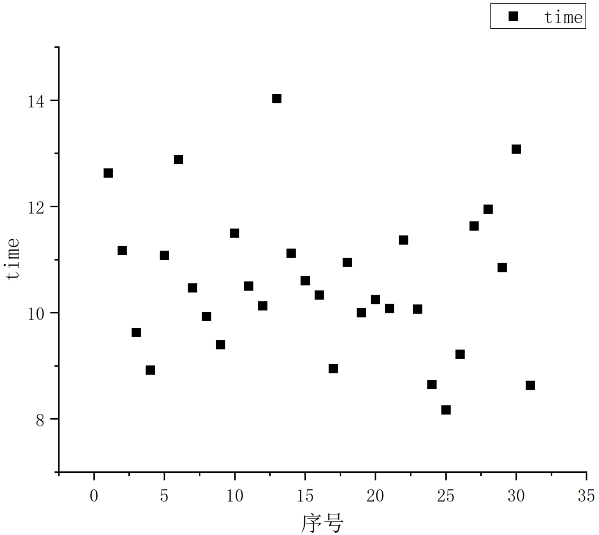
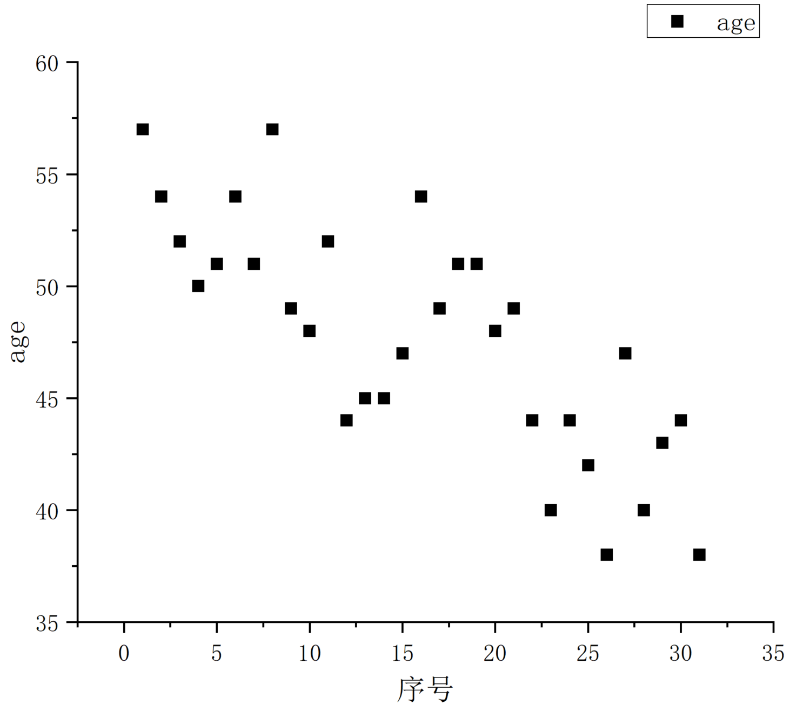
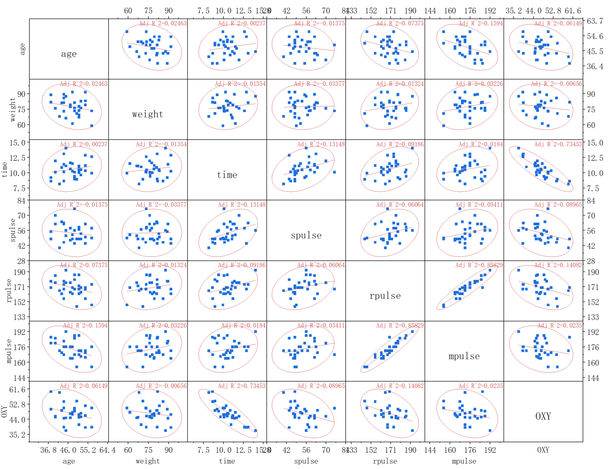
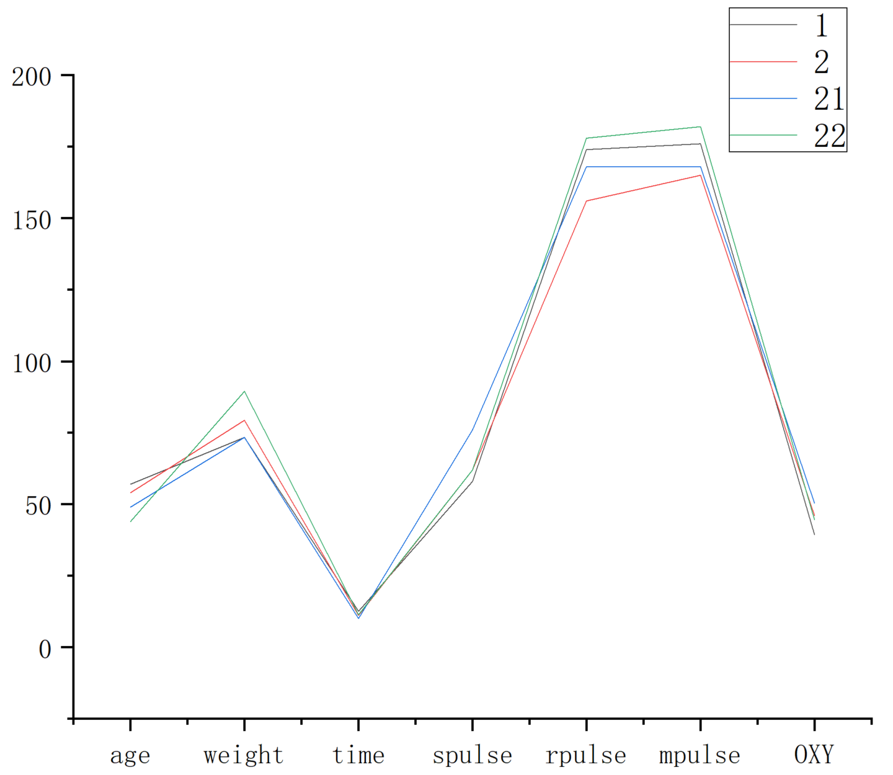
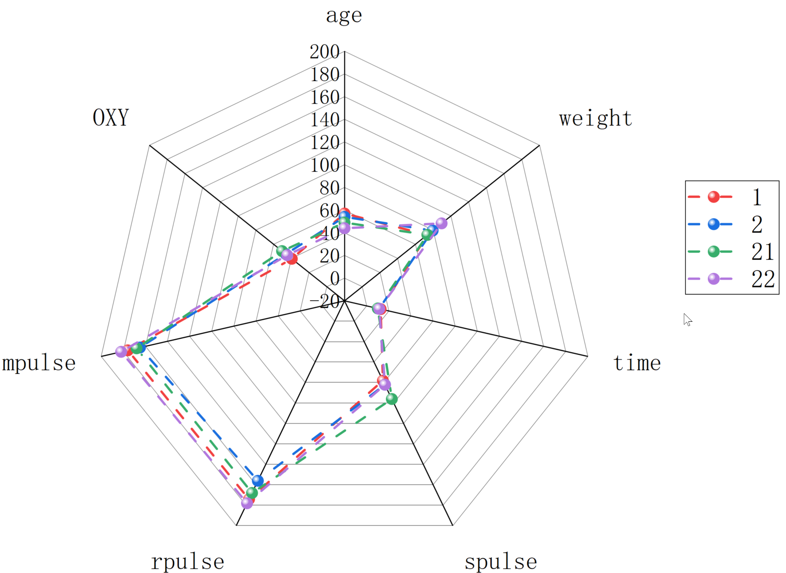

# 第一章课后作业

### 1-1

 为了研究人体的心肺功能，对31个成年男子测量了肺活量（OXY），并且记录了他们的年龄（age）、体重（weight），以及简单训练后的测试数据：跑1.5英里的时间（time）、休息时的脉搏（spulse）、跑步时的脉搏（rpulse）和跑步时记录的最大脉搏（mpulse），共7项指标（数据见表 1.2）。

（1）分别绘制 OXY与time 和 age 的散布图，从图中可得出什么结论？

（2）绘制7项指标的散布图矩阵，从这里能否直观看出一些结论；

（3）绘制序号为1，2，21，22的4个人的轮廓图和雷达图；

#### （1）

结论：这31个成年男子的肺活量基本分布在45～50之间，个别分布在40和60左右，跑1.5英里耗费的时间集中在9～11min之间，可以发现年龄对肺活量和跑步耗费的时间影响不大，而肺活量恶化跑步耗费的时间有一定相关性。

#### （2）

结论：可以发现有几个散点图两个变量的线性拟合线斜率接近1或-1，其余的接近0，以此可以得出对应两个变量的相关性，例如time和OXY负相关，rpulse和mpulse正相关。

#### （3）

轮廓图：

雷达图：

