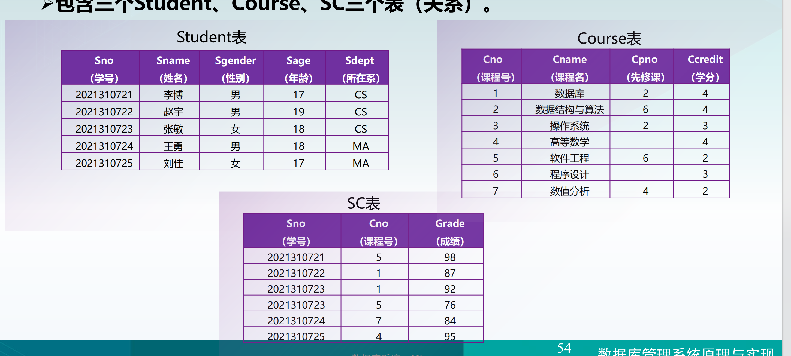

# 关系数据库标准语言SQL

## SQL概述

SQL（Structured Query Language）结构化查询语言是一种非过程化语言，用户只要说明需要的数据库内容，不必说明存取所需数据的具体过程和操作，集数据定义、数据操纵、数据查询和数据控制等功能于一体。

### 特点：

1. 功能综合、风格统一
2. 数据操纵高度非过程化
3. 语法结构统一
4. 语言简洁


## 数据定义




SQL的数据定义功能：

- 模式定义
- 表定义
- 视图和索引的定义

（表可以实体存储，视图是虚存）

|      | 创建                                                         | 删除                                       | 修改                                                         |
| ---- | ------------------------------------------------------------ | ------------------------------------------ | ------------------------------------------------------------ |
| 模式 | CREATE SCHEMA <模式名> AUTHORIZATION <用户名> [<表定义子句> \| <视图定义子句> \| <索引定义子句>] | DROP SCHEMA <模式名> <CASCADE \| RESTRICT> | /(SQL没有提供修改数据库模式的语句)                           |
| 表   | CREATE TABLE  <表名>  (<列名> <数据类型> <列级约束条件>,<br />......<br /><列名> <数据类型> <列级约束条件>,<br />[表级约束条件]) | DROP TABLE <表名> <CASCADE \| RESTRICT>    | ALTER TABLE <表名><br />[ADD[COLUMN] <新列名> <数据类型>]<br />[DROP COLUMN]<br />[DROP CONSTRAINT]<br />[ALTER COLUMN] |
| 视图 |                                                              |                                            |                                                              |
| 索引 | CREATE [UNIQUE] [CLUSTER] IDEX <索引名><br />ON <表名> (<列名> [<次序>], ......, <列名> [<次序>] )<br /><次序>：升序——ASC；降序——DESC |                                            | ALTER INDEX <旧索引名> REAME TO <新索引名>                   |

```sql
CREATE [UNIQUE] IDEX ON Student(Sno)
CREATE [UNIQUE] IDEX ON Course(Cno)
CREATE [UNIQUE] IDEX ON Course(Cno DESC, Sno ASC)
```

### 基本SQL查询

数据查询是从数据库中获取满足一定条件的数据，是数据库的核心操作。利用SQL进行查询的基本语法格式为（每一行为一个子句）：

```sql
SELECT [ALL | DISTINCT] <列表达式>, ......, <列表达式>]
FROM <表名或视图名>
[WHERE <条件表达式>]
[GROUP BY <列名>]
[HAVING <条件表达式>]
[ORDER BY <>];

---------------------
SELECT Sno, Sname, Sage
FROM Student
WHERE Sdept = "CS";

---------------------
SELECT *								=>							SELECT Sno, Sname, Sage, Sdept
FROM Student;						=>							FROM Student;

---------------------
SELECT Sname, 2021 - Sage AS birthday, LOWER(Sdept) AS	sdept	# 投影学生姓名 出生年份 所在专业小写形式
FROM Student;

---------------------
SELECT Sno, Sname, Sage
FROM Student
WHERE Sage >= 18;

---------------------
SELECT Sno, Sname, Sgrade
FROM SC
WHERE Sgrade BETWEEN 80 and 90;

---------------------
SELECT Sno, Sname, Sage
FROM Student
WHERE Sdept in ("CS", "MA");

---------------------
[NOT] LIKE "<匹配串>" [ESCAPE "<换码字符>"]
_:匹配字符串中任意一个字符
%:匹配字符串中任意多个字符（包括0个 或 1个）

SELECT Sno, Sname, Sgender, Sdept
FROM Student
WHERE Sname LIKE "王_"

SELECT Cno, Cname, Ccredit
FROM Course
WHERE Cname LIKE "%数据%"

---------------------
# 消除重复项
SELECT DISTINCT Sdept
FROM Student

---------------------
COUNT ([DISTINCT | ALL *])
COUNT ([DISTINCT | ALL <列名>])


---------------------

```


### 单表查询


### 连接查询


### 嵌套查询

将一个查询嵌套在另一个查询块的WHERE子句，FROM子句或者HAVING短语的条件中的查询

在求解嵌套查询时，先求解只查询，然后基于子查询的求解结果来求解父查询

```sql
SELECT Sno, Sname, Sdept
FROM Student
WHERE Sno IN
	(
  SELECT Sno
  FROM SC
  WHERE Cno = "1"
  )
  
---------------------------
SELECT Sname, Sno, Sage
FROM Student AS A
WHERE Sage < 
	(
  SELECT AVER(Sage)
  FROM Student AS B
  WHERE A.dept = B.dept
  )
  
---------------------------  
SELECT Sno, Sname
FROM Student
WHERE Sno IN
	(
    SELECT Sno
    FROM SC
   	WHERE Cno IN
    (
      SELECT Cno
      FROM Course
      WHERE Cname = "信息科学"
    )
  )
 
---------------------------
# 找出每个学生 超过他选修课程平均成绩的 课程号
SELECT Sno, Cno
FROM SC	AS A
WHERE grade >= 
(
  SELECT AVER(grade)
  FROM SC AS B
  WHERE A.Sno = B.Sno
)

---------------------------
# 查询所有选修了1号课程的学生姓名
SELECT Sname
FROM Student
WHERE Sno IN
(
  SELECT Sno
  FROM SC
  WHERE Cno = '1'
);

SELECT Sname
FROM Student
WHERE EXISTS
(
  SELECT *
  FROM SC
  WHERE Sno = Student.Sno AND Cno = '1'
);

SELECT Sname, Sno, Sdept
FROM Student AS S1
WHERE EXISTS
(
  SELECT *
  FROM Student AS S2
  WHERE S2.dept = S1.dept AND
  			S2.Sname = '刘晨'
)；
 
---------------------------
SELECT Sname, Sno, Ssex
FROM Student
WHERE Sname LIKE '李%四%'
  
---------------------------
SELECT Sname, Sno, Sage
FROM Student AS A
WHERE 
```


### 集合查询


### 基于派生表的查询

```sql
SELECT Sname
FROM Student
	(SELECT Sno FROM SC WHERE Cno = '1') AS SC1
WHERE Student.Sno = SC1.Sno
```


### 递归查询

```sql
WITH RECURSIVE  temporary_table AS (
  SEED QUERY
  UNION [ALL]
  RECURSIVE QUERY
)


WITH RECURSIVE t(n) AS (
  VALUES (1)
	UNION
  SELECT n+1 FROM t WHERE n < 100
)
SELECT sum(n) FROM t;
```


### 数据更新

```sql
--------------------
插入数据
·
·

--------------------
·插入元组
INSERT 
INTO <表名> (<列名1>, <列名2>, ......)		#插入到所有列可省略列名
VALUES (<常量1>, <常量2>, ......)

·插入子查询结果
INSERT
INTO <表名> (<列名1>)
子查询


--------------------
修改数据
UPDATE <表名>
SET <列名> = <表达式1>
[WHERE <条件>]

--------------------
删除数据
DELETE
FROM <表名>
[WHERE <条件>]


```


## 视图

- 虚表

- 

若一个视图是从单个表中，且保留了主码，子集视图

### 定义视图

#### 1.建立视图

```sql
CREATE VIEW
<视图名>
AS
子查询


------------------------
CREATE VIEW IS_Student
AS
SELECT Sno, Sname, Sage
FROM Student
WHERE Sdept = 'CS'
WITH CHECK OPTION		# 对视图进行修改时，会自动加上Sdept = 'CS'的条件

-----------------------
·基于多个基表的视图
# 建立信息系选修了1号课程的学生的学号、姓名、分数
CREATE VIEW IS_S1(Sno, Sname, Grade)
AS
SELECT Student.Sno, Sname, Grade
FROM Student, SC
WHERE	Sdept = 'IS' AND
			Sudent.Sno = SC.sno AND
			SC.Cno ='1'
			
--------------------
·分组视图
# 将学生的学号及平均成绩定义为一个视图
CREATE VIEW S_G (Sno, Aver_Grade)
AS
SELECT Sno, AVG(Grade)
FROM SC
GROUP BY Sno;
```


#### 2.删除视图

```sql
DROP VIEW <视图名> [CASCADE]
```


### 查询视图

```

```


### 更新视图

```sql
UPDATE IS_Student
SET Sname = 
WHERE 

INSERT 
INTO IS_Student
VALUES ('201215129', '赵鑫', 20)
转换为对基本表的更新
INSERT 
INTO Student (Sno, Sname, Sage, Sdept)
VALUES ('201215129', '赵鑫', 20, CS)
```


## 数据库完整性

### 实体完整性

- 关系模型的实体完整性
  - CREARE TABLE 中用 PRIMARY KEY 定义
- 

### 参照完整性


### 用户定义的完整性

- CREATE TABLE 时定义属性上的约束条件
  - 列值非空
  
  
  
  - 列值唯一
  
  ```sql
  CREATE TABLE DEPT
  (
    Sno CHAR(9)
  
  )
  ```
  
  
  
  - 


## 数据库安全性控制


## 数据库编程

嵌入式SQL、不用游标的SQL语句、过程化SQL

### 嵌入式SQL


