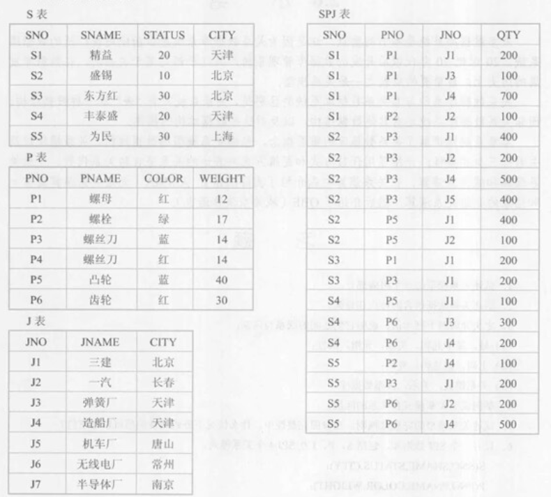
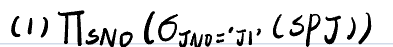
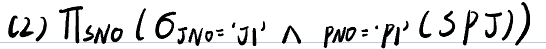
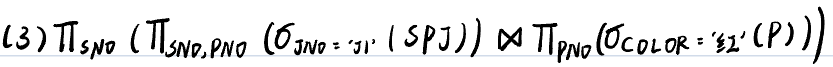
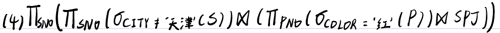
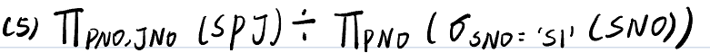

# 数据库第一次作业

### 1.举例说明关系模式和关系的区别。

关系模式是关系的描述，关系模式描述关系元组集合的结构，即它由哪些属性构成，这些属性来自哪些域，以及属性与域之间的映像关系。同时关系模式要描述关系的完整性约束。

关系是一组域的笛卡尔积的有限子集，是一张二维表，表的每一行对应一个元组，表的每一列对应一个域。

关系是动态的，可以进行插入、更新、删除等操作，而关系模式是静态的，一旦定义就不会再改变，关系模式是关系的逻辑结构，关系是关系模式的实例。

例如有以下关系

Student关系

| 学号Sno  | 姓名Sname | 年龄Sage |
| :------: | :-------: | :------: |
| 20220101 |   张三    |    18    |
| 20220102 |   李明    |    18    |
| 20220104 |   李四    |    20    |
| 20220112 |   建国    |    19    |
| 20220123 |   李华    |    17    |
| 20220118 |   王五    |    19    |

对应关系模式为

Student（Sno: int，Same: varchar ，Sage: int）

这里的关系模式定义了一个叫“Student”的表，包含3个属性：学号(Sno)、姓名(Sname)、年龄(Sage)。每个属性都有特定的数据类型，学号和年龄是整数，姓名是字符串类型。

### 2.设有一个SPJ数据库，包括S、P、J及SPJ4个关系模式：

	S (SNO, SNAME, STATUS, CITY):
	P (PNO, PNAME, COLOR, WEIGHT):
	J (JNO, JNAME, CITY):
	SPJ (SNO, PNO, JNO, QTY):
供应商表**S**由供应商代码（SNO）、供应商姓名（SNAME）、供应商状态（STATUS）、供应商所在城市（CITY）组成。
零件表 **P** 由零件代码（PNO）、零件名（PNAME）、颜色（COLOR）、承量（WEIGHT）组成。
工程项目表 **J** 由工程项目代码（JNO）、工程项目名（JNAME）、工程项目所在城市（CITY）组成。
供应情况表 **SPJ**由供应商代码（SNO）、 零件代码（PNO）、工程项目代码（JNO）、供应数量（QTY）组成，表示某供应商供应某种零件给某工程項目的数量为 QTY
	今有若干数据如下：

试用关系代数完成如下查询：
（1） 求供应工程 **J1** 零件的供应商号码 SNO；

（2） 求供应工程 **J1** 零件 **P1** 的供应商号码 SNO；

（3）求供应工程 **J1** 零件为**红色**的供应商号码 SNO；

（4）求没有使用**天津**供应商生产的**红色**零件的工程号 JNO；

（5）求至少用了供应商 **S1** 所供应的全部零件的工程号 JNO。

