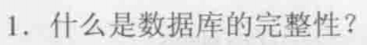
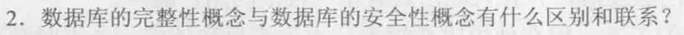
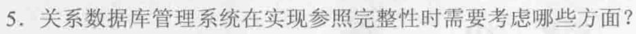
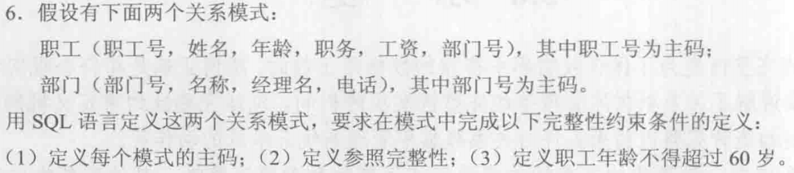
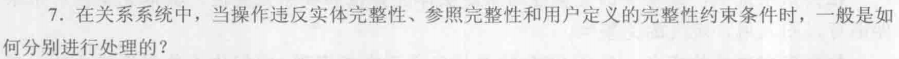
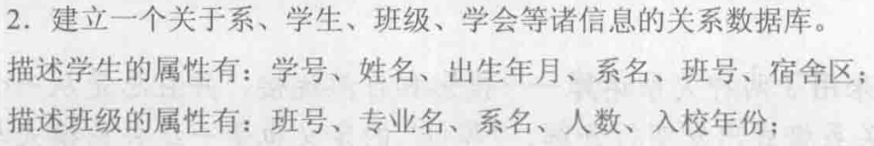
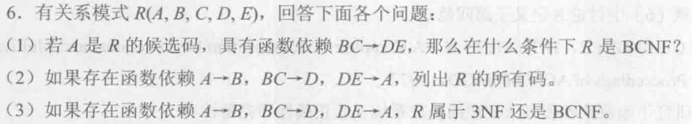

# 数据库第三次作业

Fallen

## 第五章1、2、5、6、7



数据库的完整性是指数据的**正确性**和**相容性**，数据的正确性是指数据是符合现实世界寓意、反应当前实际状况的；数据的相容性是指数据库同一对象在不同关系表中的数据是符合逻辑的。



区别：

数据的完整性是为了防止数据库中存在不符合语义的数据，也就是防止数据库中存在不正确的数据，完整性检查和控制的防范对象是不合语义的、不正确的数据，防止它们进入数据库；

数据的安全性是保护数据库防止恶意破坏和非法存取，安全性控制的防范对象是非法用户和非法操作，防止他们对数据库数据的非法存取。

联系：
数据库完整性和安全性关注点不同，但是二者相辅相成，共同保护数据的有效性、正确性和可靠性，以保证数据在逻辑和物理上都具备安全性和一致性。



1. 在对被参照表和参照表进行增、删、改操作时必须进行检查以保证两个表的相容性，如果被参照表的主码发生更新，关系数据库管理系统需要决定如何处理引用此主码的参照表记录，采用以下策略处理：
   - 拒绝执行
   - 级联操作
   - 设置为空值
2. 定义外码时还应定义外码列是否允许空值
3. 确保在处理参照完整性约束时，插入、更新、删除等操作应作为一个完整的原子性事务执行，避免并发操作导致的完整性问题。




```sql
CREATE TABLE Dept (
	Deptno INT PRIMARY KEY,		/* 定义主码 */
  Deptname VARCHAR(32),
  Deptmanager VARCHAR(10),
  Managerphone VARCHAR(12)
);

CREATE TABLE Clerk (
	Cno INT PRIMARY KEY,			/* 定义主码 */
  Cname VARCHAR(10),
  Cage INT,
 	job VARCHAR(32),
  Salary INT,
  Deptno INT,
  /* 定义参照完整性 */
  CONSTRAINT foreign_key_deptno FOREIGN KEY(Deptno) REFERENCES Dept(Deptno),
  /* 定义职工年龄不超过60岁 */
  CONSTRAINT Age_max CHECK (Cage <= 60)		
);
```



1. 实体完整性：

   - 拒绝执行

2. 参照完整性：

   - 拒绝执行

     不允许改操作执行。该策略一般设置为默认策略。

   - 级联操作

     当删除或修改被参照表的一个元组造成了与参照表的不一致，则删除或修改参照表中的所有造成不一致的元组。

   - 设置为空值

     当删除或修改被参照表的一个元组造成了不一致，则将参照表中的所有造成不一致的元组的对应属性值设置为空值。

3. 用户定义的完整性：

   - 拒绝执行

## 第六章2、6



1. 关系模式：

   学生：S(Sno, Sname, Sbirth, Dept, Cno, Dorm)

   班级：C(Cno, Major, Dept, Cppl, Cyear)

   系：D(Deptname, Deptno, Deptoffice, Deptppl)

   学会：U(Uname, Uyear, Upos, Uppl)

2. 每个关系模式的极小函数依赖集

   1. **学生关系S**(Sno, Sname, Sbirth, Dept, Cno, Dorm)的最小函数依赖集：

   {Sno → Sname, Sno → Sbirth, Sno → Cno, Cno → Dept, Dept → Dorm}

   存在传递函数依赖：

   Sno → Dept、Sno → Dorm、Cno → Dorm

   - 因为Sno → Cno, Cno ↛ Sno, Cno → Dept，故Dept函数依赖于Sno

   - 因为Sno → Dept, Dept ↛ Sno, Dept → Dorm，故Dorm函数依赖于Sno
   - 因为Cno → Dept, Dept ↛ Cno, Dept → Dorm，故Dorm函数依赖于Cno

   2. **班级关系C**(Cno, Major, Dept, Cppl, Cyear)的最小函数依赖集：

   {Cno → Major, Major → Dept, Cno → Cppl, Cno → Cyear}

   存在函数依赖：

   Cno → Dept

   - 因为Cno → Major, Major ↛ Cno, Major → Dept，故Dept函数依赖于Cno

   3. **系关系D**(Deptname, Deptno, Deptoffice, Deptppl)的最小函数依赖集：
   {Deptname → Deptno, Deptno → Deptname, Deptno → Deptoffice, Deptno → Deptppl}
   不存在函数依赖
   4. **学会关系U**(Uname, Uyear, Upos, Uppl)的最小函数依赖集：
   {Uname → Uname, Uname → Upos, Uname → Uppl}
   不存在函数依赖

   四个关系模式极小函数依赖集都不存在函数依赖左部是多属性的情况

3. 各关系的候选码、外部码，全码存在情况：

|               | 候选码           | 外部码    | 全码   |
| ------------- | ---------------- | --------- | ------ |
| **学生关系S** | Sno              | Dept、Cno | 不存在 |
| **班级关系C** | Cno              | Dept      | 不存在 |
| **系关系D**   | Deptno、Deptname | /         | 不存在 |
| **学会关系U** | Uname            | /         | 不存在 |



(1)若BC是R的候选码，即还有函数依赖BC→A，把BC作为R的主码，则R是BCNF

(2)(A, C, E)、(B, C, E)、(C, D, E)

(3)R属于3NF，因为R中属性都是主属性，故R至少是3NF，但因为主属性E不依赖于任何每个不包含它的码，不满足所有主属性对每一个不包含它的码也是完全依赖，所以R不属于BCNF，故R属于3NF