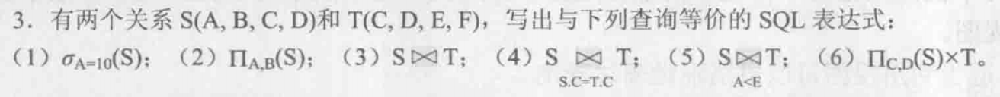
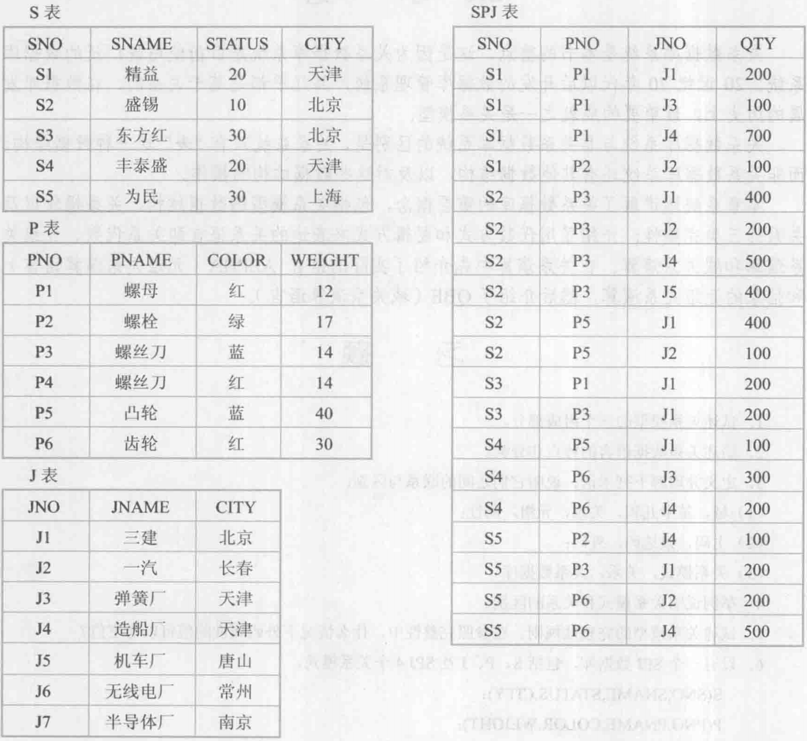
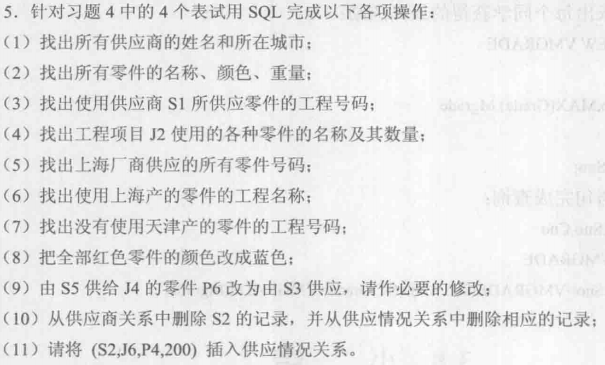
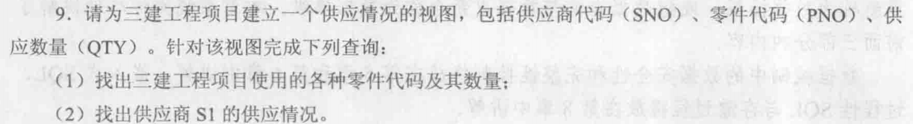

# 数据库第二次作业



(1)

```sql
SELECT *
FROM S
WHERE A = '10';
```

(2)

```sql
SELECT DISTINCT A, B
FROM S;
```

(3)

```sql
SELECT A, B, S.C, S.D, E, F
FROM S, T
WHERE S.C = T.C AND S.D = T.D;
```

(4)

```sql
SELECT S.*, T.*
FROM S, T
WHERE S.C = T.C;
```

(5)

```sql
SELECT S.*, T.*
FROM S, T
WHERE S.A < T.E;
```

(6)

```sql
SELECT S.C, S.D, T.*
FROM S, T;
```





(1)

```sql
SELECT SNAME, CITY
FROM S;
```

(2)

```sql
SELECT PNAME, COLOR, WEIGHT
FROM P;
```

(3)

```sql
SELECT DISTINCT JNO
FROM SPJ
WHERE SNO = 'S1';
```

(4)

```sql
SELECT JNAME, PNAME, QTY
FROM SPJ, P
WHERE SPJ.PNO = P.PNO AND SPJ.JNAME = 'J2';
```

(5)

```sql
SELECT JNO
FROM S, SPJ
WHERE S.SNO = SPJ.SNO AND S.CITY = '上海';
```

(6)

```sql
SELECT JNAME
FROM J, S, SPJ
WHERE S.SNO = SPJ.SNO AND J.JNO = SPJ.JNo AND S.CITY = '上海';
```

(7)

```sql
SELECT DISTINCT JNO
FROM J, S, SPJ
WHERE S.SNO = SPJ.SNO AND J.JNO = SPJ.JNO AND S.CITY <> '天津';

SELECT DISTINCT JNO
FROM SPJ
WHERE JNO NOT IN (
    SELECT SPJ.JNO
    FROM SPJ, S
    WHERE SPJ.SNO = S.SNO AND S.CITY = '天津'
);
```

(8)

```sql
UPDATE P
SET COLOR = '蓝'
WHERE COLOR = '红';
```

(9)

```sql
UPDATE SPJ
SET SNO = 'S5'
WHERE JNO = 'J4' AND SNO = 'S3' AND PNO = 'P6';
```

(10)

```sql
DELETE
FROM S
WHERE SNO = 'S2';

DELETE
FROM SPJ
WHERE SNO = 'S2';
```

(11)

```sql
INSERT
INTO SPJ
VALUES ('S2', 'J6', 'P4', 200)
```



(1)

```sql
CREATE VIEW SJP
AS
SELECT SNO, SPJ.PNO, QTY
FROM SPJ, J
WHERE SPJ.JNO = J.JNO AND JNAME = '三建';

SELECT PNO, QTY
FROM SJP;
```

(2)

```sql
SELECT *
FROM SJP
WHERE SNO = 'S1';
```

