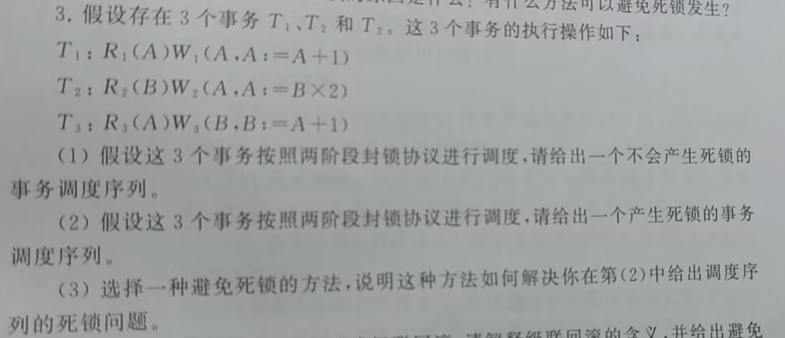
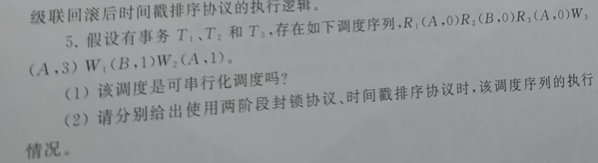
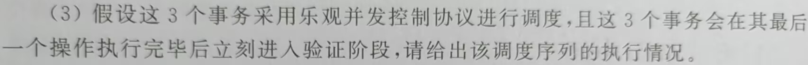

# 数据库第五次作业

Fallen

## 第十一章2、3、5

一、两阶段封锁协议中出现死锁的原因是什么？有什么方法可以避免死锁发生？

答：在两阶段封锁协议（2PL，Two-Phase Locking）中，事务分为两个阶段：

**扩展阶段**：事务可以申请获得任何数据项上的任何类型的锁，但是不能释放任何锁。

**收缩阶段**：事务可以释放任何数据项上的任何类型的锁，但是不能再申请任何锁。

其出现死锁的主要原因是**资源竞争和锁的相互等待**。具体原因包括：

- **资源依赖的循环**：如果两个或多个事务同时持有某些资源的锁，并且又尝试获取彼此已经持有的锁，就会导致死锁。例如：

  - 事务 T1 持有资源 A 的锁，正在等待资源 B 的锁。

  - 事务 T2 持有资源 B 的锁，正在等待资源 A 的锁。

这就形成了一个**等待环**，从而发生死锁。

- **事务并发运行**：由于多个事务在并发运行中申请锁，没有统一的锁申请顺序，当事务之间对资源的请求冲突时，就可能发生死锁。

- **不可抢占锁**：锁是不可抢占的，即一个事务必须等到另一个事务释放锁后才能继续，这种不可抢占的特性也增加了死锁发生的可能性。

避免死锁的方法：

1. **使用超时机制原理**：为每个事务的锁等待设置一个最大时间限制。如果超过该时间仍未获得锁，则事务会被强制中止，释放已经持有的锁，之后重新尝试执行。
2. **顺序封锁**：对所有资源（如数据项）规定一个全局的固定顺序，事务必须按这个顺序申请锁。
3. **死锁检测与恢复**：系统定期检测是否存在等待环（如构建资源等待图）。如果发现死锁，则强制中止某个事务来打破死锁。
4. **发生冲突回滚（No-Wait）**：当事务想要请求锁的时候，发现该数据项上的锁已经被其它事务持有时，回滚该事务
5. **等待/抢占策略**：
   - **等待-禁止（Wait-Die）**：如果请求锁的事务的优先级高于拥有锁的事务的优先级，那么请求锁的事务等待拥有锁的事务释放锁，否则回滚请求锁的事务。系统通常使用事务的开始时间戳来决定事务的优先级，事务的开始时间戳越小，优先级越高。
   - **抢占-回退（Wound-Wait）**：如果请求锁的事务的优先级高于拥有锁的事务的优先级，那么拥有锁的事务回滚并释放占有的锁，否则请求锁的事务等待拥有锁的事务释放锁。

(1)
$$
R_1(A) \space W_1(A,\space A: = A + 1)\space C_1 \space R_2(B) \space W_2(A,\space A: = B \times 2) \space C_2 \space R_3(A) \space W_3(B,\space B: = A + 1) \space C_3
$$
(2)
$$
R_1(A) \space R_2(B) \space R_3(A) \space W_1(A,\space A: = A + 1) \space W_2(A,\space A: = B \times 2) \space W_3(B, \space B: = A + 1) \space C_1 \space C_2 \space C_3
$$
(3)使用等待/抢占策略：

按事务开始的时间戳决定事务的优先级：T1 > T2 > T3

按调度顺序：

T1 获取SLOCK A

T2 获取SLOCK B

当 T3 请求 SLOCK A 时，发现 T1 已经持有。由于 T3 比 T1 优先级低，因此 T3 回滚等待。

当 T1请求 XLOCK A 时，发现 T1 已经持有 SLOCK A。由于 T3 比 T1 优先级低，因此 T3 回滚释放锁， T1获取 XLOCK A。

当 T2 请求 A 时，发现 T1 已经持有。由于 T1 比 T2 优先级高，因此 T2 回滚等待。

这样 T1 可以完成操作并提交，释放LOCK A、B ，从而避免死锁。

最终调整事务的调度序列为：
$$
R_1(A) \space W_1(A,\space A: = A + 1)\space C_1 \space R_2(B) \space W_2(A,\space A: = B \times 2) \space C_2 \space R_3(A) \space W_3(B,\space B: = A + 1) \space C_3
$$

(1)该调度是可串行化调度，该调度的执行结果为：**A = 1 B = 1**，该调度的其中可能的串行化调度及对应的结果为：
$$
R_1(A) \space W1(B) \space R_3(A, 0) \space W_3(A, 3) \space R_2(B, 0) \space W_2(A, 1)
$$
执行结果：**A = 1 B = 1**，与原调度的执行结果相同，所以原调度是可串行化调度

(2)

- 两阶段封锁协议：

  两阶段封锁协议将每个事务分为扩展阶段和收缩阶段，每个事务都先进行扩展阶段，扩展阶段每个事务只申请获得锁，不释放锁：

  执行$R_1(A, 0)$，$T_1$获得SLOCK A

  执行$R_2(B, 0)$，$T_2$获得SLOCK B

  执行$R_3(A, 0)$，因为是对数据项的读取，数据项A没有加排他锁，$T_3$​获得SLOCK A

  执行$W_3(A, 3)$，检测到$T_1$持有SLOCK A，故$T_3$等待$T_1$​释放锁

  执行$W_1(B, 1)$，检测到$T_2$持有SLOCK B，故$T_1$等待$T_2$释放锁

  执行$W_2(A, 1)$，检测到$T_1 \text{、} T_3$持有SLOCK A，故$T_2$也进入等待

  此时三个事物存在依赖关系：
  $T_1 \rightarrow T_3 \text{、}T_2 \rightarrow T_1 \text{、} T_1 \text{、} T_3 \rightarrow T_2$，由于存在双向依赖，故出现死锁

- 时间戳排序协议：

  时间戳排序协议按事务的开始时间排序确定事务优先级：

  执行$R_1(A, 0)$，$T_1$获得SLOCK A

  执行$R_2(B, 0)$，$T_2$获得SLOCK B

  执行$R_3(A, 0)$，因为是对数据项的读取，数据项A没有加排他锁，$T_3$​获得SLOCK A

  执行$W_3(A, 3)$，检测到$T_1$持有SLOCK A，且$TS(T_3) < MAX(WTS(T_1),\space RTS(T_1))$，故$T_3$回滚

  执行$W_1(B, 1)$，检测到$T_2$持有SLOCK B，但$TS(T_1 < WTS(T_2))$，故$T_2$回滚并释放锁，$T_1$获得锁XLOCK A

  至此$T_1$完成并提交，释放对数据项A的锁，若继续执行回滚事务：

  执行$R_2(B, 0)$，$T_2$获得SLOCK B

  执行$R_3(A, 0)$，$T_3$​获得SLOCK A

  执行$W_3(A, 3)$，$T_3$获得XLOCK A

  $T_3$执行完成，释放对数据项A得锁

  执行$W_2(A, 1)$，$T_2$获得XLOCK B

  $T_2$执行完成

  至此三个事务都能正确执行，不会出现死锁

(3)乐观并发控制控制协议将事务的生命周期分为三个阶段：

- 读取阶段：执行事务，但不进行写操作。更新的数据维护缓存在事务的私有空间。
- 验证阶段：检测事务是否满足可串行化隔离级别。
- 写阶段：将事务私有空间中的更新数据写入数据库

在同一时刻只允许一个事物进入验证阶段和写阶段；

事务的优先级顺序按事务的**验证时间**排序：如果Ti的验证时间早于Tj的验证时间，那么Ti -> Tj。

执行情况如下：

| 步骤 |             $T_1$             |             $T_2$             |             $T_3$             |                          事务读写集                          |
| :--: | :---------------------------: | :---------------------------: | :---------------------------: | :----------------------------------------------------------: |
|  1   | Begin  S-TS( $T_1$ ) = 1 |                               |                               | RS($T_1$) — 𝛷；WS($T_1$) — 𝛷； RS($T_2$) — 𝛷；WS($T_2$) — 𝛷； RS($T_3$) — 𝛷；WS($T_3$) — 𝛷；<r /> |
|  2   |                               | Begin  S-TS( $T_2$ ) = 2 |                               | RS($T_1$) — 𝛷；WS($T_1$) — 𝛷； RS($T_2$) — 𝛷；WS($T_2$) — 𝛷； RS($T_3$) — 𝛷；WS($T_3$) — 𝛷；<r /> |
|  3   |          $R_1(A, 0)$          |                               |                               | RS($T_1$) — {A}；WS($T_1$) — 𝛷； RS($T_2$) — 𝛷；WS($T_2$) — 𝛷； RS($T_3$) — 𝛷；WS($T_3$) — 𝛷；<r /> |
|  4   |                               |                               | Begin  S-TS( $T_3$ ) = 3 | RS($T_1$) — 𝛷；WS($T_1$) — 𝛷； RS($T_2$) — 𝛷；WS($T_2$) — 𝛷； RS($T_3$) — 𝛷；WS($T_3$) — 𝛷；<r /> |
|  5   |                               |          $R_2(B, 0)$          |                               | RS($T_1$) — {A}；WS($T_1$) — 𝛷； RS($T_2$) — {B}；WS($T_2$) — 𝛷； RS($T_3$) — 𝛷；WS($T_3$) — 𝛷；<r /> |
|  6   |                               |                               |          $R_3(A, 0)$          | RS($T_1$) — {A}；WS($T_1$) — 𝛷； RS($T_2$) — {B}；WS($T_2$) — 𝛷； RS($T_3$) — {A}；WS($T_3$) — 𝛷；<r /> |
|  7   |                               |                               |          $W_3(A, 3)$          | RS($T_1$) — {A}；WS($T_1$) — 𝛷； RS($T_2$) — {B}；WS($T_2$) — 𝛷； RS($T_3$) — {A}；WS($T_3$) — {A}；<r /> |
|  8   |                               |                               | Validate V-TS($T_3$) = 4 | RS($T_1$) — {A}；WS($T_1$) — 𝛷； RS($T_2$) — {B}；WS($T_2$) — 𝛷； RS($T_3$) — {A}；WS($T_3$) — {A}；<r /> |
|  9   |                               |                               |  Commit F_TS($T_3$) = 5  | RS($T_1$) — {A}；WS($T_1$) — 𝛷； RS($T_2$) — {B}；WS($T_2$) — 𝛷； RS($T_3$) — {A}；WS($T_3$) — {A}；<r /> |
|  10  |          $W_1(B, 1)$          |                               |                               | RS($T_1$) — {A}；WS($T_1$) — {B}； RS($T_2$) — {B}；WS($T_2$) — 𝛷； RS($T_3$) — {A}；WS($T_3$) — {A}；<r /> |
|  11  | Validate V-TS($T_1$) = 6 |                               |                               | RS($T_1$) — {A}；WS($T_1$) — {B}； RS($T_2$) — {B}；WS($T_2$) — 𝛷； RS($T_3$) — {A}；WS($T_3$) — {A}；<r /> |
|  12  |             Abort             |                               |                               | RS($T_1$) — 𝛷；WS($T_1$) — 𝛷； RS($T_2$) — {B}；WS($T_2$) — 𝛷； RS($T_3$) — {A}；WS($T_3$) — {A}；<r /> |
|  13  |                               |          $W_2(A, 1)$          |                               | RS($T_1$) — 𝛷；WS($T_1$) — 𝛷； RS($T_2$) — {B}；WS($T_2$) — {A}； RS($T_3$) — {A}；WS($T_3$) — {A}；<r /> |
|  14  |                               |             Abort             |                               |                                                              |

最终执行结果**A = 3, B = 0**

## 第十二章1、5

1. 简述数据库管理系统中故障的分类
   - 事务故障：事务故障是指事务的运行没有到达预期的终点（COMMIT或者显式的ROLLBACK）就被终止，有两种错误可能造成事务执行失败：
     - **逻辑错误**：事务由于某些内部情况而无法继续其正常执行，例如非法输入、溢出、完整性检查未通过或超出资源限制等。
     -  **系统错误**：系统进入一种不良状态（例如死锁）导致无法继续其正常执行。
   - 系统故障：又称软故障，是指造成系统停止运转的任何事件，使得系统要重新启动。
     - 特定类型的硬件错误（如CPU故障）
     - 操作系统故障
     - 数据库管理系统代码错误
     - 系统断电
   - 介质故障：也称为硬故障，指外存故障，与系统故障（软故障）相对。介质故障破坏数据库或部分数据库，并影响正在存取这部分数据的所有事务 ，介质故障比前两类故障的可能性小得多，但破坏性大得多。
     - **磁盘损坏**
     -  **磁头碰撞**
     - **瞬时强磁场干扰**
   - 用户错误：用户在使用数据库的过程中可能会出现的一些误操作：
     - **误删了表中的数据行** 
     - **误删除系统中的表** 
     - **用户提交了错误数据**  

恢复流程：

- 将既有<T, START>又有<T, COMMIT>日志记录的事务T加入REDO-set:

  REDO-set{$T_1$，$T_3$}

- 将只有<*T*, START>没有<*T*, COMMIT>日志记录的事务*T*加入UNDO-set:

  UNDO-set{$T_2$，$T_4$​}

- 撤销阶段：首先，从日志尾反向扫描日志文件，对每一条属于UNDO-set={$T_2$ ，$T_4$}中事务的更新操作日志依次执行UNDO操作。

  撤销过程如下：

  $<T_4, \space C, \space 13, \space 17>: \space C = 13$

  $<T_2, \space C, \space 11, \space 13>: C = 11$​

  $<T_2, \space B, \space 9, \space 10>: B = 9$​

  撤销后的结果为：B = 10, C = 13

- 重做阶段：正向扫描日志，对每一条属于REDO-set{$T_1$，$T_3$}中事务的更新操作日志依次执行REDO操作：

  重做过程如下：

  $<T_1, \space A, \space, 1, \space 10>: A = 10$​

  $<T_1, \space C, \space, 10, \space 11>: C = 11$

  $<T_3, \space A, \space, 10, \space 11>: A = 11$​

  $<T_3, \space B, \space, 10, \space 7>: B = 7$​

  重做后的结果为：A = 11, B = 7, C = 11

恢复后的结果为A = 11, B = 7, C = 11
