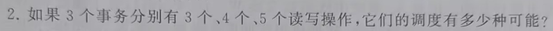
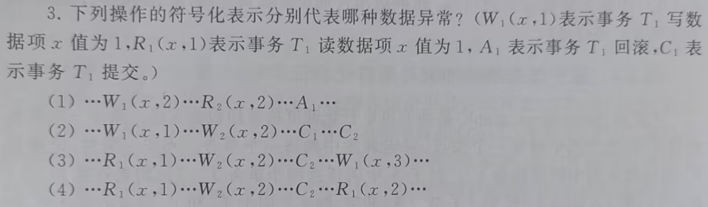
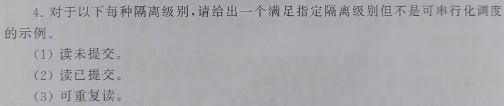
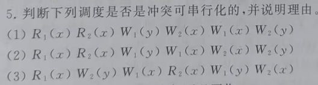
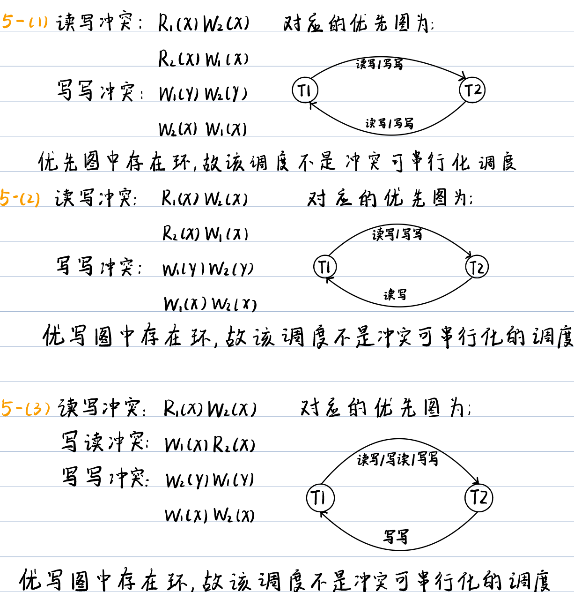
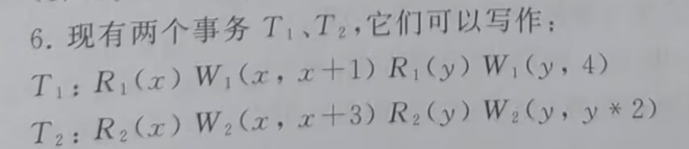
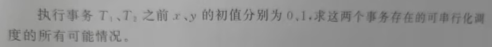

# 数据库第四次作业

Fallen

## 第十章2-6

事务调度中每个事务的读写操作是按顺序执行的，事务间的操作可以交错调度，但单个事务的操作顺序不能改变。

3个事物的操作总数为：
$$
N = n_1 + n_2 + n_3 = 3 + 4 + 5 = 12
$$
则调度的可能就是将12个操作数按排列组合方式执行，其中单个事物的操作排列顺序不能改变，所以总的调度可能为：

​				
$$
C = \frac{N!}{n_1! \cdot n_2! \cdot n_3!} = \frac{12!}{3! \cdot 4! \cdot 5!} = 27720
$$

(1)**脏读**异常，事务1先写数据项x值为2，然后事务2读取了事务1更新的x值为2，但是后来事务1回滚，撤销了对x值的写，导致事务2读到了未提交事务1的写，从而出现了脏读异常

(2)**脏写**异常，事务1先写数据项x的值为1，但是在事务1提交之前事务2也修改数据项x的值，并写为2，之后，事务1和事务2先后提交，事务2的提交导致事务1的修改被事务2的修改覆盖了。

(3)**丢失修改**异常，T1首先读取了数据项x，然后T2修改了x的值并提交，接着T1也修改了x的值，之后若T1也提交，那么T1的提交会导致T2的修改被覆盖。

(4)**不可重复读**异常，T1先读取了数据项x，随后T2修改了x的值并进行了提交，当T1再次读取数据项x的值时，读到了T2修改后x的值，此时T1发现前后两次读取相同数据项x的值各不相同。

(1)
$$
R_1(x, 10) \rightarrow W_2(x, 20) \rightarrow C_2 \rightarrow R_1(x, 20) \rightarrow C_1
$$
(2)
$$
R_1(x, 10) \rightarrow W_2(x, 20) \rightarrow C_1 \rightarrow R_1(x, 20)\rightarrow C_2
$$
(3)
$$
R_1(P) \rightarrow W_2(A \space in \space P) \rightarrow C_2 \rightarrow R_1(P)\rightarrow C_2
$$

可串行调度T1T2数据项的最终状态为**<u>x = 4、y = 8</u>** 
$$
R_1(x) \space W_1(x, \space x+1) \space R_1(y) \space W_1(y, \space 4) \space R_2(x) \space W_2(x, \space x+3) \space R_2(y) \space W_2(y, \space y * 2)
$$
与串行调度T1T2执行结果相同的可串行化调度：
$$
R_1(x) \space W_1(x, \space x + 1) \space R_2(x) \space W_2(x, \space x + 3) \space R_1(y) \space W_1(y, \space 4) \space R_2(y) \space W_2(y, \space y * 2)
$$

$$
R_1(x) \space W_1(x, \space x + 1) \space R_2(x) \space W_2(x, \space x + 3) \space R_1(y) \space R_2(y) \space W_1(y, \space 4) \space W_2(y, \space y * 2)
$$

$$
R_1(x) \space R_2(x) \space W_1(x, \space x + 1) \space W_2(x, \space x + 3) \space R_1(y) \space W_1(y, \space 4) \space R_2(y) \space W_2(y, \space y * 2)
$$

$$
R_1(x) \space R_2(x) \space W_1(x, \space x + 1) \space W_2(x, \space x + 3) \space R_1(y) \space R_2(y) \space W_1(y, \space 4) \space W_2(y, \space y * 2)
$$

串行调度T2T1数据项的最终状态为**<u>x = 4、y = 6</u>** 
$$
R_2(x) \space W_2(x, \space x+3) \space R_2(y) \space W_2(y, \space y * 2) \space R_1(x) \space W_1(x, \space x+1) \space R_1(y) \space W_1(y, \space 4)
$$
与串行调度T2T1执行结果相同的可串行化调度：
$$
R_2(x) \space W_2(x, \space x+3) \space R_1(x) \space W_1(x, \space x+1) \space R_2(y) \space W_2(y, \space y * 2) \space R_1(y) \space W_1(y, \space 4)
$$

$$
R_2(x) \space W_2(x, \space x+3) \space R_1(x) \space W_1(x, \space x+1) \space R_2(y) \space R_1(y) \space W_2(y, \space y * 2) \space W_1(y, \space 4)
$$

$$
R_2(x) \space R_1(x) \space W_2(x, \space x+3) \space W_1(x, \space x+1) \space R_2(y) \space W_2(y, \space y * 2) \space R_1(y) \space W_1(y, \space 4)
$$

$$
R_2(x) \space R_1(x) \space W_2(x, \space x+3) \space W_1(x, \space x+1) \space R_2(y) \space R_1(y) \space W_2(y, \space y * 2) \space W_1(y, \space 4)
$$

