# 作业一 环境配置

## 一、实验目的

1. 掌握虚拟机环境下大数据相关组件的安装与配置
2. 实现 SSH 免密登录配置
3. 完成 JDK、Scala 开发环境的搭建
4. 部署 Hadoop 分布式文件系统及相关组件
5. 配置 Zookeeper、HBase 和 Spark 并进行功能验证

## 二、实验环境

- 操作系统：Ubuntu 22.04 LTS
- 虚拟机：UTM
- 集群节点：1 个 master 节点，2 个 slave 节点（slave1, slave2）
- 网络配置：静态 IP 地址

## 三、实验内容与步骤

### 3.1 虚拟机搭建

1. **创建虚拟机**：使用 UTM 创建 3 台 Ubuntu 虚拟机，分别命名为 master、slave1 和 slave2。

   1. 在UTM中创建新的虚拟机，由于我的系统是ARM架构，要运行x86_64架构的Ubuntu需要选择模拟选项

      

   2. 选择下载好的ISO映像

      

   3. 使用默认选项配置，并设置20G的磁盘容量

      

   4. 最终虚拟机设置如下

      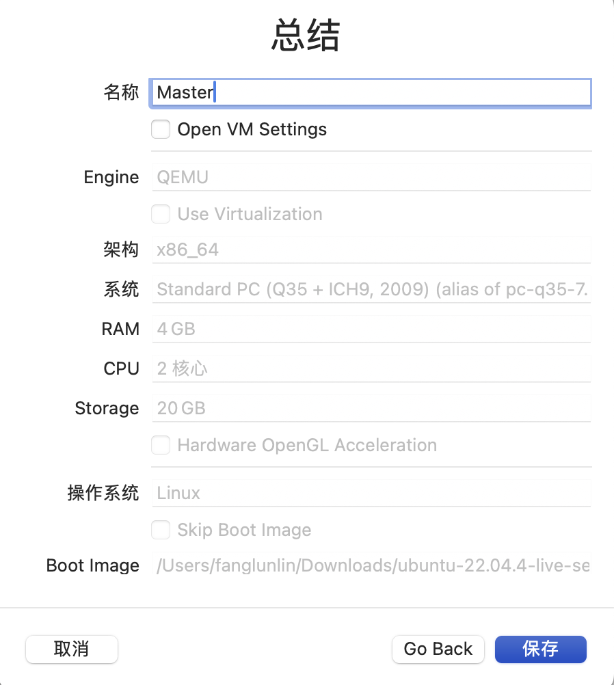

2. **配置虚拟机**：

   - 统一设置主机名为lfl

   - 设置用户名为 master、slave1、slave2

     ```shell
     $ vi /etc/hostname
     ```

   - 关于文件存放

     - 软件目录：~/package

     - 安装目录：~/install

3. **网络配置**：

   - 设置静态 IP 地址：

     - master：10.211.55.22
     - slave1：10.211.55.32
     - slave2：10.211.55.36

   - 修改`/etc/hosts`文件，添加节点 IP 与主机名映射（所有节点均设置）

     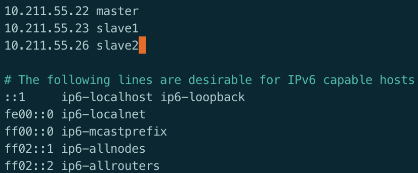

### 3.2 SSH 及免密登录配置

1. 创建 SSH 密钥：在 master 节点执行以下命令

   ```bash
   cd ~
   mkdir .ssh
   cd .ssh
   ssh-keygen -t rsa
   ```

   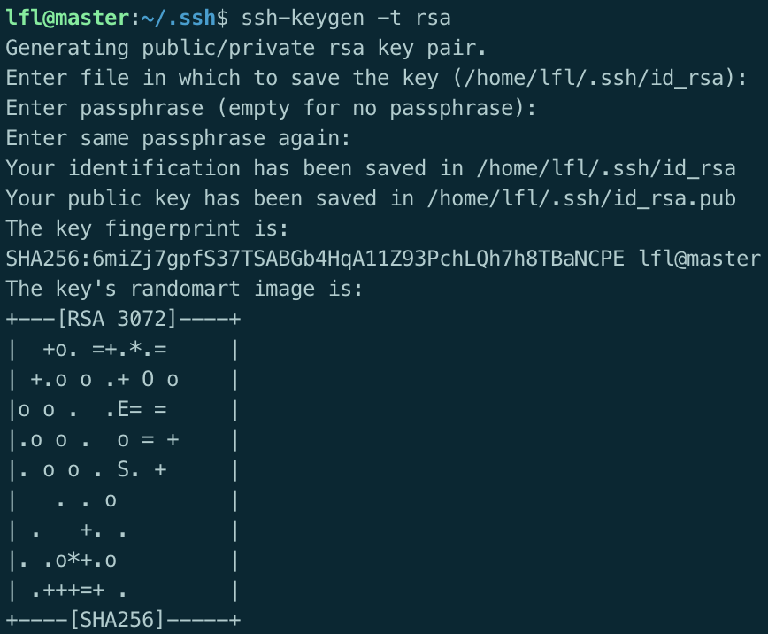

2. 配置免密登录：将 master 的公钥复制到 slave 节点

   ```bash
   ssh-copy-id -i ~/.ssh/id_rsa.pub master
   ssh-copy-id -i ~/.ssh/id_rsa.pub slave1
   ssh-copy-id -i ~/.ssh/id_rsa.pub slave2
   ```

   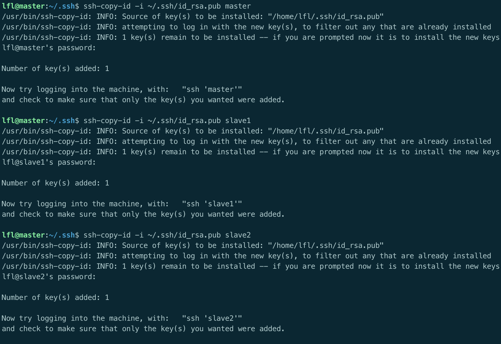

3. 验证免密登录：在 master 节点尝试登录 slave1

   ```shell
   ssh slave1
   ```

   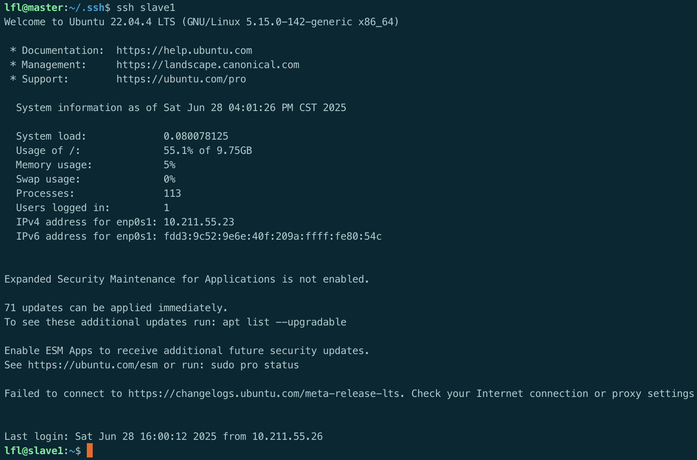

4. slave1、slave2节点重复同样操作，所有节点两两之间进行ssh免密钥配置3.3 JDK 环境搭建

### 3.3 JDK 环境搭建

1. 解压 JDK：将下载好的 [JDK 安装包](https://www.oracle.com/java/technologies/javase/javase8-archive-downloads.html)解压到指定目录

   ```bash
   sudo tar -zxvf jdk-8u151-linux-x64.tar.gz -C ~/install
   ```

2. 配置环境变量：

   修改文件

   ```
   /etc/profile
   ```

   ```bash
   export JAVA_HOME=/home/hadoop/install/jdk1.8.0_151
   export JRE_HOME=$JAVA_HOME/jre
   export CLASSPATH=.:$JAVA_HOME/lib:$JRE_HOME/lib
   export PATH=$PATH:$JAVA_HOME/bin:$JRE_HOME/bin
   ```

   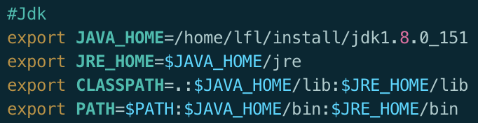

3. 使配置生效：

   ```bash
   source /etc/profile
   ```

4. 验证安装：

   ```bash
   java -version
   ```

   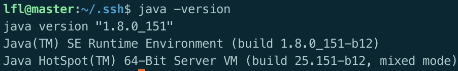

5. 将文件夹scp到其它节点服务器上（下示为slave1，slave2同理）

   ```shell
   $ scp -r ~/install/jdk1.8.0_151 $(用户名)@slave1:~/install/jdk1.8.0_151
   ```

6. 将环境变量scp到其它节点服务器上（下示为slave1，slave2同理）

   ```shell
   $ sudo scp /etc/profile $(用户名)@slave1:/etc
   ```

### 3.4 Scala 环境搭建

1. 解压 Scala：将下载好的 [Scala 安装包](https://www.scala-lang.org/download/2.11.8.html)解压到指定目录

   ```bash
   sudo tar -zxvf scala-2.11.8.tgz -C ~/install
   ```

2. 配置环境变量：

   修改文件

   ```
   /etc/profile
   ```

   ```bash
   export SCALA_HOME=/home/hadoop/install/scala-2.11.8
   export PATH=$PATH:$SCALA_HOME/bin
   ```

   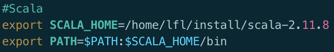

3. 使配置生效：

   ```bash
   source /etc/profile
   ```

4. 验证安装：

   ```bash
   scala -version
   ```
   
   

5. 将文件夹scp到其它节点服务器上（下示为slave1，slave2同理）

   ```shell
   $ scp -r ~/install/jdk1.8.0_151 $(用户名)@slave1:~/install/scala-2.11.8
   ```

6. 将环境变量scp到其它节点服务器上（下示为slave1，slave2同理）

   ```shell
   $ sudo scp /etc/profile $(用户名)@slave1:/etc
   ```

### 3.5 Hadoop 环境搭建

1. 解压 Hadoop：将下载好的 [Hadoop 安装包](https://dlcdn.apache.org/hadoop/common/hadoop-2.10.2/)解压到指定目录

   ```bash
   tar -zxvf hadoop-2.7.1.tar.gz -C ~/install
   ```

2. 修改配置文件（**hadoop安装目录的/etc/hadoop目录下**）：

   

   1. `core-site.xml`：设置 HDFS 默认地址和临时目录

      ```xml
      <configuration>
      　　<property>
      　　　　<name>fs.default.name</name>
      　　　　<value>hdfs://master:9000</value>
      　　</property>
      　　<property>
      　　　　<name>hadoop.tmp.dir</name>
      　　　　<value>file:/home/lfl/hadoop/tmp</value>
      　　</property>
      </configuration>
      ```

      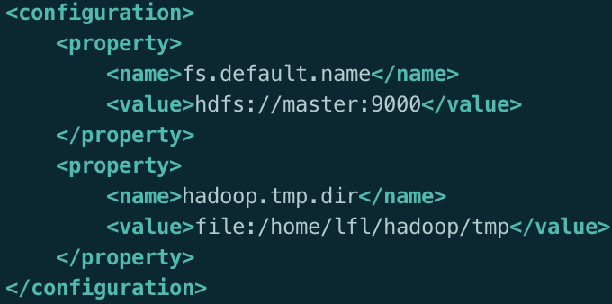
   2. `hdfs-site.xml`：设置 NameNode 和 DataNode 数据存储目录

      ```xml
      <configuration>
      　　<property>
      　　　　<name>dfs.namenode.name.dir</name>
      　　　　<value>file:/home/lfl/install/hadoop-2.7.1/tmp/dfs/name</value>
      	 </property>
      　　<property>
      　　　　<name>dfs.datanode.data.dir</name>
      　　　　<value>file:/home/lfl/install/hadoop-2.7.1/tmp/dfs/data</value>
      　　</property>
      　　<property>
      　　　　<name>dfs.namenode.secondary.http-address</name>
      　　　　<value>master:9001</value>
      　　</property>
      　　<property>
      　　　　<name>dfs.replication</name>
      　　　　<value>2</value>
      　　</property>
      </configuration>
      ```

      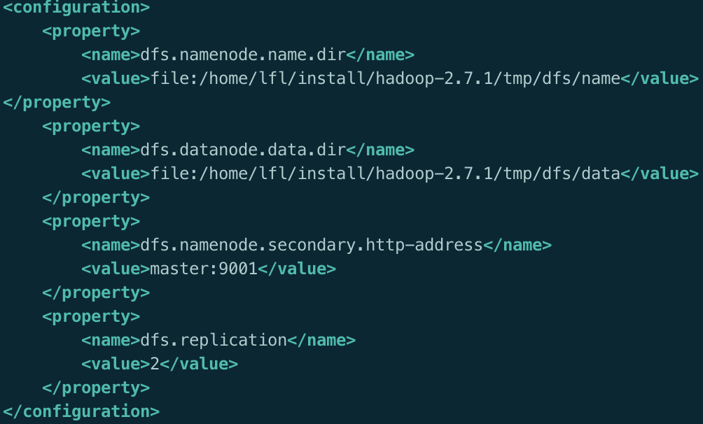
   3. `mapred-site.xml`：配置 MapReduce 框架为 YARN

      （实验中使用的是旧版Hadoop，需要`cp mapred-site.xml.template mapred-site.xml`将文件复制后修改）

      ```xml
      <configuration>
      　　<property>
      　　　　<name>mapreduce.framework.name</name>
      　　　　<value>yarn</value>
      　　</property>
      　　<property>
      　　　　<name>mapreduce.jobhistory.address</name>
      　　　　<value>master:10020</value>
      　　</property>
      　　<property>
      　　　　<name>mapreduce.jobhistory.webapp.address</name>
      　　　　<value>master:19888</value>
      		</property>
      </configuration>
      ```
   4. `yarn-site.xml`：设置 ResourceManager 主机名

      ```xml
      <configuration>
      　　<property>
      　　　　<name>yarn.resourcemanager.hostname</name>
      　　　　<value>master</value>
      　　</property>
      　　<property>
      　　　　<name>yarn.nodemanager.aux-services</name>
      　　　　<value>mapreduce_shuffle</value>
      　　</property>
      　　<property>
      　　　　<name>yarn.log-aggregation-enable</name>
      　　　　<value>true</value>
      　　</property>
      　　<property>
      　　　　<name>yarn.log-aggregation.retain-seconds</name>
      　　　　<value>604800</value>
      　　</property>
      </configuration>
      ```
   5. `hadoop-env.sh`：指定 JAVA_HOME 路径

      ```sh
      export JAVA_HOME=/home/lfl/install/jdk1.8.0_151
      ```

      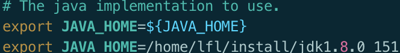
   6. `masters`：添加 master 节点列表

      ```
      master
      ```
   7. `slaves`：添加 slave 节点列表

      ```
      slave1
      slave2
      ```

      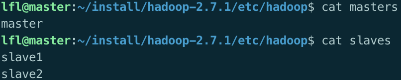

3. 配置环境变量：

   修改文件

   ```
   /etc/profile
   ```

   ```bash
   export HADOOP_HOME=/home/hadoop/install/hadoop-2.7.1
   export PATH=$PATH:$HADOOP_HOME/bin:$HADOOP_HOME/sbin
   ```

   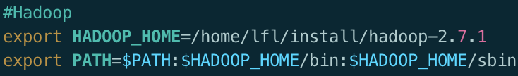

4. 将文件夹scp到其它节点服务器上（下示为slave1，slave2同理）

   ```shell
   $ scp -r ~/install/hadoop-2.7.1 lfl@slave1:~/install/hadoop-2.7.1
   ```

5. 将环境变量scp到其它节点服务器上（下示为slave1，slave2同理）

   ```shell
   $ sudo scp /etc/profile $(用户名)@slave1:/etc
   ```

6. 格式化 NameNode：

   ```bash
   hadoop namenode -format
   ```

   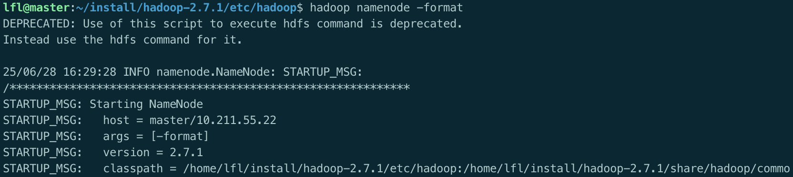

   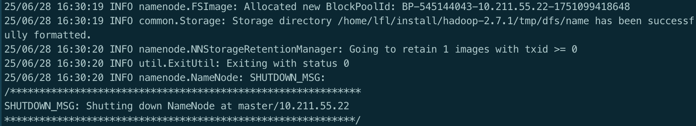

7. 启动 Hadoop 集群：

   ```bash
   start-all.sh
   ```

   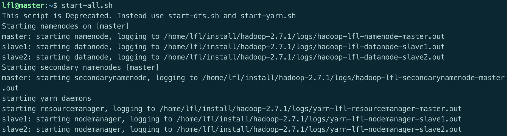

8. 验证集群：

   - 使用`jps`查看进程：

     - master:

       
     - slave:

       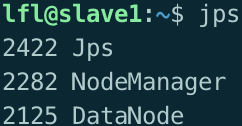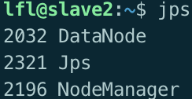
     - 可看到master节点：NameNode、SecondNameNode、ResourceManager
     - slave1~4节点：DataNode、NodeManager
   - 访问 Web 界面：http://10.211.55.22:50070

### 3.6 Zookeeper 环境搭建

1. 解压 Zookeeper：将下载好的 [Zookeeper 安装包](https://archive.apache.org/dist/zookeeper/zookeeper-3.4.10/)解压到指定目录

   ```bash
   tar -zxvf zookeeper-3.4.10.tar.gz -C ~/install
   ```

2. 创建数据和日志目录：

   ```bash
   mkdir data
   mkdir logs
   ```

3. 创建配置文件

   ```shell
   $ cd /home/lfl/install/zookeeper-3.4.10/conf
   $ cp zoo_sample.cfg zoo.cfg
   ```

4. 配置 zoo.cfg：设置 tickTime、dataDir、clientPort 等参数，并添加集群节点配置

   ```ini
   tickTime=2000
   initLimit=10
   syncLimit=5
   dataDir=/home/lfl/install/zookeeper-3.4.10/data 
   dataLogDir=/home/lfl/install/zookeeper-3.4.10/logs
   clientPort=2181
   server.1=master:2888:3888
   server.2=slave1:2888:3888
   server.3=slave2:2888:3888
   server.4=slave3:2888:3888
   server.5=slave4:2888:3888
   ```

   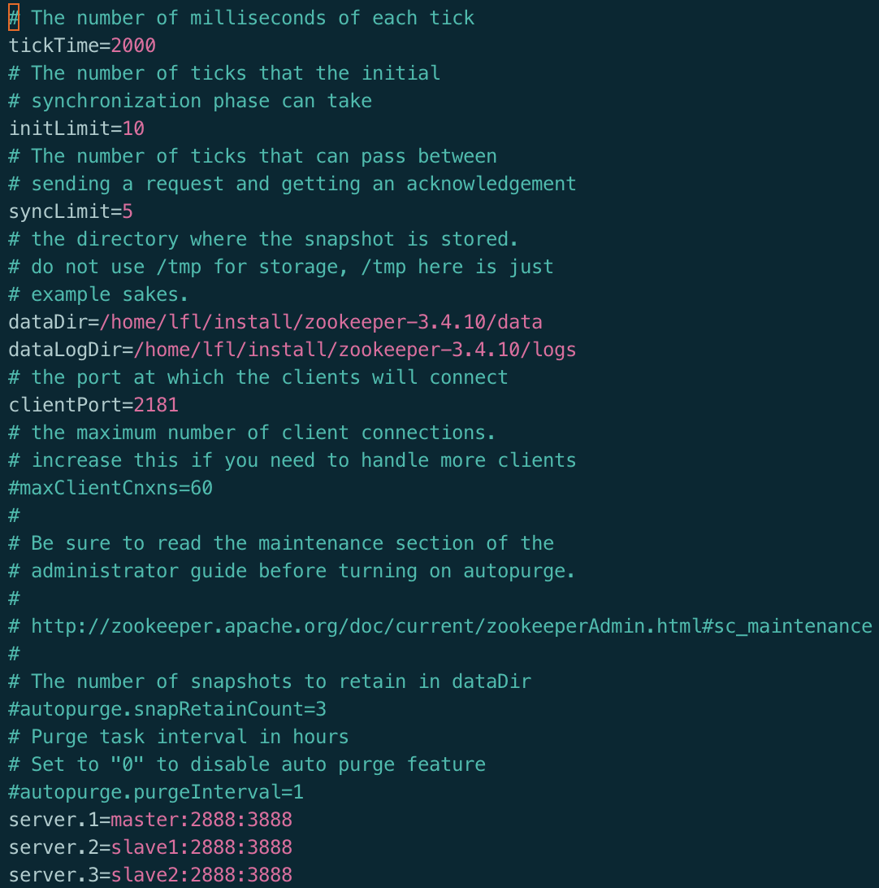

5. 配置 myid：在 data 目录下创建 myid 文件，master 节点为 1，slave1 为 2，slave2 为 3

   ```shell
   $ cd /home/lfl/install/zookeeper-3.4.10/data
   $ echo '1' > myid
   ```

6. 启动 Zookeeper（**所有节点都需要启动**）：

   ```shell
   cd /home/lfl/install/zookeeper-3.4.10/bin
   ./zkServer.sh start
   ```

   

7. 查看进程：

   `jps`

   确认所有节点都存在 QuorumPeerMain 进程

   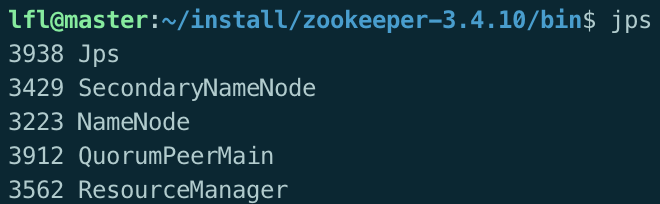

   

   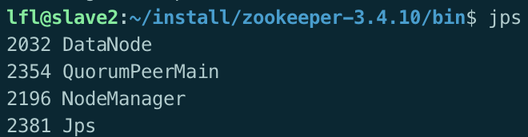


### 3.7 HBase 环境搭建

1. 解压 HBase：将下载好的 [HBase 安装包](https://archive.apache.org/dist/hbase/1.2.1/)解压到指定目录

   ```bash
   tar -zxvf hbase-1.2.1-bin.tar.gz -C ~/install
   ```

2. 修改配置文件（**hbase的配置目录下**）：

   ```shell
   cd /home/lfl/install/hbase-1.2.1/conf
   ```

   1. `hbase-env.sh`：指定 JAVA_HOME，设置 HBASE_MANAGES_ZK 为 false

      添加以下内容

      ```sh
      export JAVA_HOME=/home/lfl/install/jdk1.8.0_151
      export HBASE_MANAGES_ZK=false
      export HBASE_CLASSPATH=/home/lfl/install/hbase-1.2.1/conf
      ```

      注释掉以下行：

      ```sh
      #export HBASE_MASTER_OPTS="$HBASE_MASTER_OPTS -XX:PermSize=128m -XX:MaxPermSize=128m"
      #export HBASE_REGIONSERVER_OPTS="$HBASE_REGIONSERVER_OPTS -XX:PermSize=128m -XX:MaxPermSize=128m"
      ```

      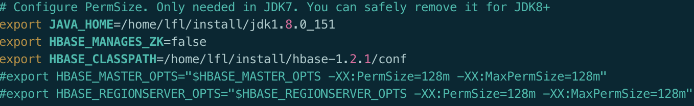
   2. `hbase-site.xml`：配置 HBase 根目录和 Zookeeper 集群

      ```xml
      <configuration>
      <property> 
      　　　　<name>hbase.rootdir</name> 
      　　　　<value>hdfs://master:9000/hbase</value> 
      　　</property> 
      　　<property> 
      　　　　<name>hbase.cluster.distributed</name> 
      　　　　<value>true</value> 
      　　</property> 
      <property>
                    <name>hbase.master</name>
                    <value>master:6000</value>
            </property>
      <property> 
      　　　　<name>hbase.zookeeper.quorum</name> 
      　　　　<value>master</value> 
      　　</property> 
      <property> 
      　　　　<name>hbase.zookeeper.property.dataDir</name> 
      　　　　<value>/home/hadoop/install/zookeeper-3.4.10/data</value> 
      　　</property>
      </configuration>
      ```

      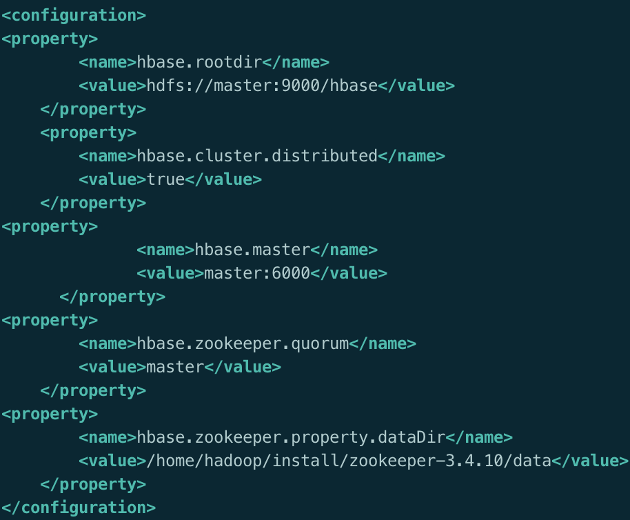
   3. `regionservers`：添加 slave 节点列表

      ```
      slave1
      slave2
      slave3
      slave4
      ```

      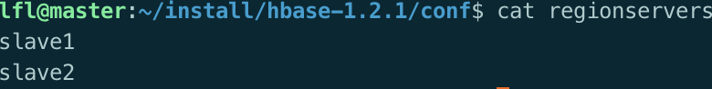

3. 在hadoop 分布式文件系统 HDFS 创建 HBase 目录：

   ```shell
   hadoop fs -mkdir /hbase
   ```

   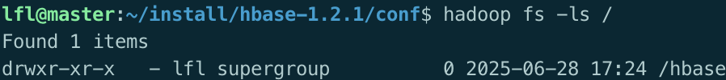

4. 配置环境变量：

   修改文件

   ```
   /etc/profile
   ```

   ```bash
   export HBASE_HOME=/home/lfl/install/hbase-1.2.1
   export PATH=$PATH:$HBASE_HOME/bin
   ```

   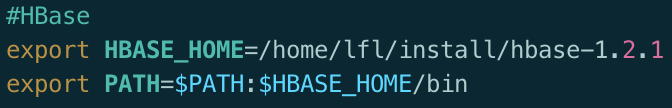

5. 将文件夹scp到其它节点服务器上（下示为slave1，slave2同理）

   ```shell
   $ scp -r ~/install/hbase-1.2.1 lfl@slave1:~/install/hbase-1.2.1
   ```

6. 将环境变量scp到其它节点服务器上（下示为slave1，slave2同理）

   ```shell
   $ sudo scp /etc/profile $(用户名)@slave1:/etc
   ```

7. 启动 HBase：

   ```bash
   start-hbase.sh
   ```

   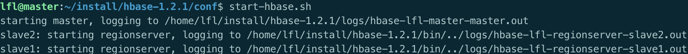

8. 查看进程：

   `jps`

   确认master节点有HMaster进程，slave1~2有HRegionServer进程

   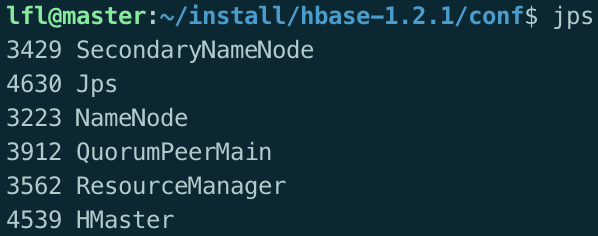

   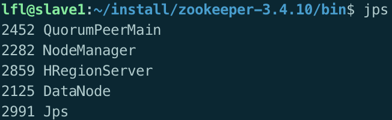

   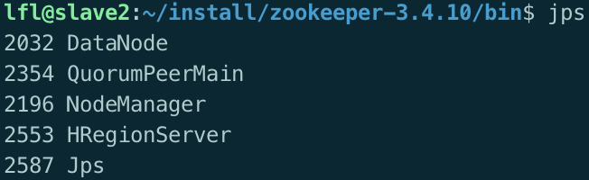

### 3.8 Spark 环境搭建

1. 解压 Spark：将下载好的 [Spark 安装包](https://archive.apache.org/dist/spark/spark-2.2.0/)解压到指定目录

   ```bash
   tar -xzvf spark-2.2.0-bin-hadoop2.7.tgz -C ~/install
   ```

2. 修改配置文件（**spark的配置目录下**）

   ```shell
   $ cd /home/lfl/install/spark-2.2.0-bin-hadoop2.7/conf
   ```

   修改`workers.template`、`spark-env.sh.template`、`spark-defaults.conf.template`文件的文件名（**对于旧版spark，workers.template对应slaves.template，workers对应slaves**）

   ```shell
   $ mv workers.template workers
   
   $ mv spark-env.sh.template spark-env.sh
   
   $ mv spark-defaults.conf.template spark-defaults.conf
   ```

   1. `spark-env.sh`：指定 JAVA_HOME、SCALA_HOME、HADOOP_HOME

      ```sh
      export JAVA_HOME=/home/$(用户名)/install/jdk1.8.0_151
      export SCALA_HOME=/home/$(用户名)/install/scala-2.11.8
      export HADOOP_HOME=/home/$(用户名)/install/hadoop-2.7.1
      export HADOOP_CONF_DIR=/home/$(用户名)/install/hadoop-2.7.1/etc/hadoop
      
      SPARK_MASTER_IP=master
      SPARK_WORKER_MEMORY=1024m
      ```

      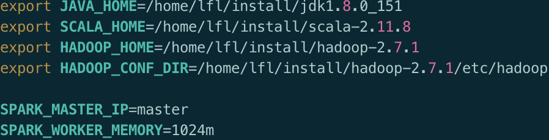
   2. `slaves`：添加 slave 节点列表

      ```
      slave1
      slave2
      ```

      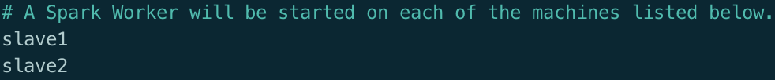
   3. `spark-defaults.conf`：设置 Spark master 地址

      ```conf
      spark.master    spark://master:7077
      ```

      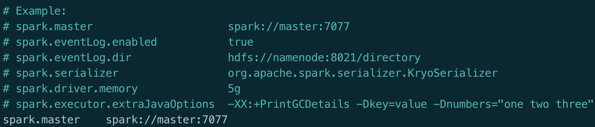

3. 配置环境变量：

   修改文件

   ```
   /etc/profile
   ```

   ```bash
   export SPARK_HOME=/home/lfl/install/spark-2.2.0-bin-hadoop2.7
   export PATH=$PATH:$SPARK_HOME/bin
   ```

   

4. 将文件夹scp到其它节点服务器上（下示为slave1，slave2同理）

   ```shell
   scp -r ~/install/spark-2.2.0-bin-hadoop2.7 $(用户名)@slave1:~/install/spark-2.2.0-bin-hadoop2.7
   ```

5. 将环境变量scp到其它节点服务器上（下示为slave1，slave2同理）

   ```shell
   $ sudo scp /etc/profile $(用户名)@slave1:/etc
   ```

6. 启动 Spark

   ```bash
   cd /home/lfl/install/spark-2.2.0-bin-hadoop2.7/sbin
   ./start-all.sh
   ```

7. 查看进程：

   `jps`

   确认 master节点有master进程，slave1~2有worker进程

   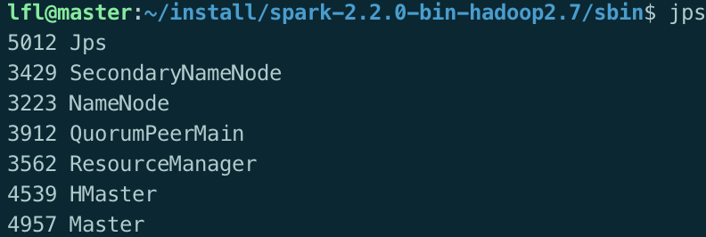

   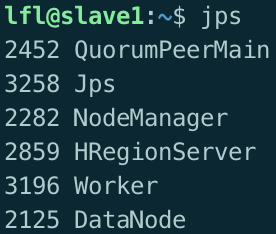

   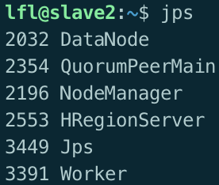

## 四、实验结果与验证

### 4.1 Hadoop 功能验证

1. 上传文件到 HDFS

   ```bash
   hdfs dfs -mkdir -p /user/hadoop/input
   hdfs dfs -put \
   ~/spark-data/file1 \
   ~/spark-data/file2 \
   ~/spark-data/file3 \
   ~/spark-data/file4 \
   ~/spark-data/file5 \
   /user/lfl/input/
   ```

2. 查看文件列表

   ```bash
   hdfs dfs -ls /user/lfl/input
   ```
   
   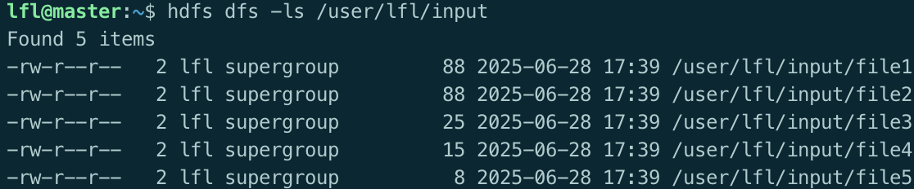

## 五、遇到的问题与解决方案

### 5.1 Hadoop 日志目录权限问题

- **问题描述**：启动 Hadoop 时提示无法创建日志目录

  ```
  java.io.IOException: Cannot create directory /home/lfl/install/hadoop-2.7.1/tmp/dfs/name/current
  ```

- **解决方案**：手动创建日志目录并设置权限

  ```bash
  sudo chmod -R 755 /home/lfl/install/hadoop-2.7.1/tmp/
  sudo chown -R lfl:lfl /home/lfl/install/hadoop-2.7.1/tmp/
  ```

### 5.2 SecondaryNameNode 未启动

- **问题描述**：jps 命令未显示 SecondaryNameNode 进程
- **解决方案**：检查 hdfs-site.xml 配置，确保 SecondaryNameNode 端口正确，重新启动 Hadoop 集群

## 六、实验总结

本次实验我完成了大数据开发环境的搭建，包括虚拟机配置、SSH 免密登录、JDK、Scala、Hadoop、Zookeeper、HBase 和 Spark 的安装与配置。成功验证了 Hadoop 的文件存储功能和 HBase 的表操作，为后续的大数据处理实验奠定了基础，在搭建过程中我遇到了一些权限、配置和依赖问题，通过查阅文档和网上资料得以解决，加深了我对大数据组件工作原理的理解，未来可进一步学习各组件的高级配置和优化，以及如何在集群上运行实际的大数据处理任务。

**启动命令：**

Hadoop:

```shell
$ start-all.sh
```

Zookeeper:

```shell
$ cd /home/lfl/install/zookeeper-3.4.10/bin
$ ./zkServer.sh start
```

Hbase:

```shell
$ start-hbase.sh
```


Spark:

```shell
$ cd /home/lfl/install/spark-2.2.0-bin-hadoop2.7/sbin
$ ./start-all.sh
```
