# 作业三 

## 一、实验目的

通过使用 Java API，实现hadoop、hbase的常见操作，包括**在Hadoop分布式文件管理系统上创建文件、删除文件、上传文件、读取文件内容，在Hbase分布式数据库上创建表、列族、插入删除数据等**，从而加深对分布式计算框架和分布式数据库的理解和应用能力。

## 二、实验环境

- 操作系统：Ubuntu 22.04 LTS
- 虚拟机：UTM
- 集群节点：1 个 master 节点，2 个 slave 节点（slave1, slave2）
- 网络配置：静态 IP 地址
- 软件版本：
  - Hadoop: 2.7.1
  - Hbase: 1.2.1
  - zookeeper: 3.4.10
  - jdk: 1.8.0_151

## 三、hdfs和hbase任务

### 3.1 使用Java API操作hdfs

所有操作都统一在一个源文件中`Hdfsop.java`中实现后编译，并打包成jar包，运行方法为：

`java -cp $(hadoop classpath):. Hdfsop <命令> <参数1> [参数2]`

例如：`java -cp $(hadoop classpath):. Hdfsop create /user/lfl/java/create.txt "hello hdfs"`

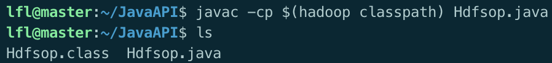

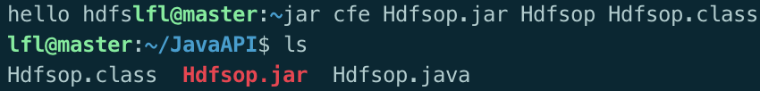

#### 3.1.1 在hdfs上创建文件

```java
// 创建文件 									Hadoop文件系统				文件路径 					文件内容
public static void createFile(FileSystem fs, String hdfsPath, String content) throws Exception {
	// 将字符串路径包装成 Hadoop 的 Path 对象
  Path path = new Path(hdfsPath);
  
  // 使用 try-with-resources 确保流会被自动关闭
  try (OutputStream out = fs.create(path)) {
    out.write(content.getBytes());
    System.out.println("文件已创建: " + hdfsPath);
  }
}
```

**运行结果：**

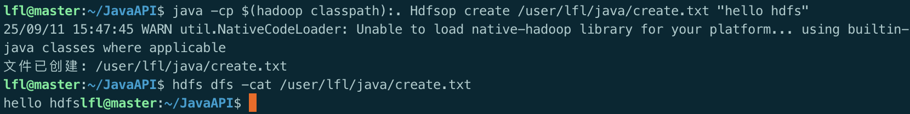

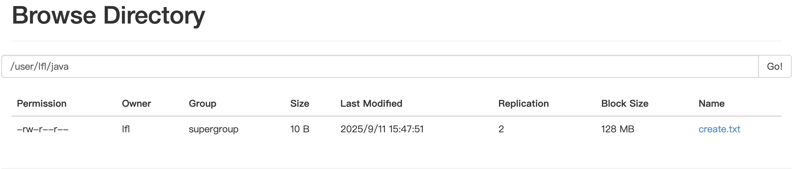

#### 3.1.2 删除hdfs上的文件

```java
// 删除文件
public static void deleteFile(FileSystem fs, String hdfsPath) throws Exception {
  Path path = new Path(hdfsPath);
  if (fs.exists(path)) {
    fs.delete(path, true);
    System.out.println("文件已删除: " + hdfsPath);
  } else {
    System.out.println("文件不存在: " + hdfsPath);
  }
}
```

**运行结果：**

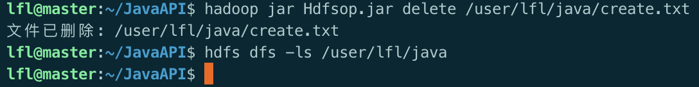

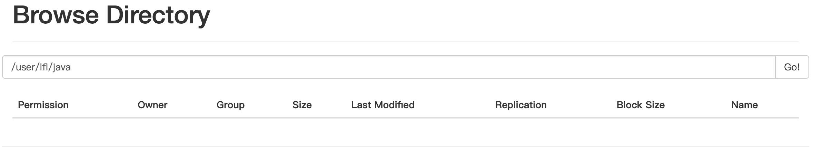

#### 3.1.3上传文件至hdfs

```java
// 上传本地文件
public static void uploadFile(FileSystem fs, String localPath, String hdfsPath) throws Exception {
  Path src = new Path(localPath);
  Path dst = new Path(hdfsPath);
  fs.copyFromLocalFile(src, dst);
  System.out.println("文件已上传: " + localPath + " -> " + hdfsPath);
}
```

在本地上创建文件`upload.txt`
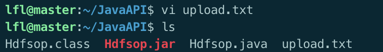

**运行结果：**

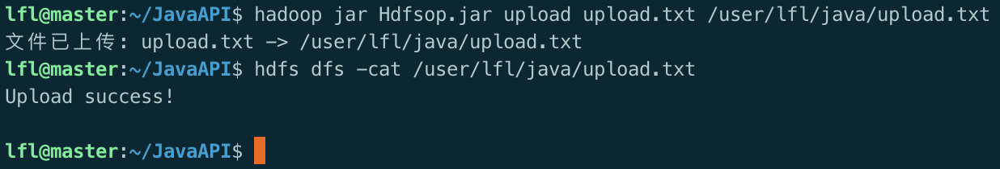


#### 3.1.4 读取文件内容

```java
// 读取 HDFS 文件
public static void readFile(FileSystem fs, String hdfsPath) throws Exception {
  Path path = new Path(hdfsPath);
  if (!fs.exists(path)) {
    System.out.println("文件不存在: " + hdfsPath);
    return;
  }
  try (BufferedReader br = new BufferedReader(new InputStreamReader(fs.open(path)))) {
    System.out.println("文件内容:");
    String line;
    while ((line = br.readLine()) != null) {
      System.out.println(line);
    }
  }
}
```

**运行结果：**

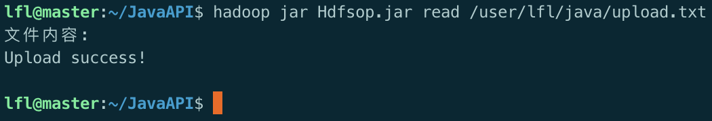

#### 3.1.5 完整代码

```java
import org.apache.hadoop.conf.Configuration;
import org.apache.hadoop.fs.FileSystem;
import org.apache.hadoop.fs.Path;
import java.io.*;

public class Hdfsop {

    // 创建文件
    public static void createFile(FileSystem fs, String hdfsPath, String content) throws Exception {
        Path path = new Path(hdfsPath);
        try (OutputStream out = fs.create(path)) {
            out.write(content.getBytes());
            System.out.println("文件已创建: " + hdfsPath);
        }
    }

    // 删除文件
    public static void deleteFile(FileSystem fs, String hdfsPath) throws Exception {
        Path path = new Path(hdfsPath);
        if (fs.exists(path)) {
            fs.delete(path, true);
            System.out.println("文件已删除: " + hdfsPath);
        } else {
            System.out.println("文件不存在: " + hdfsPath);
        }
    }

    // 上传本地文件
    public static void uploadFile(FileSystem fs, String localPath, String hdfsPath) throws Exception {
        Path src = new Path(localPath);
        Path dst = new Path(hdfsPath);
        fs.copyFromLocalFile(src, dst);
        System.out.println("文件已上传: " + localPath + " -> " + hdfsPath);
    }

    // 读取 HDFS 文件
    public static void readFile(FileSystem fs, String hdfsPath) throws Exception {
        Path path = new Path(hdfsPath);
        if (!fs.exists(path)) {
            System.out.println("文件不存在: " + hdfsPath);
            return;
        }
        try (BufferedReader br = new BufferedReader(new InputStreamReader(fs.open(path)))) {
            System.out.println("文件内容:");
            String line;
            while ((line = br.readLine()) != null) {
                System.out.println(line);
            }
        }
    }

    public static void main(String[] args) throws Exception {
        if (args.length < 1) {
            System.out.println("用法: java Hdfsop <command> [args...]");
            System.out.println("命令列表:");
            System.out.println("  create <hdfsPath> <content>");
            System.out.println("  delete <hdfsPath>");
            System.out.println("  upload <localPath> <hdfsPath>");
            System.out.println("  read <hdfsPath>");
            System.exit(1);
        }

        Configuration conf = new Configuration();
        conf.set("fs.defaultFS", "hdfs://master:9000");
        FileSystem fs = FileSystem.get(conf);

        String command = args[0];
        switch (command) {
            case "create":
                if (args.length != 3) {
                    System.out.println("用法: create <hdfsPath> <content>");
                    return;
                }
                createFile(fs, args[1], args[2]);
                break;

            case "delete":
                if (args.length != 2) {
                    System.out.println("用法: delete <hdfsPath>");
                    return;
                }
                deleteFile(fs, args[1]);
                break;

            case "upload":
                if (args.length != 3) {
                    System.out.println("用法: upload <localPath> <hdfsPath>");
                    return;
                }
                uploadFile(fs, args[1], args[2]);
                break;

            case "read":
                if (args.length != 2) {
                    System.out.println("用法: read <hdfsPath>");
                    return;
                }
                readFile(fs, args[1]);
                break;

            default:
                System.out.println("未知命令: " + command);
        }

        fs.close();
    }
}

```


### 3.2 使用Java API操作hbase

所有操作都统一在一个源文件中`HBaseop.java`中实现后编译，并打包成jar包，运行方法为：

`java -cp "$(hbase classpath):$(hadoop classpath):HBaseop.jar" HBaseop <命令> <参数1> [参数2]`

例如：`java -cp "$(hbase classpath):$(hadoop classpath):HBaseop.jar" HBaseop createTable student info score`

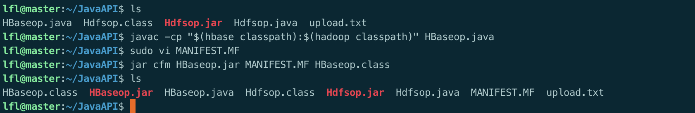

#### 3.2.1 创建表、列族

```java
public static void createTable(Admin admin, String tableName, String... familyNames) throws Exception {
  TableName tName = TableName.valueOf(tableName);

  if (admin.tableExists(tName)) {
    System.out.println("表已存在: " + tableName);
    return;
  }

  HTableDescriptor tableDescriptor = new HTableDescriptor(tName);

  for (String family : familyNames) {
    HColumnDescriptor columnDescriptor = new HColumnDescriptor(family);
    tableDescriptor.addFamily(columnDescriptor);
  }

  admin.createTable(tableDescriptor);
  System.out.println("表已创建: " + tableName + "，列族: " + String.join(",", familyNames));
}
```

**运行结果：**


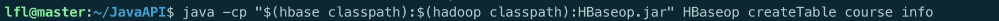


访问http://master:16010查看创建的表信息：

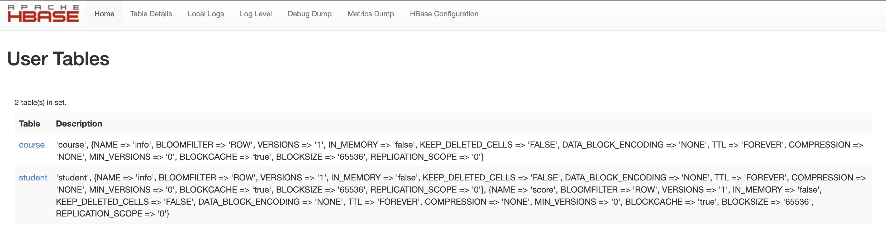

使用`habse shell`命令查看：


#### 3.2.2 插入数据

```java
public static void insertData(Connection connection, String tableName, String rowKey,
                              String family, String column, String value) throws Exception {
  try (Table table = connection.getTable(TableName.valueOf(tableName))) {
    Put put = new Put(Bytes.toBytes(rowKey));
    put.addColumn(Bytes.toBytes(family), Bytes.toBytes(column), Bytes.toBytes(value));
    table.put(put);
    System.out.println("插入成功: " + rowKey + " -> " + family + ":" + column + "=" + value);
  }
}
```

**运行结果：**

在`student`表的列族`info`插入列`name`，值为`Alice`，键值为`1`：

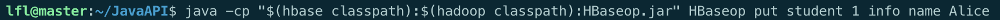


在`student`表的列族`score`插入列`math`，值为`95`，键值为`2`：


同样插入多条数据后,使用`hbase shell`命令扫描全表：

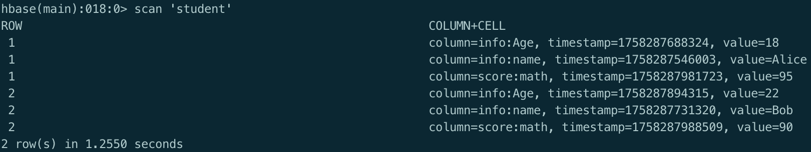

####  查询数据

```java
public static void getData(Connection connection, String tableName, String rowKey) throws Exception {
  try (Table table = connection.getTable(TableName.valueOf(tableName))) {
    Get get = new Get(Bytes.toBytes(rowKey));
    Result result = table.get(get);
    if (result.isEmpty()) {
      System.out.println("未找到数据: " + rowKey);
    } else {
      result.listCells().forEach(cell -> {
        String family = Bytes.toString(cell.getFamilyArray(), cell.getFamilyOffset(), cell.getFamilyLength());
        String qualifier = Bytes.toString(cell.getQualifierArray(), cell.getQualifierOffset(), cell.getQualifierLength());
        String value = Bytes.toString(cell.getValueArray(), cell.getValueOffset(), cell.getValueLength());
        System.out.println("row=" + rowKey + ", family=" + family + ", column=" + qualifier + ", value=" + value);
      });
    }
  }
}
```

**运行结果：**

在`student`表查询键值为`1`行：

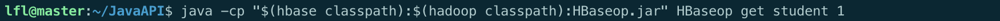

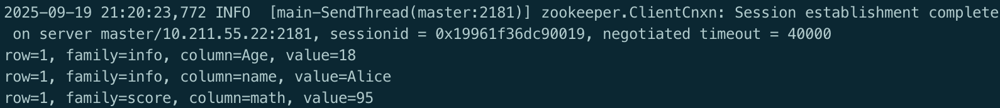

在`student`表查询键值为`2`的行：

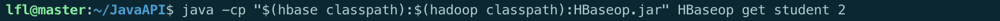

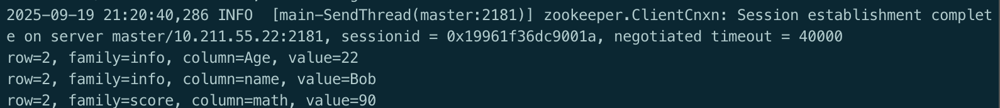

#### 3.2.5 删除数据

```java
public static void deleteData(Connection connection, String tableName, String rowKey) throws Exception {
  try (Table table = connection.getTable(TableName.valueOf(tableName))) {
    Delete delete = new Delete(Bytes.toBytes(rowKey));
    table.delete(delete);
    System.out.println("已删除: " + rowKey + " from " + tableName);
  }
}
```

**运行结果：**

在`student`表删除键值为`2`的行：


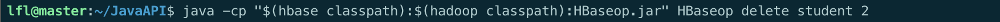


在`hbase shell`中再次扫描全表

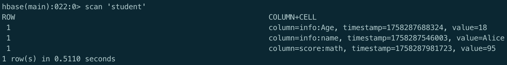

#### 完整代码

```java
import org.apache.hadoop.conf.Configuration;
import org.apache.hadoop.hbase.HBaseConfiguration;
import org.apache.hadoop.hbase.HColumnDescriptor;
import org.apache.hadoop.hbase.HTableDescriptor;
import org.apache.hadoop.hbase.TableName;
import org.apache.hadoop.hbase.client.*;
import org.apache.hadoop.hbase.util.Bytes;

public class HBaseop {

    public static void main(String[] args) throws Exception {
        if (args.length < 1) {
            System.out.println("用法: java HBaseDemo <command> [args...]");
            System.out.println("命令列表:");
            System.out.println("  createTable <tableName> <familyName>");
            System.out.println("  put <tableName> <rowKey> <family> <column> <value>");
            System.out.println("  get <tableName> <rowKey>");
            System.out.println("  delete <tableName> <rowKey>");
            System.exit(1);
        }

        String command = args[0];
        Configuration conf = HBaseConfiguration.create();

        conf.set("hbase.zookeeper.quorum", "master");
        conf.set("hbase.zookeeper.property.clientPort", "2181");

        try (Connection connection = ConnectionFactory.createConnection(conf);
             Admin admin = connection.getAdmin()) {

            switch (command) {
                case "createTable":
                    if (args.length < 3) {
                        System.out.println("用法: createTable <tableName> <family1> [family2] [family3] ...");
                        return;
                    }
                    String tableName = args[1];
                    String[] families = new String[args.length - 2];
                    System.arraycopy(args, 2, families, 0, families.length);
                    createTable(admin, tableName, families);
                    break;

                case "put":
                    if (args.length != 6) {
                        System.out.println("用法: put <tableName> <rowKey> <family> <column> <value>");
                        return;
                    }
                    insertData(connection, args[1], args[2], args[3], args[4], args[5]);
                    break;

                case "get":
                    if (args.length != 3) {
                        System.out.println("用法: get <tableName> <rowKey>");
                        return;
                    }
                    getData(connection, args[1], args[2]);
                    break;

                case "delete":
                    if (args.length != 3) {
                        System.out.println("用法: delete <tableName> <rowKey>");
                        return;
                    }
                    deleteData(connection, args[1], args[2]);
                    break;

                default:
                    System.out.println("未知命令: " + command);
            }
        }
    }

    // 1. 创建表，支持多个列族
    public static void createTable(Admin admin, String tableName, String... familyNames) throws Exception {
        TableName tName = TableName.valueOf(tableName);

        if (admin.tableExists(tName)) {
            System.out.println("表已存在: " + tableName);
            return;
        }

        HTableDescriptor tableDescriptor = new HTableDescriptor(tName);

        for (String family : familyNames) {
            HColumnDescriptor columnDescriptor = new HColumnDescriptor(family);
            tableDescriptor.addFamily(columnDescriptor);
        }

        admin.createTable(tableDescriptor);
        System.out.println("表已创建: " + tableName + "，列族: " + String.join(",", familyNames));
    }

    // 2. 插入数据
    public static void insertData(Connection connection, String tableName, String rowKey,
                                  String family, String column, String value) throws Exception {
        try (Table table = connection.getTable(TableName.valueOf(tableName))) {
            Put put = new Put(Bytes.toBytes(rowKey));
            put.addColumn(Bytes.toBytes(family), Bytes.toBytes(column), Bytes.toBytes(value));
            table.put(put);
            System.out.println("插入成功: " + rowKey + " -> " + family + ":" + column + "=" + value);
        }
    }

    // 3. 查询数据
    public static void getData(Connection connection, String tableName, String rowKey) throws Exception {
        try (Table table = connection.getTable(TableName.valueOf(tableName))) {
            Get get = new Get(Bytes.toBytes(rowKey));
            Result result = table.get(get);
            if (result.isEmpty()) {
                System.out.println("未找到数据: " + rowKey);
            } else {
                result.listCells().forEach(cell -> {
                    String family = Bytes.toString(cell.getFamilyArray(), cell.getFamilyOffset(), cell.getFamilyLength());
                    String qualifier = Bytes.toString(cell.getQualifierArray(), cell.getQualifierOffset(), cell.getQualifierLength());
                    String value = Bytes.toString(cell.getValueArray(), cell.getValueOffset(), cell.getValueLength());
                    System.out.println("row=" + rowKey + ", family=" + family + ", column=" + qualifier + ", value=" + value);
                });
            }
        }
    }

    // 4. 删除数据
    public static void deleteData(Connection connection, String tableName, String rowKey) throws Exception {
        try (Table table = connection.getTable(TableName.valueOf(tableName))) {
            Delete delete = new Delete(Bytes.toBytes(rowKey));
            table.delete(delete);
            System.out.println("已删除: " + rowKey + " from " + tableName);
        }
    }
}
```

## 四、实验总结

本次实验中，我成功使用 Java API 实现了对hdfs和hbase的各种操作，例如创建文件、删除文件、上传文件、读取文件内容等常见hdfs处理操作，以及在hbase中创建表和列族、插入数据、查询数据、删除数据等操作。

通过本次实验，我的分布式系统开发能力得到了显著提升，不仅掌握了 Java 提供的对hdfs和hbase的API，还学会了如何在集群环境中部署和调试应用程序。同时，也对分布式计算的优势和挑战有了更深入的理解，为今后进一步学习和应用大数据技术奠定了坚实的基础。在未来的学习和工作中，我将继续探索更多大数据处理技术和框架，不断提升自己的专业技能。