# 作业二 

## 一、实验目的

通过使用 Hadoop MapReduce 和 Spark 框架，实现数据处理的常见任务，包括**数据去重、数据排序、计算平均值和单表关联**，从而加深对分布式计算框架的理解和应用能力。

## 二、实验环境

- 操作系统：Ubuntu 22.04 LTS
- 虚拟机：UTM
- 集群节点：1 个 master 节点，2 个 slave 节点（slave1, slave2）
- 网络配置：静态 IP 地址
-  软件版本：
  - Hadoop: 2.7.1
  - Spark: 2.2.0
  - Scala：2.11.8

## 三、hadoop MapReduc任务

### 3.1 数据去重

#### 3.3.1 代码实现

```scala
import org.apache.hadoop.fs.Path
import org.apache.hadoop.io.{Text, NullWritable}
import org.apache.hadoop.mapreduce.{Job, Mapper, Reducer}
import org.apache.hadoop.mapreduce.lib.input.FileInputFormat
import org.apache.hadoop.mapreduce.lib.output.FileOutputFormat
import org.apache.hadoop.conf.Configuration

object DedupJob {

  // Mapper：直接输出每一行文本作为 key，value 是 NullWritable
  class DedupMapper extends Mapper[Object, Text, Text, NullWritable] {
    private val line = new Text()

    override def map(key: Object, value: Text, context: Mapper[Object, Text, Text, NullWritable]#Context): Unit = {
      if (value != null && value.toString.trim.nonEmpty) {
        line.set(value.toString.trim)
        context.write(line, NullWritable.get())
      }
    }
  }

  // Reducer：对每个唯一的 key（即原始行文本）只输出一次
  class DedupReducer extends Reducer[Text, NullWritable, Text, NullWritable] {
    override def reduce(key: Text, values: java.lang.Iterable[NullWritable],
                        context: Reducer[Text, NullWritable, Text, NullWritable]#Context): Unit = {
      // 只输出一次，达到去重目的
      context.write(key, NullWritable.get())
    }
  }

  // 主程序入口
  def main(args: Array[String]): Unit = {
    if (args.length < 2) {
      System.err.println("Usage: DedupJob <input1> [<input2> ...] <output>")
      System.exit(1)
    }

    val conf = new Configuration()
    val job = Job.getInstance(conf, "Scala Hadoop Dedup Job")

    job.setJarByClass(DedupJob.getClass)
    job.setMapperClass(classOf[DedupMapper])
    job.setReducerClass(classOf[DedupReducer])

    job.setOutputKeyClass(classOf[Text])
    job.setOutputValueClass(classOf[NullWritable])

    // 添加所有输入路径
    for (i <- 0 until args.length - 1) {
      FileInputFormat.addInputPath(job, new Path(args(i)))
    }

    // 设置输出路径
    FileOutputFormat.setOutputPath(job, new Path(args.last))

    // 提交作业并退出
    System.exit(if (job.waitForCompletion(true)) 0 else 1)
  }
}
```

#### 3.3.2 实验步骤

1. 在本地创建并编辑文件file1、file2：

   ```shell
   file1
   2012-3-1 a
   2012-3-2 b
   2012-3-3 c
   2012-3-4 d
   2012-3-5 a
   2012-3-6 b
   2012-3-7 c
   2012-3-3 c
   
   file2
   2012-3-1 b
   2012-3-2 a
   2012-3-3 b
   2012-3-4 d
   2012-3-5 a
   2012-3-6 c
   2012-3-7 d
   2012-3-3 c
   
   # 冗余数据
   2012-3-3 c
   2012-3-4 d
   2012-3-5 a
   ```

   使用命令`hdfs dfs -put file1 file2 \user\lfl\input\dedup`将文件上传到Hadoop集群（**路径内文件夹均已提前创建**），上传成功后通过访问`master:50070`Web页面查看：

   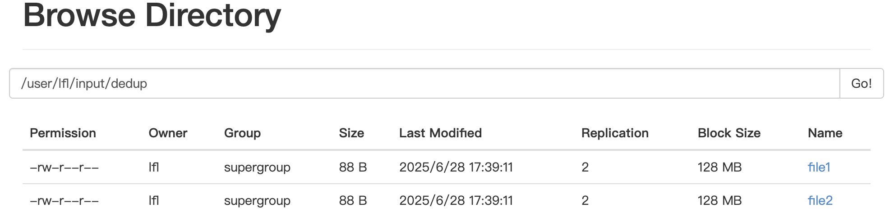

2. 编译打包代码成 JAR 文件

   实验过程已经把所有代码实现，因此四个源文件均一起编译并打包为`MapReduce-assembly-0.1.jar`，提交作业时只需选定相应的类，如下：

   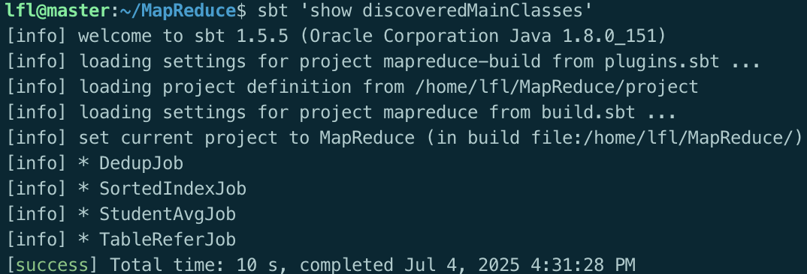

   后续任务直接在集群上运行作业

3. 在Hadoop集群上运行作业

   在工程根目录下使用命令

   ```shell
   hadoop jar target/scala-2.11/MapReduce-assembly-0.1.jar DedupJob \
     /user/lfl/input/dedup/file1 \
     /user/lfl/input/dedup/file2 \
     /user/lfl/output/mapreddedup_result
   ```

#### 3.1.3 实验结果

成功运行后可在Web页面查看输出文件是否存在:

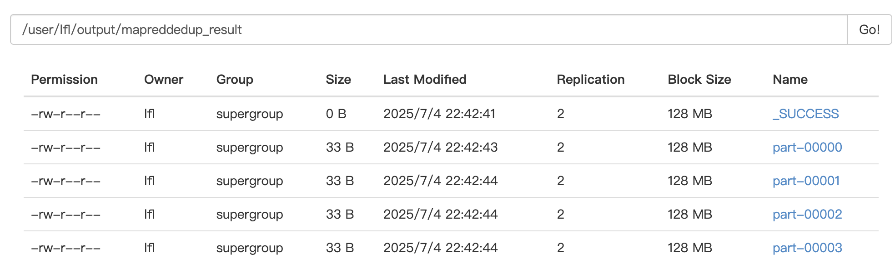

查看并验证输出结果

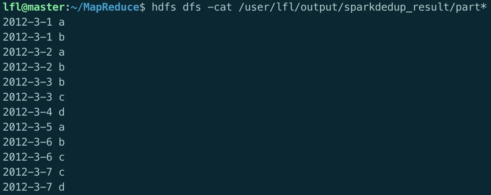

### 3.2 数据排序

#### 3.2.1 代码实现

```scala
import org.apache.hadoop.conf.Configuration
import org.apache.hadoop.fs.Path
import org.apache.hadoop.io.{IntWritable, LongWritable, Text}
import org.apache.hadoop.mapreduce.{Job, Mapper, Reducer}
import org.apache.hadoop.mapreduce.lib.input.FileInputFormat
import org.apache.hadoop.mapreduce.lib.output.FileOutputFormat

import java.lang.{Long => JLong}
import scala.collection.JavaConverters._

object SortedIndexJob {

  class SortMapper extends Mapper[LongWritable, Text, IntWritable, IntWritable] {
    private val num = new IntWritable()

    override def map(key: LongWritable, value: Text, context: Mapper[LongWritable, Text, IntWritable, IntWritable]#Context): Unit = {
      val line = value.toString.trim
      if (line.nonEmpty) {
        try {
          num.set(line.toInt)
          context.write(num, new IntWritable(1)) // 只使用 key 参与排序
        } catch {
          case _: NumberFormatException => // 忽略非法行
        }
      }
    }
  }

  class SortReducer extends Reducer[IntWritable, IntWritable, Text, IntWritable] {
  private var index = 1
  private val outputKey = new Text()

  override def reduce(key: IntWritable, values: java.lang.Iterable[IntWritable],
                      context: Reducer[IntWritable, IntWritable, Text, IntWritable]#Context): Unit = {
    for (_ <- values.iterator().asScala) {
      outputKey.set(index.toString)
      context.write(outputKey, key)
      index += 1
    }
  }
}

  def main(args: Array[String]): Unit = {
    if (args.length < 2) {
      System.err.println("Usage: SortedIndexJob <input1> [<input2> ...] <output>")
      System.exit(1)
    }

    val conf = new Configuration()
    val job = Job.getInstance(conf, "SortedIndexJob")

    job.setJarByClass(SortedIndexJob.getClass)
    job.setMapperClass(classOf[SortMapper])
    job.setReducerClass(classOf[SortReducer])

    job.setMapOutputKeyClass(classOf[IntWritable])
    job.setMapOutputValueClass(classOf[IntWritable])
    job.setOutputKeyClass(classOf[Text])
    job.setOutputValueClass(classOf[IntWritable])

    for (i <- 0 until args.length - 1) {
      FileInputFormat.addInputPath(job, new Path(args(i)))
    }
    FileOutputFormat.setOutputPath(job, new Path(args.last))

    System.exit(if (job.waitForCompletion(true)) 0 else 1)
  }
}
```

#### 3.2.2 实验步骤

1. 准备包含整数数据的输入文件

   在本地创建并编辑文件file3、file4、file5：

   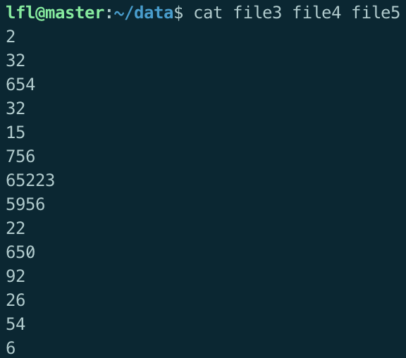

   使用命令`hdfs dfs -put file3 file4 file5 \user\lfl\input\sort`将文件上传到Hadoop集群（**路径内文件夹均已提前创建**），上传成功后通过访问`master:50070`Web页面查看：

   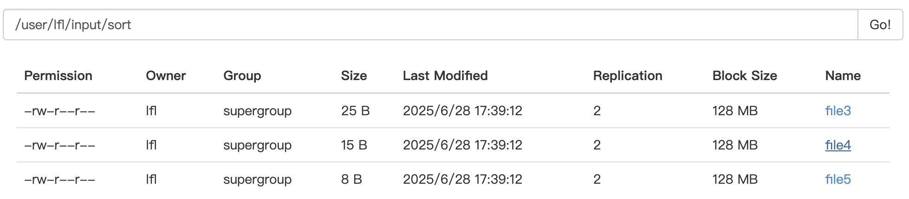

2. 在Hadoop集群上运行作业

   在工程根目录下使用命令

   ```shell
   hadoop jar target/scala-2.11/MapReduce-assembly-0.1.jar DedupJob \
     /user/lfl/input/sort/file3 \
     /user/lfl/input/sort/file4 \
     /user/lfl/input/sort/file5 \
     /user/lfl/output/mapredsorted_result
   ```

#### 3.2.3 实验结果

成功运行后可在Web页面查看输出文件是否存在

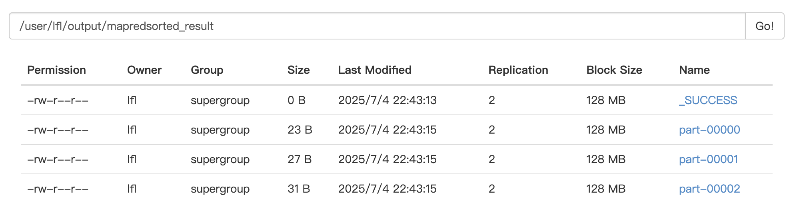

查看并验证输出结果

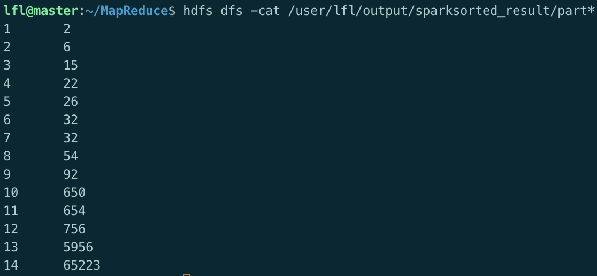

可观察到输出文件中的数据按升序排列

### 3.3 平均

#### 3.3.1 代码实现

```scala
import org.apache.hadoop.conf.Configuration
import org.apache.hadoop.fs.Path
import org.apache.hadoop.io.{IntWritable, Text}
import org.apache.hadoop.mapreduce.{Job, Mapper, Reducer}
import org.apache.hadoop.mapreduce.lib.input.FileInputFormat
import org.apache.hadoop.mapreduce.lib.output.FileOutputFormat

import scala.jdk.CollectionConverters._

object StudentAvgJob {

  // Mapper 输出：key 为学生名，value 为该科成绩
  class AvgMapper extends Mapper[Object, Text, Text, IntWritable] {
    private val name = new Text()
    private val scoreWritable = new IntWritable()

    override def map(key: Object, value: Text, context: Mapper[Object, Text, Text, IntWritable]#Context): Unit = {
      val line = value.toString.trim
      if (line.nonEmpty) {
        val parts = line.split("\\s+")
        if (parts.length == 2) {
          try {
            name.set(parts(0))
            scoreWritable.set(parts(1).toInt)
            context.write(name, scoreWritable)
          } catch {
            case _: NumberFormatException => // 忽略非法数据
          }
        }
      }
    }
  }

  // Reducer 输出：key 为学生名，value 为平均成绩
  class AvgReducer extends Reducer[Text, IntWritable, Text, IntWritable] {
    override def reduce(key: Text, values: java.lang.Iterable[IntWritable],
                        context: Reducer[Text, IntWritable, Text, IntWritable]#Context): Unit = {
      val scores = values.asScala.map(_.get)
      val sum = scores.sum
      val count = scores.size
      val avg = if (count > 0) sum / count else 0
      context.write(key, new IntWritable(avg))
    }
  }

  def main(args: Array[String]): Unit = {
    if (args.length < 2) {
      System.err.println("Usage: StudentAvgJob <input1> [<input2> ...] <output>")
      System.exit(1)
    }

    val conf = new Configuration()
    val job = Job.getInstance(conf, "Scala Hadoop StudentAvgJob")

    job.setJarByClass(this.getClass)
    job.setMapperClass(classOf[AvgMapper])
    job.setReducerClass(classOf[AvgReducer])

    job.setMapOutputKeyClass(classOf[Text])
    job.setMapOutputValueClass(classOf[IntWritable])
    job.setOutputKeyClass(classOf[Text])
    job.setOutputValueClass(classOf[IntWritable])

    // 多个输入路径
    for (i <- 0 until args.length - 1) {
      FileInputFormat.addInputPath(job, new Path(args(i)))
    }

    // 设置输出路径
    FileOutputFormat.setOutputPath(job, new Path(args.last))

    System.exit(if (job.waitForCompletion(true)) 0 else 1)
  }
}
```

#### 3.3.2 实验步骤

1. 准备包含学生姓名和成绩的数据文件，每行格式为 “姓名 成绩”。

   在本地创建并编辑文件math、chinese、english:

   ```shell
   # math
   张三 88
   李四 99
   王五 66
   赵六 77
   
   #chinese
   张三 78
   李四 89
   王五 96
   赵六 67
   
   #english
   张三 80
   李四 82
   王五 84
   赵六 86
   ```

   使用命令`hdfs dfs -put math chinese english \user\lfl\input\average`将文件上传到Hadoop集群（**路径内文件夹均已提前创建**），上传成功后通过访问`master:50070`Web页面查看：

   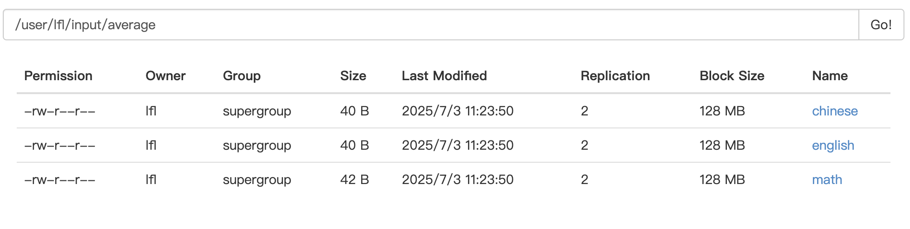

2. 在Hadoop集群上运行作业

   在项目根目录下运行命令

   ```shell
   hadoop jar target/scala-2.11/MapReduce-assembly-0.1.jar SortedIndexJob \
     /user/lfl/input/sort/math \
     /user/lfl/input/sort/chinese \
     /user/lfl/input/sort/english \
     /user/lfl/output/mapredaverage_result
   ```

#### 3.3.3 实验结果

运行成功后可在Web页面查看输出文件是否存在：


查看并验证运行结果：

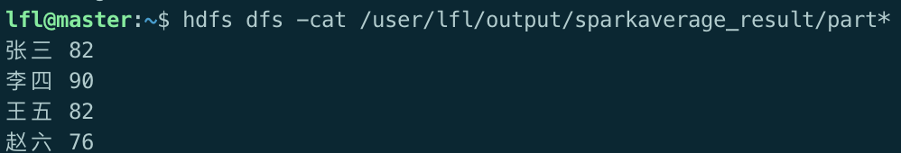

可观察到输出文件中包含每个学生的平均成绩，验证了计算平均功能。

### 3.4 单表关联

#### 3.4.1 代码实现

```scala
import org.apache.hadoop.conf.Configuration
import org.apache.hadoop.fs.Path
import org.apache.hadoop.io.{Text}
import org.apache.hadoop.mapreduce.{Job, Mapper, Reducer}
import org.apache.hadoop.mapreduce.lib.input.FileInputFormat
import org.apache.hadoop.mapreduce.lib.output.FileOutputFormat

import scala.jdk.CollectionConverters._

object TableReferJob {

  class RelationMapper extends Mapper[Object, Text, Text, Text] {
    override def map(key: Object, value: Text, context: Mapper[Object, Text, Text, Text]#Context): Unit = {
      val line = value.toString.trim
      if (line.nonEmpty && !line.startsWith("child")) { // 跳过表头
        val parts = line.split("\\s+")
        if (parts.length == 2) {
          val child = parts(0)
          val parent = parts(1)
          // 发出 parent -> child
          context.write(new Text(parent), new Text("C:" + child))
          // 发出 child -> parent
          context.write(new Text(child), new Text("P:" + parent))
        }
      }
    }
  }

  class RelationReducer extends Reducer[Text, Text, Text, Text] {
    override def reduce(key: Text, values: java.lang.Iterable[Text],
                        context: Reducer[Text, Text, Text, Text]#Context): Unit = {

      val grandchildren = scala.collection.mutable.ListBuffer[String]()
      val grandparents = scala.collection.mutable.ListBuffer[String]()

      for (v <- values.asScala) {
        if (v.toString.startsWith("C:")) {
          grandchildren += v.toString.substring(2)
        } else if (v.toString.startsWith("P:")) {
          grandparents += v.toString.substring(2)
        }
      }

      for (gc <- grandchildren; gp <- grandparents) {
        context.write(new Text(gc), new Text(gp))
      }
    }
  }

  def main(args: Array[String]): Unit = {
    if (args.length < 2) {
      System.err.println("Usage: TableReferJob <input1> [<input2> ...] <output>")
      System.exit(1)
    }

    val conf = new Configuration()
    val job = Job.getInstance(conf, "Scala Hadoop TableRefer Job")

    job.setJarByClass(this.getClass)
    job.setMapperClass(classOf[RelationMapper])
    job.setReducerClass(classOf[RelationReducer])

    job.setMapOutputKeyClass(classOf[Text])
    job.setMapOutputValueClass(classOf[Text])
    job.setOutputKeyClass(classOf[Text])
    job.setOutputValueClass(classOf[Text])

    // 添加输入路径
    for (i <- 0 until args.length - 1) {
      FileInputFormat.addInputPath(job, new Path(args(i)))
    }

    // 设置输出路径
    FileOutputFormat.setOutputPath(job, new Path(args.last))

    System.exit(if (job.waitForCompletion(true)) 0 else 1)
  }
}
```

#### 3.4.2 实验步骤

1. 准备包含亲子关系的数据文件，第一行为表头 “child parent”

   在本地创建并编辑文件child-parent:

   ```shell
   child	parent
   Tom	Lucy
   Tom	Jack
   Jone	Lucy
   Jone	Jack
   Lucy	Mary
   Lucy	Ben
   Jack	Alice
   Jack	Jesse
   Terry	Alice
   Terry	Jesse
   Philip	Terry
   Philip	Alma
   Mark	Terry
   Mark	Alma
   ```

   使用命令`hdfs dfs -put child-parent \user\lfl\input\tablerefer`将文件上传到Hadoop集群（**路径内文件夹均已提前创建**），上传成功后通过访问`master:50070`Web页面查看：

2. 在spark集群上运行作业

   在项目根目录下运行命令

   ```shell
   hadoop jar target/scala-2.11/MapReduce-assembly-0.1.jar tablereferJob \
     /user/lfl/input/tablerefer/child-parent \
     /user/lfl/output/mapredtablerefer_result
   ```

#### 3.4.3 实验结果

运行成功后可在Web页面查看输出文件是否存在：

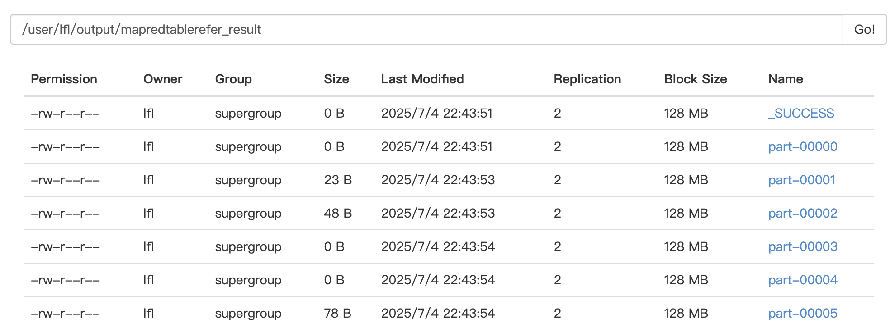

查看并验证运行结果：

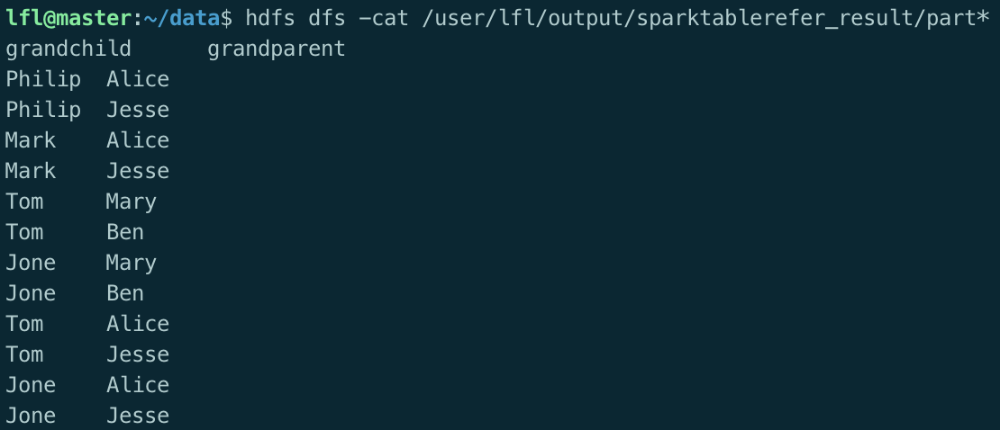

输出文件中包含每个孙子和祖父母的关系。

## 四、Spark任务

### 4.1 数据去重

#### 4.1.1 代码实现

```scala
import org.apache.spark.{SparkConf, SparkContext}

object SparkDedupJob {
  def main(args: Array[String]): Unit = {
    if (args.length < 2) {
      System.err.println("Usage: DedupApp <input1> [<input2> ... <inputN>] <output>")
      System.exit(1)
    }

    val output = args.last
    val inputPaths = args.slice(0, args.length - 1)

    val conf = new SparkConf().setAppName("DedupApp")
    val sc = new SparkContext(conf)

    val inputRDDs = inputPaths.map(path => sc.textFile(path))
    val mergedRDD = sc.union(inputRDDs)

    val result = mergedRDD.distinct().sortBy(x => x)

    result.saveAsTextFile(output)

    sc.stop()
  }
}
```

#### 4.1.2 实验步骤

1. 准备包含重复数据的输入文件

   在本地创建并编辑文件file1、file2：

   ```shell
   file1
   2012-3-1 a
   2012-3-2 b
   2012-3-3 c
   2012-3-4 d
   2012-3-5 a
   2012-3-6 b
   2012-3-7 c
   2012-3-3 c
   
   file2
   2012-3-1 b
   2012-3-2 a
   2012-3-3 b
   2012-3-4 d
   2012-3-5 a
   2012-3-6 c
   2012-3-7 d
   2012-3-3 c
   
   # 冗余数据
   2012-3-3 c
   2012-3-4 d
   2012-3-5 a
   ```

   使用命令`hdfs dfs -put file1 file2 \user\lfl\input\dedup`将文件上传到Hadoop集群（**路径内文件夹均已提前创建**），上传成功后通过访问`master:50070`Web页面查看：

   

2. 编译打包代码成 JAR 文件

   实验过程已经把所有代码实现，因此四个源文件均一起编译并打包为`sparkjob_2.11-0.1.jar`，提交作业时只需选定相应的类，如下：

   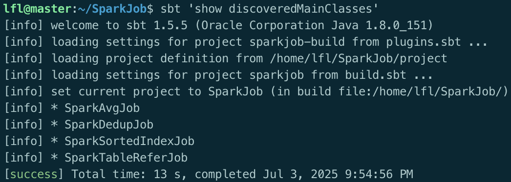

   后续任务直接在集群上运行作业

3. 在spark集群上运行作业

   在工程根目录下使用命令

   ```shell
   spark-submit \
     --class SparkDedupJob \
     --master spark://master:7077 \
     target/scala-2.11/sparkjob_2.11-0.1.jar \
     hdfs:/user/lfl/input/dedup/file1 \
     hdfs:/user/lfl/input/dedup/file2 \
     hdfs:/user/lfl/output/sparkdedup_result
   ```

#### 4.1.3 实验结果

成功运行后可在Web页面查看输出文件是否存在

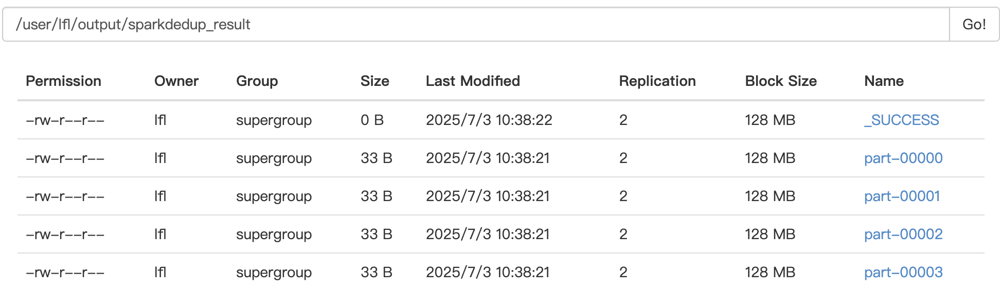

查看并验证输出结果


可以看到两个文件的重复数据均已删除，输出文件中只包含去重后的数据

### 4.2 数据排序

#### 4.1.1 代码实现

```scala
import org.apache.spark.sql.SparkSession

object SparkSortedIndexJob {
  def main(args: Array[String]): Unit = {
    if (args.length < 2) {
      System.err.println("Usage: SparkSortedIndexJob <input1> [<input2> ...] <output>")
      System.exit(1)
    }

    val inputPaths = args.slice(0, args.length - 1)
    val outputPath = args.last

    val spark = SparkSession.builder()
      .appName("Spark Sorted Index Job")
      .getOrCreate()

    val sc = spark.sparkContext

    // 读取多个输入路径并合并
    val inputRDD = sc.textFile(inputPaths.mkString(","))

    // 清理空行并尝试转换为 Int
    val numbersRDD = inputRDD
      .map(_.trim)
      .filter(_.nonEmpty)
      .flatMap(line =>
        try {
          Some(line.toInt)
        } catch {
          case _: NumberFormatException => None
        }
      )

    // 排序并 zip 上从 1 开始的索引
    val sortedIndexedRDD = numbersRDD
      .sortBy(num => num)
      .zipWithIndex()
      .map { case (value, idx) => (idx + 1, value) } // index 从 1 开始

    // 格式化为文本：index \t value
    val outputRDD = sortedIndexedRDD.map { case (index, value) => s"$index\t$value" }

    // 写入输出
    outputRDD.saveAsTextFile(outputPath)

    spark.stop()
  }
}
```

#### 4.2.2 实验步骤

1. 准备包含整数数据的输入文件

   在本地创建并编辑文件file3、file4、file5：

   

   使用命令`hdfs dfs -put file3 file4 file5 \user\lfl\input\sort`将文件上传到Hadoop集群（**路径内文件夹均已提前创建**），上传成功后通过访问`master:50070`Web页面查看：

   

2. 在spark集群上运行作业

   在工程根目录下使用命令

   ```shell
   spark-submit \
     --class SparkSortedIndexJob \
     --master spark://master:7077 \
     target/scala-2.11/sparkjob_2.11-0.1.jar \
     hdfs:/user/lfl/input/sort/file3 \
     hdfs:/user/lfl/input/sort/file4 \
     hdfs:/user/lfl/input/sort/file5 \
     hdfs:/user/lfl/output/sparksorted_result
   ```

#### 4.2.3 实验结果

运行成功后可在Web页面查看输出文件是否存在：

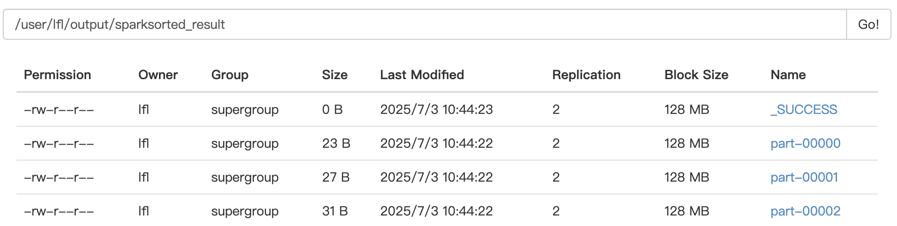

查看并验证运行结果：


可观察到输出文件中的数据按升序排列

### 4.3 平均

#### 4.3.1 代码实现

```scala
import org.apache.spark.sql.SparkSession

object SparkAvgJob {
  def main(args: Array[String]): Unit = {
    if (args.length < 2) {
      System.err.println("Usage: SparkAvgJob <input1> [<input2> ...] <output>")
      System.exit(1)
    }

    val inputPaths = args.slice(0, args.length - 1)
    val outputPath = args.last

    val spark = SparkSession.builder()
      .appName("SparkAvgJob")
      .getOrCreate()

    val sc = spark.sparkContext

    val inputRDD = sc.textFile(inputPaths.mkString(","))

    val cleanedRDD = inputRDD
      .map(_.replaceAll("[\\u00A0\\u2000-\\u200B\\u3000\\uFEFF]", " "))              // 替换全角空格
      .map(_.replaceAll("\\s+", " ").trim)            // 替换多个空格或 tab 为一个空格
      .filter(_.nonEmpty)

    val parsed = cleanedRDD.flatMap { line =>
      val parts = line.split(" ")
      if (parts.length == 2) {
        try Some((parts(0), parts(1).toInt)) catch {
          case _: NumberFormatException => None
        }
      } else None
    }

    val averageByStudent = parsed
      .mapValues(score => (score, 1))  // (name, (score, 1))
      .reduceByKey { case ((s1, c1), (s2, c2)) => (s1 + s2, c1 + c2) }
      .mapValues { case (sum, count) => sum / count } // 取整平均

    val outputRDD = averageByStudent
      .sortByKey() // 可选：按姓名排序输出
      .map { case (name, avg) => s"$name $avg" }

    outputRDD.saveAsTextFile(outputPath)

    spark.stop()
  }
}
```

#### 4.3.2 实验步骤

1. 准备包含学生姓名和成绩的数据文件，每行格式为 “姓名 成绩”。

   在本地创建并编辑文件math、chinese、english:

   ```shell
   # math
   张三 88
   李四 99
   王五 66
   赵六 77
   
   #chinese
   张三 78
   李四 89
   王五 96
   赵六 67
   
   #english
   张三 80
   李四 82
   王五 84
   赵六 86
   ```

   使用命令`hdfs dfs -put math chinese english \user\lfl\input\average`将文件上传到Hadoop集群（**路径内文件夹均已提前创建**），上传成功后通过访问`master:50070`Web页面查看：

   

2. 在spark集群上运行作业

   在项目根目录下运行命令

   ```shell
   spark-submit \
     --class SparkAvgJob \
     --master spark://master:7077 \
     target/scala-2.11/sparkjob_2.11-0.1.jar \
     hdfs:/user/lfl/input/average/math \
     hdfs:/user/lfl/input/average/chinese \
     hdfs:/user/lfl/input/average/english \
     hdfs:/user/lfl/output/sparkaverage_result
   ```

#### 4.3.3 实验结果

运行成功后可在Web页面查看输出文件是否存在：

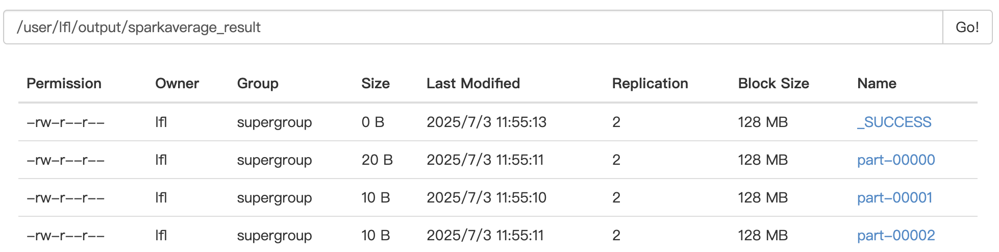

查看并验证运行结果：


可观察到输出文件中包含每个学生的平均成绩，验证了计算平均功能。

### 4.4 单表关联

#### 4.4.1 代码实现

```scala
import org.apache.spark.{SparkConf, SparkContext}

object SparkTableReferJob {
  def main(args: Array[String]): Unit = {
    if (args.length != 2) {
      System.err.println("Usage: SparkTableReferJob <input> <output>")
      System.exit(1)
    }

    val inputPath = args(0)
    val outputPath = args(1)

    val conf = new SparkConf().setAppName("SparkTableReferJob")
    val sc = new SparkContext(conf)

    // 读取数据并过滤表头
    val lines = sc.textFile(inputPath)
      .filter(line => !line.trim.startsWith("child"))

    // 拆分为 (child, parent)
    val relations = lines.map(_.trim.split("\\s+")).map {
      case Array(child, parent) => (child, parent)
    }

    // 模拟左表：key = parent，value = "L_child"
    val left = relations.map { case (child, parent) => (parent, "L_" + child) }

    // 模拟右表：key = child，value = "R_parent"
    val right = relations.map { case (child, parent) => (child, "R_" + parent) }

    // 合并并按 key 分组
    val joined = left.union(right).groupByKey()

    // Reduce 阶段做自连接：分开左右表并做笛卡尔积
    val grandchildGrandparent = joined.flatMap {
      case (_, values) =>
        val (leftValues, rightValues) = values.partition(_.startsWith("L_"))
        val grandchildren = leftValues.map(_.substring(2))
        val grandparents = rightValues.map(_.substring(2))
        for {
          gc <- grandchildren
          gp <- grandparents
        } yield (gc, gp)
    }

    // 添加表头并保存为文本
    val header = sc.parallelize(Seq("grandchild\tgrandparent"))
    val results = grandchildGrandparent.map { case (gc, gp) => s"$gc\t$gp" }

    header.union(results).saveAsTextFile(outputPath)

    sc.stop()
  }
}
```

#### 4.4.2 实验步骤

1. 准备包含亲子关系的数据文件，第一行为表头 “child parent”

   在本地创建并编辑文件child-parent:

   ```shell
   child	parent
   Tom	Lucy
   Tom	Jack
   Jone	Lucy
   Jone	Jack
   Lucy	Mary
   Lucy	Ben
   Jack	Alice
   Jack	Jesse
   Terry	Alice
   Terry	Jesse
   Philip	Terry
   Philip	Alma
   Mark	Terry
   Mark	Alma
   ```

   使用命令`hdfs dfs -put child-parent \user\lfl\input\tablerefer`将文件上传到Hadoop集群（**路径内文件夹均已提前创建**），上传成功后通过访问`master:50070`Web页面查看：

2. 在spark集群上运行作业

   在项目根目录下运行命令

   ```shell
   spark-submit \
     --class SparkTableReferJob \
     --master spark://master:7077 \
     target/scala-2.11/sparkjob_2.11-0.1.jar \
     hdfs:/user/lfl/input/tablerefer/child-parent \
     hdfs:/user/lfl/output/sparktablerefer_result
   ```

#### 4.4.3 实验结果

运行成功后可在Web页面查看输出文件是否存在：

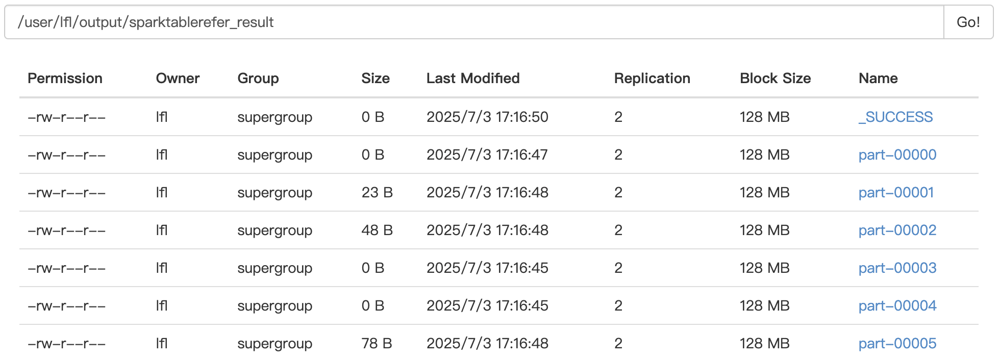

查看并验证运行结果：


输出文件中包含每个孙子和祖父母的关系。

## 五、遇到的问题及解决方案

### 5.1 任务运行时slave节点的NodeManager进程终止

- **问题描述：**在Reduce任务的copy拉去阶段时slave节点的NodeManager进程终止，查看日志后发现：

  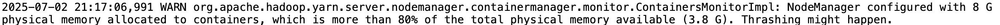

  

- **解决方案：**目前认为的可能原因是内存溢出，导致ResourceManager终止了NodeManager进程，通过修改`yarn-site.xml`文件配置：

  ```xml
  <property>
      <name>yarn.nodemanager.resource.memory-mb</name>
      <value>3072</value> <!-- 3GB 内存 -->
  </property>
  <property>
      <name>yarn.nodemanager.resource.cpu-vcores</name>
      <value>2</value> <!-- CPU核心数 2 -->
  </property>
  ```

## 五、实验总结

通过本次实验，我成功使用 Hadoop MapReduce 和 Spark 框架实现了数据去重、数据排序、计算平均值和单表关联等常见数据处理任务。在实验过程中，深入理解了分布式计算框架的工作原理和编程模型，同时也掌握了在 Hadoop 集群和 Spark 系统上运行作业的方法。

在 Hadoop MapReduce 任务中，需要手动编写 Mapper 和 Reducer 类，对数据进行处理和聚合，代码相对复杂，但能够更好地控制数据处理的细节。而在 Spark 任务中，使用 RDD 和 DataFrame 等高级抽象，代码更加简洁，开发效率更高。

对比两种框架，Hadoop MapReduce 更适合处理大规模批处理任务，其编程模型虽然繁琐，但具有良好的容错性和稳定性；Spark 则在处理速度和灵活性上更具优势，尤其适合迭代计算和实时数据处理场景，其 DAG 执行引擎能显著提升复杂任务的执行效率。

通过本次实验，我的分布式系统开发能力得到了显著提升，不仅掌握了 Hadoop 和 Spark 的核心编程模型，还学会了如何在集群环境中部署和调试应用程序。同时，也对分布式计算的优势和挑战有了更深入的理解，为今后进一步学习和应用大数据技术奠定了坚实的基础。在未来的学习和工作中，我将继续探索更多大数据处理技术和框架，不断提升自己的专业技能。