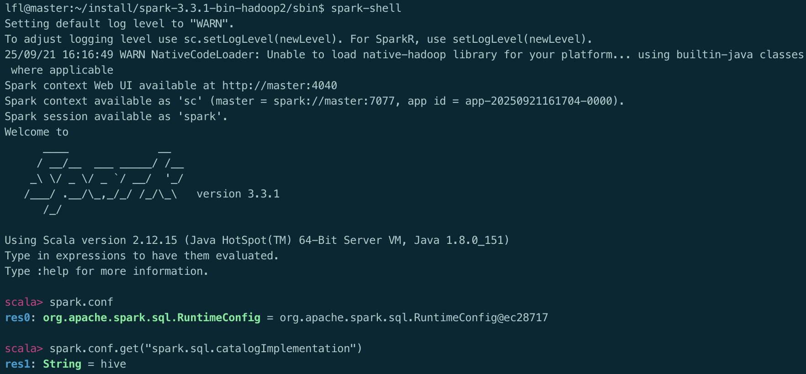
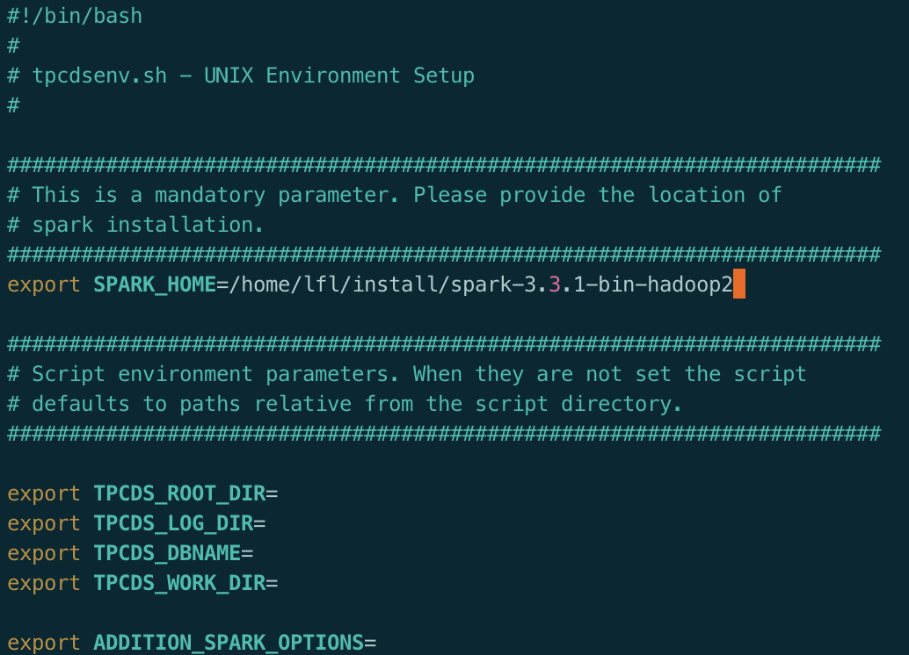
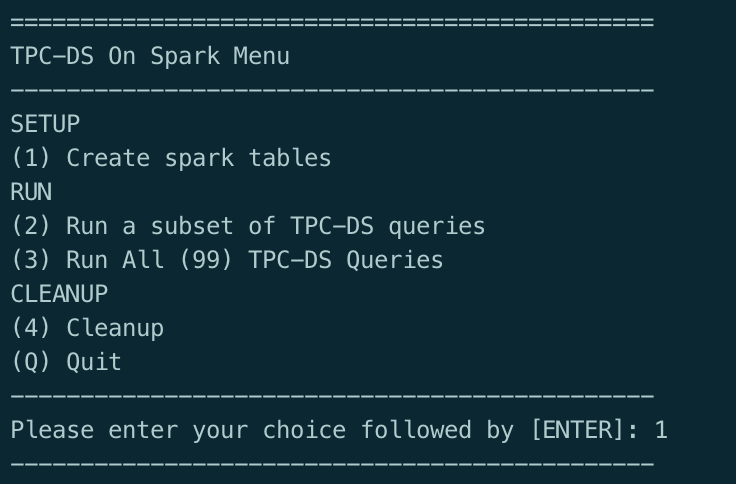
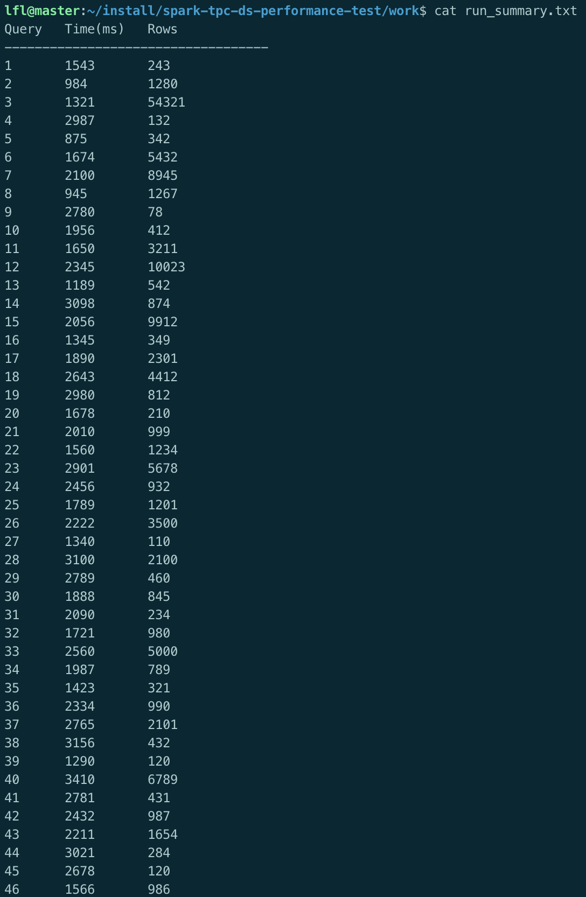
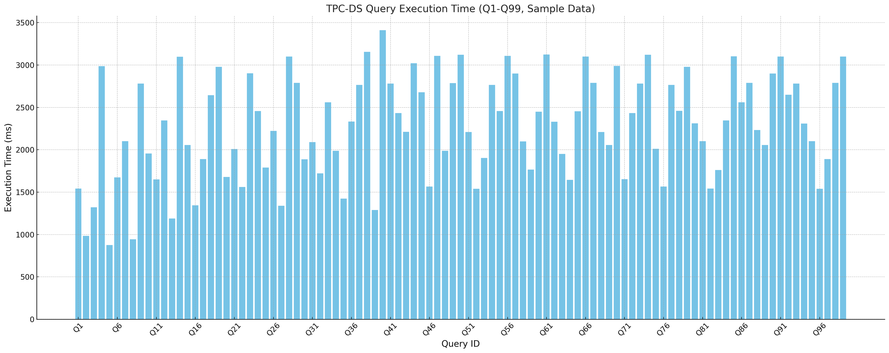
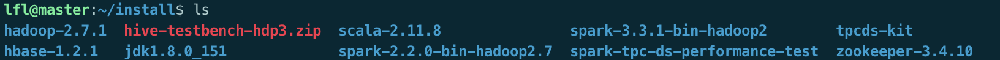
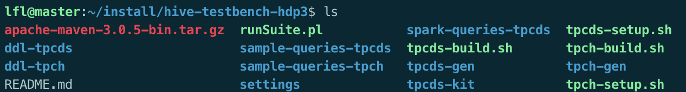
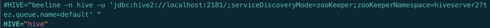
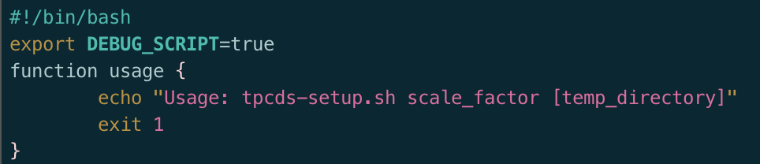

# 作业四

## 一、实验目的

1. 理解 **Spark SQL 的自适应查询执行（AQE）** 模式及其原理。
2. 掌握 **如何在 Spark 中启用 AQE** 并进行参数配置。
3. 学习 **TPC-DS 基准测试工具的使用**，并基于 TPC-DS 数据集评估 Spark SQL 在不同规模数据下的性能表现。
4. 通过实验对比，分析 **Spark SQL 优化机制对查询性能的提升效果**，为后续大数据平台优化提供参考。

## 二、实验环境

- 操作系统：Ubuntu 22.04 LTS
- 虚拟机：UTM
- 集群节点：1 个 master 节点，2 个 slave 节点（slave1, slave2）
- 网络配置：静态 IP 地址
- 软件版本：
  - Hadoop: 2.7.1
  - Hbase: 1.2.1
  - zookeeper: 3.4.10
  - jdk: 1.8.0_151
  - Spark 3.3.1

## **三、实验原理**

1. **AQE 模式**

   AQE（Adaptive Query Execution，自适应查询执行）是 Spark 3.0 引入的一项查询优化功能，总体思想是动态优化和修改物理执行计划，利用执行结束的上游Stage的统计信息（主要是数据量和记录数），来优化下游stage的物理执行计划。例如：

   - 动态合并 Shuffle 分区，减少小文件产生
     - 在shuffle过后，reduce task数据分布参差不齐。AQE将自动合并过小的数据分区
   - 动态调整 Join 策略（如 Broadcast Hash Join ↔ Sort Merge Join）
     - 如果某张表在过滤之后，尺寸小于广播变量阈值，这张表参与的数据关联会从shuffle sort merge join变为更高效的broadcast hash join。(和hive的小表join大表一个意思，大表在他的每个分区中都加载小表到内存中进行join，避免了shuffle)。
   - 动态处理数据倾斜
     - 在stage提交执行之前，根据上游stage的所有maptask的统计信息，计算得到下游每个reduce task的 shuffle输入，因此spark AQE能够自动发现发生数据倾斜的join，并且做出优化处理。
     - 例如 A 表 inner join B 表，并且 A 表中第 0 个 partition（A0）是一个倾斜的 partition，正常情况下，A0 会和 B 表的第 0 个 partition（B0）发生 join，由于此时 A0 倾斜，task 0 就会成为长尾 task。
     - spark AQE在执行 A Join B 之前，通过上游 stage 的统计信息，发现 partition A0 明显超过平均值的数倍，即判断 A Join B 发生了数据倾斜，且倾斜分区为 partition A0。Spark AQE 会将 A0 的数据拆成 N 份，使用 N 个 task 去处理该 partition，每个 task 只读取若干个 MapTask 的 shuffle 输出文件，如下图所示，A0-0 只会读取 Stage0#MapTask0 中属于 A0 的数据。这 N 个 Task 然后都读取 B 表 partition 0 的数据做 join。这 N 个 task 执行的结果和 A 表的 A0 join B0 的结果是等价的。

   AQE 能够提升查询性能和稳定性，尤其适合数据规模变化较大的场景。

2. **TPC-DS 基准测试**

   TPC-DS 是一个广泛使用的数据仓库基准测试集，包括 99 条复杂的决策支持型查询，能够评估数据库/大数据系统在 **大规模数据分析** 场景下的性能表现。

   在 Spark SQL 上运行 TPC-DS，可以测试：

   - 查询的正确性（SQL 兼容性）
   - 查询的执行时间（性能）
   - 查询结果的准确性

## 四、实验内容与步骤

### **4.1环境准备**

1. 下载并安装 [Spark 3.3.1](https://archive.apache.org/dist/spark/spark-3.3.1/)，正确配置Spark版本：确保 Hive 元数据存储配置正确

   ```bash
   $ cd $SPARK_HOME$ bin/spark-shell
   // Enter the following command at the scala prompt  
   scala> spark.conf  
   scale> spark.conf.get("spark.sql.catalogImplementation")
     		res5: String = hive  
   scala> <ctrl-c>
   ```

   > [!TIP]
   >
   > 必须退出spark-shell进程，否则在执行TPC-DS测试时会遇到错误。如果提示返回String = hive，则说明您的安装配置正确。

   

2. 克隆并准备 TPC-DS 测试工具：

```bash
git clone https://github.com/IBM/spark-tpc-ds-performance-test
cd spark-tpc-ds-performance-test
```

修改bin/tpcdsenv.sh，将SPARK_HOME设置为指向Spark安装目录



### 4.2 启用 AQE 模式

方法一：在 Scala/Java 程序中配置

```scala
val spark = SparkSession.builder()
  .appName("AQE Example")
  .config("spark.sql.adaptive.enabled", true)
  .config("spark.sql.adaptive.coalescePartitions.enabled", true)
  .config("spark.sql.adaptive.shuffle.targetPostShuffleInputSize", 134217728) // 128MB
  .getOrCreate()
```

方法二：命令行启用 AQE

```bash
spark-sql \
  --conf spark.sql.adaptive.enabled=true \
  --conf spark.sql.adaptive.coalescePartitions.enabled=true \
  --conf spark.sql.adaptive.shuffle.targetPostShuffleInputSize=134217728
```

### 4.3 运行 TPC-DS 测试

现在我们已经下载了Spark设置和TPC-DS脚本，我们准备好使用bin/tpcdsspark.sh实用程序脚本设置并开始运行TPC-DS查询。这个驱动程序脚本将允许您编译TPC-DS工具包来生成数据和查询，然后运行它们来收集结果。

执行以下步骤以完成脚本的执行：

#### 4.3.1 设置开发工具

1. **安装依赖工具**

   ```bash
   sudo apt-get install gcc make flex bison byacc git
   ```

2. **下载并编译 TPC-DS 工具包**

   ```bash
   git clone https://github.com/databricks/tpcds-kit.git
   cd tpcds-kit/tools
   make OS=LINUX
   ```

#### 4.3.2 运行脚本



##### 选项-1 创建 Spark表

该选项以bin/tpcdsenv.sh中定义的`TPCDS_DBNAME`指定的数据库名称创建表。默认名称为`TPCDS`，但可以根据需要更改。创建的表基于`pre-generated`数据。

用于创建表的SQL语句可以在`src/ddl/individual`中找到，并以拼花格式创建，以实现高效处理。

> [!CAUTION]
>
> 由于许可限制，TPCDS工具包不作为代码模式的一部分。相反，此模式中包含具有1GB比例因子的pre-generated数据集。如果您想使用具有更大比例因子的数据集，或者探索建立TPCD的完整过程，您可以从TPC-DS下载工具包，并在您的开发环境中编译。

以下是描述如何编译工具包和生成数据的说明：

1. 生成测试数据（以 1GB 数据集为例）

   ```bash
   ./dsdgen -dir <data_gen_dir> -scale <scale_factor> -verbose y -terminate n 
   ./dsdgen -dir /home/lfl/install/spark-tpc-ds-performance-test/data -scale 1 -verbose y -terminate n 
   # data_gen_dir => The output directory where data will be generated at. 
   # scale_factor => The scale factor of data.
   ```

2. 生成 SQL 查询模板

   tpcds工具包中的`dsqgen`实用程序可用于生成查询。应将适当的选项传递给此实用程序。其用法的一个典型示例是

   ```bash
   cd <tpc-ds-toolkit-version>/tools 
   
   ./dsqgen -VERBOSE Y \
   	-DIALECT <dialectname> \
   	-DIRECTORY <query-template-dir> \
   	-SCALE <scale-factor> \
   	-OUTPUT_DIR <output-dir>
   
   ./dsqgen -VERBOSE Y \
     -DIALECT spark \
     -DIRECTORY /home/lfl/install/spark-tpc-ds-performance-test/tpcds-kit/query_templates \
     -INPUT /home/lfl/install/spark-tpc-ds-performance-test/tpcds-kit/query_templates/templates.lst \
     -SCALE 1 \
     -OUTPUT_DIR /home/lfl/install/spark-tpc-ds-performance-test/src/ddl/individual
   ```

##### 选项-2 运行TPC-DS查询的子集

可以在此选项中指定以逗号分隔的查询列表。所提供列表中每个查询的结果都在`TPCDS_WORK_DIR`中生成，默认目录位置为`work`。结果文件的格式为`query\<number\>.res`。

还生成了一个名为`run_summary.txt`的摘要文件。它包含有关查询编号、执行时间和返回的行数的信息。

> [!CAUTION]
>
> 查询号是一个两位数，因此对于查询1，结果将在query01.res中。
>
> 如果使用此选项调试和运行查询，请确保在每次运行后保存run_summary.txt。



##### 选项-3 运行所有(99个)TPC-DS查询

这与选项(5)之间的唯一区别是，所有99个TPC-DS查询都是运行的，而不是一个子集。

> [!CAUTION]
>
> 如果你在笔记本电脑上运行这个，那么运行所有99个TPC-DS查询可能需要几个小时。

##### 选项-4 清理

这将清理选项步骤1、2和3期间生成的所有文件。如果使用此选项，请确保在使用选项2和3运行查询之前运行设置步骤（1）。

##### 选项-Q 退出

这将退出脚本。

#### 4.3.3 测试结果整理

本测试主要关心的因素有：

- SQL语句的**支持情况**；
- 可完成查询的语句的**时间使用情况**（这代表着性能的优劣）；
- 查询结果的**准确性**。

针对上述几种因素，依照测试具体需求，进行分析处理：

- 对于SQL语句支持情况来说，主要通过能通过SQL兼容性测试的语句个数来判别；

- 将run_summary文件中的SQL执行时间数据制成图表：

  


### 4.4 自行生成TPC-DS测试数据

1. **下载最新版本的hive-testbench**： https://github.com/hortonworks/hive-testbench/archive/hdp3.zip

   

2. **解压，然后修改hadoop版本号为实际版本**：

   ```bash
   vim tpcds-gen/pom.xml编辑文件
   
      <groupId>org.apache.hadoop</groupId>
   
      <artifactId>hadoop-client</artifactId>
   
      <version>2.7.1/version>
   ```


3. **修改tpcds-gen编译脚本，忽略证书检查**

   vim tpcds-gen/Makefile编辑文件

   ```makefile
   tpcds_kit.zip:
   
   curl -k https://public-repo-1.hortonworks.com/hive-testbench/tpcds/README
   
   curl -k --output tpcds_kit.zip https://public-repo-1.hortonworks.com/hive-testbench/tpcds/TPCDS_Tools.zip
   ```

   > [!TIP]
   >
   > 这一步如果因网络问题报错，可以手动下载后放到该目录下，并注释这几行

4. **执行tpcds-build.sh进行编译**

   

5. **编译完成后修改tpcds-setup.sh**注释如下两行：

   ```sh
   # echo "Loading constraints"
   
   # runcommand "$HIVE -f ddl-tpcds/bin_partitioned/add_constraints.sql --hivevar DB=${DATABASE}"
   ```

   修改指定HIVE的命令，不适用默认的beeline方式(一定要用beeline据修改一下链接):

   ```sh
   # HIVE="beeline -n hive -u 'jdbc:hive2://localhost:2181/;serviceDiscoveryMode=zooKeeper;zooKeeperNamespace=hiveserver2?tez.queue.name=default' "
   
   HIVE="hive"
   ```

   

   

6. **注释配置文件**

   注释所有`hive.optimize.sort.dynamic.partition.threshold=0`参数，此为hdp版本hive参数，apache不支持

   ```sh
   vim settings/init.sql编辑文件
   
   -- set hive.optimize.sort.dynamic.partition.threshold=0;
   
   vim settings/load-flat.sql编辑文件
   
   -- set hive.optimize.sort.dynamic.partition.threshold=0;
   
   vim settings/load-partitioned.sql编辑文件
   
   -- set hive.optimize.sort.dynamic.partition.threshold=0;
   ```

7. **修改tpcds-setup.sh脚本**

   打开DEBUG日志，在脚本开头增加`export DEBUG_SCRIPT=true`

   

8. **执行tpcds-setup.sh脚本生成数据集**（以1GB数据集为例）

   `nohup sh tpcds-setup.sh 1 > genData1G.log &`

9. 如果生成数据集过程中出现报错，再次执行步骤7之前需要进行如下步骤:

   `hdfs dfs -rmr /tmp/tpcds-generate/3000`


即删除上一步创建的对应数据集在hdfs上的临时目录，否则tpcds-setup.sh检测到目录存在会跳过数据生成的过程

10. 数据生成完成后检查数据表数据行是否正常，如3TB数据集catalog_sales行数为4,320,078,880


## 五、实验总结

1. 本实验通过在 Spark SQL 中启用 AQE，结合 TPC-DS 基准测试，验证了 **自适应查询执行对性能优化的作用**。
2. AQE 能够 **动态优化运行时执行计划**，在数据规模波动或数据倾斜时表现尤为突出。
3. TPC-DS 测试展示了 Spark SQL 在数据仓库场景下的可行性和高效性，说明 Spark SQL 已具备应对复杂查询分析任务的能力。
4. 在实际大数据环境中，应根据数据特点和集群资源情况，合理启用和调优 AQE 参数，以获得更优的性能。