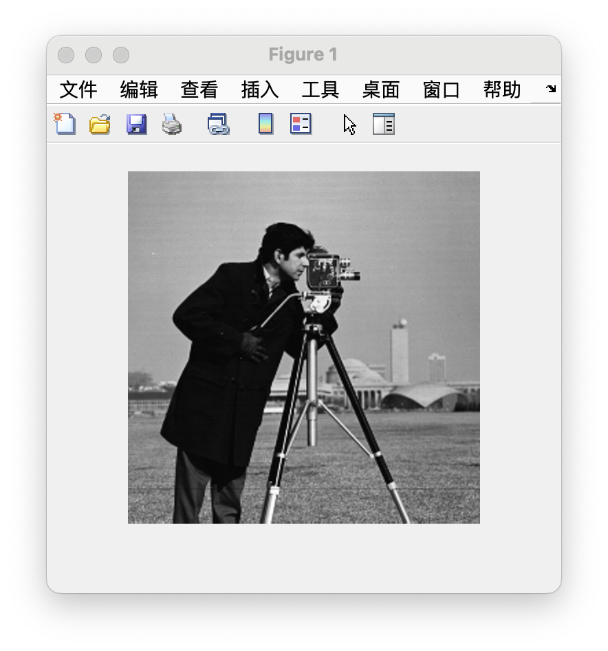
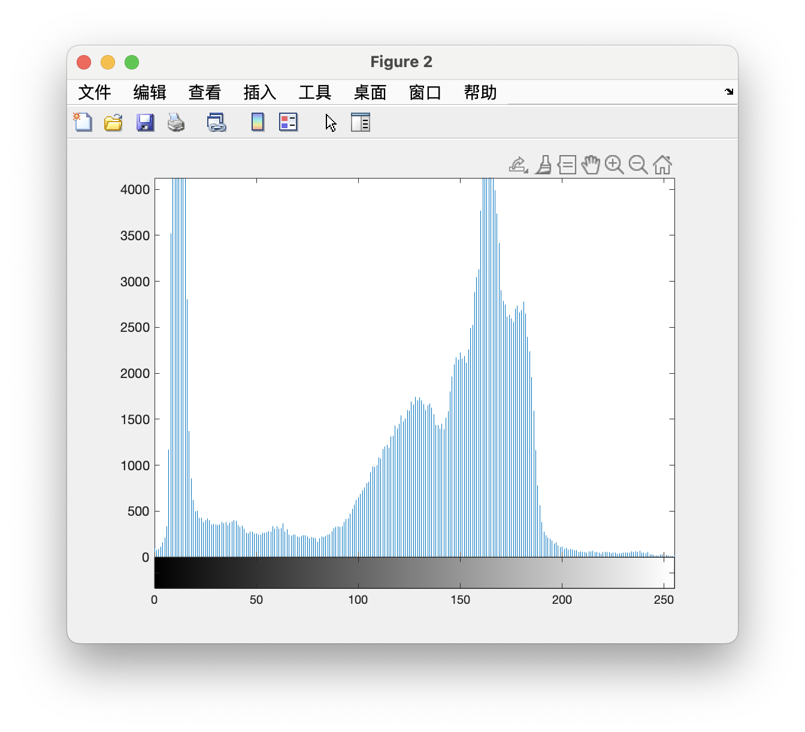
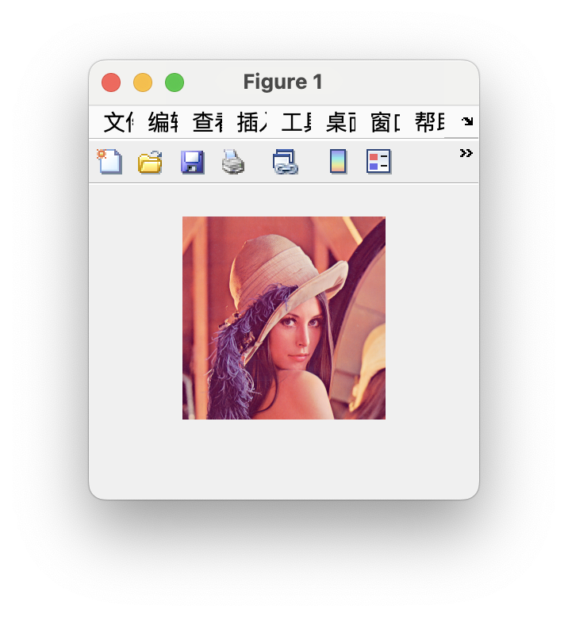
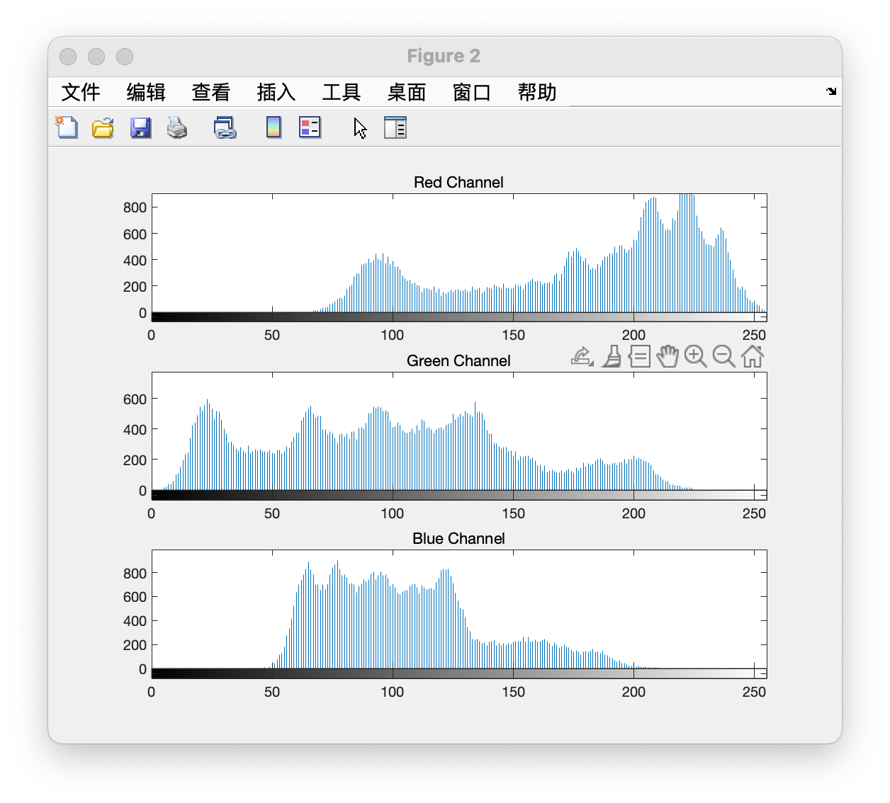
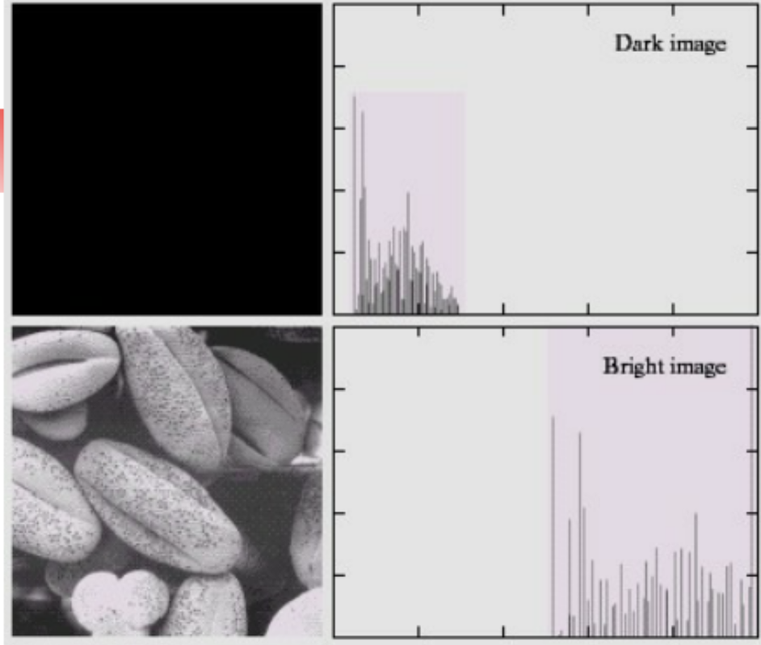
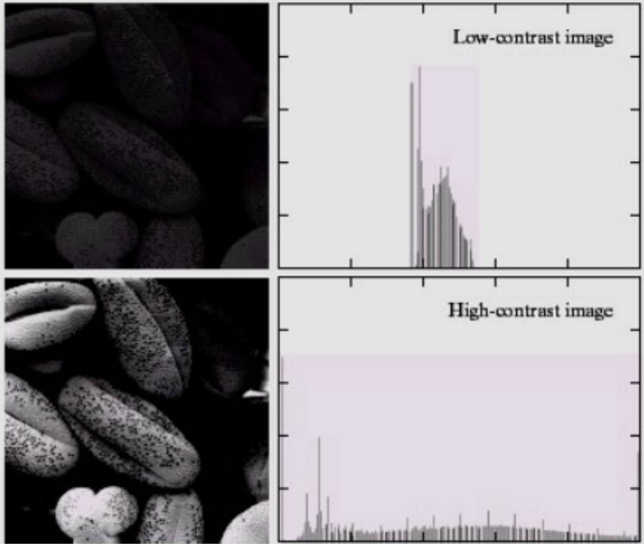
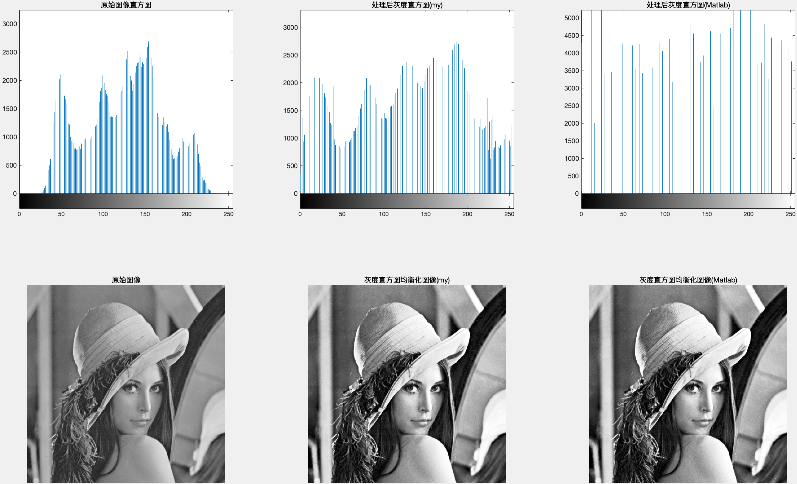

# 实验1：直方图均衡模块

Fallen

## 实验要求

在课程设计软件中完成该规定化功能，不要调用API或第三方函数，自己实现**直方图均衡算法**。

## 实验步骤

### 预备知识

#### 1、灰度直方图

如果将图像中像素灰度级看成是一个随机变量，则其取值分布情况就反映了图像的统计特性，这一特性可用**灰度直方图（Histogram）**来描述。灰度直方图是灰度级的函数， 描述的是图像中具有该灰度级的像素的个数。

灰度级范围为$[0,L-1]$的数字图象的灰度直方图是灰度级的离散函数：
$$
h(r_k) = n_k
$$
式中，$r_k$是第$k$级灰度值，$n_k$是图像中灰度值为$r_k$的像素的个数，$k=0,1,...，L-1$。



上图是一副灰度图像及其对应的灰度直方图， 其中， 灰度直方图横坐标是灰度级， 纵坐标是该灰度级出现的频率。

#### 2、直方图归一化

直方图归一化是将直方图中不同灰度级的像素个数转换到0~1之间的概率值。
$$
P(r_k) = \frac{n_k}{n} , k = 0,1,2,...,L - 1
$$
其中，$n$为一幅图像中像素总数，$n_k$是图像中灰度值为$r_k$的像素的个数。

灰度直方图归一化处理后，$p(r_k)$ 可视图像灰度级$n_k$发生的概率估计值

#### 3、彩色图像（RGB图像）直方图

彩色图像一般由 **RGB三个通道（Red、Green、Blue）** 组成，每个通道其实都可以看作是一张灰度图，因此我们可以分别为每个通道绘制一个直方图。



上图是一副彩色图像及其RGB三个通道的直方图

#### 4、直方图的性质

-  直方图反映了图像中的灰度分布规律。 它描述每个灰度级具有的像素个数， 但不包含这些像素在图像中的位置信息。 图像直方图不关心像素所处的空间位置， 因此不受图像旋转和平移变化的影响， 可以作为图像的特征。
- 任何一幅特定的图像都有唯一的直方图与之对应， 但不同的图像可以有相同的直方图。
- 如果一幅图像有两个不相连的区域组成， 并且每个区域的直方图已知， 则整幅图像的直方图是该两个区域的直方图之和。

下图是四种常见的直方图的灰度分布规律



四个基本图像类型：暗、亮、低对比度、高对比度，它们的灰度直方图反映出了以下信息：

1. 暗色图像中，直方图的组成成分集中在灰度级低（暗）的一侧；
2. 明亮图像的直方图则倾向于灰度级高的一侧；
3. 低对比度图像的直方图窄而集中于灰度级的中部。对于黑白图像，这意味着暗淡，好像灰度被冲淡了一样。
4. 在高对比度的图像中，直方图的成分覆盖了灰度级很宽的范围，而且，像素的分布较均匀，只有少量垂线比其他的高许多。

### 直方图均衡

#### 1、直方图均衡化概念

**直方图均衡化**是图像处理领域中利用**图像直方图**对**对比度**进行调整的方法。

所谓直方图均衡化，是指寻找一个灰度变换函数：
$$
S = T (r)
$$


它的目标是使变换后的图像的像素值占有全部的灰度级并且分布均匀，从而得到一幅**灰度级丰富且动态范围大的**图像，从而增强图像的对比度。

#### 2、灰度变换函数（映射函数）

为了将原图像的灰度值范围进行扩展， 需要一个变换函数$T(r)$， 将原图像的像素值均衡映射到新直方图中， 这个变换函数$T(r)$应满足两个条件：

1. 在$0 \le r \le 1$区间内，$T(r)$单值（严格）单调递增，即不能打乱原有的灰度级从白到黑次序， 映射后亮、 暗的大小关系不能改变，保证$T(r)$的反函数存在；
2.  当$0 \le r \le 1$时，$0 \le T(r) \le 1$​，即映射后的灰度级必须在原有的范围内；

综合以上两个条件，**累积分布函数**是个好的选择，因为累积分布函数是单调增函数，并且值域是0到1，所以直方图均衡化中使用的是累积分布函数：
$$
s = T(r) = \int_{0}^{r} p_r(\omega)\, d\omega
$$
对于数字图像处理，图像由一个个像素点组成，灰度值是离散的，因此使用累计分布函数的**离散形式**：
$$
s_k = T(r_k) = \sum_{j = 0}^{k} p_r(r_j) \, = \sum_{j = 0}^{k} \frac{n_j}{n}\, \, \space k = 0,1,2,...,L - 1
$$


#### 3、直方图均衡化的实现方法

1. 遍历原图像，统计每一个像素的灰度值，计算出灰度直方图

   ```matlab
   hist = zeros(1, 256);
   [m, n] = size(channel);
   
   % 计算直方图
   for i = 1:m
       for j = 1:n
           hist(channel(i, j) + 1) = hist(channel(i, j) + 1) + 1;
       end
   end
   ```

2. 将灰度直方图归一化，得到**归一化直方图**

   ```matlab
   % 归一化直方图
   hist = hist ./ (m * n);
   ```

3. 计算归一化直方图的累积分布函数，对灰度级进行映射

   ```matlab
   % 计算累计分布函数，对灰度级进行映射
   cdf = zeros(1, 256);
   for k = 0:255
       cdf(k + 1) = sum(hist(1:k + 1));
   end
   ```

4. 对映射得到的新灰度级重新量化，保证映射后灰度值是**整数**，并且映射后的灰度值落在$[0, 255]$​之间

   计算方法如下：
   $$
   \hat{s_k} = INT[\frac{L -1}{1 - s_{min}} (s_k - s_{min}) + 0.5]
   $$
   其中L是灰度等级数即0～255，共256种

   ```matlab
   min_cdf = min(cdf);
   floor((cdf(x + 1) - min_cdf) / (1 - min_cdf) * 255 + 0.5);
   ```

5. 对图像进行映射

   ```matlab
   out = uint8(arrayfun(@(x) floor((cdf(x + 1) - min_cdf) / (1 - min_cdf) * 255 + 0.5), channel));
   ```

### 完整实现代码

```matlab
function out = my_histeq(channel)
    hist = zeros(1, 256);
    [m, n] = size(channel);

    % 计算直方图
    for i = 1:m
        for j = 1:n
            hist(channel(i, j) + 1) = hist(channel(i, j) + 1) + 1;
        end
    end
    % 归一化直方图
    hist = hist ./ (m * n);
            
    % 计算累计分布函数，对灰度级进行映射
    cdf = zeros(1, 256);
    for k = 0:255
        cdf(k + 1) = sum(hist(1:k + 1));
    end
            
    % 重新量化映射函数，用新对映射函数更新原图每个像素的灰度值
    min_cdf = min(cdf);
    out = uint8(arrayfun(@(x) floor((cdf(x + 1) - min_cdf) / (1 - min_cdf) * 255 + 0.5), channel));
end
```

### 测试结果

使用如下代码对图像进行处理，并与Matlab内置函数histeq处理后的图像进行对比

```matlab
clear;clc;close all;

img = imread("../lena_gray_512.tif");
hiseq_img = my_histeq(img);
hiseq = histeq(img);

figure
subplot(2, 3, 1); imhist(img); title("原始图像直方图");
subplot(2, 3, 2); imhist(hiseq_img); title("处理后灰度直方图(my)");
subplot(2, 3, 3); imhist(hiseq); title("处理后灰度直方图(Matlab)");
subplot(2, 3, 4); imshow(img); title("原始图像");
subplot(2, 3, 5); imshow(hiseq_img); title("灰度直方图均衡化图像(my)");
subplot(2, 3, 6); imshow(hiseq); title("灰度直方图均衡化图像(Matlab)");

```

结果如下：



对比结果可知，原始图像直方图非均匀分布，主要集中在低中灰度区间，表现为几个明显的峰值。进行直方图均衡化后图像对比度增强，视觉效果清晰。
实验中手动实现的my_histeq直方图均衡化算法与Matlab内置的直方图均衡化算法结果有明显差异，尽管在肉眼上处理后的图像没有很大差别，但是从灰度直方图可以看出，histeq处理后图像灰度分布更加均匀，分布近似平坦，my_hiteq处理后的图像虽然也让灰度分布到更广泛的范围（几乎每个灰度值都有分布），但是还是出现密集的峰值。

## 实验总结

通过本次试验，我复习回顾了灰度变换和直方图均衡化，并根据要求不使用任何API和第三方函数实现了基本的直方图均衡化算法，应用到图像处理中，成功对图像进行对比度增强，并且将结果与Matlab内置函数histeq处理后的图像进行对比分析，认为自己实现的直方图均衡化算法也存在一定局限性，后续可优化映射方式，使图像增强的效果更加明显。

$\text{dist}(x_0, H) = \frac{|w \cdot x_0 + b|}{\|w\|}$