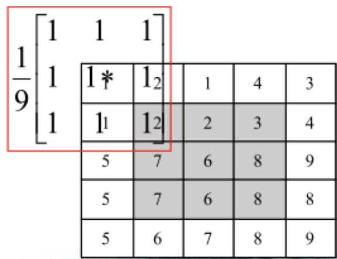
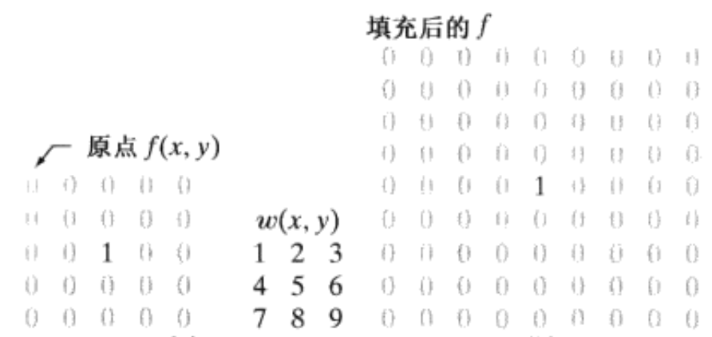
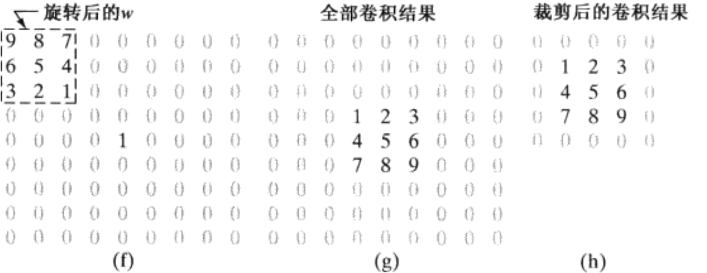
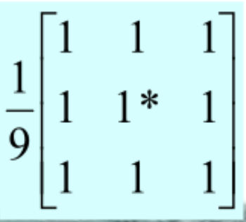
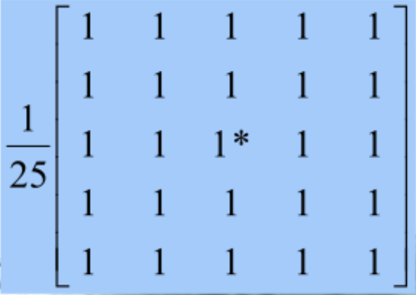
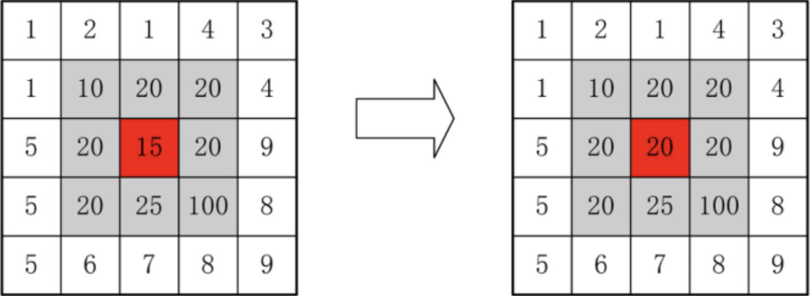
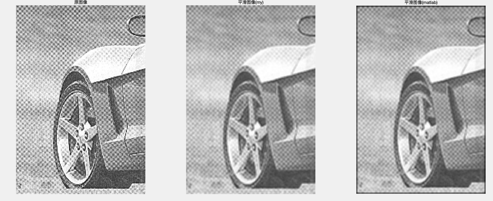
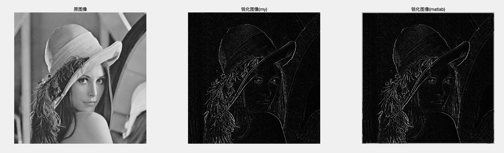

# 实验2：卷积运算模块

fallen

## 实验要求

在课程设计软件中完成该规定化功能，不要调用API或第三方函数，自己实现卷积运算算法，并在此基础上通过平滑或者锐化应用演示其效果。

## 实验步骤

### 预备知识

#### 1、线性空间滤波

##### 相关概念

线性滤波是使用一个滤波器（**卷积核**），将卷积核中心与图像像素对齐，计算它的邻域像素和滤波器矩阵的对应元素的乘积，然后加起来，作为该像素位置的值。用卷积核遍历图像像所有像素，这样就完成了滤波过程。

一般来说，对于一个尺寸为$m \times n$的模板，假设$m=2a+1，n=2b+1$，这里a、b为非负整数，使模板的长和宽都为奇数。在大小为$M \times N$的图像$f$上，用上述滤波器模板进行线性滤波（**卷积运算**），像素$(x, y)$处的运算结果可由下式给出：
$$
g(x, y) = \sum_{s = -a}^{a}\,\sum_{t = -b}^{b} w(s, t)f(x + s,\space y + t)\,
$$
为了得到一幅完整的经过卷积运算处理的图像，必须对图像中$x=0,1,2,...,M-1$ 和$y=0,1,2,...,N-1$​依次应用上式，即遍历处理图像中所有像素。

##### 卷积运算步骤

1. 将滤波器（**卷积核**）在图中漫游，并将模板中心与图中某个像素位置重合；
2. 将滤波器系数与滤波器下方对应像素相乘；
3. 将所有乘积相加；
4. 将和（模板的输出响应）赋给图中对应模板中心位置的像素

##### 卷积运算中的问题

在卷积的加权运算中，当在图像上移动滤波器（**卷积核**）至图像的边界时，在原图像中不能找到与卷积核中的加权系数相对应的全部9个像素，即卷积核悬挂在图像缓冲区的边界上，这种现象在图像的上下左右四个边界上均会出现。


**处理方法**

为解决边缘上的像素位于卷积核中心找不到全部9个像素的问题，可以在进行卷积操作前，对原图像进行**填充（Padding）**，也就是在图像的边界上填充一些像素，以增加图像的大小，填充的方式有**零填充**、**复制边界值**(replicate)、**对称镜像填充**（symmetric）等。

以零填充为例，对于大小为$m \times n$的滤波器，我们在图像的顶部和底部**至少**填 充$m - 1 $行0，在左侧和右侧填充$n - 1$列0：




#### 2、平滑

**平滑滤波**能减弱或消除图像的高频分量，**是增加低频的空间域滤波技术**。因为高频分量对应图像中的区域边缘等**灰度值变化较大、较快**的部分，滤波器将这些分量滤除从而使图像平滑。

平滑滤波器主要用于**模糊处理**和**减小噪声**。模糊处理经常用于预处理，例如，在提取大的目标之前去除图像中一些琐碎的细节、桥接直线或曲线的缝隙。由于典型的随机噪声由灰度级的尖锐变化组成，因此，常见的平滑处理应用就是减噪。

##### 均值滤波

**邻域平均滤波器**（均值滤波器）的输出（响应）是包含在滤波器模板邻域内像素的**简单平均值**。因此，这些滤波器也称**均值滤波器**，是一种低通滤波器。

邻域平均法是一种利用Box模板对图像进行模板操作（卷积运算）的图像平滑方法，所谓Box模板是指模板中所有系数都取相同值的模板，常用的3×3和5X5模板如下：





数学含义可用下式表示：
$$
g(x, y) = \frac{1}{M}\, \sum_{(i,j) \in S_{xy}} f(i, j)\,
$$
式中：$x,y =0,1,...,N-1$;$S_{xy}$是以$(x, y)$为中心的邻域的集合，M是$S_{xy}$内的像素数

由于典型的随机噪声由灰度级的急剧变化组成，因此，常见的平滑处理应用就是降低噪声。

然而，由于图像边缘（几乎总是一幅图像希望有的特性）也是由图像灰度尖锐变化带来的特性，所以均值滤波处理存在着不希望有的边缘模糊的负面效应。

##### 中值滤波

中值滤波就是用一个含有奇数点的移动窗口，将窗口中心点的值用窗口内各点的中值代替，即：
$$
g(x, y) = \text{Med}_{(s,t) \in S_\text{xy}} \{ f(x, t) \}
$$
式中：$S_{xy}$为以像素$(x,y)$为中心的含有奇数个像素点的邻域窗口，$\{f(s,t)\}$；为窗口$S_{xy}$内所有像素灰度值按大小排序后的一维数据序列    



以上图为例，窗口大小为$3 \times 3$，当窗口中心在灰度值为15的像素时，窗口内所有像素灰度值按大小升序排序后的一维数据序列为$\{10, 15, 20, 20, \textcolor{red}{20}, 20, 20, 25, 100\}$，中值为第5个值：20，而在大小为$5 \times 5$的窗口中，中值是第13（$m = [\frac{n \times n}{2}] + 1$）个值。

##### 高斯滤波

高斯滤波与均值滤波类似，都是矩形窗口内所有像素点的像素值加权和，只不过其权重与均值滤波不一样。高斯滤波是利用 **二维高斯函数** 对图像进行加权平均，距离越近的像素权重越大，越远的像素权重越小：
$$
w(x, y) = \frac{1}{2\pi\sigma^2} \cdot e^{-\frac{x^2 + y^2}{2\sigma^2}}
$$
其中：

- $(x, y)$：相对于中心的坐标
- $\sigma$​：标准差，控制模糊程度，越大模糊越强
- $\frac{1}{2\pi\sigma^2}$是归一化因子，为了使加权和之后的值不超过像素值本来的最大范围，需要对权制进行归一化操作

#### 3、锐化 

锐化处理的主要目的是突出灰度的**过渡部分**，突出图像上地物的**边缘、轮廓**，或某些**线性目标**要素的特征，增强图像中的细节。这种滤波方法提高了地物边缘与周围像元之间的反差，因此也被称为**边缘增强**。

图像的锐化处理，是采用与滤波窗口同样大小的数值矩阵（此矩阵一般被称为**算子**），与窗口对应的图像上的像元值矩阵进行相乘处理，最后**求和取绝对值**赋值给待处理像元，遍历完之后就实现了整个图像的锐化操作，所以锐化也是一种卷积操作，但是与平滑操作所用的卷积核不同。

为了达到寻找**边缘**的目的，检测灰度变化可用**一阶导数**或**二阶导数**来完成。

**一阶导数**。

为了在一幅图像$f$的$(x, y)$位置寻找**边缘**的强度和方向，所以选择的工具是**梯度**，梯度用$\nabla{f}$​来表示，梯度是矢量，定义为：
$$
\nabla{f} = grad(f) \equiv \begin{bmatrix}g_x \\
																					g_y
																					\end{bmatrix} = \begin{bmatrix}\frac{\partial f}{\partial x} \\
                                                                         \frac{\partial f}{\partial y}
                                          \end{bmatrix} = \begin{bmatrix}f(x + 1, y) - f(x, y) \\
                                                         								 f(x, y + 1) - f(x, y)
                                           \end{bmatrix}
$$
梯度的两个重要性质是：

- 梯度的方向在函数$f(x, y)$​最大变化率的方向上。
- 梯度大小用$M(x , y)$表示：$M(x , y) = mag(\nabla{f}) = \sqrt{g_x^2 + g_y^2}$，$M(x , y)$​表示梯度向量方向变化率的值。

**数学梯度的简单推导**

对于以为函数$f(x)$，在点$x$处的导数的近似：将函数$f(x + \Delta{x})$在$x$ 泰勒展开
$$
\begin{aligned}
f(x + \Delta x) &= f(x) + \frac{f'(x)}{1!} \Delta x + \frac{f''(x)}{2!} (\Delta x)^2 + \frac{f^{(3)}(x)}{3!} (\Delta x)^3 + \cdots \\
&= \sum_{n=0}^{\infty} \frac{f^{(n)}(x)}{n!} (\Delta x)^n
\end{aligned}
$$
令$\Delta{x} = -1$，且只保该级数的线性项，得函数$f(x)$的梯度$\nabla{f}$：
$$
f(x - 1) = f(x) - f'(x)
\\
\nabla{f} = \frac{\partial f}{\partial x} = f'(x) = f(x) - f(x - 1)
$$
**二阶导数**

对数字图像来讲，$f(x, y)$​的二阶偏微分可表示为：
$$
\begin{aligned}
\textcolor{blue} {\frac{\partial^2 f(x, y)}{\partial x^2}}
&= \nabla_x f(x+1, y) - \nabla_x f(x, y) \\
&= [f(x + 1, y) - f(x, y)] - [f(x, y) - f(x - 1, y)] \\
&=f(x + 1, y) + f(x - 1, y) - 2(x, y) \\
\textcolor{blue} {\frac{\partial^2 f(x, y)}{\partial y^2}}
&= f(x, y + 1) + f(x, y - 1) - 2f(x, y) \\
\nabla^2f &= \frac{\partial^2 f(x, y)}{\partial x^2} + \frac{\partial^2 f(x, y)}{\partial y^2} \\
&= [f(x + 1, y) + f(x - 1, y) + f(x, y + 1) + f(x, y - 1)] - 4f(x, y)
\end{aligned}
$$
这也可以得到一个拉普拉斯算子：
$$
\begin{bmatrix}
0 & 1 & 0 \\
1 & -4 & 1 \\
0 & 1 & 0
\end{bmatrix}
$$


由上面的数学推导可知，要得到一幅图像的**梯度**，则要求在图像的每个像素点位置处计算偏导数。我们处理的是数字量，可通过泰勒展开对一点的邻域上的偏导数近似，因此一幅图像$f$，在$(x, y)$处的$x$和$y$方向上的梯度大小为：
$$
g_x = \frac{\partial f(x, y)}{\partial x} = f(x, y) - f(x - 1, y) 
\\
g_y = \frac{\partial f(x, y)}{\partial y} = f(x, y) - f(x, y - 1)
\\
\nabla f = g_x + g_y = -f(x - 1, y) -f(x, y - 1) + 2f(x, y)
$$
上述两个公式对 $g_x$ 和$g_y$的计算可用下图的**一维模板**对$f(x,y)$卷积得到：
$$
\begin{bmatrix}-1, 1 \end{bmatrix} \space \space
\begin{bmatrix}-1, \\
1\end{bmatrix}
$$


这是一个离散卷积核：
$$
\begin{bmatrix}
0 & -1 & 0 \\
-1 & 2 & 0 \\
0 & 0 & 0
\end{bmatrix}
$$


用于计算梯度偏导数的**卷积模板**，通常称之为**梯度算子**、**边缘算子**和**边缘检测子**等。

对于不同的模板得到的梯度是不同的，这也就衍生出很多算子，如Roberts、Prewitt、Sobel和Laplacian算子等。下面将详细介绍不同的算子。

##### Roberts 算子

**Roberts 算子（Roberts Cross Operator）** 是一种经典的边缘检测算子，又称为交叉微分算法，基于交叉差分的梯度算法，通过局部差分计算检测边缘线条，尤其适合检测图像的**对角方向边缘**。

Roberts 算子定义两个方向上（水平方向、垂直方向）的梯度（梯度分别沿对角线）：
$$
\begin{aligned}
d_x &= \begin{bmatrix}
-1 & 0 \\
0 & 1
\end{bmatrix}, \quad
d_y = \begin{bmatrix}
0 & -1 \\
1 & 0
\end{bmatrix}
\\[8pt]
G_x &= f(x, y) - f(x+1, y+1) \\
G_y &= f(x+1, y) - f(x, y+1)
\\[8pt]
\nabla f &= \sqrt{G_x^2 + G_y^2}
\end{aligned}
$$


##### Sobel算子

**Sobel算子**是一种用于边缘检测的离散微分算子，它结合了高斯平滑和微分求导。该算子主要用于计算图像明暗程度近似值，根据图像边缘旁边明暗程度把该区域内超过某个数的特定点记为边缘。

Sobel算子计算图像在水平方向（x）和垂直方向（y）上的梯度，具有一定的**平滑效果**；
$$
\begin{aligned}
d_x &=
\begin{bmatrix}
-1 & -2 & -1 \\
0 & 0 & 0 \\
1 & 2 & 1
\end{bmatrix}	\quad
d_y =
\begin{bmatrix}
-1 & 0 & 1 \\
-2 & 0 & 2 \\
-1 & 0 & 1
\end{bmatrix}

\\[8pt]
G_x &= [f(x - 1, y + 1) + 2*f(x, y + 1) + f(x + 1, y + 1)] - [f(x - 1, y - 1) + 2*f(x, y - 1) + f(x + 1, y -1 )] \\
G_y &= [f(x + 1, y - 1) + 2*f(x + 1, y) + f(x + 1, y + 1)] - [f(x - 1, y - 1) + 2*f(x - 1, y) + f(x - 1, y + 1)]
\\[8pt]

|\nabla f| &= \sqrt{G_x^2 + G_y^2}

\end{aligned}
$$

##### Laplacian算子

Laplacian（拉普拉斯）算子是用于检测图像**边缘和轮廓的二阶微分算子**，通过计算图像像素值的二阶导数来找出变化剧烈的区域。相比 Sobel 和 Roberts 算子，它不考虑方向信息，而是检测所有方向的边缘。常用于图像增强领域和边缘提取。它通过灰度差分计算邻域内的像素。

1）拉普拉斯算子通过计算图像中某个像素与其邻域像素之间的二阶灰度变化（即二阶导数），来判断该点是否是边缘或灰度突变区域。锐化时，会根据这个突变程度调整中心像素的灰度，使边缘更突出。

2）在算法实现过程中，拉普拉斯算子通过对图像像素在四邻域或八邻域方向上的灰度变化求二阶差分（即二阶导数），并将这些结果累加，反映该点与邻域像素灰度值的变化程度。

3）最后，将拉普拉斯算子计算得到的值用于调整原图像中对应像素的灰度值，实现图像锐化。常见方式：$g(x, y) = f(x, y) - \lambda \cdot \nabla^2 f(x, y)$

其中，Laplacian算子**四邻域**模板如下所示：
$$
H &=
\begin{bmatrix}
0 & -1 & 0 \\
-1 & 4 & -1 \\
0 & -1 & 0
\end{bmatrix}
$$
Laplacian算子**八邻域**模板如下所示：
$$
H &=
\begin{bmatrix}
-1 & -1 & -1 \\
-1 & 8 & -1 \\
-1 & -1 & -1
\end{bmatrix}
$$
通过Laplacian算子的模板可以发现：

- 当邻域内像素灰度相同时，模板的卷积运算结果为0；
- 当中心像素灰度高于邻域内其他像素的平均灰度时，模板的卷积运算结果为正数；
- 当中心像素的灰度低于邻域内其他像素的平均灰度时，模板的卷积为负数。

对卷积运算的结果用适当的衰弱因子处理并加在原中心像素上，就可以实现图像的锐化处理。


### 卷积运算具体实现

1. 确定图片大小和卷积核大小，用于对图像的预处理

   ```matlab
   [m, n] = size(img);
   [km, kn] = size(kernel);
   ```
   
2. 计算合适的填充大小，对原图像进行填充，让填充后卷积的图像与原图像大小一致

   填充步骤封装到函数中

   ```matlab
   function paddedImg = replicatePad(img, padSize)
       % 实现复制边缘填充
       [m, n] = size(img);
       padH = padSize(1); % 上下填充的行数
       padW = padSize(2); % 左右填充的列数
   
       % 创建填充后的空图像
       paddedImg = zeros(m + 2 * padH, n + 2 * padW);
   
       % 中心区域填原图像
       paddedImg(padH+1:end-padH, padW+1:end-padW) = img;		% 左闭右闭
   
       % 上下边缘复制
       paddedImg(1:padH, padW+1:end-padW) = repmat(img(1, :), padH, 1);        		% 上
       paddedImg(end-padH+1:end, padW+1:end-padW) = repmat(img(end, :), padH, 1);	% 下
   
       % 左右边缘复制
       paddedImg(:, 1:padW) = repmat(paddedImg(:, padW+1), 1, padW);         			% 左
       paddedImg(:, end-padW+1:end) = repmat(paddedImg(:, end-padW), 1, padW);   	% 右
       % 四个角
       paddedImg(1:padH, 1:padW) = img(1,1);                                   % 左上
       paddedImg(1:padH, end-padW+1:end) = img(1,end);                         % 右上
       paddedImg(end-padH+1:end, 1:padW) = img(end,1);                         % 左下
       paddedImg(end-padH+1:end, end-padW+1:end) = img(end,end);               % 右下
   end
   ```

   在卷积运算函数中调用

   ```matlab
   padSize = floor([km, kn] / 2);
   paddedImg = replicatePad(double(img), padSize);
   ```

3. 进行卷积运算

   ```matlab
   for i = 1:m
       for j = 1:n
           region = paddedImg(i:i+km-1, j:j+kn-1);			% 选取窗口
           out(i, j) = sum(sum(region .* kernel));			% 窗口和卷积核对应相乘计算，求和
       end
   end
   ```
4. 对结果处理，转回 uint8 图像格式，同时防止溢出

   ```matlab
   out = min(max(out, 0), 255);  % 防止溢出 裁剪到[0, 255]
   out = uint8(out);
   ```
### 完整代码

```matlab
function out = applyConv2D(~, img, kernel)
    [m, n] = size(img);
    [km, kn] = size(kernel);
    padSize = floor([km, kn] / 2);
    paddedImg = replicatePad(double(img), padSize);
    out = zeros(m, n);
    for i = 1:m
        for j = 1:n
            region = paddedImg(i:i+km-1, j:j+kn-1);
            out(i, j) = sum(sum(region .* kernel));
        end
    end
    
    out = min(max(out, 0), 255);  % 防止溢出 裁剪到[0, 255]
    out = uint8(out);
end
```

```matlab
function paddedImg = replicatePad(img, padSize)
    % 实现复制边缘填充
    [m, n] = size(img);
    padH = padSize(1); % 上下填充的行数
    padW = padSize(2); % 左右填充的列数

    % 创建填充后的空图像
    paddedImg = zeros(m + 2 * padH, n + 2 * padW);

    % 中心区域填原图像
    paddedImg(padH+1:end-padH, padW+1:end-padW) = img;		% 左闭右闭

    % 上下边缘复制
    paddedImg(1:padH, padW+1:end-padW) = repmat(img(1, :), padH, 1);        		% 上
    paddedImg(end-padH+1:end, padW+1:end-padW) = repmat(img(end, :), padH, 1);	% 下

    % 左右边缘复制
    paddedImg(:, 1:padW) = repmat(paddedImg(:, padW+1), 1, padW);         			% 左
    paddedImg(:, end-padW+1:end) = repmat(paddedImg(:, end-padW), 1, padW);   	% 右
    % 四个角
    paddedImg(1:padH, 1:padW) = img(1,1);                                   % 左上
    paddedImg(1:padH, end-padW+1:end) = img(1,end);                         % 右上
    paddedImg(end-padH+1:end, 1:padW) = img(end,1);                         % 左下
    paddedImg(end-padH+1:end, end-padW+1:end) = img(end,end);               % 右下
end
```

### 测试结果

使用如下代码对图像进行处理，并与Matlab内置函数conv2处理后的图像进行对比

```matlab
% 读取灰度图像
img = imread('cameraman.tif'); 
img = double(img);              % 转为 double 方便计算

% 定义平滑卷积核(均值滤波)
smooth_kernel = (1/9) * ones(3,3);

% 定义锐化卷积核(Laplacian)
 sharp_kernel = [-1 -1  -1;
                -1  8 -1;
                 -1 -1  -1];

% 使用手写卷积函数处理图像
smooth_img_my = my_conv2(img, smooth_kernel);
smooth_img = conv2(img, smooth_kernel);
sharp_img_my  = my_conv2(img, sharp_kernel);
sharp_img  = conv2(img, sharp_kernel);

% 显示结果
figure(1);
subplot(1,3,1); imshow(uint8(img));        title('原图像');
subplot(1,3,2); imshow(uint8(smooth_img_my)); title('平滑图像(my)');
subplot(1,3,3); imshow(uint8(smooth_img));  title('平滑图像(matlab)');
figure(2)
subplot(1,3,1); imshow(uint8(img));        title('原图像');
subplot(1,3,2); imshow(uint8(sharp_img_my)); title('锐化图像(my)');
subplot(1,3,3); imshow(uint8(sharp_img));  title('锐化图像(matlab)');
```

结果如下





对比可知，使用手动实现的my_conv2和内置conv2处理后的图像整体视觉上都达到了平滑的效果，图像细节的锐利度降低，原图中格子得到一定抑制，整体变得更加柔和 。自己实现的平滑图像在细节过渡上与 MATLAB 内置函数处理的结果相近，没有明显的块状或不自然的痕迹，但是MATLAB内置函数处理后的图像有一层黑边，推测是因为使用的填充方法是零填充，当于边界与黑色（像素值值为 0）计算，因此造成图像四周一圈黑边（或偏暗）现象。
对于人物图像的锐化结果，my_conv2和conv2都实现了突出图像边缘和细节的目的，人物的帽子轮廓、发丝等细节都变得更加清晰可辨，达到了锐化的预期效果，二者没有很大差距，但是仔细对比conv2提取的边缘细节更多。

## 实验总结

通过本次试验，我复习回顾了卷积运算、平滑和锐化，并根据要求不使用任何API和第三方函数实现了基本的卷积运算算法，并在此基础上对图像进行平滑和锐化，
具体步骤为：

1. 对图像进行边缘填充，以避免卷积过程中的边界问题；
2. 通过嵌套循环，针对图像的每个像素点，从填充后的图像中提取对应区域，与卷积核进行逐元素相乘并求和，从而完成卷积操作。

基于此卷积算法，我分别选择了平滑和锐化的卷积核，对图像进行了相应处理，并将处理结果与 Matlab 内置函数处理后的图像进行对比，在整体平滑和锐化趋势上基本一致，初步证明了算法的可行性。后续可深入研究不同类型的滤波算法和卷积核设计原理，增加对多种滤波功能的支持。