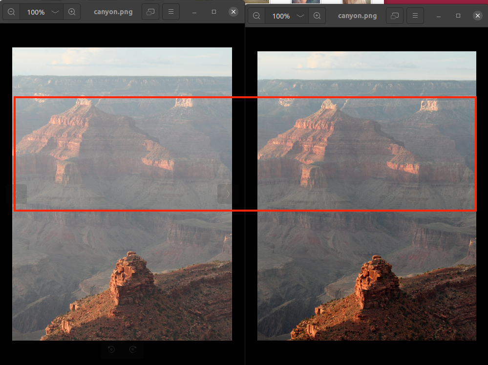
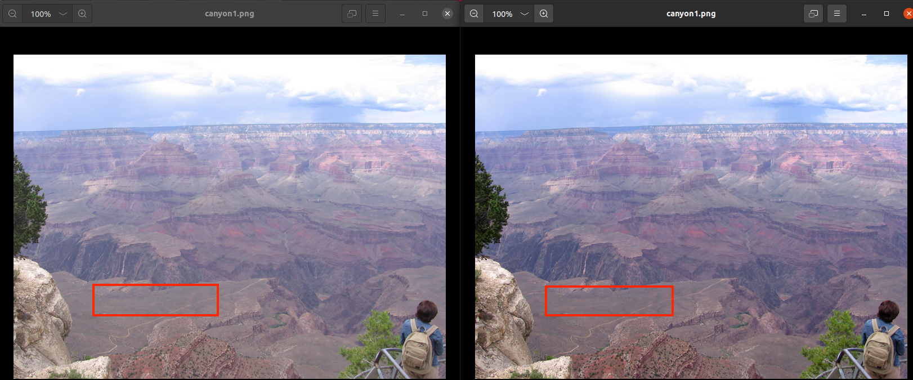
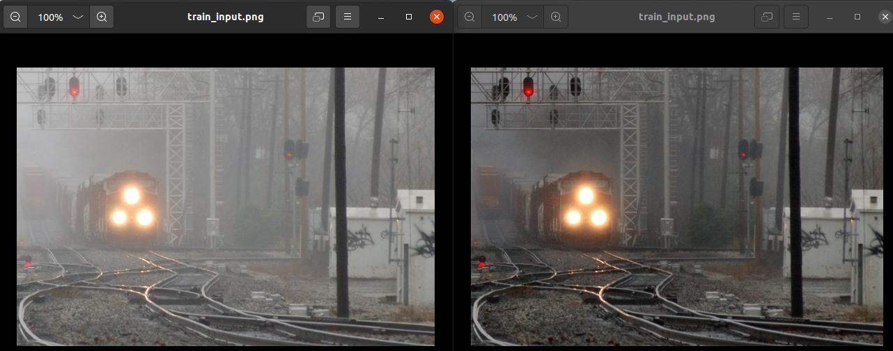
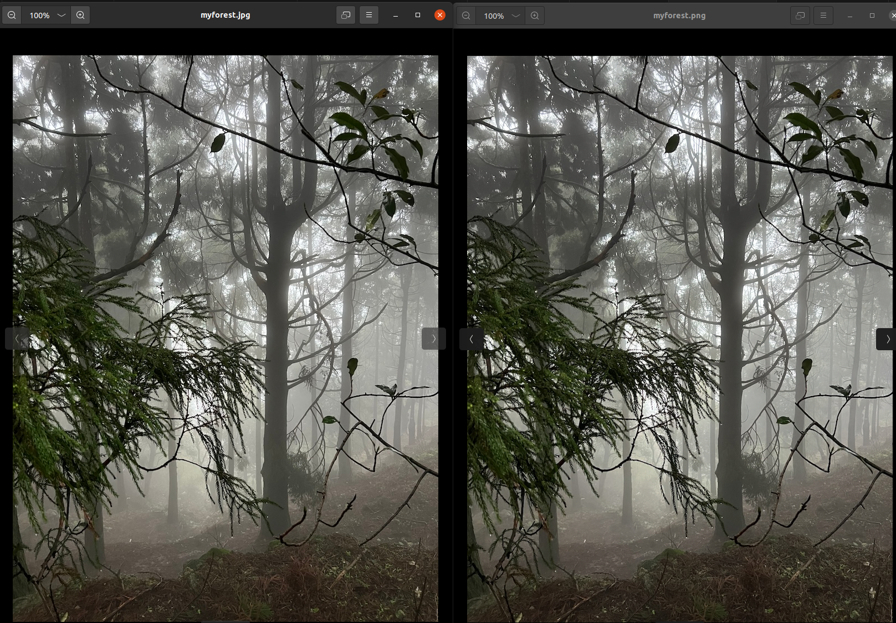
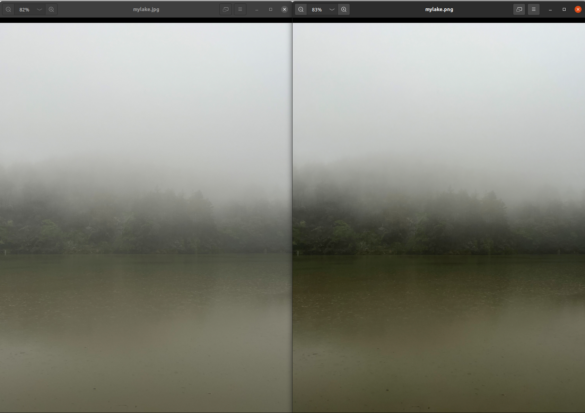

# 《Image Dehazing Transformer with Transmission-Aware 3D Position Embedding 》阅读报告

Fallen

## 一、研究背景与研究内容

### 研究背景

图像去雾作为计算机视觉中的基础预处理步骤，广泛应用于城市监控、无人驾驶、图像理解等场景。然而，雾气对图像的遮挡往往具有空间变异性，特别是在远距离区域更为显著，这对模型的全局感知能力提出了挑战。以往基于卷积神经网络（CNN）的方法虽然在去雾任务中取得了一定效果，但由于其卷积操作的局部感知特性，难以捕捉远距离区域的雾气变化。与此同时，Transformer 模型在图像分类、检测等任务中展现出强大的全局建模能力，然而其在图像复原任务中仍存在细节还原能力不足的问题。因此，如何融合 Transformer 与 CNN 的互补优势，成为推动图像去雾任务性能突破的关键切入点。

### 研究内容

对于单帧图像去雾的图像增强任务，现有方法存在两个关键问题：难以有效建模图像中的远程依赖信息；生成图像细节模糊、清晰度不足。为此，本文提出了一种新型图像去雾方法 DeHamer。该方法将具备全局建模能力的 Transformer 与擅长局部细节表达的 CNN 结合，通过传输感知的三维位置编码（Transmission-aware 3D Position Embedding）注入雾密度先验信息，同时设计特征调制模块实现跨模态特征融合，显著提升了图像去雾的精度与自然度。

## 二、核心理论与方法创新

### 1、传输感知的3D位置嵌入（3D Position Embedding）  

- 动机：传统位置编码仅考虑空间坐标，无法反映图像中雾气分布的不均匀性，限制了模型对区域性雾密度差异的感知与处理能力。

- 实现：  
  
  -  使用暗通道先验（DCP）估算输入图像的传输图 $t = 1 - \text{DCP}(I)$，作为雾密度的第三维坐标 $d$。
  
  -  将像素坐标扩展为三维$ (x, y, d)$，每个维度的坐标 $pos^D$ 使用以下公式进行正弦和余弦编码：：
    $$
    \begin{aligned}
    PE(pos^D, 2i) &= \sin(pos^D / 10000^{2i/p_{\text{total}}}), \\
    PE(pos^D, 2i+1) &= \cos(pos^D / 10000^{2i/p_{\text{total}}}),
    \end{aligned}
    $$
      其中$ ( p_{\text{total}}=32 )$，三个维度合计生成 96 维度的位置嵌入，与 Transformer 的 token 向量一致。
  
  -  最终将嵌入向量与对应图像 patch 的 token 相加，使 Transformer 同时感知空间和雾密度信息。
  

### 2、特征调制模块（Feature Modulation）  

- 动机：Transformer 与 CNN 提取的特征具有不同性质。Transformer 捕捉的是图像全局依赖关系，细节模糊；CNN 特征注重局部结构，纹理清晰。若直接融合这两类特征（如拼接或相加），会导致语义不一致，影响去雾效果。
- 实现：  
  - 对于每一层的 Transformer 特征 $ F_t^s $ ，使用两个独立的卷积模块分别生成调制系数 $\gamma^s$ 和偏置项 $\beta^s$。  
  - 对 CNN 编码器提取的特征$ F_c^s $ 先进行实例归一化（IN）后，按 $\gamma \otimes \text{IN}(F_c) + \beta $调制：
    $$
    F_m^s = G_{\gamma}^s(F_t^s) \otimes \text{IN}(F_c^s) \oplus G_{\beta}^s(F_t^s).
    $$
    其中 $⊙$ 表示逐元素乘法，$⊕$ 表示逐元素加法。
    
  - 这种方式在不破坏 CNN 细节表达能力的前提下，有效将 Transformer 的全局上下文信息引入到特征中，实现特征层级间的精细调控与融合。

### 3、新型网络 DeHamer 结构

DeHamer 网络由五大模块组成，结合了 Transformer 的全局建模能力与 CNN 的局部细节还原能力，结构设计如下：

- **传输感知三维位置编码模块（Transmission-aware 3D Position Embedding）**：引入雾密度先验，通过三维位置编码增强 Transformer 对空间与密度分布的建模能力。
- **Transformer 模块**：基于 Swin Transformer 构建，patch size 设置为 2，采用 3 阶段结构，对应层数为 [2, 2, 2]，多头注意力头数为 [3, 6, 9]，用于提取图像的全局上下文特征。
- **CNN 编码器**：由 3 个卷积块组成，每个块包含两层卷积 + ReLU 激活函数 + 最大池化（MaxPooling），末端加入金字塔池化模块（Pyramid Pooling Module, PPM）以提升多尺度感知能力。
- **特征调制模块**：使用 Transformer 特征作为条件信息，对 CNN 编码器输出的特征进行缩放与偏移调制，有效融合全局与局部信息。
- **CNN 解码器**：通过逐步上采样逐级恢复图像尺寸，并结合多尺度残差块（Multi-scale Residual Block, MRB）强化细节恢复能力，最终生成高质量去雾图像。

## 三、实验设计与结果分析

### 数据集构建

论文研究在多个合成与真实图像去雾数据集上进行了训练和测试，具体如下：

- **训练集**：来自 RESIDE 数据集中两个子集：
  - **ITS (Indoor Training Set)**：包含合成的室内雾图及其对应的清晰图，用于模拟受控环境下的雾气影响。
  - **OTS (Outdoor Training Set)**：包含大量合成的室外场景，覆盖多种天气与雾气条件，提升模型对复杂场景的泛化能力。
- **测试集**：包括以下多个权威标准和真实拍摄数据集：
  - **SOTS (Synthetic Objective Testing Set)**：划分为 Indoor 和 Outdoor 两个子集，用于对模型在标准合成雾图上的性能进行客观评估。
  - **Dense-Haze**：真实场景下采集的高浓度均匀雾图数据集，挑战性高，考验模型的去雾强度与鲁棒性。
  - **NH-HAZE**：同样为真实数据集，采自自然非均匀雾气条件下的复杂环境，适用于验证模型在真实非均质场景中的表现。

### 评价指标

- **对比去雾方法**：DCP（Dark Channel Prior）、AODNet、GridDehazeNet、MSBDN、FFANet、UHD

- **评价指标：**

  - **PSNR（Peak Signal-to-Noise Ratio）峰值信噪比**：衡量增强后图像与清晰图之间的像素级差异，值越高表示图像失真越小。

  - **SSIM（Structural Similarity Index Measure）结构相似性指数**：衡量两张图像在亮度、对比度和结构信息上的相似程度，值越接近 1 表示结构还原越好。

  - **主观可视效果**：通过对比增强图像的色彩还原、纹理保留以及视觉自然度，评价模型的感知质量。

### 实验设置

- 实验环境

  1. **硬件环境**：
     - **GPU**：NVIDIA RTX 3090

  2. **软件环境**：
     - 使用基于 PyTorch 的训练框架实现 Transformer 与 CNN 模块的协同建模。

- **数据处理与训练流程**：
  1. **数据预处理**：
     - 所有图像统一调整尺寸至 256 × 256。
     - 输入图像进行归一化处理。
     - 增加随机水平翻转等数据增强策略。
  2. **模型训练配置**：
     - 优化器：Adam
     - 初始学习率：2e-4，使用余弦退火策略动态调整。
     - 批次大小：16
     - 训练轮数：300 Epoch
     - 损失函数：L1损失与感知损失（Perceptual Loss）结合使用。
     - 使用梯度裁剪与 early stopping 策略防止过拟合。
- **参数设置与模型结构选择**：
  - Swin Transformer 模块采用 patch size = 2 的窗口划分结构。
  - CNN 解码器采用多尺度残差模块（MRB）以增强细节重建。
  - 融合模块中调制方式优于直接相加或拼接方式。

### 实验结果

在多个基准测试数据集上，DeHamer 显示出领先性能：

- **SOTS-Outdoor**：PSNR 达到 **35.18**，SSIM 达到 **0.9860**，在所有比较方法中性能最优。
- **SOTS-Indoor**：在室内合成测试集上同样表现优异，PSNR 达到 **36.63**，SSIM 达到 **0.9881**，整体结构还原效果良好。
- **Dense-Haze** 与 **NH-HAZE**（真实世界数据集）：DeHamer 均取得最优指标，证明其在非均匀真实雾气场景下具备良好泛化能力。

实验结果表明，所提方法在主客观评估中均优于现有代表性去雾模型，具有更好的视觉一致性和图像细节保留能力。

### 消融实验

为验证模型中各模块的有效性，本文进行了系统性的消融实验，主要结论如下：

- **移除三维位置编码（3D Position Embedding）**：将其替换为传统的二维位置编码（2DPE），PSNR 降低了 1.76 dB，说明注入雾密度信息显著提升了去雾质量。
- **移除 Transformer 或 CNN 编码器模块**：
  - 去除 Transformer 模块后，模型缺乏全局建模能力，图像结构还原能力下降明显。
  - 去除 CNN 编码器后，图像局部细节严重缺失，纹理模糊，SSIM 急剧下降。
- **特征融合方式对比**：将特征调制模块替换为简单的拼接或相加方式，实验结果显示调制机制能更有效地引入 Transformer 上下文信息，PSNR 平均提升 0.88 dB，说明特征调制在融合不同模态特征方面更具优势。

## 四、论文方法测试

从作者提供的[GitHub](https://github.com/Li-Chongyi/Dehamer)主页，我将开源代码下载到本地Ubuntu虚拟机运行测试。

### 环境搭建

首先根据作者提供的README文件搭建模型需要的环境

使用conda创建虚拟环境并在该环境中下载环境依赖项

```bash
conda env create -f environment.yaml
conda activate dehamer
```

环境搭建时间可能较长，未安装好的依赖项可以先不安装，可以先激活虚拟环境运行测试代码再根据缺少的项目安装。

### 下载预训练模型

根据作者提供的链接下载预训练模型，并按以下结构存放在在工程目录文件中

```
ckpts
   |- dense
      |- PSNR1662_SSIM05602.pt  
   |- NH
      |- PSNR2066_SSIM06844.pt
   |- indoor
      |- PSNR3663_ssim09881.pt
   |- outdoor
      |- PSNR3518_SSIM09860.pt
```

### 测试

我们可以使用作者已经提供的图像测试集直接进行去雾测试，该测试集存放在`classic_test_image`文件夹中

直接运行命令：

```shell
CUDA_VISIBLE_DEVICES=X python src/test_PSNR.py --dataset-name our_test  
```

测试代码如下：

```python
# --- Imports --- #
import time
import torch
import argparse
import torch.nn as nn
from torch.utils.data import DataLoader
from val_data import ValData
from swin_unet import UNet_emb #UNet
from utils import validation_PSNR, generate_filelist
import os
# --- Parse hyper-parameters  --- #
parser = argparse.ArgumentParser(description='PyTorch implementation of dehamer from Guo et al. (2022)')
parser.add_argument('-d', '--dataset-name', help='name of dataset',choices=['NH', 'dense', 'indoor','outdoor','our_test'], default='NH')
parser.add_argument('-t', '--test-image-dir', help='test images path', default='./data/classic_test_image/')
parser.add_argument('-c', '--ckpts-dir', help='ckpts path', default='./ckpts/outdoor/PSNR3518_SSIM09860.pt')
parser.add_argument('-val_batch_size', help='Set the validation/test batch size', default=1, type=int)
args = parser.parse_args()


val_batch_size = args.val_batch_size
dataset_name = args.dataset_name
# import pdb;pdb.set_trace()
# --- Set dataset-specific hyper-parameters  --- #
if dataset_name == 'NH':
    val_data_dir = './data/valid_NH/'
    ckpts_dir = './ckpts/NH/PSNR2066_SSIM06844.pt'
elif dataset_name == 'dense': 
    val_data_dir = './data/valid_dense/'
    ckpts_dir = './ckpts/dense/PSNR1662_SSIM05602.pt'
elif dataset_name == 'indoor': 
    val_data_dir = './data/valid_indoor/'
    ckpts_dir = './ckpts/indoor/PSNR3663_ssim09881.pt'
elif dataset_name == 'outdoor': 
    val_data_dir = './data/valid_outdoor/'
    ckpts_dir = './ckpts/outdoor/PSNR3518_SSIM09860.pt'
else:
    val_data_dir = args.test_image_dir
    ckpts_dir =  args.ckpts_dir

# prepare .txt file
if not os.path.exists(os.path.join(val_data_dir, 'val_list.txt')):
    generate_filelist(val_data_dir, valid=True)

# --- Gpu device --- #
device_ids =  [Id for Id in range(torch.cuda.device_count())]
device = torch.device("cuda:0" if torch.cuda.is_available() else "cpu")


# --- Validation data loader --- #
val_data_loader = DataLoader(ValData(dataset_name,val_data_dir), batch_size=val_batch_size, shuffle=False, num_workers=4)


# --- Define the network --- #
net = UNet_emb()


  
# --- Multi-GPU --- # 
net = net.to(device)
net = nn.DataParallel(net, device_ids=device_ids)
net.load_state_dict(torch.load(ckpts_dir, map_location='cpu'), strict=False) # 这里修改为兼容cpu-only


# --- Use the evaluation model in testing --- #
net.eval() 
print('--- Testing starts! ---') 
start_time = time.time()
val_psnr, val_ssim = validation_PSNR(net, val_data_loader, device, dataset_name, save_tag=True)
end_time = time.time() - start_time
print('val_psnr: {0:.2f}, val_ssim: {1:.4f}'.format(val_psnr, val_ssim))
print('validation time is {0:.4f}'.format(end_time))
```

运行后我的虚拟机出现以下错误：

```
RuntimeError: Attempting to deserialize object on a CUDA device but torch.cuda.is_available() is False. If you are running on a CPU-only machine, please use torch.load with map_location=torch.device('cpu') to map your storages to the CPU.
```

这是提示当前运行环境下 PyTorch **没有检测到可用的 CUDA 设备**，在 torch.load() 时默认尝试加载到 GPU，结果失败了。因为虚拟机没有GPU等硬件设备(测试使用的设备为MacBook)，因此需要将模型加载语句：

```python
net.load_state_dict(torch.load(ckpts_dir), strict=False)
```

修改成可兼容 CPU-only 环境：

```python
net.load_state_dict(torch.load(ckpts_dir, map_location='cpu'), strict=False)
```

再次运行命令

```shell
(dehamer) morisummer@ubuntu:~/Dehamer-main$ CUDA_VISIBLE_DEVICES=X python src/test_PSNR.py --dataset-name our_test
The dataset is not included in this work.
--- Testing starts! ---
/home/morisummer/miniconda3/envs/dehamer/lib/python3.7/site-packages/torch/nn/functional.py:3458: UserWarning: Default upsampling behavior when mode=bicubic is changed to align_corners=False since 0.4.0. Please specify align_corners=True if the old behavior is desired. See the documentation of nn.Upsample for details.
  "See the documentation of nn.Upsample for details.".format(mode)
val_psnr: 23.74, val_ssim: 0.9479
validation time is 72.1017
```

模型成功加载，完成测试生成了our_test_result文件夹，其中是去雾后的图像集，对比几幅去雾前后的图像







可以看到使用DeHamer模型后，模型既保留了全局细节，让去雾后的图像依然真实，并且达到了较好的去雾效果

除了使用作者提供的图像，我也将两幅自己手机拍摄的真实图像交给模型处理，一下是处理前后的效果：





对比可以发现，模型对第一幅图的去雾效果不是很好，去雾前后图像肉眼没有发现明显区别，但对于第二幅图可以看到显著的去雾效果，对岸的树丛更加清晰，这说明对于一些图像模型的去雾质量会有所降低。

## 五、局限性及改进方向

### 局限性

- **对传统先验的依赖性较强**：模型的三维位置编码依赖于**暗通道先验（DCP）**生成的雾密度图。虽然DCP简单有效，但其在强光、白色物体或阴影区域下易失效，可能导致位置编码信息失真，进而影响去雾质量。
- **模型结构复杂、计算成本较高**：Transformer 模块虽具备强大建模能力，但其计算复杂度随图像分辨率线性增长，限制了模型在资源受限环境（如移动设备、嵌入式系统）中的部署。
- **端到端优化空间有限**：融合多模块结构使得训练过程较为复杂，各模块间协同学习机制尚不够充分，模型调参和收敛难度较高。

### 改进方向

- **引入更鲁棒的雾密度估计机制**：可尝试使用深度学习方法预测雾气分布，减少对传统 DCP 的依赖，提高编码可靠性与适应性。
- **探索轻量级模型结构设计**：通过模型剪枝、权重共享、注意力稀疏化等手段简化 Transformer 模块，或采用混合视觉感知结构（如 MobileViT）实现实时去雾处理。
- **提升多模块协同训练能力**：可引入联合损失函数、多阶段优化、对比学习等机制，提升 Transformer 与 CNN 之间的信息互补效率。
- **扩展到多模态与跨域任务**：未来工作可结合红外、深度图、语义分割等信息进行多模态图像增强，并探索在跨天气、跨区域场景下的泛化能力。

## 六、总结与展望

本文提出的 DeHamer 方法创新性地融合了 Transformer 的全局建模能力和 CNN 的局部表达优势，针对图像去雾任务中的远距离依赖建模困难和局部细节恢复不充分的问题，设计了具备传输感知能力的三维位置编码模块与特征调制机制，从结构设计层面引入任务先验，提升了模型的表达能力与泛化能力。

在多个标准数据集（SOTS-Indoor/Outdoor、Dense-Haze、NH-HAZE）上，DeHamer 均取得了显著优于现有方法的性能表现，主客观评估结果一致，表明该网络结构在图像复原类任务中具有良好适用性和推广价值。

**启示：**

- 有效引入任务先验信息（如雾密度）并通过结构化方式注入模型中，有助于提升网络在特定视觉任务上的适应能力。
- Transformer 的全局建模能力需通过合理设计与 CNN 的局部建模结构协同工作，尤其在图像重建类任务中，融合机制（如调制式融合）相比传统拼接方式更具表现力。
- 模型架构设计应结合任务特性进行定制，单一模块的堆叠难以取得最优结果，多模块协同优化是未来视觉模型演化的重要方向。
