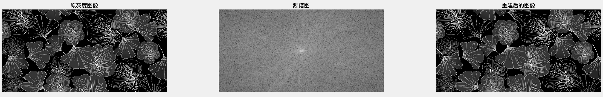
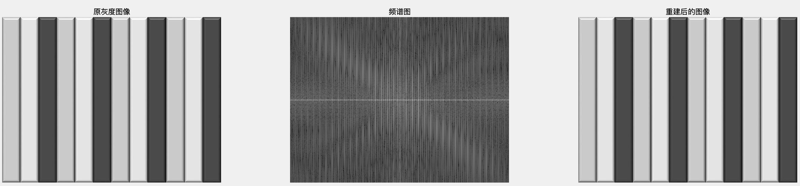
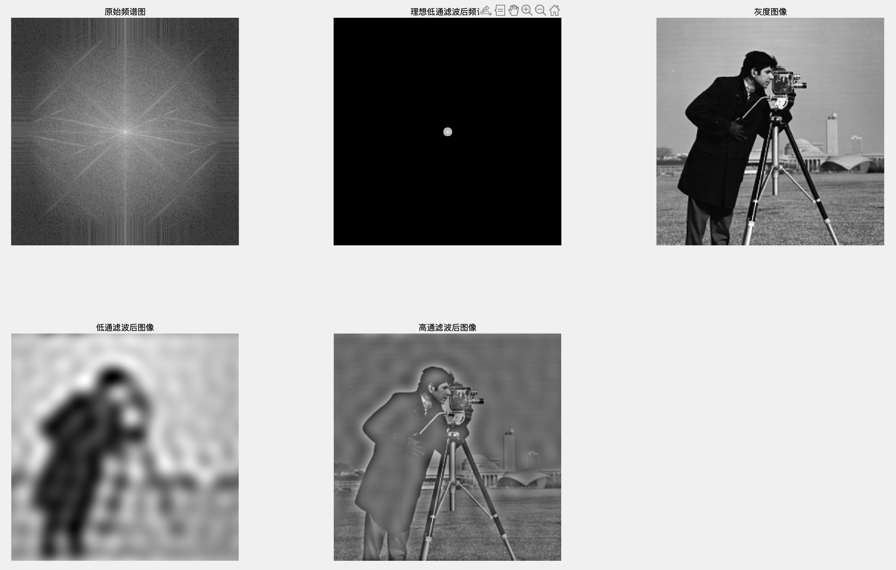
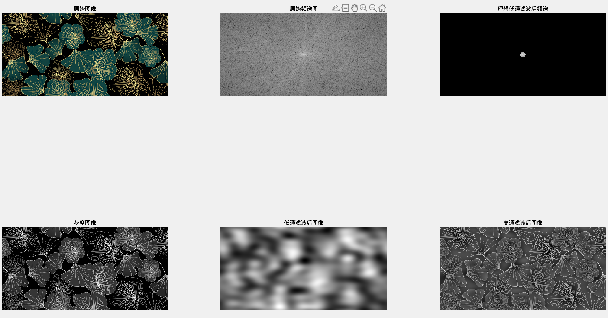
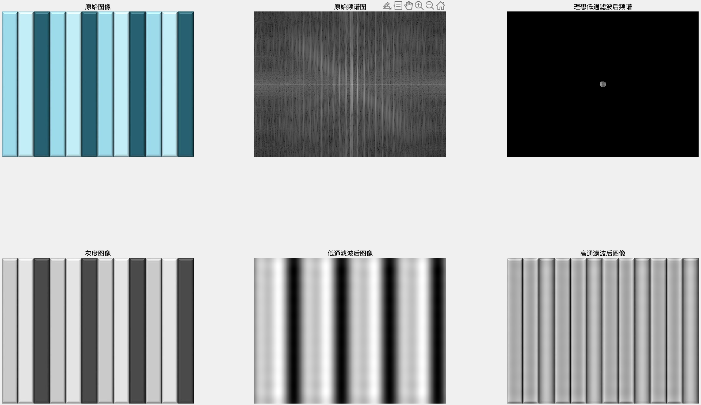

# 第一次作业

Fallen

1. **(论述题) 通过多组不同的图像及其频谱，分析频谱图与图像之间的关系。**

   首先使用 **傅里叶变换（Fourier Transform, FT）** 将图像转换到频域：

   - 对灰度图像应用 **2D 离散傅里叶变换（DFT）**：
     $$
     F(u,v) = \sum_{x=0}^{M-1} \sum_{y=0}^{N-1} f(x,y)\mathrm{e}^{−j2\pi(ux/M+vy/N)}
     $$

   - 使用MatLab编程如下

     ```matlab
     % 读取图像
     img = imread('cameraman.tif');
     
     % 处理不同类型的输入图像，转换为单通道灰度图
     if size(img, 3) == 3
         img_gray = rgb2gray(img);  % RGB 图像转换为灰度
     elseif size(img, 3) == 2
         img_gray = mean(img, 3);   % 双通道图像，取平均
     else
         img_gray = img;            % 灰度图像，直接使用
     end
     
     img_gray_d = double(img_gray); % 转换为 double 类型，确保计算正确
     
     % 计算傅里叶变换
     F = fft2(img_gray_d);
     F_shifted = fftshift(F); % 频谱中心化
     
     % 计算幅度谱（Magnitude Spectrum）
     magnitude_spectrum = abs(F_shifted);
     magnitude_spectrum = log(1 + magnitude_spectrum); % 取对数增强可视化
     ```

     为了便于观察，将低频部分移动到中心，使频谱中心化，并且由于低频分量幅值很大，而高频幅值很小，导致低频部分特别亮，高频部分几乎变成黑色，看不到细节。因此后续绘制频谱时还需要进行一次对数变换，即
     $$
     1 + \log{\lvert F(u, v)\rvert}
     $$
     后续频域可以通过傅立叶逆变换回到空间域，重建图像，验证频谱信息的作用：

     ```matlab
     F_ishift = ifftshift(F_shifted); % 将低频成分移回原位置
     img_reconstructed = real(ifft2(F_ishift)); % 逆变换
     ```

     绘制图片

     ```matlab
     figure;
     subplot(1,3,1);
     imshow(img_gray_d, []), title('原灰度图像');
     subplot(1,3,2);
     imshow(magnitude_spectrum, []);
     title('频谱图');
     subplot(1,3,3);
     imshow(img_reconstructed, []), title('重建后的图像');
     ```

   读取多幅图片，分别观察其频谱和图像之间的关系：

   

   对这一幅图，可以观察到图像对频谱图有**中心高亮区域**，对应了原图像中**大面积的天空**，**背景较为均匀**；

   原图像还中存在较强的水平和垂直边缘：如站立的**人物轮廓线**、**相机三脚架的垂直杆**以及**背景建筑物边缘**，这些结构在空间域上表现为**直线**，在频域中对应的是**垂直或水平的高频分量**，因此频谱图中有明显的**十字形直线**；

   频谱图中斜向亮线对应**向前倾斜的人物**、**三脚架的倾斜杆**，这些结构具有一定的方向性，使得频谱图在这些方向上也出现较强的频率成分；

   画面中仍然存在细节：**人物的服装纹理、草地**，高频区域的点状噪声可能与这些纹理相关。

   

   对这一幅图，图像有大块均匀的黑色背景，这部分主要贡献了低频成分，因此频谱图中心部分较亮；

   由于图像中有清晰的叶的筋络线条，这些线条贡献了较多的高频信息，在频谱中表现为边缘区域的微弱点状分布。

   

   这一幅图相较前两幅图更加规则，可以看到其频谱图是关于中心对称的，且有条高亮的水平高频分量，对应原图中的多条垂直轮廓线。

   

   后续我还对图像进行进行滤波，更加直观地观察频谱图与图像间的关系，可以看到使用**低通滤波器**后图像由于**高频部分被去除**，相应的细节信息也丢失，滤波后的**图像变得模糊**：(截止频率D0=10)

   - 这部分代码如下：

     ```matlab
     % 计算频率距离
     [M, N] = size(img_gray_d);
     [u, v] = meshgrid(-N/2:N/2-1, -M/2:M/2-1);
     D = sqrt(u.^2 + v.^2); % 计算每个点到频谱中心的距离
     
     % 设定截止频率 D0
     D0 = 10; 
     
     % 理想低通滤波器
     L = double(D <= D0);
     % 高通滤波器
     H = 1 - L;
     
     % 频谱图滤波
     F_filtered_L = F_shifted .* L;
     F_filtered_H = F_shifted .* H;
     
     % 逆傅里叶变换
     F_inverse_L = ifft2(ifftshift(F_filtered_L));
     filtered_L_img = real(F_inverse_L);
     
     F_inverse_H = ifft2(ifftshift(F_filtered_H));
     filtered_H_img = real(F_inverse_H);
     
     % 显示结果
     figure;
     i = 0;
     j = 3;
     if size(img, 3) == 3
         i = i + 1;
         subplot(2, j, i); imshow(img, []); title('原始图像');
     elseif size(img, 3) == 2
         i = i + 1;
         subplot(2,j, i); imshow(img(:,:,1), []); title('原始图像(通道1）');
     end
     
     i = i + 1; subplot(2, j, i); imshow(log(1+abs(F_shifted)), []); title('原始频谱图');
     i = i + 1; subplot(2, j, i); imshow(log(1+abs(F_filtered_L)), []); title('理想低通滤波后频谱');
     i = i + 1; subplot(2, j, i); imshow(img_gray_d, []); title('灰度图像');
     i = i + 1; subplot(2, j, i); imshow(filtered_L_img, []); title('低通滤波后图像');
     i = i + 1; subplot(2, j, i); imshow(filtered_H_img, []); title('高通滤波后图像');
     ```

   运行结果如下，可以看到图片经过低频滤波后，频谱图只保留了中心低频部分，图像也变得模糊不清，有些轮廓已分别不出，而高频滤波后的图像轮廓明显，且保留了原图大部分纹理细节

   

   

   

   **总结**

   通过傅里叶变换，可以将图像从**空间域**转换到**频率域**，得到图像对应的频谱图，据此我们可以分析频谱图与图像之间的关系。

   通过实验，我得知**不同类型的图像具有不同的频谱模式**，可以通过对比观察得到：

   - **自然图像** ：频谱图低频主导原图像平滑区域，高频反映原图像边缘和细节，方向性结构与频谱方向性分量一一对应。一般来说，主要信息主要集中在低频，且自然图像的背景较为均匀（如天空），频率变化平滑，因此中心都具有明显的高亮区域。
   - **纹理图像** ：频谱图高频分量占比高，中心也可能存在低频亮区，取决于图像背景，频谱没有明显的对称点阵结构，频谱的连续性反映原图像纹理的随机性和非周期性。 
   - **规则图案** ：原图像的规则结构的周期性和方向性直接决定频谱的对称性与频率分布模式，一般频谱没有中心亮点，且具有特定对称性，由规则边缘（如垂直轮廓线）产生，频谱呈现关于中心对称的垂直/水平亮线。

   通过频谱与滤波验证：

   - **低通滤波**：保留中心低频分量，图像模糊（丢失边缘和细节），频谱仅剩中心亮区。
   - **高通滤波**：保留边缘高频分量，图像保留轮廓但丢失均匀背景，频谱显示外围亮区。

   通过上述验证可知，频谱图直观反映了图像中不同频率成分的分布：

   - **低频**：对应图像整体亮度和平滑区域（如背景）。
   - **高频**：对应边缘、纹理和细节。
   - **方向性特征**：空域中的边缘方向与频域能量分布方向正交（如垂直边缘产生水平高频分量）。

