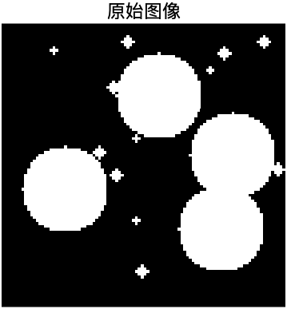
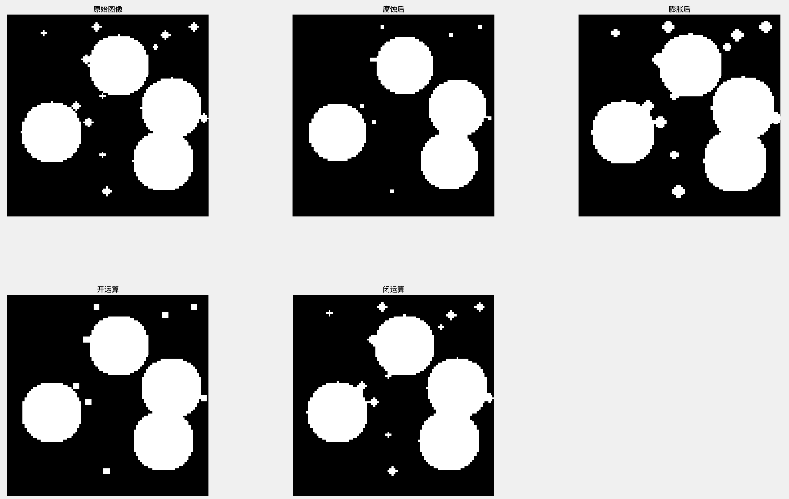
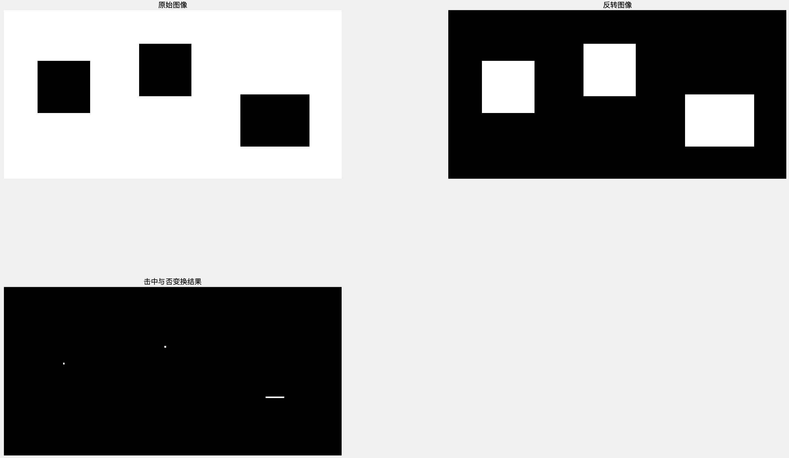
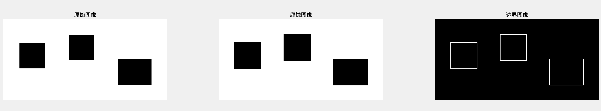
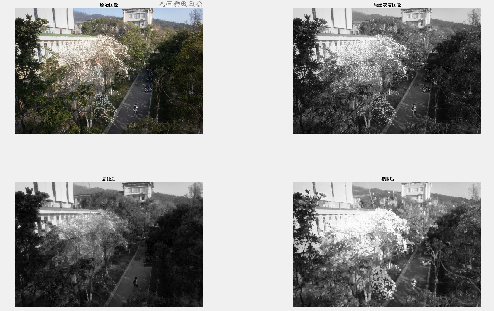
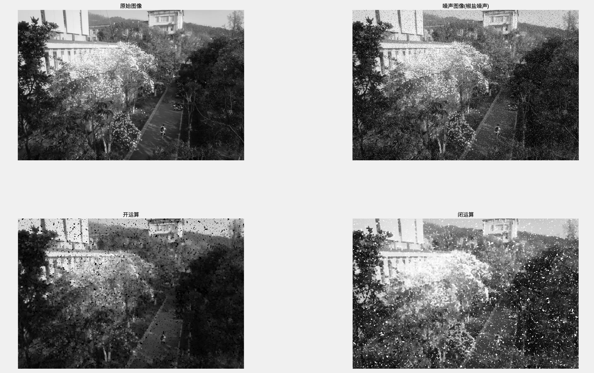
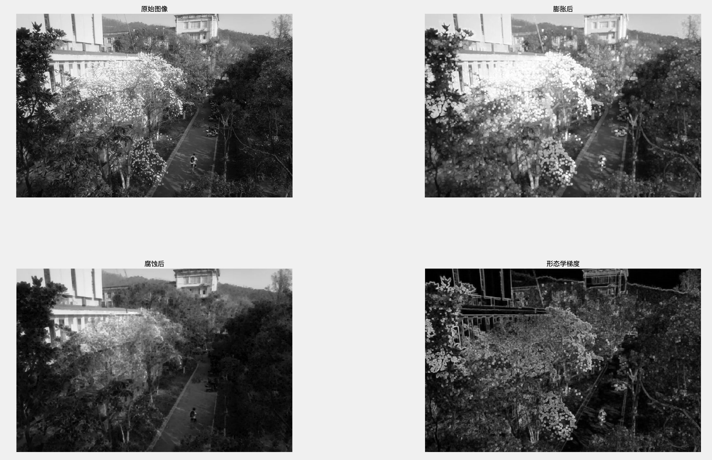

## 形态学算法实践分析

Fallen

形态学操作可以分为**二值形态学**和**灰度形态学**，灰度形态学由二值形态学扩展而来。数学形态学有2个基本的运算，即腐蚀和膨胀，而腐蚀和膨胀通过结合又形成了开运算和闭运算。开运算就是先腐蚀再膨胀，闭运算就是先膨胀再腐蚀。

**形态学（Morphological）算法**是基于图像中物体的几何结构来处理图像的一类算法。这些算法主要用于**图像去噪、边界提取、图像分割、连通区域分析、形态滤波等**任务。

## 二值形态学

首先熟悉一些常用的形态学操作

### 腐蚀

**原理**：若结构元素完全包含在图像局部区域内，才保留中心像素
$$
A \ominus B = \{ z \mid B_z \subseteq A \}
$$
该式子表示用结构B腐蚀A，当B的原点平移到图像A的像元$\space z \space$时，如果B在$\space z \space$处，完全被包含在图像A重叠的区域，(也就是B中为1的元素位置上对应的A图像值全部也为1)则将输出图像对应的像元$\space z \space$赋值为1，否则赋值为0。

### 膨胀

**原理**：通过结构元素在图像上滑动，若结构元素与图像局部区域有交集，则将该区域的中心像素置为前景（白色）
$$
A \oplus B = \{ z \mid ( \hat{B} )_z \cap A \neq \emptyset \}
$$
该式子表示用结构B膨胀A，将结构元素B的原点平移到图像像元$\space z \space$位置。如果B在图像像元$\space z \space$处与A的交集不为空（也就是B中为1的元素位置上对应A的图像值至少有一个为1），则输出图像对应的像元$\space z \space$赋值为1，否则赋值为0。

### 开运算

开运算是**先腐蚀再膨胀**，用来去除小的噪声或突出物
$$
A \circ B = (A \ominus B) \oplus B
$$


### 闭运算

闭运算是**先膨胀再腐蚀**，用来填补小的孔洞或缝隙
$$
A \bullet B = (A \oplus B) \ominus B
$$

了解以上基本形态学操作后，接下来对一些图像进行形态学处理，并分析处理前后的图像差异，加深对腐蚀和膨胀的理解，以及这些形态学图像处理方法的作用

#### 图像预处理

首先先对基本二值图像进行处理，这里使用python生成一副二值图像，并随机在图像中生成白色噪声点，观察腐蚀和膨胀后的图像变化

实现代码

```python
import numpy as np
from PIL import Image

# 创建一个黑底图像
img = np.zeros((100, 100), dtype=np.uint8)

num_noise = 20  # 噪点数量
noise_params = {
    'size': [3, 3, 5, 5, 5, 10, 30],  # 最小噪点尺寸（单像素）
    'shapes': ['circle', 'rect']  # 噪点形状类型
}
#
# 生成随机噪声
np.random.seed(11)  # 固定随机种子保证可重复性11
for _ in range(num_noise):
    # 随机选择形状
    shape = np.random.choice(noise_params['shapes'])

    # 随机生成尺寸（边长）
    size = np.random.choice(noise_params['size'])

    # 计算中心坐标（确保区域不超出图像边界）
    center_row = np.random.randint(0, img.shape[0] - size + 1)
    center_col = np.random.randint(0, img.shape[1] - size + 1)

    # 计算噪点区域的边界
    start_row = center_row
    end_row = start_row + size
    start_col = center_col
    end_col = start_col + size

    # 生成噪点掩模
    if shape == 'rect':
        # 矩形噪点直接填充区域
        img[start_row:end_row, start_col:end_col] = 255
    elif shape == 'circle':
        # 生成圆形掩模（适配区域大小）
        y, x = np.ogrid[:size, :size]
        mask = ((x - size//2)**2 + (y - size//2)**2) <= (size//2)**2
        img[start_row:end_row, start_col:end_col][mask] = 255

# 保存和显示图像
Image.fromarray(img).save('original_image01.png')
```

得到图像为



#### 结构元定义

得到图像后在MATLAB编写代码，对原始图像进行形态学操作，首先定义结构元，MATLAB中提供三种形状的结构元，代码实现如下：

```matlab
se_diamond = strel('diamond', 2);    % 菱形结构元，适用对斜对角方向的处理
se_disk = strel('disk', 3);          % 半径为3像素 圆形结构元，常规边缘处理、去噪
se_line = strel('line', 5, 45);      % 45度线状结构元
```

其中圆形是最常用的结构元之一，后续对图像的处理也采用圆形结构元

#### 执行形态学操作

定义好结构元后，即可对图像进行具体操作，首先读取原始图像，分别对其进行腐蚀、膨胀、开运算、闭运算操作，得到相应的图片

```matlab
img = imread('original_image01.png');
eroded_img = imerode(img, se_disk);
dilated_img = imdilate(img, se_disk);
opened_img = imopen(img, se_disk);
closed_img = imclose(img, se_disk);
```

#### 图像输出与分析

```matlab
figure('Position', [100, 100, 800, 800]);

% 原始图像与处理结果
subplot(3,3,1); imshow(img); title('原始图像');
subplot(3,3,2); imshow(eroded_img); title('腐蚀后');
subplot(3,3,3); imshow(dilated_img); title('膨胀后');
subplot(3,3,4); imshow(opened_img); title('开运算');
subplot(3,3,5); imshow(closed_img); title('闭运算');

% 将结构元素转换为二值图像（用于可视化）
se_disk_img = getnhood(se_disk);
se_line_img = getnhood(se_line);
se_diamond_img = getnhood(se_diamond);

% 显示结构元素图像
subplot(3,3,6); imshow(se_disk_img); title('结构元素（圆形）');
subplot(3,3,7); imshow(se_line_img); title('结构元素（线状）');
subplot(3,3,8); imshow(se_diamond_img); title('结构元素（菱形）');

```

最终得到的结果如下：



- 对比腐蚀、膨胀前后的图像

  - 对于腐蚀操作可以看到图像中小块的白色像素被消除，被保留的小圆形周围的小锯齿被消除，只保留了尺寸较大的圆形
  - 对于膨胀操作，可以看到每个白色圆形都扩大了，出现了相连的情况

  以此可以得知腐蚀操作会**“擦除”**白色物体边缘的像素，膨胀操作会**“填充”**白色物体边缘的邻域，使图像变大。综上，所以可以看作膨胀是将二值图像的白色区域扩大，腐蚀是将黑色区域扩大。

- 开运算、闭运算前后图像

  - 开运算是将图像先用结构元进行腐蚀再膨胀，可以看到处理后的图像一些无关细节（较小的白色噪点）被消除，且保留下来的圆形边界更加平滑
  - 闭运算是将图像先用结构元进行膨胀再腐蚀，可以看到处理后的图像中原来邻近噪点被连接

  以此可知开运算可以对图像轮廓进行平滑，使狭窄的“地峡”形状断开，去掉细的突起，闭运算也是趋向于平滑图像的轮廓，但与开运算相反，它一般使窄的断开部位熔合，填补轮廓上的间隙

### 击中与否变换

设二值图像为 A，结构元素为两个部分：

- **前景结构元素**：B1，表示我们要匹配的前景部分（即要命中的位置）；

- **背景结构元素**：B2，表示我们希望这些位置是背景（即要避开的地方）；

则击中与否变换的定义
$$
A \otimes B = (A \ominus B1) \cap (A^c \ominus B2)
$$
即：**图像 A 经过 B1 的腐蚀，图像 A 的补集（背景）经过 B2 的腐蚀，然后两者交集。**

#### 图像预处理

同样先用python生成一个简单的二值图像，这个图像是白色背景，其中包含三个黑色方块

```python
import cv2
import numpy as np
import matplotlib.pyplot as plt

# 创建白底图像（100x200）
img = np.ones((100, 200), dtype=np.uint8) * 255

# 添加三个黑色矩形块
cv2.rectangle(img, (20, 30), (50, 60), 0, -1)   # 左上
cv2.rectangle(img, (80, 20), (110, 50), 0, -1)  # 中上
cv2.rectangle(img, (140, 50), (180, 80), 0, -1) # 右下

# 保存图像
cv2.imwrite('origin_img_HTM.png', img)
```

#### 结构元定义

这里定义一个结构元用于匹配黑块，找出图像中黑块的位置

```matlab
se_fore = strel('arbitrary', ones(31,31));  % 结构元：31x31 全 1，用于匹配黑块
```

#### 图像处理

```matlab
% 读取图像并二值化
bw = imread('origin_img_HMT.png');

% 注意匹配的是黑块（值为 0），所以对 bw 取反
bw_neg = ~bw;

% 腐蚀处理（只匹配到与结构元完全一致的区域）
hit_miss = imerode(bw_neg, se_fore);
```

#### 图像输出与分析

```matlab
figure;

subplot(2,2,1); imshow(bw); title('原始图像（二值）');
subplot(2,2,2); imshow(bw_neg); title('反转图像（黑块为前景）');
subplot(2,2,3); imshow(hit_miss); title('击中与否变换结果');
```



可以看到击中与否变换的后的图像中有两个白色像素，这就是两个31x31大小的黑块中心点位置，对于31x41的图像，击中与否变换后的结果是一个大小1x10的长条，因此击中与否变换的用处是 **在图像A中寻找图像B在A中的位置**。


熟悉基本形态学操作后，对于二值图像，有许多形态学算法，这里我选择使用并分析边界抽取算法

### 边界抽取算法

#### 原理

边界抽取是从**二值图像中提取前景物体的边缘轮廓**的一种方法。通常应用于图像分割后，想看到“物体的边缘线”。

边界抽取最经典的公式是
$$
\text{Boundary}(A) = A - (A \ominus B)
$$
即：**前景区域减去其“收缩”结果，得到的是前景物体的边界**

#### 代码实现

```matlab
clc; clear; close all;

% 读取图像

%%
bw = imread('MATLAB/lena_color_256.tif');
if size(bw,3) == 3
    bw = rgb2gray(bw);
end
bw = imbinarize(bw); % 转换为二值图像
%%

% 定义结构元
se = strel('square', 3);	% 标准边界

% 腐蚀
eroded = imerode(bw, se);

% 边界抽取
boundary = bw - eroded;
%%

% 显示
figure;
subplot(1,3,1); imshow(bw); title('原始图像');
subplot(1,3,2); imshow(eroded); title('腐蚀图像');
subplot(1,3,3); imshow(boundary); title('边界图像');
```

#### 结果分析

处理图像后的结果：



可以看到用3x3大小的结构元处理图像后，图像中方形边界被提取出来，同样处理自然图像，结果如下，可以看到人物和背景的轮廓都被提取出来，边界提取算法顾名思义，就是用于提取物体边界，可应用于图像检测。


## 灰度形态学

灰度形态学（Grayscale Morphology）是形态学算法在灰度图像上的扩展，通过结构元素对图像的灰度值进行操作，主要用于**图像平滑、边缘检测、噪声抑制、形态特征提取**等任务。

### **基本操作**

由二值形态学扩展而来，因此同二值形态学一样，灰度形态学也有腐蚀、膨胀、开运算、闭运算操作。

#### 灰度腐蚀

原理：缩小图像中亮区域的尺寸，降低亮度。
$$
(f \ominus b)(x,y) = \min_{(s,t) \in b} \left[ f(x + s, y + t) - b(s,t) \right]
$$

#### 灰度膨胀

原理：扩大亮区域，增强亮度。
$$
(f \oplus b)(x,y) = \max_{(s,t) \in b} \left[ f(x - s, y - t) + b(s,t) \right]
$$

#### 开操作

原理：先进行灰度腐蚀再灰度膨胀
$$
f \circ b = (f \ominus b) \oplus b
$$

#### 闭操作

原理：先进行灰度膨胀再灰度腐蚀
$$
f \bullet b = (f \oplus b) \ominus b
$$
了解以上对灰度图像的基本形态学操作后，接下来对一些图像进行形态学处理，并分析处理前后的图像差异，加深对腐蚀和膨胀的理解，以及这些形态学图像处理方法的作用

##### 图像预处理

```matlab
% 读取灰度图像
img = imread('hnu.jpeg');
if size(img,3) == 3
    gray_img = rgb2gray(img);
end
```

##### 结构元定义

```matlab
% 定义结构元素（圆形，半径3）
se = strel('disk', 3);
```

##### 执行灰度形态学操作

```matlab
% 执行腐蚀与膨胀
eroded = imerode(gray_img, se);
dilated = imdilate(gray_img, se);


% 添加噪声
sp_noise = imnoise(gray_img, 'salt & pepper', 0.05);  % 椒盐噪声
gauss_noise = imnoise(gray_img, 'gaussian', 0, 0.01);  % 高斯噪声
speckle_noise = imnoise(gray_img, 'speckle', 0.04);    % 斑点噪声
% 开运算
opened = imopen(gray_img, se);

% 闭运算
closed = imclose(gray_img, se);

% 显示结果
subplot(1,2,1); imshow(opened); title('开运算');
subplot(1,2,2); imshow(closed); title('闭运算');
```

##### 图片输出与分析

```matlab
% 显示结果
subplot(2,2,1); imshow(img); title('原始图像');
subplot(2,2,2); imshow(gray_img); title('原始灰度图像');
subplot(2,2,3); imshow(eroded); title('腐蚀后');
subplot(2,2,4); imshow(dilated); title('膨胀后');

figure;
% 显示结果
subplot(2,2,1); imshow(gray_img); title('原始图像');
subplot(2,2,2); imshow(sp_noise); title('噪声图像(椒盐噪声)');
subplot(2,2,3); imshow(opened); title('开运算');
subplot(2,2,4); imshow(closed); title('闭运算');
```

首先分析腐蚀和膨胀后的图像



- 对比腐蚀、膨胀后的图像

  - 对于腐蚀后的图像，可以观察到，白色的花朵区域明显缩小，细节变得模糊，背景的暗区域则变得更加明显，即腐蚀后的图像整体亮度都降低，且一些细节变得模糊，边缘变弱
  - 对于膨胀后的图像，可以观察到，白色花朵部分变得更亮更大，一些边缘模糊的区域被“填补”或加强，使图像的亮部更加突出，膨胀后图像整体亮度都上升，原本亮区变得更加突出，并且相邻的高亮区域被连接

  综上，可以认为，腐蚀灰度图像会收缩白色区域，增强黑色区域，膨胀灰度图像会扩展亮部区域。

  

继续在灰度图像的基础上，加入椒盐噪声，并对其进行开运算和闭运算的形态学处理，分析二者对图像噪声的抑制效果：



- 对比开操作、闭操作后的图像

  - 对于开操作后的图像，部分白色噪声被有效去除，但由于开运算本身具有“削弱亮区域、保留暗区域”的特性，因此图像整体变暗，且对于黑色噪声的抑制不明显。
  - 对于闭操作后的图像，黑色噪声有所减少，图像亮度得到一定程度的恢复，但同时白色噪声点仍然存在。

  综上，开运算在去除白色噪声方面更有效，而闭运算在去除黑色噪声方面更有优势。在实际图像预处理过程中，可以根据噪声的特性选择合适的操作，或结合使用两者以达到更好的去噪效果。

### **形态学梯度算法**

#### 原理

形态学梯度算法是一种基于形态学操作的边缘检测方法，通过计算图像膨胀与腐蚀的差异来提取梯度信息。形态学梯度通常通过膨胀后的图像减去腐蚀后的图像，得到的差值即为梯度图像

对灰度图像 f 和结构元 B ，形态学梯度定义为：
$$
\text{Gradient}(f) = (f \oplus B) - (f \ominus B)
$$

#### 代码实现

```matlab
clc; clear; close all;

% 读取灰度图像
img = imread('hnu.jpeg');
if size(img,3) == 3
    gray_img = rgb2gray(img);
else
    gray_img = img;
end

gray_img = im2double(gray_img); % 归一化到[0,1]

%%
% 圆形结构元素（半径3）
se = strel('disk', 3); 

%%
% 膨胀与腐蚀
dilated = imdilate(gray_img, se);
eroded = imerode(gray_img, se);

% 计算梯度
gradient = dilated - eroded;

%%
figure('Position', [100, 100, 1200, 400]);
subplot(1,4,1); imshow(gray_img); title('原始图像');
subplot(1,4,2); imshow(dilated); title('膨胀后');
subplot(1,4,3); imshow(eroded); title('腐蚀后');
subplot(1,4,4); imshow(gradient); title('形态学梯度');
```

#### 结果分析

处理后图像的结果：



观察形态学梯度处理后的图像，可以看到：

- 树木、叶子的轮廓（树冠边缘）被强化，形成明暗分明的边界。
- 建筑物的边缘（如墙体、屋顶）因梯度突显，细节如窗户轮廓更清晰。

因此灰度形态学梯度算法能强化图像边缘，突显物体轮廓，适用于边缘检测、特征提取。

## 总结

本次实践分析，我系统梳理了形态学算法的理论框架，通过二值/灰度图像实验验证了腐蚀、膨胀、开闭运算等操作的实际效果，并结合击中与否变换、边界抽取等高级应用展示了其在噪声抑制、特征提取等场景中的价值。未来可通过多尺度融合与深度学习结合，进一步拓展形态学算法的应用边界。