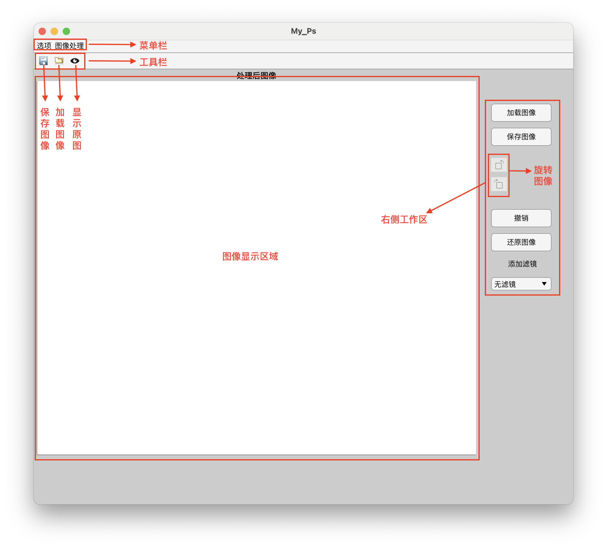
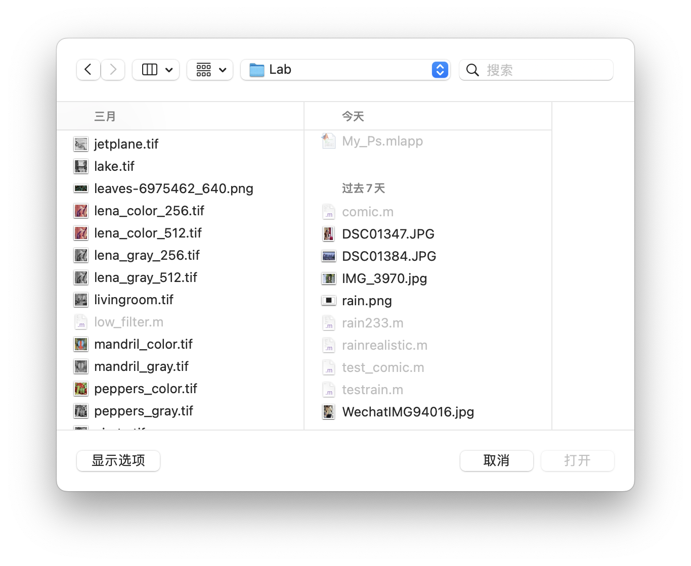
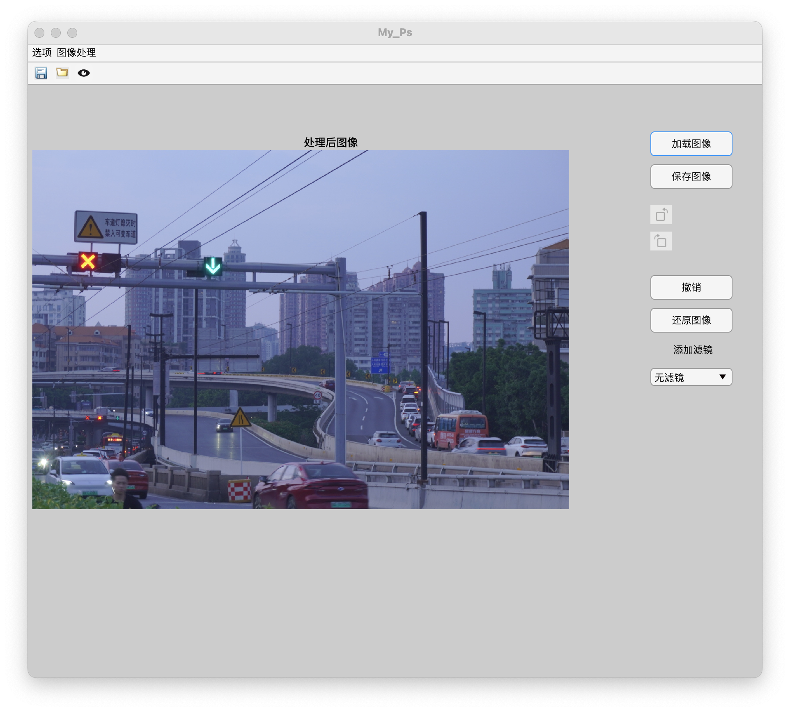
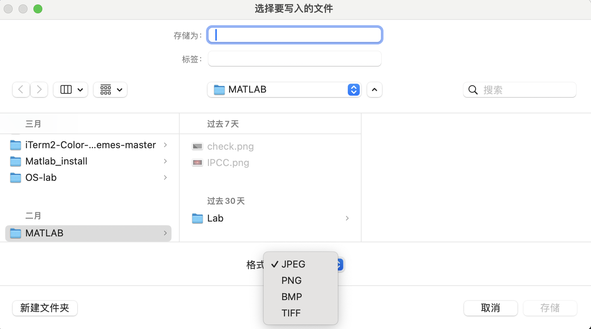
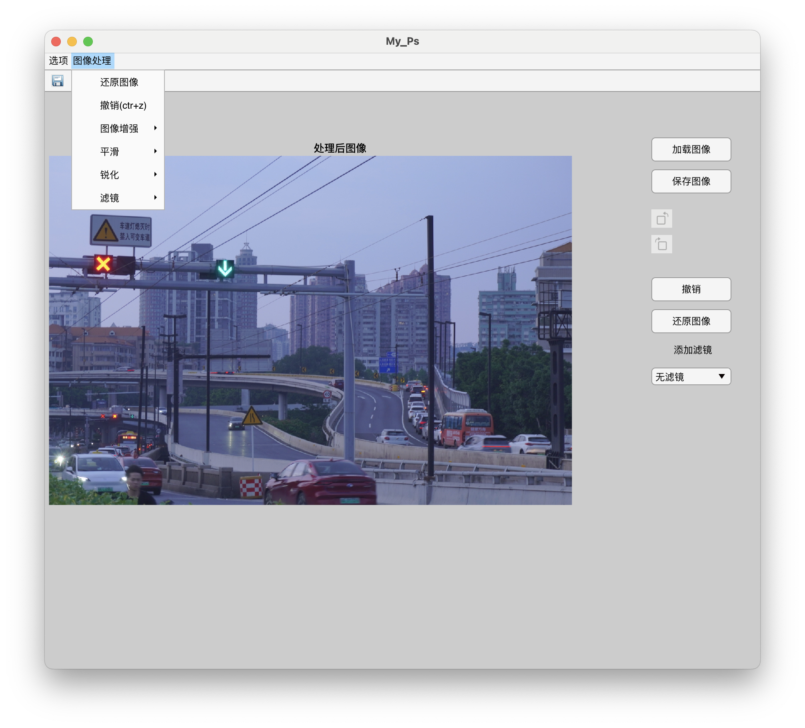
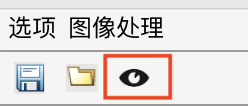

# My_Ps使用说明

## 1、软件简介

**My_Ps** 是一款基于 MATLAB App Designer 开发的简易图像处理软件，集成了常用的图像增强、滤波、锐化、滤镜和图像变换功能，适用于图像处理学习、实验演示及日常图像编辑任务。

## 2、运行环境

- **开发平台**：MATLAB R2021b 及以上版本
- **运行方式**：
  - 方式一：双击My_Ps.mlappinstall将程序安装到MATLAB中，在**我的APP**中找到My_ps，点击即可启动图形界面程序
  - 方式二：解压在文件路径My_Ps/for_testing中，找到My_Ps.app文件，双击运行

## 3、功能介绍与使用方法

基本界面介绍：

#### 3.1 图像加载与保存

- 点击右侧**“加载图像”**按钮，弹出窗口后选择需要处理的图像

  
- 加载成功后，图像将显示在主界面的显示区域；

  
- 点击 **“保存图像”** 按钮可将处理后的图像保存为本地文件；

  
- 应用支持 TIFF、PNG、JPG、BMP等格式

#### 3.2 图像处理功能

| **功能类别** | **功能选项**                               | **使用说明**                                                 |
| ------------ | ------------------------------------------ | ------------------------------------------------------------ |
| 图像增强     | 直方图均衡、对数变换                       | 菜单栏选择**图像增强**子菜单，直接点击按钮执行，自动作用于当前图像 |
| 平滑处理     | 中值滤波、均值滤波、高斯滤波               | 菜单栏选择**平滑**子菜单，选择需要的滤波器，会弹出参数设置窗口（卷积核大小、sigma），调整后点击“确认”应用 |
| 锐化处理     | Laplacian、Sobel、Roberts、Unsharp Masking | 菜单栏选择**锐化**子菜单，通过选择锐化方式进行增强           |
| 图像滤镜     | 复古滤镜、冷暖滤镜、HDR、夜景、雨天        | 菜单栏选择**滤镜子菜单**或使用**下拉框**选择滤镜，自动应用对应效果 |
| 图像变换     | 图像旋转                                   | 点击右侧旋转图案，实现顺/逆时针旋转，可支持任意角度输入      |

所有功能集中在菜单栏的**“图像处理”**子菜单下：

#### 3.3 图像比较与撤销、还原

- 点击工具栏**“眼睛”**图标，可快速对比原始图像与当前处理图

  

- 点击 **“撤销”** 可撤销最近一次图像处理操作，支持多次撤销；

- 点击**“还原图像”**可一键将图像还原

#### 3.4 快捷键支持

| **快捷键** | **功能**         |
| ---------- | ---------------- |
| Ctrl+N     | 新建图像（加载） |
| Ctrl+S     | 保存图像         |
| Ctrl+Z     | 撤销上一步操作   |

### 4、注意事项

- 建议加载分辨率适中的图像，避免因过大图像导致处理时卡顿；
- 某些功能仅适用于 RGB 彩色图像（滤镜），处理灰度图像时请注意；
- 所有处理操作均在当前图像副本上进行，原图始终可恢复；