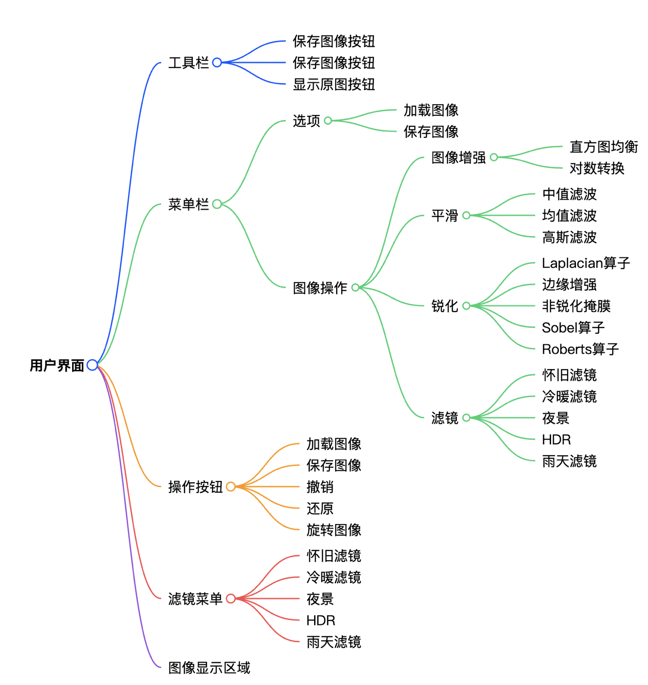
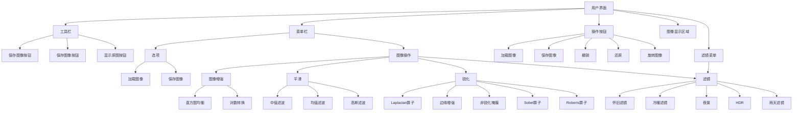

# 软件设计报告

fallen

## 实验要求

仿照photoshop、GIMP、美图等图像处理软件，请设计一款图像处理软件，覆盖图像缩放、增强、颜色变换、滤镜、分割、识别等至少三个功能（不限于上述功能）。 

## 1、软件概述

My_Ps 是一款基于 MATLAB App Designer 开发的图像编辑软件，旨在提供基础的图像处理功能，包括图像加载与保存、图像增强、平滑处理、锐化处理以及多种滤镜效果。软件采用面向对象的设计思想，将界面组件与图像处理逻辑分离，实现了良好的可维护性和可扩展性。

## 2、软件架构设计

### 2.1 整体架构

My_Ps 采用了 Model-View-Controller (MVC) 架构模式，虽然 MATLAB App Designer 对该模式进行了一定封装，但整体结构仍遵循这一设计原则：

- **View（视图层）**：包含所有 UI 组件，如菜单、工具栏、按钮、图像显示区域等，负责用户交互和结果展示。
- **Model（模型层）**：包含**图像数据**和**图像处理算法**，负责存储原始图像、处理后图像以及图像历史记录，实现各种图像处理功能。
- **Controller（控制层）**：包含**回调函数**和**处理逻辑**，负责响应用户操作，调用模型层的算法对图像进行处理，并更新视图层的显示。

### 2.2 类设计

软件的核心是 `My_Ps` 类，继承自 `matlab.apps.AppBase`，主要包含以下部分：

#### 2.2.1 属性 (Properties)

- **公共属性 (Public Properties)**：包含所有 UI 组件的引用，如 `My_PsUIFigure`（主窗口）、各种菜单、工具栏、图像显示控件等，用户可直接访问和交互。
- **私有属性 (Private Properties)**：
  - `OriginalImage`：存储最初加载的原始图像，用于处理前后图像对比、还原操作
  - `ProcessedImage`：存储当前处理后的图像，是主要的显示图像
  - `ImageHistory`：图像历史记录，用于撤销操作
  - `HistoryIndex`：当前历史索引，用于快速访问历史记录
  - `IsShowingOriginal`：标记是否显示原始图像
  - `ImageBeforeFilter`：保存滤镜处理前的图像，支持重复选择滤镜，不会有滤镜叠加
  - `FilterList`：保存历史使用过的滤镜，用于撤销操作
  - `FilterIndex`：当前历史滤镜索引，用于快速访问历史记录，恢复显示

#### 2.2.2 方法 (Methods)

- **私有方法 (Private Methods)**：实现核心图像处理算法，如直方图均衡、对数变换、各种滤波操作、锐化处理和滤镜效果等。
- **回调方法 (Callback Methods)**：处理用户交互事件，如菜单选择、按钮点击、键盘操作等。
- **组件初始化方法 (Component Initialization Methods)**：生成和配置 UI 组件属性，包括生成位置、显示文本等。
- **应用生命周期方法 (App Creation and Deletion Methods)**：包括构造函数和析构函数，处理UIFigure 和所有 UI 控件的创建和删除。

### 2.3 模块划分

My_Ps 软件可分为以下几个主要模块：

1. **用户界面模块**：负责创建和管理所有 UI 元素，包括菜单、工具栏、按钮、图像显示区域等。
2. **图像加载与保存模块**：处理图像的导入和导出操作，支持常见图像格式。
3. **图像增强模块**：实现直方图均衡、对数变换等图像增强功能。
4. **图像平滑模块**：提供中值滤波、均值滤波和高斯滤波等平滑处理功能。
5. **图像锐化模块**：实现多种锐化算法，包括Laplacian算子、Sobel 算子、Roberts 算子等。
6. **滤镜效果模块**：提供复古滤镜、冷暖色调调节、夜景效果和 HDR 等滤镜效果。
7. **撤销与还原模块**：管理图像历史记录，支持撤销操作和还原到原始图像。

### 2.4 整体预览





## 3、算法设计

### 3.1图像增强算法

#### 3.1.1 直方图均衡化

直方图均衡化的目标是使变换后的图像的像素值占有全部的灰度级并且分布均匀，从而得到一幅**灰度级丰富且动态范围大的**图像，从而增强图像的对比度。算法步骤如下：

1. 计算图像的直方图，统计每个灰度级的像素数量。
2. 将直方图转换为归一化的概率分布。
3. 计算累积分布函数 (CDF)，将原始灰度级映射到新的灰度级。
4. 对映射得到的新灰度级重新量化，更新图像中每个像素的灰度值。

```matlab
function out = equalizeSingleChannel(~, channel)
    hist = zeros(1, 256);
    [m, n] = size(channel);

    % 计算直方图
    for i = 1:m
        for j = 1:n
            hist(channel(i, j) + 1) = hist(channel(i, j) + 1) + 1;
        end
    end
    % 归一化直方图
    hist = hist ./ (m * n);
    
    % 计算累计分布函数
    cdf = zeros(1, 256);
    for k = 0:255
        cdf(k + 1) = sum(hist(1:k + 1));
    end
    
    % 重新量化映射
    min_cdf = min(cdf);
    out = uint8(arrayfun(@(x) floor((cdf(x + 1) - min_cdf) / (1 - min_cdf) * 255 + 0.5), channel));
end
```

在实际图像处理中，软件实现对灰度图像和RGB图像的兼容，对RGB图像，分别对每个通道使用直方图均衡：

```matlab
function imgOut = histogramEqualization(app, img)
    if size(img, 3) == 1  % 灰度图
        imgOut = equalizeSingleChannel(app, img);
    else  % RGB 图像，每个通道分别处理
        imgOut = zeros(size(img), 'like', img);
        for c = 1:3
            imgOut(:, :, c) = equalizeSingleChannel(app, img(:, :, c));
        end
    end
end
```


#### 3.1.2 对数变换

对数变换是另一种灰度变换的方法，其采用的灰度变换函数为对数函数$s = c \cdot log(1 + r)$，其中$c$为常数，对数变换可以扩展图像中的暗像素值，压缩亮像素值，常用于增强图像中的暗部细节，代码实现如下：

```matlab
function img_out = logTransform(~, img)
    img = double(img);
    
    if size(img, 3) == 1  % 灰度图
        img = log(1 + img);
        img = img / max(img(:)) * 255;
        img_out = uint8(img);
    else  % RGB图
        img_out = zeros(size(img));
        for ch = 1:3
            channel = log(1 + img(:,:,ch));
            channel = channel / max(channel(:)) * 255;
            img_out(:,:,ch) = channel;
        end
        img_out = uint8(img_out);
    end
end
```

### 3.2 图像平滑算法

> [!TIP]
>
> 实现平滑和锐化前，在**实验二**中已经实现了卷积运算函数**convolution**以及图像填充方法**replicatePad**，算法设计中不再赘述

图像平滑处理能减弱或消除图像的高频分量，**是增加低频的空间域滤波技术**。因为高频分量对应图像中的区域边缘等**灰度值变化较大、较快**的部分，滤波器将这些分量滤除从而使图像平滑。软件中实现了三种平滑滤波：

#### 3.2.1 中值滤波

中值滤波是一种非线性滤波方法，能够有效去除椒盐噪声，同时保持边缘，中值滤波就是用一个含有奇数点的移动窗口，将窗口中心点的值用窗口内各点的中值代替，即：
$$
g(x, y) = \text{Med}_{(s,t) \in S_\text{xy}} \{ f(x, t) \}
$$
式中：$S_{xy}$为以像素$(x,y)$为中心的含有奇数个像素点的邻域窗口，$\{f(s,t)\}$；为窗口$S_{xy}$内所有像素灰度值按大小排序后的一维数据序列    

```matlab
function channelFiltered = applyMedian(app, channel, padSize)
    [rows, cols] = size(channel);
    paddedImg = replicatePad(app, double(channel), [padSize, padSize]);	%填充算法已实现
    channelFiltered = zeros(size(channel), 'like', channel);	%初始化一个与channel大小相同且数据类型一致的零矩阵
    
    for i = 1:rows
        for j = 1:cols
            window = paddedImg(i:i+2*padSize, j:j+2*padSize);
            channelFiltered(i, j) = median(window(:));		%在窗口中选择中值作为中心像素处理后的值
        end
    end
end
```

在实际图像处理中，软件实现对灰度图像和RGB图像的兼容，对RGB图像，分别对每个通道使用中值滤波：

```matlab
function filteredImg = medianFilter(app, img, kernelSize)
    padSize = floor(kernelSize / 2);

    if size(img, 3) == 1  % 灰度图
        filteredImg = applyMedian(app, img, padSize);
    else  % RGB 图
        filteredImg = zeros(size(img), 'like', img);
        for c = 1:3
            filteredImg(:, :, c) = applyMedian(app, img(:, :, c), padSize);
        end
    end
end
```

#### 3.2.2 均值滤波

均值滤波是一种线性滤波，**邻域平均滤波器**的输出（响应）是包含在滤波器模板邻域内像素的**简单平均值**，因此，这些滤波器也称**均值滤波器**，是一种低通滤波器。

```matlab
function filteredImg = meanFilter(app, img, kernelSize)
    kernel = ones(kernelSize, kernelSize) / (kernelSize^2);
    filteredImg = app.convolution(img, kernel);
end
```

卷积核中的系数归一化后都取相同值，以此对领域内像素施加相同的权重。

#### 3.2.3 高斯滤波

高斯滤波使用高斯核进行加权平均，能够在平滑图像的同时保持更好的边缘特性。高斯滤波与均值滤波类似，都是矩形窗口内所有像素点的像素值加权和，只不过其权重与均值滤波不一样。高斯滤波是利用 **二维高斯函数** 对图像进行加权平均，距离越近的像素权重越大，越远的像素权重越小：
$$
w(x, y) = \frac{1}{2\pi\sigma^2} \cdot e^{-\frac{x^2 + y^2}{2\sigma^2}}
$$
其中：

- $(x, y)$：相对于中心的坐标
- $\sigma$​：标准差，控制模糊程度，越大模糊越强
- $\frac{1}{2\pi\sigma^2}$是归一化因子，为了使加权和之后的值不超过像素值本来的最大范围，需要对权制进行归一化操作

算法步骤：

1. 计算领域内每个像素相对中心的坐标
2. 根据高斯函数公式算出每个位置的权值$w$
3. 对高斯核归一化
4. 将高斯核应用到卷积运算中

```matlab
function filteredImg = gaussFilter(app, img, k, sigma)
    center = floor(k / 2);		% 高斯核的中心索引
    
    range = -center:center; 
    n = length(range); 

    % 初始化 X 和 Y
    X = zeros(n, n);
    Y = zeros(n, n);

    for i = 1:n        
        for j = 1:n    
            X(i, j) = range(j);
            Y(i, j) = range(i);  
        end
    end
    kernel = exp(-(X.^2 + Y.^2) / (2 * sigma^2));
    kernel = kernel / sum(kernel(:));
    
    filteredImg = app.convolution(img, kernel);
end
```

### 3.3 图像锐化算法

锐化处理的主要目的是突出灰度的**过渡部分**，突出图像上地物的**边缘、轮廓**，或某些**线性目标**要素的特征，增强图像中的细节。这种滤波方法提高了地物边缘与周围像元之间的反差，因此也被称为**边缘增强**。

#### 3.3.1 卷积实现

所有锐化算子都基于卷积操作实现，卷积函数如下：

```matlab
function out = applyConv2D(app, img, kernel)
    [m, n] = size(img);
    [km, kn] = size(kernel);
    padSize = floor([km, kn] / 2);
    paddedImg = replicatePad(app, double(img), padSize);	%已手动实现
    out = zeros(m, n);
    for i = 1:m
        for j = 1:n
            region = paddedImg(i:i+km-1, j:j+kn-1);
            out(i, j) = sum(sum(region .* kernel));
        end
    end
    out = min(max(out, 0), 255);  % 防止溢出
    out = uint8(out);
end
```

软件实现时同样兼容灰度图和RGB图，在RGB图中，对每个通道分别进行卷积运算

```matlab
function output = convolution(app, img, kernel)
    if size(img, 3) == 1  % 灰度图
        output = applyConv2D(app, img, kernel);
    else  % RGB 图
        output = zeros(size(img), 'like', img);
        for c = 1:3
            output(:, :, c) = applyConv2D(app, img(:, :, c), kernel);
        end
    end
end
```

#### 3.3.3 拉普拉斯算子

Laplacian（拉普拉斯）算子是用于检测图像**边缘和轮廓的二阶微分算子**，通过计算图像像素值的二阶导数来找出变化剧烈的区域。相比 Sobel 和 Roberts 算子，它不考虑方向信息，而是检测所有方向的边缘。常用于图像增强领域和边缘提取。它通过灰度差分计算邻域内的像素。其中，Laplacian算子**四邻域**模板如下所示：
$$
H &=
\begin{bmatrix}
0 & -1 & 0 \\
-1 & 4 & -1 \\
0 & -1 & 0
\end{bmatrix}
$$
Laplacian算子**八邻域**模板如下所示：
$$
H &=
\begin{bmatrix}
-1 & -1 & -1 \\
-1 & 8 & -1 \\
-1 & -1 & -1
\end{bmatrix}
$$

```matlab
case "Laplacian"
     if Lkernel == 4
         kernel = [0 -1 0; -1 4 -1; 0 -1 0];
     else
         kernel = [-1 -1 -1; -1 8 -1; -1 -1 -1];
     end

     laplacian = app.convolution(img, kernel);
     sharpenedImg = img + alpha * laplacian;
     sharpenedImg = uint8(min(max(sharpenedImg, 0), 255));  % 裁剪到 [0, 255]
```

#### 3.3.3 Sobel 算子

**Sobel算子**是一种用于边缘检测的离散微分算子，它结合了高斯平滑和微分求导。该算子主要用于计算图像明暗程度近似值，根据图像边缘旁边明暗程度把该区域内超过某个数的特定点记为边缘。

Sobel算子计算使用两个 3x3 核分别检测水平和垂直边缘，具有一定的**平滑效果**；
$$
\begin{aligned}
d_x &=
\begin{bmatrix}
-1 & 0 & 1 \\
-2 & 0 & 2 \\
-1 & 0 & 1
\end{bmatrix}

\quad

d_y =
\begin{bmatrix}
-1 & -2 & -1 \\
0 & 0 & 0 \\
1 & 2 & 1
\end{bmatrix}

\\[8pt]
G_x &= [f(x - 1, y + 1) + 2*f(x, y + 1) + f(x + 1, y + 1)] - [f(x - 1, y - 1) + 2*f(x, y - 1) + f(x + 1, y -1 )] \\
G_y &= [f(x + 1, y - 1) + 2*f(x + 1, y) + f(x + 1, y + 1)] - [f(x - 1, y - 1) + 2*f(x - 1, y) + f(x - 1, y + 1)]
\\[8pt]

|\nabla f| &= \sqrt{G_x^2 + G_y^2}

\end{aligned}
$$

Sobel 算子是一种一阶导数算子，

```matlab
case "Sobel"
     % Sobel 的两个方向算子
     Gx = [-1 0 1; -2 0 2; -1 0 1];
     Gy = [-1 -2 -1; 0 0 0; 1 2 1];
     imgX = app.convolution(img, Gx);
     imgY = app.convolution(img, Gy);
                    
     % 合并两个方向的结果
     gradient = sqrt(double(imgX).^2 + double(imgY).^2);
     % 归一化
     gradient = gradient / max(gradient(:)) * 255;

     %作用到原图
     sharpened = img + alpha * gradient;
     sharpenedImg = uint8(min(max(sharpened, 0), 255));
```

#### 3.3.4 Roberts 算子

Roberts 算子是一种简单的一阶导数算子，使用 2x2 核检测对角线边缘：

```matlab
case "Roberts"
     % Roberts 算子为 2x2 的边缘检测核
     Gx = [-1 0; 0 1];
     Gy = [0 -1; 1 0];
     imgX = app.convolution(img, Gx);
     imgY = app.convolution(img, Gy);
        
     % 合并结果
     gradient = sqrt(double(imgX).^2 + double(imgY).^2);
     % 归一化
     gradient = gradient / max(gradient(:)) * 255;

     %作用到原图
     sharpened = img + alpha * gradient;
     sharpenedImg = uint8(min(max(sharpened, 0), 255));
```

### 3.4 滤镜效果算法

滤镜是一种对图像进行空间或颜色域变换的处理函数，旨在增强、修改或提取图像的某种视觉特性。其处理范畴主要是集中在色彩（比如饱和度、对比度、色调等）、噪点处理、风格化处理以及一些比较基础层级的画面整体处理。

#### 3.4.1 复古滤镜

**“复古滤镜”**通常是模拟旧照片或复古风格的滤镜效果。其实现思路核心是将原图的 RGB 分量通过某种方式**加权映射**到新的 RGB 值，使其整体色调偏暖、偏黄棕、略显褪色。

最常见的转换矩阵为：
$$
A =
\begin{bmatrix}
0.393 & 0.769 & 0.189 \\
0.349 & 0.686 & 0.168 \\
0.272 & 0.534 & 0.131
\end{bmatrix}
$$
算法思路：

1. 检查输入图像是否为RGB图
2. 获取图像信息，包括图像大小、每个像素的RGB分量
3. 遍历图像，把图像所有像素的RGB值通过转换矩阵映射到新的RGB值
4. 将结果保存到输出图像，根据用户选择的滤镜强度线性融合原图，输出最终的图像

```matlab
% 复古滤镜
function output = sepiaFilter(~, img, alpha)  
    % 如果是灰度图，转换为伪 RGB
    if size(img,3) == 1
        img = repmat(img, [1, 1, 3]);
    end
            
    % 图像大小
    [h, w, ~] = size(img);
            
    % 初始化输出图像
    sepiaImg = zeros(h, w, 3, 'uint8');
            
    for i = 1:h
        for j = 1:w
            r = double(img(i,j,1));
            g = double(img(i,j,2));
            b = double(img(i,j,3));
                    
            % 通过转换矩阵将RGB分量映射到新的RGB值
            r_new = (393 * r + 769 * g + 189 * b) / 1000;
            g_new = (349 * r + 686 * g + 168 * b) / 1000;
            b_new = (272 * r + 534 * g + 131 * b) / 1000;
                    
            % 限制范围 0~255，避免溢出
            sepiaImg(i,j,1) = uint8(min(255, max(0, r_new))); % R
            sepiaImg(i,j,2) = uint8(min(255, max(0, g_new))); % G
            sepiaImg(i,j,3) = uint8(min(255, max(0, b_new))); % B
        end
    end
        
    % 混合原图和 sepia 图，调节强度
    sepiaImg = uint8(sepiaImg);            % 保证和 img 同类型
    output = uint8(alpha * double(sepiaImg) + (1 - alpha) * double(img));
end
```

#### 3.4.2 冷暖色调调节

冷暖色调滤镜通过增强图像的**红色通道**（暖色）或**蓝色通道**（冷色）来调整图像**“色温”**。该算法不依赖复杂的颜色空间变换，直接在 RGB 空间中调整 R/B 分量实现冷暖调节，具有高效、易调控的特点。

算法思路：

1. 检查输入图像是否为RGB图
2. 检查用户选择色温值temp，裁剪到$[-100, 100]$​
3. 根据temp使用线性函数计算调色算子
4. 遍历图像，把图像所有像素的红蓝分量值通过计算得到的调色算子映射到新的值，实现色温调节
5. 将结果保存到输出图像

```matlab
function out = temperatureFilter(~, img, temp)
    if isa(img, 'uint8')
        img = im2double(img);
    end

    % 灰度图转伪 RGB
    if size(img, 3) == 1
        img = repmat(img, [1,1,3]);
    end

    % 限制温度值范围[-100, 100]
    temp = max(-100, min(100, temp));
    
    % 通过线性函数转换进行调色
    % temp为正时增强暖色调，抑制冷色调
    % temp为负时增强冷色调，抑制暖色调
    red_shift   = 1 + 0.02 * temp;  % 红色增强（暖色）
    blue_shift  = 1 - 0.02 * temp;  % 蓝色抑制（暖色）或增强（冷色）
    
    % 将算子应用到红蓝分量
    out = zeros(size(img));
    out(:, :, 1) = img(:, :, 1) * red_shift;
    out(:, :, 2) = img(:, :, 2);        % 绿色保持不变
    out(:, :, 3) = img(:, :, 3) * blue_shift;
    
    % 裁剪超限像素
    out = min(max(out, 0), 1);
    out = im2uint8(out);
end
```

#### 3.4.3 模拟HDR滤镜

HDR（高动态范围）滤镜是一种图像增强技术，旨在同时保留图像中**亮部和暗部的细节**，提升图像的整体视觉表现力。它通过模拟高动态范围摄影的效果，使普通图像看起来更富层次、更具质感。

算法思路：

1. 检查输入图像是否为RGB图
2. 根据用户选择的滤镜强度$strength$计算$\gamma$，使用简单$\gamma$校正：$output=input^γ$调整像素值的幂次来改变图像的亮度分布
3. 通过高通滤波得到图像高频信息，提取图像细节
4. 将提取的高频细节按照$strength$权重加回图像，突出纹理细节
5. 将结果保存到输出图像

```matlab
function out = hdrFilter(app, img, strength)
    if isa(img, 'uint8')
        img = im2double(img);
    end
    if size(img, 3) == 1
        img = repmat(img, [1,1,3]);
    end
    
    % 提升对比度（Gamma矫正）
    gamma = 1 - 0.4 * strength;
    gammaCorrected = img .^ gamma;

		% 高通滤波
    % 用均值滤波模糊图像
    kernel = ones(5, 5) / 25;
    blurred = zeros(size(img));
    for c = 1:3
        blurred(:,:,c) = applyConv2D(app, gammaCorrected(:,:,c), kernel);
    end
    blurred = double(blurred) / 255;

    % 计算高频信息 提取细节（原图 - 模糊图）
    highFreq = gammaCorrected - blurred;

    % 增强细节
    enhanced = gammaCorrected + strength * highFreq;
    enhanced = min(max(enhanced, 0), 1);

    out = uint8(enhanced * 255);
end
```

#### 3.4.4 夜景滤镜

夜景滤镜的目标是将普通的日间照片转换为具有夜晚氛围的图像，主要通过调整图像的色彩、对比度、亮度及细节表现，营造出昏暗、冷色调、柔和的夜景效果，常用于风格转换、氛围渲染等场景。

典型效果包括：

- 降低图像整体亮度

- 提亮夜景中的暗区，避免画面过暗导致信息丢失
- 突出夜间灯光的暖色调，同时加深天空、阴影等区域的冷色调，形成对比。

算法实现：

1. 图像预处理，转换图像格式为`double`并确保为 RGB 图
2. 通过乘法快速降低整体亮度，模拟夜间环境
3. 增强蓝色通道并微调红色通道，用偏蓝紫色调覆盖画面，营造冷色夜晚氛围
4. 对像素值 `< threshold` 的区域进行提亮，提亮幅度与阈值的差值成正比，保留细节，避免夜景滤镜导致图像“死黑”
5. 通过灰度图亮度阈值（0.8），判断图像中发光区域（如灯、窗），用高斯模糊使亮区向四周扩散，形成柔光效果
6. 将结果保存到输出图像，根据用户选择的滤镜强度线性融合原图，输出最终的图像

```Matlab
% 夜景滤镜
function output = nightFilter(~, img, alpha)
    % alpha: 滤镜强度，范围 0~1
    if isa(img, 'uint8')
        img = im2double(img);
    end

    if size(img, 3) == 1
        img = repmat(img, [1,1,3]);
    end
        
    original = img; % 保留原图用于光源检测
    
    % 降低亮度
    darkImg = img * 0.4;
        
    % 添加冷色调（蓝紫色）矩阵
    coolTone = zeros(size(img));
    coolTone(:,:,3) = 0.2;  % 蓝色通道增强
    coolTone(:,:,1) = 0.085; % 红色微弱提升（避免太绿）
        
		% 混合冷色调图像
    toneImg = darkImg + coolTone;
    toneImg = min(toneImg, 1.0);  % 保证不溢出
    
    threshold = 0.25;
    liftStrength = 0.5;
    for c = 1:3
    		channel = toneImg(:,:,c);
    		mask = channel < threshold;
    		channel(mask) = channel(mask) + liftStrength * (threshold - channel(mask));
    		toneImg(:,:,c) = channel;
    end
    
    % 光源检测
    luminance = rgb2gray(original);
    light_mask = luminance > 0.8;

    % 模拟光晕
    glow = double(gaussFilter(app, double(light_mask), 21, 3));
    glow = repmat(glow, [1, 1, 3]);

    % 色彩校正：偏暖
    warm_color = toneImg;
    warm_color(:,:,1) = warm_color(:,:,1) * 1.2; % 增强红色
    warm_color(:,:,2) = warm_color(:,:,2) * 1.1; % 增强绿色

    % 融合光晕
    glow_strength = 0.4; 
    toneImg = toneImg + glow_strength * glow .* warm_color;
    toneImg = min(toneImg, 1.0);
                
    % 线性混合原图与夜景图
    output = alpha * toneImg + (1 - alpha) * img;
    output = im2uint8(output);
end
```

#### 3.4.5 雨天滤镜

雨天滤镜是通过图像算法模拟阴雨天气下的视觉效果，其实现思路是降低图像色调饱和度、亮度，在原图上添加雨丝特效，使图像整体呈现潮湿、阴暗的效果。

算法思路：

1. 与处理图像，检查输入图像是否为RGB图
2. 根据图像大小生成雨图层，后续添加到原图中
3. 降低图像饱和度，使图像呈现偏冷、灰的色调
4. 降低图像亮度，模拟阴天
5. 使用滤色混合叠加雨丝图层，结果保存输出图像

```Matlab
function output = rainFilter(app, srcImg)
    if size(srcImg, 3) == 1
        srcImg = repmat(srcImg, [1 1 3]);
    end
    [h, w, ~] = size(srcImg);
        
    %  动态生成雨图层（与原图等大）
    rainMap = rain(app, h, w, 0.002, -80); %雨水强度0.002 倾角-80˚
        
    % 去饱和度（-50%）
    img = double(srcImg) / 255;
    R = img(:,:,1); G = img(:,:,2); B = img(:,:,3);
    gray = 0.299*R + 0.587*G + 0.114*B;
        
    satFactor = -0.3;
    temp = zeros(size(img));
    for c = 1:3
        temp(:,:,c) = gray + (img(:,:,c) - gray) * (1 + satFactor);
    end
    temp = max(0, min(1, temp));
    temp = uint8(round(temp * 255));
        
    % 亮度调整（-25）
    brightness = -15;
    contrast = 0;
    temp = double(temp);
    temp = (temp - 128) * (contrast/100 + 1) + 128 + brightness * 128 / 100;
    temp = uint8(max(0, min(255, temp)));
        
    % Step 4: 滤色混合
    base = double(temp);
    overlay = double(rainMap);
    % output = (A × B) / 255
    % output = 255 - (A .* B / 255);
    output = 255 - ((255 - base) .* (255 - overlay) / 255); 
    output = uint8(max(0, min(255, output)));
end
```

雨丝图层实现代码：

```Matlab
function rainImg = rain(app, height, width, density, angleDeg)
            
    rainImg = uint8(ones(height, width, 3) * 30);  % 背景稍亮，利于滤色
    numDrops = round(height * width * density);    % 雨滴数目
    angle = deg2rad(angleDeg);                     % 角度转换
            
    % 创建雨图层（浮点方便叠加）
    rainLayer = zeros(height, width);
            
    for k = 1:numDrops
        % 起始点
        x0 = randi([1, width]);
        y0 = randi([1, height]);
                
        % 雨滴长度与随机角度扰动
        len = randi([40, 50]);  % 不同长度，模拟大小不同雨滴
        angleNoise = angle + deg2rad(randn() * 2);  % 模拟风吹扰动
                
        dx = round(len * cos(angleNoise));
        dy = round(len * sin(angleNoise));
                
        x1 = x0 + dx;
        y1 = y0 + dy;
        
        if x1 < 1 || x1 > width || y1 < 1 || y1 > height
            continue;
        end
                
        % 雨滴亮度通过 alpha 控制透明程度；
        N = max(abs(dx), abs(dy));
        for t = linspace(0, 1, N)
            xi = round((1 - t) * x0 + t * x1);
            yi = round((1 - t) * y0 + t * y1);
            if xi > 0 && xi <= width && yi > 0 && yi <= height
                alpha = 0.5;
                intensity = alpha * randi([150, 180]);
                rainLayer(yi, xi) = min(255, rainLayer(yi, xi) + intensity);
            end
        end
    end
            
    % 高斯模糊模拟下雨模糊
    rainBlur = gaussFilter(app, rainLayer, 5, 1.5);
            
    % 将雨图层叠加到 RGB 图上
    for c = 1:3
       rainImg(:, :, c) = uint8(min(255, double(rainImg(:, :, c)) + double(rainBlur)));
    end
end
```

### 3.5 撤销、还原与历史管理

软件实现了图像历史记录功能，支持撤销和一键还原操作：

- `ImageHistory、 FilterList` 属性分别存储图像历史记录、滤镜使用记录，是一个 cell 数组。
- `HistoryIndex、FilterIndex` 属性记录当前历史位置。
- 每次图像处理操作都会将当前图像添加到历史记录中，更新`ImageHistory、HistoryIndex、 FilterList、FilterIndex`。
- 撤销操作时，`HistoryIndex、FilterIndex` 递减，从历史记录中获取上一步图像。

#### 3.5.1 历史记录

每次对图像操作后都进行历史记录，操作为更新`ImageHistory、HistoryIndex、 FilterList、FilterIndex`，把操作后得到的新图像加入历史记录，更新历史索引

```matlab
% 记录历史
app.ImageHistory = [app.ImageHistory(1:app.HistoryIndex), {NewImag}];
app.HistoryIndex = app.HistoryIndex + 1;
app.FilterList = [app.FilterList(1:app.FilterIndex), {app.FilterSelection.Value}];	
app.FilterIndex = app.FilterIndex + 1;
```
#### 3.5.2 撤销

因为维护了历史索引，因此撤销操作能够快速定位到上一次操作后的图像，且不用对历史记录做任何处理，直接递减`HistoryIndex、FilterIndex`，最后将撤销后的图像重新显示。

```matlab
% 撤销操作
if app.HistoryIndex > 1
		if app.FilterIndex > 1
      app.FilterIndex = app.FilterIndex - 1;
    end
    app.FilterSelection.Value = app.FilterList{app.FilterIndex};
    app.HistoryIndex = app.HistoryIndex - 1;
    app.ProcessedImage = app.ImageHistory{app.HistoryIndex};
    app.ImageBeforeFilter = app.ProcessedImage;
    % 更新显示
    imshow(app.ProcessedImage, 'Parent', app.AxesProcessed);
end
```

#### 3.5.3 还原

```Matlab
 if isempty(app.OriginalImage)
     uialert(app.My_PsUIFigure, '没有图像可还原！', '错误');
     return;
 end
 app.OriginalImage = app.ImageHistory{1}; 
 app.ProcessedImage = app.OriginalImage;
 app.ImageBeforeFilter = app.ProcessedImage;
 app.FilterSelection.Value = '无滤镜';
 app.FilterList = {'无滤镜'};
 app.FilterIndex = 1;
 app.ImageHistory = {app.OriginalImage};
 app.HistoryIndex = 1;
 imshow(app.ProcessedImage, 'Parent', app.AxesProcessed);
```

### 3.6 图像旋转

软件实现了图像直角旋转功能，让用户能够处理倒转的图像，通过几何变换和双线性插值来完成图像旋转。

算法思路：

1. 读取图像尺寸，通道数

2. 计算旋转中心，图像默认以左上角为原点，绕中心旋转需将坐标平移至中心（以中心为原点）再旋转。

3. 计算新图像的尺寸(高度、宽度），避免旋转后被裁剪：

   用图像四个角确定图像大小，对四个角分别进行旋转，使用二维旋转矩阵：
   $$
   \begin{bmatrix}
   x^{'} \\
   y^{'}  \\
   \end{bmatrix}
   =
   \begin{bmatrix}
   \cos{\theta} & -\sin{\theta} \\
   \sin{\theta} & \cos{\theta}  \\
   \end{bmatrix} \cdot
   \begin{bmatrix}
   x \\
   y  \\
   \end{bmatrix}
   $$

4. 得到旋转后四个角的坐标后，计算新图像的边界，确定图像大小

5. 恢复新图像的坐标系，即以左上角为原点

6. 使用双线性插值法计算新图像的像素值，其中涉及对原图像和新图像的像素坐标的相互映射：

   - 使用旋转矩阵的逆矩阵，通过逆旋转将新图像坐标映射回原图像坐标，新图像的像素值根据原图像对应位置的像素值计算得到

7. 将结果保存到输出图像

```Matlab
function output = rotateImage(~, img, angle)
      % angle 单位为度（正为逆时针）
      angle = deg2rad(angle);  % 转换为弧度

      % 将图像转换为 double
      img = im2double(img);
      [rows, cols, ch] = size(img);

      % 计算旋转中心
      cx = cols / 2;
      cy = rows / 2;

      % 计算新图像尺寸（避免裁剪）
      corners = [1, 1;	% 原图左上角
      cols, 1;					% 原图右上角
      1, rows;					% 原图左下角
      cols, rows];			% 原图右下角
      
      % 旋转后图像四个角的坐标
      new_corners = zeros(4, 2);
      for k = 1:4
      		% 将四个角的坐标平移到以图像中心为原点的坐标系
          x = corners(k,1) - cx;
          y = corners(k,2) - cy;
          % 使用二维旋转矩阵将每个角点绕中心逆时针旋转angle弧度
          x_rot = cos(angle)*x - sin(angle)*y;
          y_rot = sin(angle)*x + cos(angle)*y;
          new_corners(k,:) = [x_rot, y_rot];
      end

      max_x = ceil(max(new_corners(:,1)));
      min_x = floor(min(new_corners(:,1)));
      max_y = ceil(max(new_corners(:,2)));
      min_y = floor(min(new_corners(:,2)));

      new_cols = max_x - min_x + 1;
      new_rows = max_y - min_y + 1;

      % 新图中的坐标原点，将整张图“平移”回以左上角为原点的坐标系。
      new_cx = -min_x;
      new_cy = -min_y;

      % 初始化输出图像
      output = zeros(new_rows, new_cols, ch);

      for i = 1:new_rows
           for j = 1:new_cols
               % 将新图像中坐标(i, j)的像素 映射到以图像中心为原点的坐标
               x = (j - new_cx);
               y = (i - new_cy);
        
        			 % 绕图像中心旋转回原图像，这里是逆旋转，使用旋转矩阵的逆矩阵
               x_rot = cos(angle) * x + sin(angle) * y;
               y_rot = -sin(angle) * x + cos(angle) * y;
        			 
        			 % 将坐标映射回以原图像左上角为原点
               x_src = x_rot + cx;
               y_src = y_rot + cy;
        
               % 双线性插值
               if x_src >= 1 && x_src <= cols - 1 && y_src >= 1 && y_src <= rows - 1
                   x1 = floor(x_src);
                   x2 = ceil(x_src);
                   y1 = floor(y_src);
                   y2 = ceil(y_src);
        
                   dx = x_src - x1;
                   dy = y_src - y1;
        
                   for c = 1:ch
                      Q11 = img(y1, x1, c);  % 左上
                      Q21 = img(y1, x2, c);  % 右上
                      Q12 = img(y2, x1, c);  % 左下
                      Q22 = img(y2, x2, c);  % 右下
        
                       val = (1 - dx) * (1 - dy) * Q11 + ...
                             dx * (1 - dy) * Q21 + ...
                             (1 - dx) * dy * Q12 + ...
                             dx * dy * Q22;
        
                       output(i, j, c) = val;
                   end
               end
           end
			end
        
			% 转换为 uint8
			output = im2uint8(output);
end
```

## 4. 软件特色与创新点

1. **完整的图像处理功能**：集成了图像增强、平滑、锐化和多种滤镜效果，涵盖常见图像编辑需求，功能丰富实用。
2. **历史记录与撤销功能**：通过维护图像历史记录，支持任意次数的撤销与还原，提升用户操作的灵活性与容错性。
3. **灵活的参数调整**：对于需要参数调整的操作（滤波器类型、滤镜强度），提供交互式对话框或滑块，使用户能够精确控制处理效果。
4. **快捷键支持**：支持常用快捷键（ Ctrl+N 打开新图像 Ctrl+Z 撤销、Ctrl+S 保存），提高操作效率。
5. **原图与处理图对比**：通过工具栏按钮可以切换显示原始图像和处理后图像，方便用户对比效果。
6. **图像旋转功能**：支持图像旋转功能，通过按钮触发实现顺/逆时针旋转，满足基本几何变换需求。

## 5. 总结

本次设计的My_Ps图像编辑软件通过科学的架构设计与多样的图像处理算法，构建了一个功能完善、交互友好的图像处理平台。软件采用**面向对象**的设计理念，将用户界面与核心逻辑有效分离，不仅提升了代码的可读性与模块化程度，也为后续的功能扩展与维护提供了良好基础。

按照实验基本要求，My_Ps不依赖MATLAB内置图像处理函数，通过自主编写的滤波、锐化、卷积、插值等核心算法，实现了包括**图像增强、平滑滤波、锐化、滤镜效果、旋转变换**等一系列实用功能。此外，软件还支持**操作记录与撤销还原机制、快捷键操作、参数自定义调节**等特性，提升了用户的交互体验，具有较高的实用价值与应用潜力。

整个软件设计过程，我从学习使用MATLAB App Designer开始，根据官方教学以及网上查阅教程，我从实验初期对使用MATLAB设计图像处理软件的迷茫，到能够熟练运用各类界面组件实现图像加载、处理与显示的完整交互流程，在此基础上一步步实现各种功能模块，完成整个软件设计。

在本次课程设计中，我使用本学期课程中新学习到Matlab完成了软件的界面的初步设计和具体功能算法设计，实现过程中复习回顾了课程内容，包括各类图像处理算法的原理和具体实现，帮助我加深对直方图均衡化、平滑、锐化等图像处理方法的理解，也提升了我个人编写Matlab代码的能力。通过本次课程设计，我不仅提升了图像处理算法的实践能力，还培养了从0到1独立开发软件的综合能力，也激发了我对图像处理和软件开发的浓厚兴趣，为今后从事相关科研或工程开发打下了坚实的基础。