# 实验一  决策树

fallen

## 实验目的

.掌握决策树的基本原理及其构建方法，使用决策树模型进行分类任务，掌握对决策树的评估和性能度量。

## 实验要求

使用提供的数据集建立决策树，并根据第二章的内容实现对模型的评估。从评估方法到性能度量给出实验数据数据。

## 实验步骤

### 数据预处理

1. **读取数据集，检查数据格式和缺失值**

   通过阅读数据集描述[description.txt](tree/description.txt)查看数据集[car_1000.txt](tree/car_1000.txt)，可以得知样本包含6个属性,且每个属性对应的属性值如下：

   ```
   buying       v-high, high, med, low
   maint        v-high, high, med, low
   doors        2, 3, 4, 5-more
   persons      2, 4, more
   lug_boot     small, med, big
   safety       low, med, high
   ```

   样本类别以及每类样本的数量如下：

   ```
   Class Distribution (number of instances per class)
      class      N          N[%]
      -----------------------------
      unacc     1210     (70.023 %) 
      acc        384     (22.222 %) 
      good        69     ( 3.993 %) 
      v-good      65     ( 3.762 %) 
   ```

   检查样本没有发现缺失值，代码实现如下：

   ```python
   # 定义列名（根据数据集描述）
   columns = ['buying', 'maint', 'doors', 'persons', 'lug_boot', 'safety', 'acceptability']
   
   # 加载数据
   data = pd.read_csv('car2/car_1000.txt', header=None, names=columns)
   
   print(data.shape)  # 打印数据的形状 (行数, 列数)
   print(data.head())  # 打印前几行数据
   ```

2. **定义映射关系，将属性值转换为数值，便于机器处理**

   每类的属性值都是字符串，不能用于机器处理，必须将属性值编码为具体数值，并且为了阅读方便，按等级顺序映射

   ```python
   # 类别编码
   
   # 定义映射关系
   ordinal_mappings = {
       'buying': {'vhigh': 3, 'high': 2, 'med': 1, 'low': 0},
       'maint': {'vhigh': 3, 'high': 2, 'med': 1, 'low': 0},
       'doors': {'2': 0, '3': 1, '4': 2, '5more': 3},
       'persons': {'2': 0, '4': 1, 'more': 2},
       'lug_boot': {'small': 0, 'med': 1, 'big': 2},
       'safety': {'low': 0, 'med': 1, 'high': 2},
       'acceptability': {'unacc': 0, 'acc': 1, 'good': 2, 'vgood': 3}
   }
   
   # 映射
   for col in columns:
       data[col] = data[col].map(ordinal_mappings[col])
   ```

3. **划分属性和类别，便于训练和验证**

```python
# 划分属性与类别
X = data.iloc[:, :-1]
y = data.iloc[:, -1]
```

处理后最终的数据为

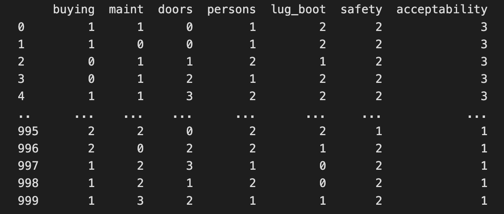

### 数据集划分（评估方法）

#### 留出法

***“留出法”（hold-out）***直接将数据集D划分为两个互斥的集合，其中一个集合作为训练集S，另一个作为测试集T，即$D = S \cup T, \space S \cap T = \emptyset$。在S上训练出模型后，用T来评估其测试误差，作为对泛化误差的估计。

```python
#数据集划分hold_out
X_train, X_test, y_train, y_test = train_test_split(
    X, y, 
    test_size=0.3, 	# 训练集 ： 测试集 = 7:3
    stratify=y, 
    random_state=42
)
```

#### K折交叉验证法

***“交叉验证法”（cross validation）***先将数据集D 划分为k个大小相似的互斥子集，即$D = D_1 \cup D_2 \cup \space ... \space \cup D_k, D_i \cap D_j = \empty (i \neq j)$，每个子集$D_i$都尽可能保持数据分布的一致性，即从D中通过分层采样得到。然后，每次用 $k-1$ 个子集的并集作为训练集，余下的那个子集作为测试集；这样就可获得 $k$ 组训练/测试集，从而可进行 $k$​ 次训练和测试，**最终返回的是这k个测试结果的均值**。

手动实现k折交叉验证

```python
# 数据集划分：k折交叉验证（k-Fold）
k = 10  # 设置交叉验证的折数
skf = StratifiedKFold(n_splits=k, shuffle=True, random_state=42)

# 存储每折的准确率
accuracies = []

# 取最优划分
Macc = 0
M_X_train = []
M_X_test = []
M_y_train = []
M_y_test = []

# 进行k折划分
for fold, (train_index, test_index) in enumerate(skf.split(X, y), 1):
    # 根据索引划分训练集和测试集
    X_train = X.iloc[train_index]
    X_test = X.iloc[test_index]
    y_train = y.iloc[train_index]
    y_test = y.iloc[test_index]

    clf.fit(X_train, y_train)

    # 预测测试集
    y_pred = clf.predict(X_test)

   # 计算准确率
    acc = accuracy_score(y_test, y_pred)
    accuracies.append(acc)

    print(f"第 {fold} 折 - 准确率: {acc:.2%}")
    if (acc >= Macc):
        Macc = acc
        M_X_train = X_train
        M_X_test = X_test
        M_y_train = y_train
        M_y_test = y_test

X_train = M_X_train
X_test = M_X_test
y_train = M_y_train
y_test = M_y_test

# 计算平均准确率
mean_acc = sum(accuracies) / k
print(f"{k} 折交叉验证的平均准确率: {mean_acc:.2%}")
```

#### 自助法

***“自助法”（bootstrapping）***以自助采样法（bootstrap sampling）为基础，给定包含m 个样本的数据集D，我们对它进行采样产生数据集 $D^{'}$：每次随机从D中挑选一个样本，将其拷贝放入 $D^{'}$，然后再将该样本放回初始数据集D中，使得该样本在下次采样时仍有可能被采到；这个过程重复执行m次后，我们就得到了包含m 个样本的数据$D^{'}$，这就是自助采样的结果。

样本在m次采样中始终不被采到的概率是${(1 - \frac{1}{m})}^m$​，取极限得到
$$ {自助法}
\lim_{m \to \infty} (1 - \frac{1}{m})^m \rightarrow \frac{1} {e} \approx 0.368
$$


```python
# 生成随机种子
random_seed = np.random.randint(0, 1000)
np.random.seed(random_seed)
print(f"  随机种子: {random_seed}")
n = len(data)

# 生成训练集（有放回抽样）
train_indices = np.random.choice(n, n, replace=True) # 找出被抽中的样本索引
X_train = X.iloc[train_indices]
y_train = y.iloc[train_indices]

# 生成测试集（未被抽中的样本）
test_indices = np.setdiff1d(np.arange(n), train_indices)  # 找出未被抽中的样本索引
X_test = X.iloc[test_indices]
y_test = y.iloc[test_indices]
```

### 训练模型

#### 初始化模型参数

1. **选择属性划分的算法**

   使用DecisionTreeClassifier初始化参数设置，其提供的算法有ID3（信息增益）、CART（基尼指数）以及C4.5（信息增益率），实验中使用基尼指数算法。

2. **预剪枝参数**

   为防止决策树模型过拟合，我们需要对模型进行剪枝避免决策分支过多，我们可以设置决策树最大深度、最小分裂样本数、最小叶子结点样本数等，限制决策树的深度和大小，控制模型复杂度，提升泛化能力。

3. **设置类别权重**

   观察数据样本可以发现，每类样本的数量是及其**不均衡的**，uacc类在所有样本中占比达到**70%**，good和vgood类二者分别仅占所有样本的**3%**，通过调整类别权重，可以缓解类别不平衡问题，提升少数类的识别能力。


```python
# 初始化决策树
clf = DecisionTreeClassifier(
    criterion='gini',       # 基尼指数
    max_depth=10,           # 最大深度
    min_samples_split=20,   # 最小分裂样本数
    class_weight='balanced',# 自动调整类别权重
    random_state=42					# 随机种子
)
```

#### 模型训练与评估

将测试集输入训练好的决策树进行预测和验证，查看不同评估方法预测准确率和预测报告，绘制混淆矩阵直观查看分类结果

```python
# 训练模型
clf.fit(X_train, y_train)
# 评估
y_pred = clf.predict(X_test)
# 准确率
print(f"测试集准确率: {clf.score(X_test, y_test):.2%}")
print("Classification Report:\n", classification_report(y_test, y_pred))
```

##### 留出法

1. **分类报告：**

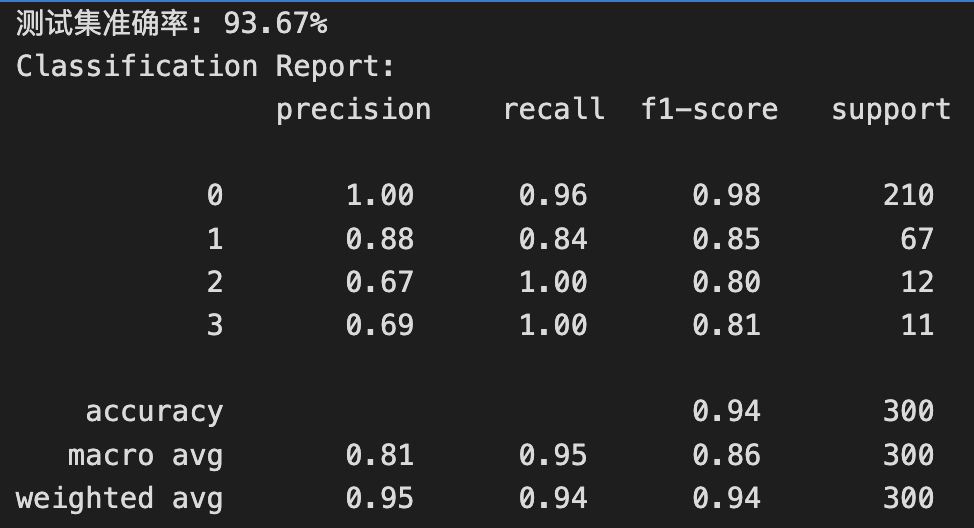

2. **混淆矩阵：**


3. **结果分析：**

   可以看到留出法评估的决策树模型总体准确率非常高，达到了93.67%，但模型对小类别（good和vgood）的样本预测准确率并不高

##### K折交叉验证法

1. **分类报告：(取最优的划分方式）**

   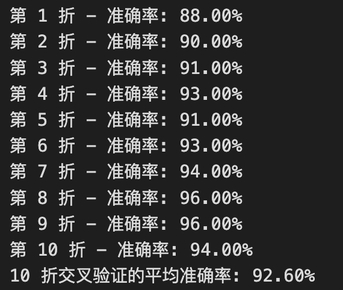

   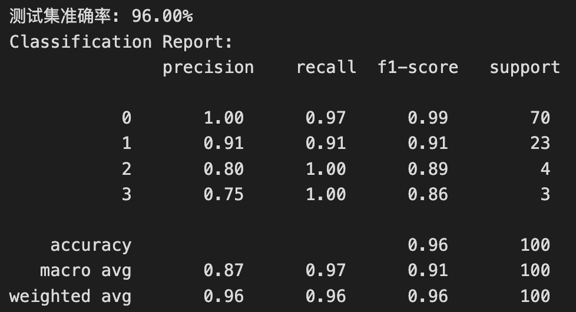

2. **混淆矩阵：**

   

3. **结果分析：**

   K折交叉验证评估的模型平均准确率也比较高，尽管平均准确率总体略低于留出法，但是模型对小类别的分类效果要比留出法的好

##### 自助法（随机种子893）

1. **分类报告：**

   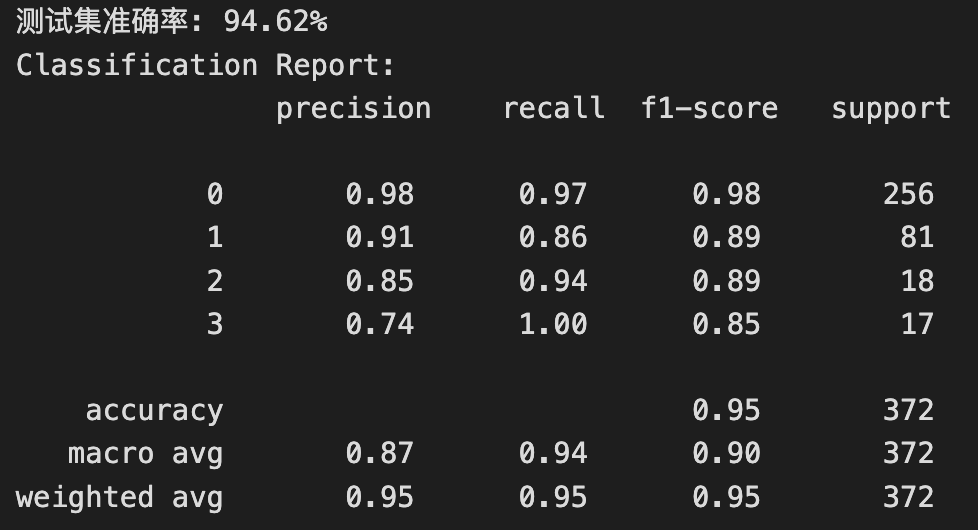

2. **混淆矩阵：**

   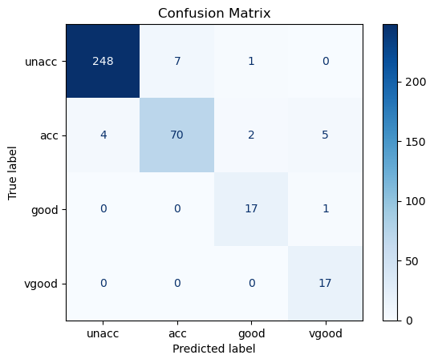

3. **结果分析：**

   自助法应该相比于前两个评估方法都要好，且对数据量较少的两类样本的分类准确率也高于前两类，这大概是因为自助法在数据集较少、难以有效划分训练/测试集时能表现出更好的分裂效果。

#### 决策树可视化

为了直观地观察决策树模型，查看决策树的构造，实验还实现了决策树可视化，具体代码如下：

```python
# 设置特征和类别名称（用于可视化标签）
feature_names = columns[:-1]
class_names = list(ordinal_mappings['acceptability'].keys())

plt.figure(figsize=(30, 15))
plot_tree(
    clf,
    feature_names=feature_names,
    class_names=class_names,
    filled=True,
    rounded=True,
    fontsize=15,
    max_depth=3  # 只显示前3层避免图像过大
)
plt.title('Decision Tree Visualization (First 3 Levels)')
plt.show()
```

##### 留出法

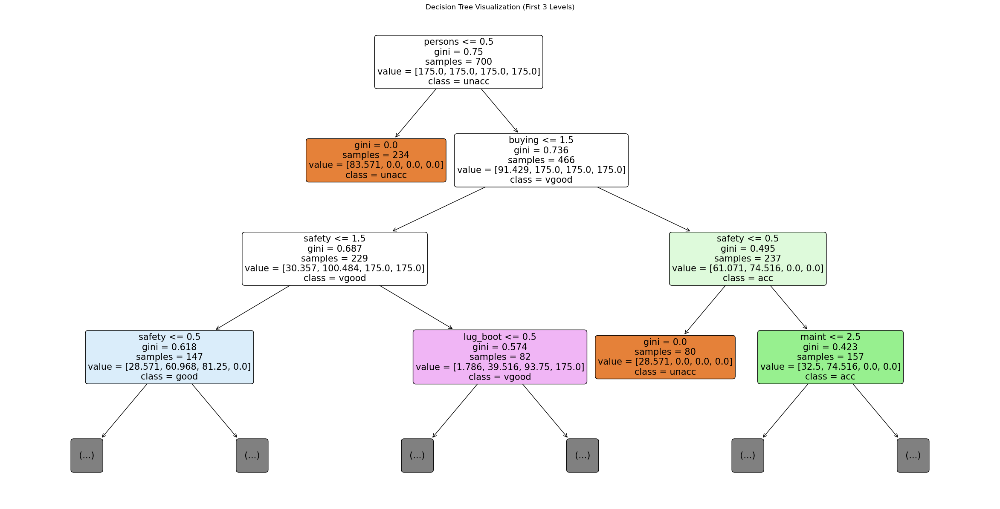

##### K折交叉验证法

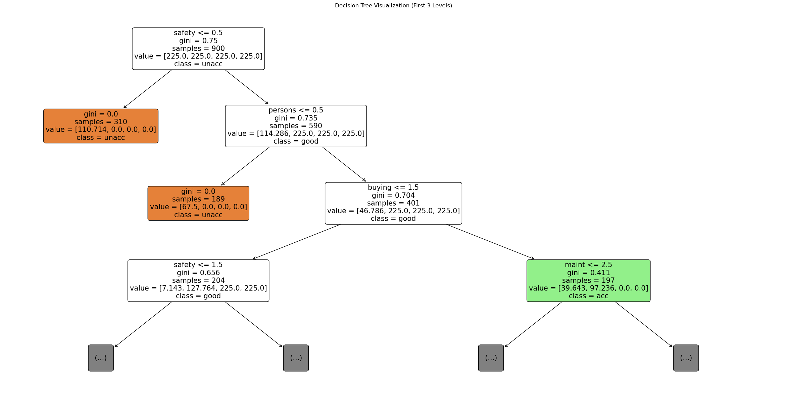

##### 自助法

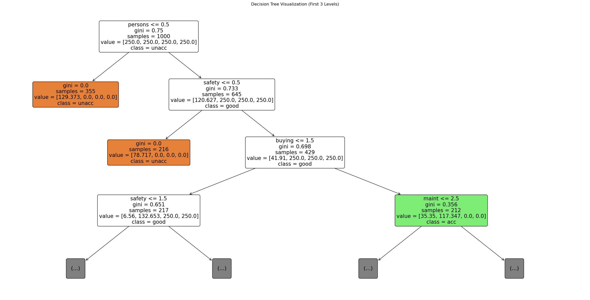

### 性能度量

完成对决策树模型的评估，还需要有衡量模型泛化能力的评价标准，这就是***性能度量（performance measure）***。性能度量反映了任务需求，在对比不同模型的能力时，使用不同的性能度量往往会导致不同的评判结果；这意味着模型的“好坏”是相对的，什么样的模型是好的，不仅取决于算法和数据，还决定于任务需求。

对于分类任务，错误率和精度是最常用的两种性能度量：

- 错误率：分错样本占样本总数的比率
- 精度：分对样本占样本总数的比率

#### P-R曲线

前面模型评估中的分类报告已经体现了F1度量的结果，这里直接绘制P-R图对比三种模型的性能

代码如下：

```python
# 获取测试集的预测概率（需确保模型支持概率输出）
y_prob = clf.predict_proba(X_test)  # 形状为 (n_samples, n_classes)

print(y_prob)
# 将目标变量二值化（多分类转二进制）
n_classes = len(ordinal_mappings['acceptability'])
y_test_bin = label_binarize(y_test, classes=range(n_classes))  # 形状为 (n_samples, n_classes)

# 初始化存储结果
precision = dict()
recall = dict()
average_precision = dict()

# 遍历每个类别
for i in range(n_classes):
    precision[i], recall[i], _ = precision_recall_curve(y_test_bin[:, i], y_prob[:, i])
    average_precision[i] = average_precision_score(y_test_bin[:, i], y_prob[:, i])

# 计算宏平均（Macro-average）
precision["macro"], recall["macro"], _ = precision_recall_curve(
    y_test_bin.ravel(), y_prob.ravel()
)
average_precision["macro"] = average_precision_score(y_test_bin, y_prob, average="macro")


# 设置绘图参数
colors = cycle(['navy', 'turquoise', 'darkorange', 'cornflowerblue'])
class_names = list(ordinal_mappings['acceptability'].keys()) + ["Macro-average"]

plt.figure(figsize=(10, 8))
for i, color, name in zip(range(n_classes), colors, class_names):
    display = PrecisionRecallDisplay(
        recall=recall[i],
        precision=precision[i],
        average_precision=average_precision[i]
    )
    display.plot(ax=plt.gca(), name=name, color=color, linewidth=2)

# 添加宏平均曲线
display = PrecisionRecallDisplay(
    recall=recall["macro"],
    precision=precision["macro"],
    average_precision=average_precision["macro"]
)
display.plot(ax=plt.gca(), name="Macro-average", color='red', linestyle=':', linewidth=3)

# 绘制图表
plt.xlabel('Recall')
plt.ylabel('Precision')
plt.title('Precision-Recall Curve (Multi-Class)')
plt.legend(loc="lower left")
plt.grid(True)
plt.show()


print("各类别平均精度 (AP):")
for i, name in enumerate(class_names[:-1]):  # 排除宏平均
    print(f"- {name}: {average_precision[i]:.3f}")
print(f"- Macro-average AP: {average_precision['macro']:.3f}")
```

##### 留出法

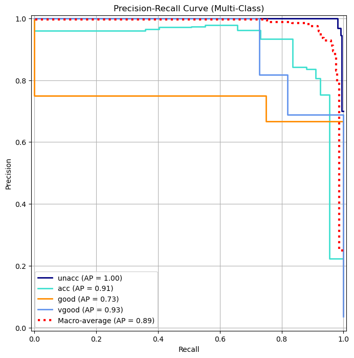

```
各类别平均精度 (AP):
- unacc: 0.998
- acc: 0.911
- good: 0.729
- vgood: 0.927
- Macro-average AP: 0.891
```

通过结果可知，留出法对unacc类的分类性能最高，vgood其次，对good类的划分性能最低，总体平均精度在0.89

##### K折交叉验证法


```
各类别平均精度 (AP):
- unacc: 0.996
- acc: 0.924
- good: 1.000
- vgood: 0.917
- Macro-average AP: 0.959
```

通过结果可知，K折交叉验证对四种类别的样本分类精度都较高，其中unacc类的分类性能最高，总体平均精度在0.959

##### 自助法

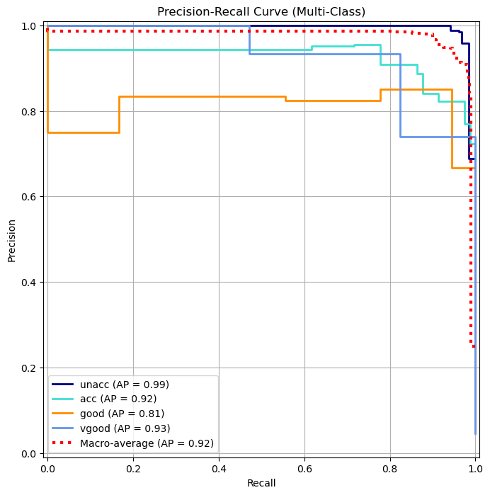

```
各类别平均精度 (AP):
- unacc: 0.994
- acc: 0.925
- good: 0.811
- vgood: 0.930
- Macro-average AP: 0.915
```

通过结果可知，自助法对unacc类的分类性能最高，vgood其次，对good类的划分性能最低，总体平均精度在0.915

#### ROC曲线

##### 留出法

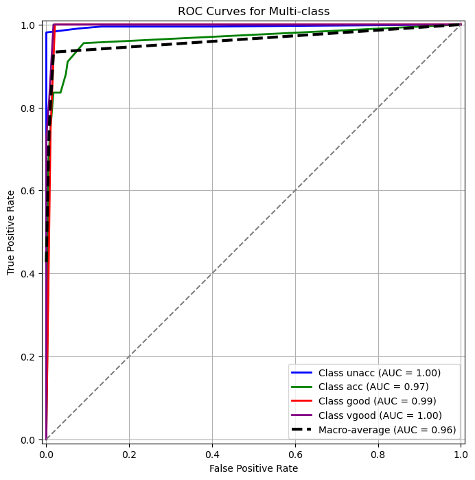

```
各类别AUC:
- unacc: 0.996
- acc: 0.965
- good: 0.992
- vgood: 0.997
宏平均AUC: 0.963
```

##### K折交叉验证法

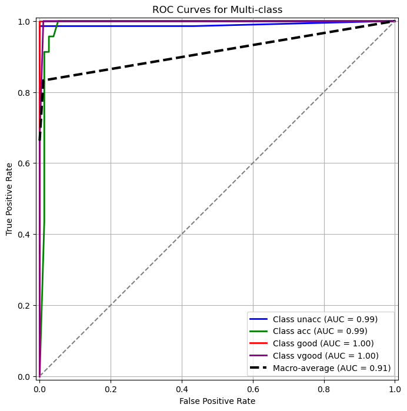

```
各类别AUC:
- unacc: 0.990
- acc: 0.988
- good: 1.000
- vgood: 0.998
宏平均AUC: 0.915
```

##### 自助法

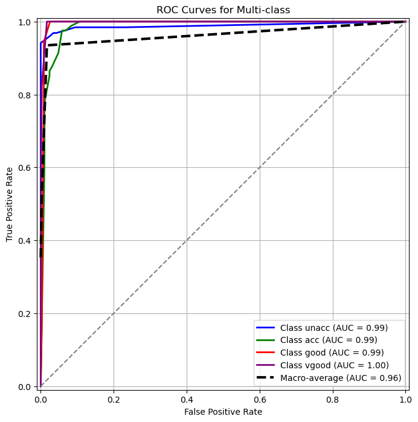

```
各类别AUC:
- unacc: 0.989
- acc: 0.986
- good: 0.994
- vgood: 0.998
宏平均AUC: 0.963
```

#### 总结

观察三类模型的P-R曲线和ROC曲线，可以发现K折交叉验证评估的模型综合性能表现最好，但是其对样本预测的排序质量都略逊于留出法和自助法，因此可以根据目标选择不同的评估方法：

- **目标为模型泛化性能**：优先使用 **K折交叉验证**，综合性能更优且稳定性高。
- **目标为概率排序质量**：可选择 **留出法** 或 **自助法**，并在训练时优化概率校准。

## 实验总结

本次实验我根据提供的车辆数据集完成了对决策树模型的构建，熟悉并掌握了决策树的构建流程，从数据集处理、模型参数选择、评估方法到性能度量，实验中我使用了三种方法构建的决策树，并完成对它们的分析。

三种方法都能构建出整体准准确率达到90%以上的决策树模型，但对数据样本少的类别分裂性能较低，分析认为是提供的数据集类别数量不均衡导致的，模型很可能存在过拟合。后续的处理方法可以调整数据，采用某种生成额外样本的方法，增加训练数据，或者随机删除类别多的样本，以达到样本类别均衡。


