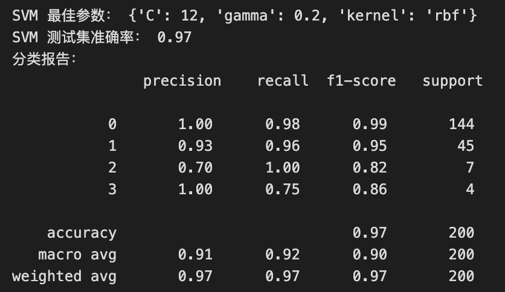
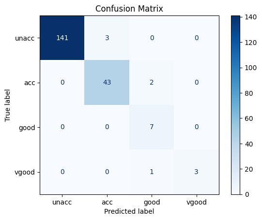
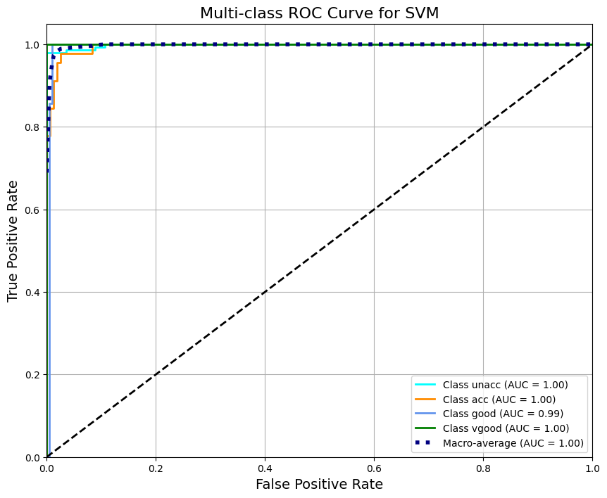

# 讨论二 支持向量机

fallen

## 实验目的

了解并掌握线性模型、支持向量机、深度神经网络中的一个机器学习算法，选择其中一个算法对car数据集进行分类预测，掌握对机器学习算法的原理和应用。

## 实验要求

深入讨论线性模型、支持向量机、深度神经网络中的一个机器学习算法，介绍算法的起源，算法工作的原理，其关键的参数和影响因素，以及现在算法在生活中具体的应用情况（Car数据集，应用数据依赖性问题分析，为什么得到了推广应用，为什么有好的应用效果或者是什么限制了其大范围的应用）。

## 实验步骤

### 数据预处理

1. **读取数据集，检查数据格式和缺失值**

   通过阅读数据集描述[description.txt](car2/description.txt)查看数据集[car_1000.txt](car2/car_1000.txt)，可以得知样本包含6个属性,且每个属性对应的属性值如下：

   ```
   buying       v-high, high, med, low
   maint        v-high, high, med, low
   doors        2, 3, 4, 5-more
   persons      2, 4, more
   lug_boot     small, med, big
   safety       low, med, high
   ```

   样本类别以及每类样本的数量如下：

   ```
   Class Distribution (number of instances per class)
      class      N          N[%]
      -----------------------------
      unacc     1210     (70.023 %) 
      acc        384     (22.222 %) 
      good        69     ( 3.993 %) 
      v-good      65     ( 3.762 %) 
   ```

   检查样本没有发现缺失值，代码实现如下：

   ```python
   # 定义列名（根据数据集描述）
   columns = ['buying', 'maint', 'doors', 'persons', 'lug_boot', 'safety', 'acceptability']
   
   # 加载数据
   data = pd.read_csv('car2/car_1000.txt', header=None, names=columns)
   
   print(data.shape)  # 打印数据的形状 (行数, 列数)
   print(data.head())  # 打印前几行数据
   ```

2. **定义映射关系，将属性值转换为数值，便于机器处理**

   每类的属性值都是字符串，不能用于机器处理，必须将属性值编码为具体数值，并且为了阅读方便，按等级顺序映射

   ```python
   # 类别编码
   
   # 定义映射关系
   ordinal_mappings = {
       'buying': {'vhigh': 3, 'high': 2, 'med': 1, 'low': 0},
       'maint': {'vhigh': 3, 'high': 2, 'med': 1, 'low': 0},
       'doors': {'2': 0, '3': 1, '4': 2, '5more': 3},
       'persons': {'2': 0, '4': 1, 'more': 2},
       'lug_boot': {'small': 0, 'med': 1, 'big': 2},
       'safety': {'low': 0, 'med': 1, 'high': 2},
       'acceptability': {'unacc': 0, 'acc': 1, 'good': 2, 'vgood': 3}
   }
   
   for col in columns:
       data[col] = data[col].map(ordinal_mappings[col])
   
   ```

3. **划分属性和类别，便于训练和验证**

   模型训练前需要划分属性和类别，用于模型的训练和对模型的评估

   ```python
   # 划分特征与标签
   X = data.drop("acceptability", axis=1)
   y = data["acceptability"]
   print(X)
   print(y)
   ```

4. **标准化数据，划分数据集和训练集，用于后续支持向量机模型训练**

   因为 SVM 对特征的尺度（scale）非常敏感，使用 SVM（支持向量机）训练模型前对数据进行标准化：

   ```python
   # 标准化
   scaler = StandardScaler()
   X_scaled = scaler.fit_transform(X)
   print(X_scaled)
   DataFrame_X_scaled = pd.DataFrame(X_scaled, columns=X.columns)
   print(DataFrame_X_scaled)
   # 划分训练集与测试集
   X_train, X_test, y_train, y_test = train_test_split(X_scaled, y, test_size=0.2, random_state=42)
   ```

   处理后最终的数据为：

   


### 模型训练

1. **选择合适的核函数**

   核函数决定了数据的映射方式，不同核函数可适配不同数据分布，选核不当会严重影响模型效果 ，对于样本不大、模式复杂的数据集，使用RBF（高斯核函数）训练的模型性能更好。
   $$
   K(x, x{\prime}) = \exp(-\gamma |x - x{\prime}|^2)
   $$

2. **关键参数调节**

   - 惩罚参数C

     惩罚参数控制对误分类样本的惩罚程度，C越大对误分类的容忍度越低，追求低训练误差，可能过拟合；值小时容忍误差，提升泛化能力

   - 系数$\gamma$

     $\gamma \space$控制单个训练样本的影响范围，$\gamma \space$​越大模型复杂度越高，易过拟合；值越小模型越平滑，可能欠拟合

   因此我们要选择合适C和$\gamma \space$​来构建模型，使得模型的鲁棒性和对数据预测的准确率最好，并且考虑训练时间开销。

   模型构建及训练代码如下：

   ```python
   model = SVC(C=1, kernel='rbf', gamma=0.01, class_weight='balanced')
   
   start = time.time()
   model.fit(X_train, y_train)
   end = time.time()
   
   print(f"训练时间为：{end - start:.4f} 秒")
   
   # 模型预测
   y_pred = model.predict(X_test)
   
   # 输出评估结果
   print("分类报告：\n", classification_report(y_test, y_pred))
   ```

   我先选择几个合适的参数训练模型，以此确定最优参数。

   使用多组惩罚参数C和系数$\space \gamma \space$构建模型后，我得到以下结果：

   | **惩罚参数C** | **γ** | **训练时间（平均5次）** | **准确率** | **宏平均准确率** | **加权平均准确率** |
   | ------------- | ----- | ----------------------- | ---------- | ---------------- | ------------------ |
   | 1             | 0.01  | 0.02313                 | 0.690      | 0.500            | 0.730              |
   | 10            | 0.1   | 0.01422                 | 0.940      | 0.809            | 0.943              |
   | 10            | 0.08  | 0.01456                 | 0.940      | 0.809            | 0.943              |
   | 10            | 0.12  | 0.01360                 | 0.955      | 0.894            | 0.956              |
   | 10            | 0.15  | 0.01520                 | 0.960      | 0.897            | 0.961              |
   | 12            | 0.12  | 0.01398                 | 0.960      | 0.897            | 0.961              |
   | 12            | 0.15  | 0.01420                 | 0.965      | 0.900            | 0.966              |
   | 15            | 0.15  | 0.01430                 | 0.965      | 0.900            | 0.966              |
   | 20            | 0.2   | 0.01460                 | 0.960      | 0.897            | 0.961              |

   由结果可知，模型的训练时间都很短（0.1秒內），几乎可以忽略不计，不用担心计算开销。最优参数C应在12～20之间，$\space \gamma \space$在0.12~0.2之间。

   为了寻找局部最优参数组，可使用网格搜索法：

   ```python
   param_grid = {
       'C': [12, 13, 14, 15, 17, 18, 20, 30], 
       'gamma': ['scale', 'auto', 0.12, 0.13, 0.14, 0.15, 0.18, 0.2, 0.25, 0.28],
       'kernel': ['rbf']
   }
   svm = SVC(class_weight='balanced', random_state=42)
   grid_search = GridSearchCV(svm, param_grid, cv=5)
   
   
   # 训练模型
   grid_search.fit(X_train, y_train)
   
   # 使用找到的最佳模型进行预测
   best_svm = grid_search.best_estimator_
   y_pred = best_svm.predict(X_test)
   
   # 输出结果
   print("SVM 最佳参数：", grid_search.best_params_)
   print("SVM 测试集准确率：", accuracy_score(y_test, y_pred))
   print("分类报告：\n", classification_report(y_test, y_pred))
   ```

   网格搜索结果如下：

   

   因此确定最优的惩罚参数C = 12，系数$\space \gamma \space = 0.2$。这组参数训练出的模型准确率最高（达到0.97）对各类对分类能力最强。  

### 模型评估

前面模型参数选择已给出了最佳模型的分类报告，已经体现了F1度量的结果，这里绘制混淆矩阵和ROC图分析模型的性能

- 混淆矩阵

  ```python
  # 构建并训练模型
  model = SVC(C=12, gamma=0.2, kernel='rbf', probability=True, class_weight='balanced', random_state=42)
  model.fit(X_train, y_train)
  
  # 生成混淆矩阵
  cm = confusion_matrix(y_test, y_pred)
  
  # 可视化混淆矩阵
  disp = ConfusionMatrixDisplay(confusion_matrix=cm, display_labels=["unacc", "acc", "good", "vgood"])
  disp.plot(cmap='Blues', values_format='d')
  plt.title('Confusion Matrix')
  plt.show()
  ```

  结果如下

  

- ROC图

  ```python
  # 获取预测的概率值
  y_score = model.predict_proba(X_test)
  
  # Binarize the output（多分类转成二分类）
  n_classes = len(np.unique(y_train))
  y_test_binarized = label_binarize(y_test, classes=[0, 1, 2, 3])
  
  # 计算每个类别的 ROC 曲线和 AUC
  fpr = dict()
  tpr = dict()
  roc_auc = dict()
  for i in range(n_classes):
      fpr[i], tpr[i], _ = roc_curve(y_test_binarized[:, i], y_score[:, i])
      roc_auc[i] = auc(fpr[i], tpr[i])
  
  # 计算宏平均 ROC 曲线和 AUC
  all_fpr = np.unique(np.concatenate([fpr[i] for i in range(n_classes)]))
  
  mean_tpr = np.zeros_like(all_fpr)
  for i in range(n_classes):
      mean_tpr += np.interp(all_fpr, fpr[i], tpr[i])
  
  mean_tpr /= n_classes
  
  fpr["macro"] = all_fpr
  tpr["macro"] = mean_tpr
  roc_auc["macro"] = auc(fpr["macro"], tpr["macro"])
  
  # 绘制所有类别的ROC曲线
  plt.figure(figsize=(10, 8))
  colors = ['aqua', 'darkorange', 'cornflowerblue', 'green']
  class_names = ['unacc', 'acc', 'good', 'vgood']
  
  for i, color in zip(range(n_classes), colors):
      plt.plot(fpr[i], tpr[i], color=color, lw=2,
               label=f'Class {class_names[i]} (AUC = {roc_auc[i]:0.2f})')
  
  # 绘制宏平均 ROC
  plt.plot(fpr["macro"], tpr["macro"],
           label=f'Macro-average (AUC = {roc_auc["macro"]:0.2f})',
           color='navy', linestyle=':', linewidth=4)
  
  # 绘制对角线（随机分类器）
  plt.plot([0, 1], [0, 1], 'k--', lw=2)
  
  plt.xlim([0.0, 1.0])
  plt.ylim([0.0, 1.05])
  plt.xlabel('False Positive Rate', fontsize=14)
  plt.ylabel('True Positive Rate', fontsize=14)
  plt.title('Multi-class ROC Curve for SVM', fontsize=16)
  plt.legend(loc="lower right")
  plt.grid(True)
  plt.show()
  ```

  结果如下：

  

通过分析混淆矩阵和ROC曲线，可以发现：

- unacc、acc、vgood类AUC = 1.00：模型在三类别上的分类能力几乎完美；每一类的预测表现都非常优异，几乎没有混淆。
- good类AUC = 0.99：虽然是少数类，模型对它的识别也非常精准。
- 宏平均 AUC = 1.00：综合所有类别，模型整体表现优秀

可以认为模型的泛化能力较好，对数据分类的准确率较高，但是可能存在严重的过拟合。

## 实验总结

本次实验我根据提供的车辆数据集完成了对支持向量机模型的构建，熟悉并掌握了该机器学习算法的起源和原理，从数据集处理、模型参数选择、评估方法到性能度量，实验中我使用了两种方法训练支持向量机模型，并完成对它们的分析。

使用支持向量机算法构建出模型准确率达97%，对数据样本少的类别也能够很好分类，观察ROC曲线AUC也接近1，说明模型在训练集或测试集上的预测几乎完美。但是一般情况下，这种过于理想的表现可能表示模型过度拟合了训练数据，尤其是在真实应用中很难达到这种效果。我分析认为是提供的数据集样本数量过少，并且类别数量不均衡导致的过拟合。

后续的处理方法可以调整数据，对数据做平衡处理，例如对 good 和 vgood 类别进行过采样，对 unacc 类别进行欠采样，以减少类别不平衡影响。或采用某种生成额外样本的方法，增加训练数据，或者随机删除类别多的样本，以达到样本类别均衡。
